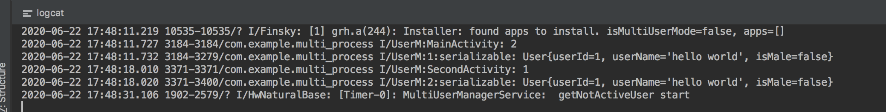

#### 1. 概述

android中的IPC机制

- android中多进程以及多进程开发模式中常见的注意事项
- android序列化机制和Binder
- Bundle,文件共享,AIDL,Message,ContentProvider,Socket


IPC:进程间通讯或者跨进程通讯,是指两个进程之间进行数据交换的过程


##### 1.1 线程和进程

- 线程:是一种有限的系统资源
- 进程:一般指一个执行单元,一个进程可以包含多个线程

最简单的情况下,一个进程包含一个线程,这就是主线程

在Android中主线程就是**UI线程**,在UI线程中才能操作界面元素,一般一个线程中去执行耗时任务会导致**ANR**,所以耗时任务应该开辟子线程去执行

##### 2.android中的多进程模式

创建多进程的方式:

-  最常用在`AndroidManifest`中制定四大组件的`android:process`属性

- 还有一种非常规的多进程方法,那就是通过`JNI`在`native`层去`fork`一个新的进程

所以开进程时候需要权衡多进程带来的好处和多进程带来的开销

下面 我们开3个进程,一个默认进程

```xml
<application
    android:allowBackup="true"
    android:icon="@mipmap/ic_launcher"
    android:label="@string/app_name"
    android:roundIcon="@mipmap/ic_launcher_round"
    android:supportsRtl="true"
    android:theme="@style/AppTheme">
    <activity android:name=".MainActivity">
        <intent-filter>
            <action android:name="android.intent.action.MAIN" />

            <category android:name="android.intent.category.LAUNCHER" />
        </intent-filter>
    </activity>


    <activity android:name=".SecondActivity"
        android:process=":remote"/>


    <activity android:name=".ThirdActivity"
        android:process="com.example.multi_process.remote"/>
</application>
```


MainActivity没有制定process所以是默认进程`com.example.multi_process`,SecondActivity指定是`:remote`,所以进程是`com.example.multi_process:remote`,ThirdActivity单独指定进程是`com.example.multi_process.remote`

##### 2.1 `:remote`和`独立命名`的区别

- `:`
  - 是当前默认进程之后拼接所得进程名,会附加包名信息
  - 以`:`开头的是当前应用的私有进程,其他应用组件不可以与其跑在同一个进程中

- 独立命名,不以`:`开头
  - 这是一种完整的命名方式,不会附加包名
  - 不以`:`开头的属于全局进程,其他应用组件可以通过`shareUID`方式和他跑在一起


在android中每个应用会分配一个唯一的UID,具有相同UID的应用可以共享数据

那么两个应用通过shareUID跑在听一个进程中是有要求的,需要这两个应用具有相同的`shareUID`并且签名相同才可以;他们可以互相访问对方的私有数据,比如data目录,组件信息等;当然也可以共享内存数据


##### 2.2多进程模式的运行机制

###### 2.2.1 进程间共享带来的问题

我们知道静态变量是全局共享的,下面不同进程set/get,看数据是否一致

```java
class UserManager {

    public static int sUserId = 1;
}

// MainActivity
  @Override
    protected void onCreate(Bundle savedInstanceState) {
        super.onCreate(savedInstanceState);
        setContentView(R.layout.activity_main);
      	// 修改静态变量
        UserManager.sUserId = 2;
        Log.i("UserM:MainActivity",UserManager.sUserId + "");
        findViewById(R.id.id).setOnClickListener(new View.OnClickListener() {
            @Override
            public void onClick(View v) {

                startActivity(new Intent(MainActivity.this,SecondActivity.class));
            }
        });
    }

// SecondActivity
	@Override
    protected void onCreate(Bundle savedInstanceState) {
        super.onCreate(savedInstanceState);
        setContentView(R.layout.activity_a);
        Log.i("UserM:SecondActivity",UserManager.sUserId + "");
        findViewById(R.id.id).setOnClickListener(new View.OnClickListener() {
            @Override
            public void onClick(View v) {

                startActivity(new Intent(SecondActivity.this,ThirdActivity.class));
            }
        });

    }
```

直觉上来看 第一个进程修改静态值,第二个应该输出修改后的值才是

那么我们来看结果


第二的进程拿到的还是初始值,为什么呢?

**Android中为每一个进程分配一个独立的虚拟机,不同的虚拟机在内存分配上有不同的地址空间,这就导致不同的虚拟机访问同一个类的对象会产生多个副本**

- MainActivity修改了  `UserManager.sUserId`之后影响当前进程,而不会影响`SecondActivity`所在进程的读取

所以,**所有运行在不同进程中的四大组件,只要他们之间需要内存来共享数据,都会共享失败,这也是多进程带来的影响**

一般来说,使用多进程会造成如下几方面的问题:

1. 静态成员和单例模式完全失效
   - 这个问题上面已经分析
2. 线程同步机制完全失效
   - 同上,一个原理
3. Sp的可靠性下降
   - 这个错误的原因是Sp不支持两个进程同时取执行读写操作,否则会导致一定几率的数据丢失;这是因为Sp底层是通过读写XML文件来实现的,并发显然是可能出问题的
4. Application多次创建
   - 运行在同一个进程中的组件是属于同一个虚拟机和同一个Application的,同理运行在不同进程中的组件是属于不同的虚拟机和Application的

下面进行测试上面第4点

我们来看Application对应`onCreate`的log打印

```java
public class MyApplication  extends Application {

    private static final String TAG = "MyApplication";


    @Override
    public void onCreate() {
        super.onCreate();
        String processName = MyUtils.getProcessName(getApplicationContext(), Process.myPid());
        Log.i(TAG,"application process name:" + processName);
    }
}
```

结果:


解决方法就是**判断是否是UI主进程,然后根据进程来决定是否进行初始化**


#### 3.IPC基础概念

- 序列化: Serializable接口  &  Parcelable接口
  - 为了更好的完成跨进程通信,我们对数据要进行序列化,然后进行传输;
- Binder
  - 进程间传输的载体

##### 3.1  Serializable接口

` Serializable接口`是java提供的一个序列化接口,他是一个空接口,对对象提供标准的序列化和反序列化操作

使用`Serializable`:只需要声明`serialVersionID`即可:

序列化class:

```java
public class User implements Serializable {

    private static final long serialVersionUID = 519067L;


    public int userId;
    public String userName;
    public boolean isMale;


    public User(int userId, String userName, boolean isMale) {
        this.userId = userId;
        this.userName = userName;
        this.isMale = isMale;
    }

    public int getUserId() {
        return userId;
    }

    public void setUserId(int userId) {
        this.userId = userId;
    }

    public String getUserName() {
        return userName;
    }

    public void setUserName(String userName) {
        this.userName = userName;
    }

    public boolean isMale() {
        return isMale;
    }

    public void setMale(boolean male) {
        isMale = male;
    }

    @Override
    public String toString() {
        return "User{" +
                "userId=" + userId +
                ", userName='" + userName + '\'' +
                ", isMale=" + isMale +
                '}';
    }
}
```

通过Serializable进行序列化(`ObjectOutputStream`)与反序列化(`ObjectInputStream`)

```java
User newUser = null;
User user = new User(0, "jack", true);
try {
    String path = "data/data/" + getPackageName() + "/";
    File dir = new File(path);
    if(!dir.exists()){
        dir.mkdirs();
    }
    File cachedFile = new File(path + "cache.txt");
    if (!cachedFile.exists()){
        cachedFile.createNewFile();
    }
    // 序列化
    ObjectOutputStream outputStream = new ObjectOutputStream(new FileOutputStream(cachedFile));
    outputStream.writeObject(user);
    outputStream.close();

    // 反序列化
    ObjectInputStream inputStream = new ObjectInputStream(new FileInputStream(cachedFile));

    newUser = (User) inputStream.readObject();
    inputStream.close();
} catch (Exception e) {
    e.printStackTrace();
}


Log.i("UserM:serializable",newUser.toString());
```

上诉是Serializable方式序列化对象的典型过程,很简单,只需要把实现了Serializable接口的User对象写到文件中就可以快速恢复了

恢复后的对象`newUser`和源数据`User`数据一致,但不是同一个对象


Serializable中官网要求指定 `serialVersionUID`,但是不指定仍然可以实现序列化,那么到底是否应该指定呢?

这个`serialVersionUID`是用来辅助序列化和反序列化的过程的,原则上序列化后的数据中的`serialVersionUID`只有和当前类的`serialVersionUID`相同才能够正常被反序列化

**`serialVersionUID`的原理是这样的:**

序列化的时候系统把当前类`serialVersionUID`写入序列化的文件中(也可能是其他中介),当反序列化的时候系统会去检测文件中的`serialVersionUID`,看他是否与当前类的`serialVersionUID`一致;如果一致就说明序列化的类的版本是相同的,这个时候可以成功的反序列化;反之亦然

有以下两个场景:

- 手动指定`serialVersionUID`:一般来说应该手动指定`serialVersionUID`的值,不会反序列化失败

- 根据类的结构自动生成`hash`值作为`serialVersionUID`:当目标类的成员增删时候就是序列化失败

需要注意某些元素不参与序列化:

- 静态成员变量属于类不属于对象,所以不参与序列化过程
- 用`transient`关键字标记的成员不参与序列化

##### 3.2 Parcelable接口


```java
public class User1 implements Parcelable {
    public int userId;
    public String userName;
    public boolean isMale;


    public User1(int userId, String userName, boolean isMale) {
        this.userId = userId;
        this.userName = userName;
        this.isMale = isMale;
    }

   ......

    @Override
    public int describeContents() {
        return 0;
    }

    @RequiresApi(api = Build.VERSION_CODES.Q)
    @Override
    public void writeToParcel(Parcel out, int flags) {
        out.writeInt(userId);
        out.writeString(userName);
        out.writeBoolean(isMale);
    }
    
    public  static final Parcelable.Creator<User1> CREATOR = new Parcelable.Creator<User1>()		{

        @RequiresApi(api = Build.VERSION_CODES.Q)
        @Override
        public User1 createFromParcel(Parcel source) {
            return new User1(source);
        }

        @Override
        public User1[] newArray(int size) {
            return new User1[size];
        }
    };

    @RequiresApi(api = Build.VERSION_CODES.Q)
    public User1(Parcel in) {
        userId = in.readInt();
        userName = in.readString();
        isMale = in.readBoolean();
    
    }
}
```

Parcel包装了可序列化的数据,可以在binder中自由传输

在上述代码中主动实现了 

- 内容描述`describeContents`
- 反序列化`CREATOR`
  - 其内部标明了如果创建序列化对象和数组,并通过  parcel的read实现反序列化,如果序列化类中嵌套序列化类,write时候需要`writeParacelable`,反序列化时候需要传入当前线程的classloader
- 序列化`writeToParcel`的相关逻辑


系统为我们提供了许多Pacelable接口的类,他们都是可以直接序列化的,比如 Intent,Bundle,Bitmap等,同时list和map也是可以序列化的,前提是他们的元素可以序列化


**Parcelable和Serializable的区别:**

- **Serializable**: 是java中的序列化接口,其使用起来简单但是开销很大,序列化和反序列化过程需要大量的I/O操作
- **Parceable**: 是Android中的序列化方式,这是android平台官推的序列化方式,但是使用起来稍微麻烦一些.但是效率高,**parceable**主要用在内存序列化上


##### 3.3 Binder

**Binder**是android中的一个类,他实现了IBinder接口.从IPC角度来说,Binder是Android中的一种跨进程通信方式,Binder还可以理解为一种虚拟的物理设备,他的设备驱动是`/dev/binder`,该通信方式liunx中没有;

- 从**Android  Framework**角度来说,Binder是`ServiceManager`连接各种Manager(如ActivityManager,WindowManager,等等)和相应的ManagerService的桥梁

- 从**Android应用层**来说,Binder是客户端和服务端进行通信的媒介,当BindService的时候,服务端会返回一个包含了服务端业务调用的Binder对象,通过这个 Binder对象,客户端就可以获取服务端提供的服务或者数据,这里的服务包括普通服务和基于AIDL的服务

#### 4. Android中的IPC机制

##### 4.1 使用Bundle

我们知道三大组件(Activity,Service,Receiver)都是支持在Intent中传递Bundle数据的,由于Bundle实现了Pracelable接口,所以他可以方便在不同进程间传输

当我们在一个进程中启动了另一个进程的Activity,Service和Receiver,我们就可以在Bundle中附加我们需要传输给远程的信息并通过Intent发送出去;当然传输的数据必须能够被序列化,比如基本类型实现了Pracelable接口的对象,实现了Serializable接口的对象以及一些Android支持的特殊对象;当然Bundle不支持的类型我们无法通过他在进程间进行传输;


##### 4.2 使用文件共享

共享文件也是一个不错的进程间通信方式,两个进程通过读/写同一个文件来交换数据,不如A进程写入文件,B进程通过读取这个文件来获取数据

在Windows上,一个文件如果被加了排斥锁将会导致其他线程无法对其访问,包括读和写,而由于Android基于liunx,使得其并发读/写文件可以没有限制的进行,甚至两个线程同时对一个文件进行操作都是允许的,尽管会有线程安全的问题;

通过文件交换数据很好使用,除了可以交换一些文本信息外,我们还可以序列化一个对象到文件系统中的同时,从另一个进程中回复这个对象


我们在MainActivity的on'Resume中序列化一个 User对象到sd卡上的一个文件里,然后SecondActivity的onResume中去反序列化;下面看实例:

```java
// MainActivity
private void persistToFile(){
    new Thread(new Runnable() {
        @Override
        public void run() {
            User user = new User(1,"hello world",false);
            String path = "data/data/" + getPackageName() + "/";
            File dir = new File(path);
            if(!dir.exists()){
                dir.mkdirs();
            }
            File cachedFile = new File(path + "cache.txt");

            try {
                ObjectOutputStream outputStream = new ObjectOutputStream(new FileOutputStream(cachedFile));
                outputStream.writeObject(user);
                outputStream.close();
                Log.i("UserM:1:serializable",user.toString());
            } catch (IOException e) {
                e.printStackTrace();
            }
        }
    }).start();
}

// SecondActivity
private void recoverFromFile() {
        new Thread(new Runnable() {
            @Override
            public void run() {
                User newUser = null;
                String path = "data/data/" + getPackageName() + "/";
                File cachedFile = new File(path + "cache.txt");
                // 序列化
                try {
                    ObjectInputStream inputStream = new ObjectInputStream(new FileInputStream(cachedFile));
                    newUser = (User) inputStream.readObject();
                    inputStream.close();

                    Log.i("UserM:2:serializable",newUser.toString());
                } catch (Exception e) {
                    e.printStackTrace();
                }


            }
        }).start();
    }
```

看下结果:



SecondActivity成功恢复了MainActivity序列化的文件

通过文件共享这种方式来共享数据对文件格式是没有具体要求的,比如可以是文本文件,也可以是xml文件,只要读写双方约定数据格式即可;

但是共享文件在并发时候表现不好,会产生线程安全或者进程安全的隐患,所以建议:

**文件共享方式适合在对数据同步要求不高的进程之间进行通信,并且要妥善处理并发读/写的问题**

当然Sp是个特例,他是android提拱的轻量级存储方案,他通过键值对的方式来存储数据,在底层实现上他采用xml文件来存储键值对,对个应用的Sp文件都可以在其当前包的data目录下到`/data/data/package_name/share_perfs`目录下;从本质上来说,Sp属于文件的一种,但是由于系统怼他的读写有一定的策略,即在内存周末给会有一份Sp文件的缓存,因此在多进程下,系统对他的读写变得不可靠,面对高并发的读写访问SP有很大几率会丢失数据,因此不建议在进程间通讯使用Sp


##### 4.3 使用Messenger

Messenger可以认为是信使,,通过他可以在不同的进程中传递Message对象,在Message中放入我们需要传递的数据,就可以轻松实现进程间数据的传递

Messenger是一种轻量级的IPC方案,他的底层是AIDL,简单看下 Messenger这个类的构造:

```java
public Messenger(Handler target) {
    mTarget = target.getIMessenger();
}
public Messenger(IBinder target) {
    mTarget = IMessenger.Stub.asInterface(target);
}
```

Messenfer的使用方式很简单,他对AIDL做了封装,使得我们可以更加简单的进行进程间通信.同时,由于他一次处理一个请求,因此在服务端我们不用考虑线程同步的问题,这是因为服务端中不存在并发执行的情形.实现一个Messenger有一下几个步骤,分为服务端和客户端;

**服务端代码:**

```xml
// Manifest 完成Service的注册
<manifest xmlns:android="http://schemas.android.com/apk/res/android"
    package="com.example.servier">

    <application
        android:allowBackup="true"
        android:icon="@mipmap/ic_launcher"
        android:label="@string/app_name"
        android:roundIcon="@mipmap/ic_launcher_round"
        android:supportsRtl="true"
        android:theme="@style/AppTheme">
        <activity android:name=".MainActivity">
            <intent-filter>
                <action android:name="android.intent.action.MAIN" />

                <category android:name="android.intent.category.LAUNCHER" />
            </intent-filter>
        </activity>

        <service android:name=".MessengerService"
            android:exported="true"
            android:enabled="true"/>
    </application>

</manifest>
```


```java
public class MessengerService extends Service {

    private static final String TAG = "MessengerService";


    private static class MessengerHandler extends Handler{
        @Override
        public void handleMessage(@NonNull Message msg) {
            switch (msg.what){
                case 0:
                    Log.i(TAG,"receive msg from client:" + msg.getData().getString("msg"));
                    break;
                default:
                    super.handleMessage(msg);

            }
        }
    }

    private final Messenger mMessenger = new Messenger(new MessengerHandler());


    @Nullable
    @Override
    public IBinder onBind(Intent intent) {
        return mMessenger.getBinder();
    }


}
```

- MessengerHandler用来处理客户端发送的消息,并从消息中去除客户端发来的消息,mMessenger是一个 Messenger对象,他和MessengerHandler进行关联,并在onBind方法中返回他里面的Binder对象
- **可以看出,这里的Messenger的作用是将客户端发送的消息传递给MessengerHandler处理—`handleMessage`处理 **

**接着看客户端代码:**

```java
private static final String TAG = "MessengerActivity";

private Messenger mService;


private ServiceConnection mConn = new ServiceConnection() {
    @Override
    public void onServiceConnected(ComponentName name, IBinder service) {
        mService = new Messenger(service);
        Message msg = Message.obtain(null, 0);
        Bundle data = new Bundle();
        data.putString("msg","hello, this is client.");
        msg.setData(data);
        try {
            mService.send(msg);
        } catch (RemoteException e) {
            e.printStackTrace();
        }
    }

    @Override
    public void onServiceDisconnected(ComponentName name) {

    }
};

@Override
protected void onCreate(Bundle savedInstanceState) {
    super.onCreate(savedInstanceState);
    setContentView(R.layout.activity_main);


    Intent intent = new Intent();
    intent.setComponent(new ComponentName("com.example.servier",
            "com.example.servier.MessengerService"));
    bindService(intent,mConn, Context.BIND_AUTO_CREATE);

}

@Override
protected void onDestroy() {
    unbindService(mConn);
    super.onDestroy();
}
```

首先绑定远程服务`MessengerService`,在`bindService`的回调中获取服务端返回的Binder对象,然后创建Messenger对象,并使用此对象向服务发送消息

看下运行效果:


- Messenger中进行数据传递必须将数据放入Message中,而Messenger和Message都实现了Pracelable接口,所以可以进行跨进程传输
- Message中所支持的数据类型就是Messenger所支持的数据类型,Message中能够使用的载体只有`what`,`arg1`,`arg2`,`Bundle`和`replyTo`
- Message还有一个object的字段,android 2.2之前object字段是不支持跨进程通讯的,即便是2.2以后,也仅仅是系统提供的实现了Pracelable接口的对象才能通过他来传输;自定义实现Pracelable的类不能进行传输

**客户端-服务端互传**

服务端:

```java
private static class MessengerHandler extends Handler{
    @Override
    public void handleMessage(@NonNull Message msg) {
        switch (msg.what){
            case 0:
                Log.i(TAG,"receive msg from client:" + msg.getData().getString("msg"));
                Messenger client = msg.replyTo;  // 这是客户端传过来的Messenger
                // 开始给客户端发消息
                Message replyMsg = Message.obtain(null, 100);
                Bundle data = new Bundle();
                data.putString("reply","已经收到");
                replyMsg.setData(data);
                try {
                    client.send(replyMsg);
                } catch (RemoteException e) {
                    e.printStackTrace();
                }

                break;
            default:
                super.handleMessage(msg);

        }
    }
}
```

客户端:

```java
private Messenger mService;

private static class MessengerHandler extends Handler {
    @Override
    public void handleMessage(@NonNull Message msg) {
        switch (msg.what){
            case 100:
                Log.i(TAG,"receive msg from server:" + msg.getData().getString("reply"));
                break;
            default:
                super.handleMessage(msg);

        }
    }
}

private final Messenger mMessenger = new Messenger(new MessengerHandler());


private ServiceConnection mConn = new ServiceConnection() {
    @Override
    public void onServiceConnected(ComponentName name, IBinder service) {
        mService = new Messenger(service);
        Message msg = Message.obtain(null, 0);
      	// 传输时候 replyTo指明Messenger
        msg.replyTo = mMessenger;
        Bundle data = new Bundle();
        data.putString("msg","hello, this is client.");
        msg.setData(data);
        try {
            mService.send(msg);
        } catch (RemoteException e) {
            e.printStackTrace();
        }
    }
```

结果 

```java
2020-06-22 19:23:23.292 21439-21439/com.example.servier I/MessengerService: receive msg from client:hello, this is client.
2020-06-22 19:23:23.343 21637-21637/com.example.client I/MessengerActivity: receive msg from server:已经收到
```

到此为止Messenger之间的进程间通信介绍到这里,简单看下原理:


##### 4.4 AIDL

- Messenger进行进程间通讯的方法,我们可以发现Messenger是以串行的方式处理客户端发来的消息,如果大量的消息同时发送到服务端,服务端仍然只能一个个处理,如果有大量的并发请求,那么用Messenger就不太合适了;

- 同时Messenger的作用是为了传递消息,很多时候我们可能需要跨进程调用服务的方法,这种情形下Messenger就无法做到了;


基于上面的两个确定,AIDL隆重登场,我们知道 Messenger的底层实现也是AIDL

**服务端:**

首先创建一个Service用来监听客户端的连接请求,然后创建一个AIDL文件,将暴露给客户端的接口在这个AIDL文件中声明,最后在Service中实现这个AIDL即可

**客户端**

客户端所要做的事情就稍微简单一些,首先需要绑定服务端的Service,绑定成功之后,将服务端返回的Binder对象转成AIDL接口所属的类型,接着可以调用AIDL的方法了

代码实现 

###### 4.4.1 AIDL接口的创建

首先来看AIDL接口的创建,如下所示,我们创建了一个后缀为AIDL的文件,在里面声明了一个接口和两个接口的方法


```java
// Book.aidl
package com.example.ipc;

// Declare any non-default types here with import statements

parcelable Book;


// IBookManager.aidl
package com.example.ipc;
import com.example.ipc.Book;

// Declare any non-default types here with import statements

interface IBookManager {


    List<Book> getBookList();
    void addBook(in Book book);
}

```

定义AIDL接口,这里扩展一下AIDL支持的数据类型:

- 基本数据类型(int,long,char,boolean,double等)
- String和CharSequence
- List:只支持ArrayList,里面每一个元素都必须能够被AIDL支持
- Map:只支持HashMap,里面的每个元素都必须被AIDL支持,包括key和value
- Parcelable:所有实现了Parcelable接口的对象
- AIDL:所有的AIDL接口本身也可以在AIDL文件中使用

以上6中数据类型都是AIDL所支持的所有类型,其中自定义的Parcelable对象和AIDL对象必须显示import进来,不管他们是否和当前的AIDL文件位于同一个包内

关于ADIL

- AIDL创建序列化class : `parcelable Book;`
- AIDL除了基本数据类型之外,其他类型必须标注方向:`in`入参,`out`出参,`inout`输入输出参数
- AIDL只支持方法不支持静态变量

1. 使用in方式时，参数值单向传输，客户端将对象传给服务端后，依然使用自己的对象值，不受服务端的影响。

2. 使用out方式传递数组类型时，客户端传递给服务端的只有数组的长度，客户端得到的是服务端赋值后的新数组。

3. 使用inout方式传递数组类型时，客户端会将完整的数组传给服务端，客户端得到的是服务端修改后的数组。

4. 使用out方式传递Parcelable对象时，客户端传给服务端的是一个属性值全部为空的对象，得到的是服务端重新赋值后的对象。

   

5. 使用inout方式传递Parcelable对象时，客户端会将完整的对象传递给服务端，得到的是服务端修改后的对象。
  


###### 4.4.2 服务端

```java
public class BookManagerService extends Service {

    private static final String TAG = "BMS";

    // 支持并发的读写,支持线程同步
    private CopyOnWriteArrayList<Book> mBookList = new CopyOnWriteArrayList<Book>();


    private Binder mBinder = new IBookManager.Stub(){

        @Override
        public List<com.example.ipc.Book> getBookList() throws RemoteException {
            return mBookList;
        }

        @Override
        public void addBook(com.example.ipc.Book book) throws RemoteException {
            mBookList.add(book);
        }
    };

    @Override
    public void onCreate() {
        super.onCreate();
        mBookList.add(new Book(0,"android开发艺术探索"));
        mBookList.add(new Book(1,"android源码解读"));
    }

    @Nullable
    @Override
    public IBinder onBind(Intent intent) {
        return mBinder;
    }
}
```

上述服务端:

- 在onCreate中添加了两本书的信息
- 实现`IBookManager.Stub()`中的两个方法,然后返回实现后的binder,最后在service的onBind中返回Binder
- 注意一点,前面有说过AIDL只支持ArrayList,但是这里使用的是`CopyOnWriteArrayList`,那么为什么可以正常运行呢?
  - 这是因为AIDL中所支持的是抽象的List,而List只是一个接口,因此虽然服务端返回的是`CopyOnWriteArrayList`,但是在BInder中会按照List的规范去访问数据并最终形成一个新的ArrayList传给客户端

**CopyOnWriteArrayList**:这个List是支持并发读写的,AIDL实在服务端的Binder线程池中执行的,因此会有多个客户端同时连接,并发执行的场景,而`CopyOnWriteArrayList`可以进行自动的线程同步

同理可以使用`CocurrentHashMap`

###### 4.4.3 客户端

```java
public class BookActivity extends AppCompatActivity {

    private static final String TAG = "BookActivity";


    @Override
    protected void onCreate(@Nullable Bundle savedInstanceState) {
        super.onCreate(savedInstanceState);
        setContentView(R.layout.activity_main);
        Intent intent = new Intent();
        intent.setComponent(new ComponentName("com.example.server",
                "com.example.server.BookManagerService"));
        boolean b = bindService(intent, mConn, Context.BIND_AUTO_CREATE);
        Toast.makeText(this,b+"",Toast.LENGTH_SHORT).show();

    }


    private ServiceConnection mConn = new ServiceConnection(){

        @Override
        public void onServiceConnected(ComponentName name, IBinder service) {
            IBookManager bookManager = IBookManager.Stub.asInterface(service);
            try {
                List<Book> bookList = bookManager.getBookList();
                Log.i(TAG,"query book list,list type:" + bookList.getClass().getCanonicalName());
                for (Book book : bookList) {
                    Log.i(TAG,"query book list: " + book.getId() + " " +  book.getName());
                }

            } catch (RemoteException e) {
                e.printStackTrace();
            }
        }

        @Override
        public void onServiceDisconnected(ComponentName name) {

        }

        @Override
        public void onBindingDied(ComponentName name) {

        }
    };

    @Override
    protected void onDestroy() {
        unbindService(mConn);
        super.onDestroy();
    }
}
```

- bindService在其回调中获取服务端的binder对象,然后去执行其getBookList,然后打印其图书信息
- 需要注意的是,服务端的方法可能需要很久才能执行完毕,这个时候下面的代码就会导致ANR,这一点需要主要

运行结果:


我们可以发现在服务端返回的是`CopyOnWriteArrayList`,而在客户端返回的是`ArrayList`,正如前面所说:

`AIDL中所支持的是抽象的List,而List只是一个接口,因此虽然服务端返回的是CopyOnWriteArrayList,但是在BInder中会按照List的规范去访问数据并最终形成一个新的ArrayList传给客户端`

###### 4.4.4 其他场景

**下面我们来实现`.addBook`的交互**

```java
// 客户端
@Override
public void onClick(View v) {
    if (bookManager!= null){
        try {
            bookManager.addBook(new Book(2,"nlp实战"));
            List<Book> bookList = bookManager.getBookList();

            for (Book book : bookList) {
                Log.i(TAG,"add then query book list: " + book.getId() + " " +  book.getName());
            }
        } catch (RemoteException e) {
            e.printStackTrace();
        }
    }
}
```

客户端添加如上代码即可

运行结果


**新书订阅提醒**

现在我们有一个新书订阅提醒,每次来新书都会给订阅者进行信息的展示,这样就不用每次去遍历所有图书(**观察者模式**)

- 订阅模式用户可以随时取消
- 使用AIDL接口,因为AIDL中不能使用普通接口

**服务端**  

添加AIDL订阅接口:

```java
// IOnNewBookArrivedListener.aidl
package com.example.ipc;
import com.example.ipc.Book;

// Declare any non-default types here with import statements

interface IOnNewBookArrivedListener {
    void onNewBookArrived(in Book newBook);
}

// IBookManager.aidl
package com.example.ipc;
import com.example.ipc.Book;
import com.example.ipc.IOnNewBookArrivedListener;


// Declare any non-default types here with import statements

interface IBookManager {


    List<Book> getBookList();
    void addBook(in Book book);

    // 添加新书订阅
    void registerListener(IOnNewBookArrivedListener listener);
    // 取消新书订阅
    void unregisterListener(IOnNewBookArrivedListener listener);

}

```

在`BookManagerService`实现这两个接口:

```java
public class BookManagerService extends Service {

    private static final String TAG = "BMS";
    private boolean isDestroy = false;

    // 支持并发的读写,支持线程同步
    private CopyOnWriteArrayList<Book> mBookList = new CopyOnWriteArrayList<Book>();

    private CopyOnWriteArrayList<IOnNewBookArrivedListener> mListenerList
            = new CopyOnWriteArrayList<IOnNewBookArrivedListener>();

    private Binder mBinder = new IBookManager.Stub(){

        ......
				
      	// 实现订阅逻辑
        @Override
        public void registerListener(IOnNewBookArrivedListener listener) throws RemoteException {
            if (!mListenerList.contains(listener)){
                mListenerList.add(listener);
                Log.i(TAG,"订阅成功");
            } else {
                Log.i(TAG,"已经订阅过");
            }
            Log.i(TAG,"registerListener -- size: " + mListenerList.size());
        }
				
   			// 实现取消订阅逻辑
        @Override
        public void unregisterListener(IOnNewBookArrivedListener listener) throws RemoteException {
            if (mListenerList.contains(listener)){
                mListenerList.remove(listener);
                Log.i(TAG,"取消订阅成功");
            } else {
                Log.i(TAG,"当期没有没定");
            }
            Log.i(TAG,"unregisterListener -- size: " + mListenerList.size());
        }
    };
		

    ......
		
  	// 开启线程 每5s新增图书
    private class ServiceWorker implements Runnable {
        @Override
        public void run() {
            while (!isDestroy){
                // 创建新书
                try {
                    Thread.sleep(5000);
                } catch (InterruptedException e) {
                    e.printStackTrace();
                }
                int id = mListenerList.size() + 1;
                Book book = new Book(id, "new book#" + id);
                mBookList.add(book);
                // 将订阅者加入
                for (IOnNewBookArrivedListener iOnNewBookArrivedListener : mListenerList) {
                    try {
                        iOnNewBookArrivedListener.onNewBookArrived(book);
                    } catch (RemoteException e) {
                        e.printStackTrace();
                    }
                }
            }
        }
    }
}
```

但是会有一个问题,从表面来看,注册是完全没有问题的,解注册完全没有效果;我们来看下注册和了解注册时候的log


其实仔细分析log就能知道,每次注册或者解注册传过去的listener在客户端是统一的,但是在服务反序列化之后每次产生一个新的对象,也就是说:**虽然我们在注册和解注册过程中使用同一个客户端对象,但是通过Binder传递到服务之后,却产生两个全新的对象**

主要的原因是:

**对象是不能跨进程直接传输的,对象的跨进程传输本质上是序列化和反序列化的过程,这就是为什么AIDL中的自定义对象都必须实现Parcelable接口的原因**


为了解决这个问题,我们这里使用`RemoteCallbackList`,`RemoteCallbackList`是系统专门提供的用于删除跨进程listener的接口,`RemoteCallbackList`是一个泛型,支持管理任意的AIDL接口,这点从他的声明就可以看出来,因为所有的AIDL接口都继承自IInterface接口

```java
public class RemoteCallbackList<E extends IInterface> {
```

他的工作原理很简单,在他的内部有一个Map结构专门用来保存所有的AIDL回调,这个Map的key是IBinder类型,value是Callback类型

```java
ArrayMap<IBinder, Callback> mCallbacks
        = new ArrayMap<IBinder, Callback>();
```

其中callback中封装了真正的远程listener,当客户注册listener的时候,他会把这个listener的信息存入mCallbacks中,其中key和value分别通过下面的方式获得

```java
IBinder key = callback.asBinder();
Callback value = new Callback(callback, cookie);
```

到这里我们可以归纳总结下`RemoteCallbackList`:

- 在跨进程的对象传输中,对象是一个序列化和反序列化的过程,这就导致两端的对象一定不是一直的,但是这些新生成的对象有一个共同点,那就是他们底层的Binder对象是同一个,利用这个特性我们可以解决上面的问题;
- 当客户端注册时候,我们只需要遍历服务端所有的listener,找出那个和解注册listener具有相同BInder对象的服务端listener并把它删除即可,这就是`RemoteCallbackList`为我们做的事情
- 当客户端进程停止时候,`RemoteCallbackList`能够移除所有客户端注册的listener
- `RemoteCallbackList`内部自动实现了线程同步的功能

**客户端**

```java
public class BookManagerService extends Service {

    private static final String TAG = "BMS";
    private boolean isDestroy = false;

    // 支持并发的读写,支持线程同步
    private CopyOnWriteArrayList<Book> mBookList = new CopyOnWriteArrayList<Book>();
  	// RemoteCallbackList
    private RemoteCallbackList<IOnNewBookArrivedListener> mListenerList
            = new RemoteCallbackList<IOnNewBookArrivedListener>();

    private Binder mBinder = new IBookManager.Stub(){

        ......
        @Override
        public void registerListener(IOnNewBookArrivedListener listener) throws RemoteException {
            mListenerList.register(listener);
            Log.i(TAG,"registerListener -- size: " + mListenerList.beginBroadcast());
            mListenerList.finishBroadcast();
        }

        @Override
        public void unregisterListener(IOnNewBookArrivedListener listener) throws RemoteException {
            mListenerList.unregister(listener);
            Log.i(TAG,"unregisterListener -- size: " + mListenerList.beginBroadcast());
            mListenerList.finishBroadcast();
        }
    };

   ......
    private class ServiceWorker implements Runnable {
        @Override
        public void run() {
            while (!isDestroy){
                ......
                try {
                    onNewBookArrived(book);
                } catch (RemoteException e) {
                    e.printStackTrace();
                }

            }
        }
    }

    private void onNewBookArrived(Book book) throws RemoteException{
        mBookList.add(book);
        final int N = mListenerList.beginBroadcast();
        for (int i = 0; i < N; i++) {
            IOnNewBookArrivedListener item = mListenerList.getBroadcastItem(i);
            if (item!=null){
                try {
                    item.onNewBookArrived(book);
                } catch (RemoteException e) {
                    e.printStackTrace();
                }
            }
        }
        mListenerList.finishBroadcast();
    }
}
```

- listener用`RemoteCallbackList`进行存储

- 修改注册和反注册接口

  - ```java
         @Override
            public void registerListener(IOnNewBookArrivedListener listener) throws RemoteException {
                mListenerList.register(listener);
                Log.i(TAG,"registerListener -- size: " + mListenerList.beginBroadcast());
                mListenerList.finishBroadcast();
            }
      
            @Override
            public void unregisterListener(IOnNewBookArrivedListener listener) throws RemoteException {
                mListenerList.unregister(listener);
                Log.i(TAG,"unregisterListener -- size: " + mListenerList.beginBroadcast());
                mListenerList.finishBroadcast();
            }
        };
    ```

- 修改listener回调逻辑:

  ```java
  private void onNewBookArrived(Book book) throws RemoteException{
          mBookList.add(book);
          final int N = mListenerList.beginBroadcast();
          for (int i = 0; i < N; i++) {
              IOnNewBookArrivedListener item = mListenerList.getBroadcastItem(i);
              if (item!=null){
                  try {
                      item.onNewBookArrived(book);
                  } catch (RemoteException e) {
                      e.printStackTrace();
                  }
              }
          }
          mListenerList.finishBroadcast();
      }
  ```

**客户端无需修改**

运行结果:


注意一点:

**`.beginBroadcast`和`.finishBroadcast`**应该配对使用,不然会抛出:`java.lang.IllegalStateException: beginBroadcast() called while already in a broadcast`

######4.4.5 ANR

到目前位置AIDL的基本使用已经完成,**客户端调用远程的方法,被调用的方法会运行在服务端的Binder线程池中,同时客户端的线程会被挂起,如果服务端的方法比较耗时,就会导致客户端长时间阻塞在这里,如果是UI线程的话就会ANR**

**修改服务端**

```java
@Override
public void addBook(com.example.ipc.Book book) throws RemoteException {
    try {
        Thread.sleep(5000);
    } catch (InterruptedException e) {
        e.printStackTrace();
    }
    mBookList.add(book);
}
```


解决方法就是客户端开线程进行调用


这样就可以返回了

###### 4.4.6 AIDL健壮性

**AIDL-Service Die重试**

在开发过程中会遇到Binder的意外死亡,这是由于服务进程意外停止了,这时候有两种方式:

- 1.给Binder设置DeathRecipient监听,这是在binder线程池中调用
- 2.bindService的回调中`onServiceDisconnected`监听,这个实在UI线程

**AIDL权限功能**

默认情况下,我们的远程服务任何人都可以链接,但是这应该不是我们愿意看到的,所以我们必须给服务加入权限验证功能;验证成功才能调用

- 在onBind中进行权限check:

服务端:

```java
 <permission android:name="com.example.ipc.permission.ACCESS_BOOK"
        android:protectionLevel="normal"/>

public IBinder onBind(Intent intent) {
        int check = checkCallingOrSelfPermission("com.example.ipc.permission.ACCESS_BOOK");
        if (check == PackageManager.PERMISSION_DENIED){
            Log.i(TAG,"onBind fail");
            return null;
        }
        Log.i(TAG,"onBind sucess");
        return mBinder;
    }
```

客户端:

```java
<uses-permission android:name="com.example.ipc.permission.ACCESS_BOOK" />
```

- 在服务端的`onTransact`方法进行权限验证


##### ,

##### 4.5 Socket

Scoket可以实现进程中的通信,Scoket也被称为"套接字",是网络通信中的概念,他分为流式套接字和用户数据报套接字,分别对应与网络传输控制层中的TCP和UDP协议

- TCP协议是面向连接的协议,提供稳定的双向通信功能,TCP连接的简历需要经过"三次握手"才能完成,为了提供稳定的数据传输功能,其本身提供了超时重传机制,因此具有很高的稳定性
- UDP是无连接的,提供不稳定的单向通信功能,当然UDP也可以实现双向通信的功能

在性能上UDP具有更好的效率,其缺点是不能保证数据一定可以正确传输


接下来直接看Socket实例:

**已经实现demo**,后序http时候继续看

