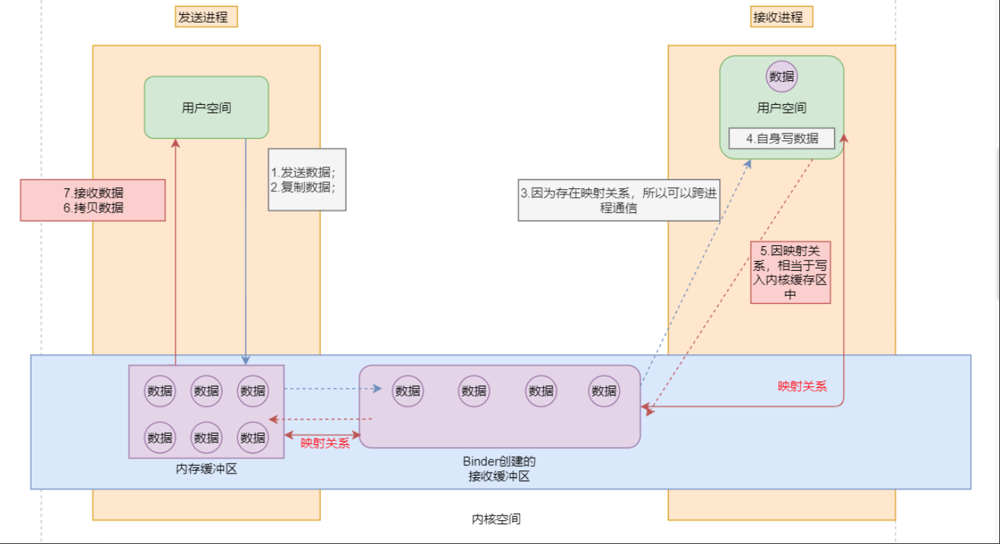

### Android源码解析RPC系列(一)  — binder原理

binder是android比较综合的一块知识,目前的理解仅限于java


#### 1.概述


为了从而保障系统的安全和稳定,整个系统被划分为内核空间和用户空间

内核空间:独立于普通的应用程序,可以访问受保护的内存空间,有访问底层引荐设备的所有权限

用户空间相对:相对与内核空间,上层运行程序所运行的空间就是用户空间,用户空间访问内核空间的唯一方式就是系统调用,一个4G的虚拟空间,其中3G是用户空间,剩余1G是内核空间,如果一个用户空间想与另外一个用户空间进行通信,就需要内核模块支持,这个运行在内核空间的,负责各个用户进程通过Binder通信的内核模块叫做Binder驱动,虽然叫做binder驱动,但是和硬件没有什么关系,只是实现方式和设备驱动程序是一样的,提供一些标准的文件操作


#### 2.Liunx中的RPC  & android中的binder

liunx中的rpc方式有管道,消息队列,共享内存等

- 消息队列和管道: 采用存储转发的方式,即数据先从发送发缓存区拷贝到内核开辟的缓存区中,然后再从内核缓存区拷贝到接收方的缓存区,这样就有两次拷贝过程
- 共享内存:不需要拷贝,但是控制复杂,难以使用

**binder是一种折中的方案**

- 只需要拷贝一次即可,其次binder的安全性较好


#### 3.Binder机制


##### 3.1 角色说明

- 用户进程:使用服务的进程(客户端)
- 服务进程:提供服务的进程
- ServiceManager进程:管理服务的注册和查询
- Binder驱动: 一种虚拟设备驱动,可以连接用户和服务,ServiceManager进程

##### 3.2 步骤说明

- 注册服务
  - 服务进程向binder进程发起服务注册
  - Binder驱动将注册请求发送给ServiceManager进程
  - ServiceManager进程添加这个服务进程
- 获取服务
  - 用户进程向Binder驱动发起获取服务的请求,传递要获取的服务名称
  - Binder驱动将该请求转发给ServiceManager进程
  - ServiceManager进程查到用户进程需要的服务进程信息
  - 最后通过binder驱动将上述服务返回给用户进程
- 使用服务
  - binder驱动为跨进程通信准备:实现内存映射
  - 用户进程将参数数据发送到服务进程
  - 服务进程根据用户进程要求调用目标方法
  - 服务进程将目标方法的结果返回给用户进程

使用服务的流程图



```java
  @Override public android.os.IBinder queryBinder(int binderCode) throws android.os.RemoteException
  {
    android.os.Parcel _data = android.os.Parcel.obtain();
    android.os.Parcel _reply = android.os.Parcel.obtain();
    android.os.IBinder _result;
    try {
      _data.writeInterfaceToken(DESCRIPTOR);
      // 1.发送数据 &  2.复制数据
      _data.writeInt(binderCode);
      // 3.跨进程调用 BinderRPC(内存映射) & 4.因为内存映射关系,写入内核缓存区
      boolean _status = mRemote.transact(Stub.TRANSACTION_queryBinder, _data, _reply, 0);
      if (!_status && getDefaultImpl() != null) {
        return getDefaultImpl().queryBinder(binderCode);
      }
      _reply.readException();
      
      // 6. 拷贝数据 7.接收数据
      _result = _reply.readStrongBinder();
    }
    finally {
      _reply.recycle();
      _data.recycle();
    }
    return _result;
  }
  public static com.example.ipc.IBinderPool sDefaultImpl;
}
```

#### 4.Binder实现原理

##### 4.1 注册服务

Server进程创建一个Binder对象,注册后Binder驱动持有Server进程创建的Binder实体

##### 4.2 获取服务

Client通过BinderService()绑定Service进程中注册的Service进程;用Service进程中onBind()得到创建的Binder对象的代理对象:BinderProxy对象;Client进程通过调用onServiceConnected获得了Service进程中创建的Binder对象的代理对象BinderProxy对象

##### 4.3 使用服务

- Binder驱动实现内存映射:调用了mmap()
- Client进程发送数据到Server进程:
  1. Client进程将需要传送的数据发送到Binder驱动
  2. 通过调用代理对象的transact()将上述数据发送到Binder驱动
  3. Binder驱动根据代理对象找到对应的真是Binder对象所在的Server进程(自动执行)
  4. Binder驱动把数据发送到Server进程中,并通知Server执行解包(自动执行)
- 收到Binder驱动的通知后,Server进程通过会调Binder对象的onTransact进行数据解包,调用目标方法,最终将结果返回(写入`_reply`参数中)
- 将结果返回给Client
  1. Binder驱动根据代理对象原路将结果返回并通知Client进程获取返回结果
  2. 通过代理对象获取reply对象,从而接收结果(之前被挂起的线程被唤醒)


#### 5 Binder源码分析


##### 5.1 Binder驱动

- binder_init()`:驱动设备初始化
- `binder_open()`:打开binder驱动设备
- `binder_mmap()`:首先在内核虚拟地址空间,申请一块与用户虚拟内存相同大小的内存;然后再申请一个page大小的物理内存,再将同一块屋里内存分别映射到内核虚拟空间和用户虚拟内存空间,从而实现了空间Buffer同步操作的功能
- `binder_ioctl()`:数据操作
- Binder进程间数据通信流程: 当Client端向Server端发送数据时候,Client(作为数据发送端)先从自己的进程空间把IPC通信数据`copy_from_user`拷贝到内核空间,而Server端(作为数据接收端)与内核共享数据,不需要再次拷贝数据,而是通过内存地址空间的偏移量,即可获得内存地址,整个过程发生一次内存拷贝

#####5.2 ServiceManager

**启动**

**`binder_open()`打开binder驱动**

- open('dev/binder')通过系统调用binder内核,打开binder设备驱动
- ioctl()通过系统调用,ioctl获取binder信息
- mmap()通过系统调用,mmap内存映射

**`binder_become_context_manager()`注册成为binder服务的大管家**

ioctl()成为上下文管理者,整个系统中只有一个这样的管理者,通过ioctl()方法经过系统调用,对应于Binder驱动层的binder_ioctl方法

**`binder_loop()`进入无限循环,处理client端发来的请求**


**获取**

**概述:获取ServiceManager是通过defaultServiceManager()方法来完成,当进程注册服务(addService)或获取服务(getService)的过程之前,都需要先调用defaultServiceManager()方法来获gDefaultServiceManager对象.对于gDefaultServiceManager对象,如果存在则直接返回;如果不存在就创建内核对象,创建过程包括调用open()打开binder驱动设备,利用mmap()映射内核的地址空间**

**defaultServiceManager**

- ProcessState::self: 用于获取ProcessState对象(也是单例模式),每个进程有且只有一个ProcessState对象,存在则直接返回,不存在则创建
- getContextObject():用于获取BpBinder对象,对于handle = 0的BpBinder对象,存在则直接返回,不存在才创建
- interface_cast():用于获取BpServiceManager对象

**do_add_service()注册服务**

- svc_can_register()权限检查,检查 seliunx权限是否满足
- find_svc()服务检索,根据服务名来查询匹配的服务
- svcinfo_death()释放服务,当查询到已存在同名服务时候,则先清理该服务信息,再将当前服务信息加入到服务列表svclist

**do_find_service查询服务**

find_svc()从svclist服务列表中,根据服务名遍历查找是否已经注册.当服务已经存在svclist,则返回相应服务名,否则返回NULL


##### 5.3 framwork层分析

初始化:

**startReg**

在android开机过程中Zygote启动时候会有一个虚拟机注册过程,该过程调用AndroidRuntime::startReg方法来完成jni注册


**register_android_os_Binder**

- 注册Binder:建立binder类在Native层与framework层之间的相互调用的桥梁
- 注册BinderInternal:建立BinderInternal类在Native层与framework层之间的相互调用的桥梁
- 注册BinderProxy:简历BinderProxy类在Native层与framework层之间的相互调用的桥梁

**注册服务**

ServiceManager中的`addService`

**获取服务**

ServiceManager中`getService()`


