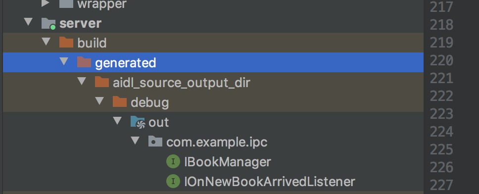
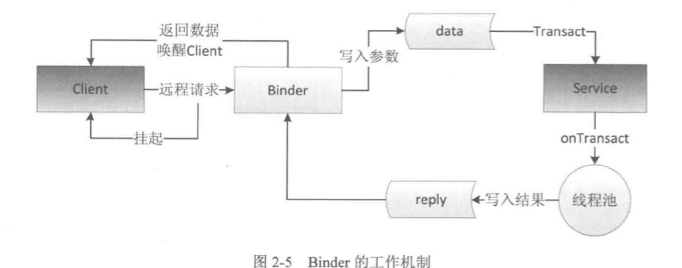
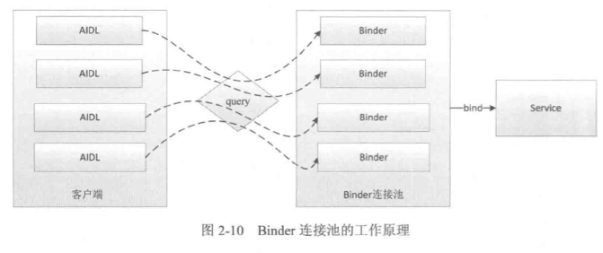

#### 1.Binder概述

Binder是android中的一个类,它实现了IBinder接口,从IPC角度来说,Binder是Android中的一种跨进程通信方式,Binder还可以理解为一种虚拟的物理设备,他的设备驱动是`/dev/binder`,该通信方式liunx中没有

在android中Binder有一下作用:

- App启动: System_Service连接各种Manage(ActivityManager,WindowManager)和各种ManagerService的桥梁
- ap对外开放能力等

#### 2.场景设定

还是使用之前的book相关管理系统

- **aidl文件**: `Book.aidl`(实现Parcelable),`IBookManager.aidl`其中实现了两个book相关的方法:`getBookList`和`addBook`,分别用于获取图书的所有信息和添加新的图书

在androidstudio rebuild知乎系统会为`IBookManager.aidl`生成一个`IBookManager.java`接下来我们基于此来分析binder的工作原理

####3.系统生成  `IBookManager.aidl`  —> `IBookManager.java`

文件路径:



在`/moudle/build/generated\aidl_source_output_dir\debug\out`下

来看代码:

```java
/*
 * This file is auto-generated.  DO NOT MODIFY.
 */
package com.example.ipc;
// Declare any non-default types here with import statements

public interface IBookManager extends android.os.IInterface
{
  /** Default implementation for IBookManager. */
  public static class Default implements com.example.ipc.IBookManager
  {
    @Override public java.util.List<com.example.ipc.Book> getBookList() throws android.os.RemoteException
    {
      return null;
    }
    @Override public void addBook(com.example.ipc.Book book) throws android.os.RemoteException
    {
    }
    // 添加新书订阅

    @Override public void registerListener(com.example.ipc.IOnNewBookArrivedListener listener) throws android.os.RemoteException
    {
    }
    // 取消新书订阅

    @Override public void unregisterListener(com.example.ipc.IOnNewBookArrivedListener listener) throws android.os.RemoteException
    {
    }
    @Override
    public android.os.IBinder asBinder() {
      return null;
    }
  }
  /** Local-side IPC implementation stub class. */
  public static abstract class Stub extends android.os.Binder implements com.example.ipc.IBookManager
  {
    private static final java.lang.String DESCRIPTOR = "com.example.ipc.IBookManager";
    /** Construct the stub at attach it to the interface. */
    public Stub()
    {
      this.attachInterface(this, DESCRIPTOR);
    }
    /**
     * Cast an IBinder object into an com.example.ipc.IBookManager interface,
     * generating a proxy if needed.
     */
    public static com.example.ipc.IBookManager asInterface(android.os.IBinder obj)
    {
      if ((obj==null)) {
        return null;
      }
      android.os.IInterface iin = obj.queryLocalInterface(DESCRIPTOR);
      if (((iin!=null)&&(iin instanceof com.example.ipc.IBookManager))) {
        return ((com.example.ipc.IBookManager)iin);
      }
      return new com.example.ipc.IBookManager.Stub.Proxy(obj);
    }
    @Override public android.os.IBinder asBinder()
    {
      return this;
    }
    @Override public boolean onTransact(int code, android.os.Parcel data, android.os.Parcel reply, int flags) throws android.os.RemoteException
    {
      java.lang.String descriptor = DESCRIPTOR;
      switch (code)
      {
        case INTERFACE_TRANSACTION:
        {
          reply.writeString(descriptor);
          return true;
        }
        case TRANSACTION_getBookList:
        {
          data.enforceInterface(descriptor);
          java.util.List<com.example.ipc.Book> _result = this.getBookList();
          reply.writeNoException();
          reply.writeTypedList(_result);
          return true;
        }
        case TRANSACTION_addBook:
        {
          data.enforceInterface(descriptor);
          com.example.ipc.Book _arg0;
          if ((0!=data.readInt())) {
            _arg0 = com.example.ipc.Book.CREATOR.createFromParcel(data);
          }
          else {
            _arg0 = null;
          }
          this.addBook(_arg0);
          reply.writeNoException();
          return true;
        }
        case TRANSACTION_registerListener:
        {
          data.enforceInterface(descriptor);
          com.example.ipc.IOnNewBookArrivedListener _arg0;
          _arg0 = com.example.ipc.IOnNewBookArrivedListener.Stub.asInterface(data.readStrongBinder());
          this.registerListener(_arg0);
          reply.writeNoException();
          return true;
        }
        case TRANSACTION_unregisterListener:
        {
          data.enforceInterface(descriptor);
          com.example.ipc.IOnNewBookArrivedListener _arg0;
          _arg0 = com.example.ipc.IOnNewBookArrivedListener.Stub.asInterface(data.readStrongBinder());
          this.unregisterListener(_arg0);
          reply.writeNoException();
          return true;
        }
        default:
        {
          return super.onTransact(code, data, reply, flags);
        }
      }
    }
    private static class Proxy implements com.example.ipc.IBookManager
    {
      private android.os.IBinder mRemote;
      Proxy(android.os.IBinder remote)
      {
        mRemote = remote;
      }
      @Override public android.os.IBinder asBinder()
      {
        return mRemote;
      }
      public java.lang.String getInterfaceDescriptor()
      {
        return DESCRIPTOR;
      }
      @Override public java.util.List<com.example.ipc.Book> getBookList() throws android.os.RemoteException
      {
        android.os.Parcel _data = android.os.Parcel.obtain();
        android.os.Parcel _reply = android.os.Parcel.obtain();
        java.util.List<com.example.ipc.Book> _result;
        try {
          _data.writeInterfaceToken(DESCRIPTOR);
          boolean _status = mRemote.transact(Stub.TRANSACTION_getBookList, _data, _reply, 0);
          if (!_status && getDefaultImpl() != null) {
            return getDefaultImpl().getBookList();
          }
          _reply.readException();
          _result = _reply.createTypedArrayList(com.example.ipc.Book.CREATOR);
        }
        finally {
          _reply.recycle();
          _data.recycle();
        }
        return _result;
      }
      @Override public void addBook(com.example.ipc.Book book) throws android.os.RemoteException
      {
        android.os.Parcel _data = android.os.Parcel.obtain();
        android.os.Parcel _reply = android.os.Parcel.obtain();
        try {
          _data.writeInterfaceToken(DESCRIPTOR);
          if ((book!=null)) {
            _data.writeInt(1);
            book.writeToParcel(_data, 0);
          }
          else {
            _data.writeInt(0);
          }
          boolean _status = mRemote.transact(Stub.TRANSACTION_addBook, _data, _reply, 0);
          if (!_status && getDefaultImpl() != null) {
            getDefaultImpl().addBook(book);
            return;
          }
          _reply.readException();
        }
        finally {
          _reply.recycle();
          _data.recycle();
        }
      }
      // 添加新书订阅

      @Override public void registerListener(com.example.ipc.IOnNewBookArrivedListener listener) throws android.os.RemoteException
      {
        android.os.Parcel _data = android.os.Parcel.obtain();
        android.os.Parcel _reply = android.os.Parcel.obtain();
        try {
          _data.writeInterfaceToken(DESCRIPTOR);
          _data.writeStrongBinder((((listener!=null))?(listener.asBinder()):(null)));
          boolean _status = mRemote.transact(Stub.TRANSACTION_registerListener, _data, _reply, 0);
          if (!_status && getDefaultImpl() != null) {
            getDefaultImpl().registerListener(listener);
            return;
          }
          _reply.readException();
        }
        finally {
          _reply.recycle();
          _data.recycle();
        }
      }
      // 取消新书订阅

      @Override public void unregisterListener(com.example.ipc.IOnNewBookArrivedListener listener) throws android.os.RemoteException
      {
        android.os.Parcel _data = android.os.Parcel.obtain();
        android.os.Parcel _reply = android.os.Parcel.obtain();
        try {
          _data.writeInterfaceToken(DESCRIPTOR);
          _data.writeStrongBinder((((listener!=null))?(listener.asBinder()):(null)));
          boolean _status = mRemote.transact(Stub.TRANSACTION_unregisterListener, _data, _reply, 0);
          if (!_status && getDefaultImpl() != null) {
            getDefaultImpl().unregisterListener(listener);
            return;
          }
          _reply.readException();
        }
        finally {
          _reply.recycle();
          _data.recycle();
        }
      }
      public static com.example.ipc.IBookManager sDefaultImpl;
    }
    static final int TRANSACTION_getBookList = (android.os.IBinder.FIRST_CALL_TRANSACTION + 0);
    static final int TRANSACTION_addBook = (android.os.IBinder.FIRST_CALL_TRANSACTION + 1);
    static final int TRANSACTION_registerListener = (android.os.IBinder.FIRST_CALL_TRANSACTION + 2);
    static final int TRANSACTION_unregisterListener = (android.os.IBinder.FIRST_CALL_TRANSACTION + 3);
    public static boolean setDefaultImpl(com.example.ipc.IBookManager impl) {
      if (Stub.Proxy.sDefaultImpl == null && impl != null) {
        Stub.Proxy.sDefaultImpl = impl;
        return true;
      }
      return false;
    }
    public static com.example.ipc.IBookManager getDefaultImpl() {
      return Stub.Proxy.sDefaultImpl;
    }
  }
  public java.util.List<com.example.ipc.Book> getBookList() throws android.os.RemoteException;
  public void addBook(com.example.ipc.Book book) throws android.os.RemoteException;
  // 添加新书订阅

  public void registerListener(com.example.ipc.IOnNewBookArrivedListener listener) throws android.os.RemoteException;
  // 取消新书订阅

  public void unregisterListene
  r(com.example.ipc.IOnNewBookArrivedListener listener) throws android.os.RemoteException;
}
```

下面进行拆解,代码实在太多了!


#### 4. `IBookManager extends android.os.IInterface`

首先来看最外层的实现:

```java
public interface IBookManager extends android.os.IInterface
{
	public java.util.List<com.example.ipc.Book> getBookList() throws android.os.RemoteException;
  public void addBook(com.example.ipc.Book book) throws android.os.RemoteException;
  // 添加新书订阅

  public void registerListener(com.example.ipc.IOnNewBookArrivedListener listener) throws android.os.RemoteException;
  // 取消新书订阅

  public void unregisterListener(com.example.ipc.IOnNewBookArrivedListener listener) throws android.os.RemoteException;
}
```

这就是一个`interface`,然后服务端取实现即可,实现之后在Stub的onTrans中就可以直接调用实现的方法

接下来看Binder的真正流程

接着看 Stub

#### 5. `.Stub`

```java
public static abstract class Stub extends android.os.Binder implements com.example.ipc.IBookManager
  {
    private static final java.lang.String DESCRIPTOR = "com.example.ipc.IBookManager";
    /** Construct the stub at attach it to the interface. */
    // 添加描述,并且绑定
    public Stub()
    {
      this.attachInterface(this, DESCRIPTOR);
    }
    /**
     * Cast an IBinder object into an com.example.ipc.IBookManager interface,
     * generating a proxy if needed.
     */
    // 将binder转化为目标aidl  IBookManager
    public static com.example.ipc.IBookManager asInterface(android.os.IBinder obj)
    {
      if ((obj==null)) {
        return null;
      }
      android.os.IInterface iin = obj.queryLocalInterface(DESCRIPTOR);
      if (((iin!=null)&&(iin instanceof com.example.ipc.IBookManager))) {
        // 同一进程下返回服务端的Stub对象本身
        return ((com.example.ipc.IBookManager)iin);
      }
      // 不同进程下返回的是系统封装后的Proxy对象
      return new com.example.ipc.IBookManager.Stub.Proxy(obj);
    }
    @Override public android.os.IBinder asBinder()
    {
      return this;
    }

    // 同一进程下走这个   运行在服务端binder的线程池
    @Override public boolean onTransact(int code, android.os.Parcel data, android.os.Parcel reply, int flags) throws android.os.RemoteException
    {
      java.lang.String descriptor = DESCRIPTOR;
      switch (code)
      {
        case INTERFACE_TRANSACTION:
        {
          reply.writeString(descriptor);
          return true;
        }
        case TRANSACTION_getBookList:
        {
          data.enforceInterface(descriptor);
          java.util.List<com.example.ipc.Book> _result = this.getBookList();
          reply.writeNoException();
          // 最终写入返回值  --- 依然有具体实现
          reply.writeTypedList(_result);
          return true;
        }
        case TRANSACTION_addBook:
        {
          data.enforceInterface(descriptor);
          com.example.ipc.Book _arg0;
          if ((0!=data.readInt())) {
            // 自己有实现这个方法
            /**
             *  public static final Creator<Book> CREATOR = new Creator<Book>(){
             *
             *         @Override
             *         public Book createFromParcel(Parcel source) {
             *
             *             return new Book(source);
             *         }
             *
             *         @Override
             *         public Book[] newArray(int size) {
             *             return new Book[size];
             *         }
             *     };
             */
            // 获取data数据
            _arg0 = com.example.ipc.Book.CREATOR.createFromParcel(data);
          }
          else {
            _arg0 = null;
          }
          this.addBook(_arg0);

          reply.writeNoException();
          return true;  // return true  客户端请求成功  return false 客户端请求失败
        }
        case TRANSACTION_registerListener:
        {
          data.enforceInterface(descriptor);
          com.example.ipc.IOnNewBookArrivedListener _arg0;
          _arg0 = com.example.ipc.IOnNewBookArrivedListener.Stub.asInterface(data.readStrongBinder());
          this.registerListener(_arg0);
          reply.writeNoException();
          return true;
        }
        case TRANSACTION_unregisterListener:
        {
          data.enforceInterface(descriptor);
          com.example.ipc.IOnNewBookArrivedListener _arg0;
          _arg0 = com.example.ipc.IOnNewBookArrivedListener.Stub.asInterface(data.readStrongBinder());
          this.unregisterListener(_arg0);
          reply.writeNoException();
          return true;
        }
        default:
        {
          return super.onTransact(code, data, reply, flags);
        }
      }
    }
```

`.Stub`继承自`binder`,并实现了`IBookManager`

一步步分析:


##### 5.1DESCRIPTOR

先看其构造

```java
  private static final java.lang.String DESCRIPTOR = "com.example.ipc.IBookManager";
    /** Construct the stub at attach it to the interface. */
    // 添加描述,并且绑定
    public Stub()
    {
      this.attachInterface(this, DESCRIPTOR);
    }
```

**DESCRIPTOR**

这是binder的唯一标识,一般用binder的类名表示,然后进行绑定binder

##### 5.2`.asInterface`

```java
   // 将binder转化为目标aidl  IBookManager
    public static com.example.ipc.IBookManager asInterface(android.os.IBinder obj)
    {
      if ((obj==null)) {
        return null;
      }
      android.os.IInterface iin = obj.queryLocalInterface(DESCRIPTOR);
      if (((iin!=null)&&(iin instanceof com.example.ipc.IBookManager))) {
        // 同一进程下返回服务端的Stub对象本身
        return ((com.example.ipc.IBookManager)iin);
      }
      // 不同进程下返回的是系统封装后的Proxy对象
      return new com.example.ipc.IBookManager.Stub.Proxy(obj);
    }
    @Override public android.os.IBinder asBinder()
    {
      return this;
    }
```

将服务端的binder对象转换成客户端所需的AIDL接口类型的对象,其实类似多态的向下强转,注意看上面的代码:

- 如果客户端和服务端位于同一进程,那么就返回服务端的Stub本身,就是原始AIDL的实现
- 如果客户端和服务端不是同一进程,就返回`.Stub`的代理对象`.Stub.Proxy`,这个代理不是真正的实现类

##### 5.2 asBinder

```java
@Override public android.os.IBinder asBinder()
{
  return this;
}
```

返回当前的binder对象,无实际意义


#### 6.`.Stub.Proxy`

接着看`.stub`的内部类 `Proxy`

```java
private static class Proxy implements com.example.ipc.IBookManager
```

同样实现了IBookManager,但是他没有办法调用服务实现的aidl接口的方法,需要借助`.Stub.onTransact`

**这个方法是在客户端和服务端不在同一进程下,获得的aidl接口实例**

上面有提到  `asinterface`转化时候如果不在同意进程则返回  `proxy`就是他

下面来分析具体的方法

```java
@Override public java.util.List<com.example.ipc.Book> getBookList() throws android.os.RemoteException
{
  // 创建该方法需要输入Parcel对象_data;输出的Parcel对象_reply;返回值List
  android.os.Parcel _data = android.os.Parcel.obtain();
  android.os.Parcel _reply = android.os.Parcel.obtain();
  java.util.List<com.example.ipc.Book> _result;
  try {
    _data.writeInterfaceToken(DESCRIPTOR);
    // 调用transact来发起RPC(远程过程调用)  当前线程(客户端)挂起  -- 进而调用服务端的onTransact
    boolean _status = mRemote.transact(Stub.TRANSACTION_getBookList, _data, _reply, 0);
    if (!_status && getDefaultImpl() != null) {
      return getDefaultImpl().getBookList();
    }
    _reply.readException();
    // RPC执行结束后 将返回值写入reply
    _result = _reply.createTypedArrayList(com.example.ipc.Book.CREATOR);
  }
  finally {
    _reply.recycle();
    _data.recycle();
  }
  return _result;
}
```

在`getList方法中`我们看到(首先这个方法无入参,只有出参)

大体流程是这样的:

- 声明入参  `  android.os.Parcel _data`, 出参`android.os.Parcel _reply`,然后返回值` java.util.List<com.example.ipc.Book> _result`

- 然后`_data`写入数据,由于`getBookList`没有入参,我们可以结合看下`addBook`

  ```java
  @Override public void addBook(com.example.ipc.Book book) throws android.os.RemoteException
  {
    android.os.Parcel _data = android.os.Parcel.obtain();
    android.os.Parcel _reply = android.os.Parcel.obtain();
    try {
      _data.writeInterfaceToken(DESCRIPTOR);
      if ((book!=null)) {
        _data.writeInt(1);
        // 写入到data中
        book.writeToParcel(_data, 0);
      }
      else {
        _data.writeInt(0);
      }
      // 调用transact来发起RPC(远程过程调用) 当前线程(客户端)挂起  -- 进而调用服务端的onTransact
      boolean _status = mRemote.transact(Stub.TRANSACTION_addBook, _data, _reply, 0);
      if (!_status && getDefaultImpl() != null) {
        getDefaultImpl().addBook(book);
        return;
      }
      _reply.readException();
    }
  ```

  这里` book.writeToParcel(_data, 0);`就是客户端传入数据的写入,他的具体实现是在`Book.java`中,我们自己有实现:

  ```java
  @Override
  public void writeToParcel(Parcel dest, int flags) {
      dest.writeInt(id);
      dest.writeString(name);
  }
  ```

  到此数据写入完毕,继续回到 `getBookList`

- 写入数据要把数据传入服务端,这里调用`mRemote.transact`,发起远程调用(RPC),此时客户端线程挂起,然后调用服务中的`onTransact`(在binder线程池中执行),这个后面写,先走通流程

  ```java
   mRemote.transact(Stub.TRANSACTION_getBookList, _data, _reply, 0);
  ```

  执行完RPC之后`_reply`被赋值

- 从RPC中去除`_reply`返回的数据,然后从序列化类读取`_reply.createTypedArrayList(com.example.ipc.Book.CREATOR);`进行返回

  `_reply.createTypedArrayList(com.example.ipc.Book.CREATOR)`这个我们也是实现过的

  

```java
public static final Creator<Book> CREATOR = new Creator<Book>(){

    @Override
    public Book createFromParcel(Parcel source) {

        return new Book(source);
    }

    @Override
    public Book[] newArray(int size) {
        return new Book[size];
    }
};
 public Book(Parcel in) {
        id = in.readInt();
        name = in.readString();
    }
```

#### 7..Stub.onTransact

这是服务真正调用获取aidl方法结果的类,**当然前面说过如果客户端和服务端在同一进程,那么`asinterface`返回的就是stub,不需要走上面proxy的逻辑,也就是说会直接调用onTransact**

```java
@Override public boolean onTransact(int code, android.os.Parcel data, android.os.Parcel reply, int flags) throws android.os.RemoteException
{
  java.lang.String descriptor = DESCRIPTOR;
  switch (code)
  {
    case INTERFACE_TRANSACTION:
    {
      reply.writeString(descriptor);
      return true;
    }
    case TRANSACTION_getBookList:
    {
      data.enforceInterface(descriptor);
      java.util.List<com.example.ipc.Book> _result = this.getBookList();
      reply.writeNoException();
      // 最终写入返回值  --- 依然有具体实现
      reply.writeTypedList(_result);
      return true;
    }
    case TRANSACTION_addBook:
    {
      data.enforceInterface(descriptor);
      com.example.ipc.Book _arg0;
      if ((0!=data.readInt())) {
        // 自己有实现这个方法
        /**
         *  public static final Creator<Book> CREATOR = new Creator<Book>(){
         *
         *         @Override
         *         public Book createFromParcel(Parcel source) {
         *
         *             return new Book(source);
         *         }
         *
         *         @Override
         *         public Book[] newArray(int size) {
         *             return new Book[size];
         *         }
         *     };
         */
        // 获取data数据
        _arg0 = com.example.ipc.Book.CREATOR.createFromParcel(data);
      }
      else {
        _arg0 = null;
      }
      this.addBook(_arg0);

      reply.writeNoException();
      return true;  // return true  客户端请求成功  return false 客户端请求失败
    }
    case TRANSACTION_registerListener:
    {
      data.enforceInterface(descriptor);
      com.example.ipc.IOnNewBookArrivedListener _arg0;
      _arg0 = com.example.ipc.IOnNewBookArrivedListener.Stub.asInterface(data.readStrongBinder());
      this.registerListener(_arg0);
      reply.writeNoException();
      return true;
    }
    case TRANSACTION_unregisterListener:
    {
      data.enforceInterface(descriptor);
      com.example.ipc.IOnNewBookArrivedListener _arg0;
      _arg0 = com.example.ipc.IOnNewBookArrivedListener.Stub.asInterface(data.readStrongBinder());
      this.unregisterListener(_arg0);
      reply.writeNoException();
      return true;
    }
    default:
    {
      return super.onTransact(code, data, reply, flags);
    }
  }
}
```

这就是 `onTransact`,看下他的方法实现

```java
case TRANSACTION_getBookList:
{
  data.enforceInterface(descriptor);
  java.util.List<com.example.ipc.Book> _result = this.getBookList();
  reply.writeNoException();
  // 最终写入返回值  --- 依然有具体实现
  reply.writeTypedList(_result);
  return true;
}
case TRANSACTION_addBook:
{
  data.enforceInterface(descriptor);
  com.example.ipc.Book _arg0;
  if ((0!=data.readInt())) {
    // 自己有实现这个方法
    // 获取data数据
    _arg0 = com.example.ipc.Book.CREATOR.createFromParcel(data);
  }
  else {
    _arg0 = null;
  }
  this.addBook(_arg0);

  reply.writeNoException();
  return true;  // return true  客户端请求成功  return false 客户端请求失败
}
```

结合`getBookList`和`addBook`

- `_arg0 = com.example.ipc.Book.CREATOR.createFromParcel(data);`获取入参

-  `this.addBook(_arg0)`调用服务实现的aidl方法

  ```java
  @Override
  public void addBook(com.example.ipc.Book book) throws RemoteException {
      try {
          Thread.sleep(5000);
      } catch (InterruptedException e) {
          e.printStackTrace();
      }
      mBookList.add(book);
  }
  ```

- `addbook`没有返回值,继续跳到`getBookList`,`this.getBookList();`调用完之后进行返回值的写入  `reply.writeTypedList(_result);`这个方法会调用`Book`的

  ```java
  @Override
  public void writeToParcel(Parcel dest, int flags) {
      dest.writeInt(id);
      dest.writeString(name);
  }
  ```

到此为止就结束了,然后RPC之后`Proxy`拿到结果反馈给客户端



这是流程图


#### 8 binder的连接池

> 场景:多个业务模块使用AIDL进行进程间通信

所有AIDL放在同一个Service中去管理

服务端只需要一个Service即可,然后提供一个queryBinder接口,这个接口能够根据业务模块的特征来返回相应的binder对象给他们,不同的业务模块拿到所需的Binde对象后就可以进行远程调用了

由此可见Binder连接池的主要作用:

**将每个业务模块的binder请求统一转发到远程Service去执行,从而避免了重复创建Service的过程**



##### 8.1服务端:

- 建立Binder链接池或者Binder工厂

```java
// IBinderPool.aidl
package com.example.ipc;


// Declare any non-default types here with import statements

interface IBinderPool {

    IBinder queryBinder(int binderCode);
}

public class QueryBinderImpl extends IBinderPool.Stub {


    private static final int BINDER_SECURITY_CENTER = 1;
    private static final int BINDER_COMPUTE = 0;

    @Override
    public IBinder queryBinder(int binderCode) throws RemoteException {
        IBinder binder = null;
        switch (binderCode){
            case BINDER_SECURITY_CENTER:
                binder = new SecurityCenterImpl();
                break;
            case BINDER_COMPUTE:
                binder = new ComputeImpl();
                break;
            default:
                break;
        }
        return binder;
    }
}

```

可以看到 客户端传给服务端`binderCode`,然后服务端会返回客户端相应功能的binder

我们来看服务端的Service

```java
import androidx.annotation.Nullable;

public class BinderPoolService extends Service {


    private static final String TAG = "BinderPoolService";

    private Binder mBinderPool = new QueryBinderImpl();


    @Nullable
    @Override
    public IBinder onBind(Intent intent) {
        Log.i(TAG,"onBind");
        return mBinderPool;
    }

    @Override
    public void onDestroy() {
        super.onDestroy();
    }
}
```

##### 8.2客户端:

```java
public class BinderPool {
    private static final String TAG = "BinderPool";

    public static final int BINDER_NONE = -1;
    public static final int BINDER_COMPUTE = 0;
    public static final int BINDER_SECURITY_CENTER = 1;

    private Context mContext;
    private IBinderPool mBinderPool;
    private static volatile BinderPool sInstance;
    private CountDownLatch mConnectBinderPoolCountDwonLatch;

    public BinderPool(Context mContext) {
        this.mContext = mContext;
        connectBinderPoolService();
    }

    public static BinderPool getInstance(Context context){
        if (sInstance == null){
            synchronized (BinderPool.class){
                if (sInstance == null){
                    sInstance = new BinderPool(context);
                }
            }
        }
        return sInstance;
    }

    private void connectBinderPoolService() {
        mConnectBinderPoolCountDwonLatch = new CountDownLatch(1);
        Intent intent = new Intent();
        intent.setComponent(new ComponentName("com.example.server",
                "com.example.server.BinderPoolService"));
        mContext.bindService(intent, mConn, Context.BIND_AUTO_CREATE);
        try {
            // 线程挂起
            mConnectBinderPoolCountDwonLatch.await();
        } catch (InterruptedException e) {
            e.printStackTrace();
        }
    }

    private ServiceConnection mConn = new ServiceConnection() {
        @Override
        public void onServiceConnected(ComponentName name, IBinder service) {
            mBinderPool = IBinderPool.Stub.asInterface(service);
            try {
                mBinderPool.asBinder().linkToDeath(mBinderPoolDeatchRecipient,0);
            } catch (RemoteException e) {
                e.printStackTrace();
            }
            // 线程释放  为了保证获取mBinderPool
            mConnectBinderPoolCountDwonLatch.countDown();
        }

        @Override
        public void onServiceDisconnected(ComponentName name) {

        }
    };


    private IBinder.DeathRecipient mBinderPoolDeatchRecipient = new IBinder.DeathRecipient() {
        @Override
        public void binderDied() {
            Log.i(TAG,"binder died");
            mBinderPool.asBinder().unlinkToDeath(mBinderPoolDeatchRecipient,0);
            mBinderPool = null;
            connectBinderPoolService();
        }
    };

    // 从binderPool 中查询对应的binder
    public IBinder queryBinder(int binderCode){
        IBinder binder = null;
        try {
            if (mBinderPool!=null){
                binder = mBinderPool.queryBinder(binderCode);
            }

        } catch (RemoteException e) {
            e.printStackTrace();
        }
        return binder;
    }


}
```

其实就是封装bindSrrvice的过程以及`queryBinder`

使用:

```java
private void doWork() {
    BinderPool binderPool = BinderPool.getInstance(BinderPoolActivity.this);
    IBinder securityBinder = binderPool
            .queryBinder(BinderPool.BINDER_SECURITY_CENTER);;
    mSecurityCenter = ISecurityCenter.Stub
            .asInterface(securityBinder);
    Log.d(TAG, "visit ISecurityCenter");
    String msg = "helloworld-安卓";
    System.out.println("content:" + msg);
    try {
        String password = mSecurityCenter.encrypt(msg);
        System.out.println("encrypt:" + password);
        System.out.println("decrypt:" + mSecurityCenter.decrypt(password));
    } catch (RemoteException e) {
        e.printStackTrace();
    }

    Log.d(TAG, "visit ICompute");
    IBinder computeBinder = binderPool
            .queryBinder(BinderPool.BINDER_COMPUTE);
    ;
    mCompute = ICompute.Stub.asInterface(computeBinder);
    try {
        System.out.println("3+5=" + mCompute.add(3, 5));
    } catch (RemoteException e) {
        e.printStackTrace();
    }
}
```

#### 9 .总结

服务维护一个Service,这个service会维护所有的binder接口,所以叫binder池,然后通过`queryBinder(BinderCode)`返回对应的Binder接口


客户端通过启动服务获取服务端连接池的binder接口,然后根据想要获取binderCode来获取对应的binder,然后调用其方法


