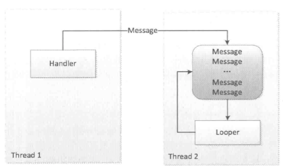
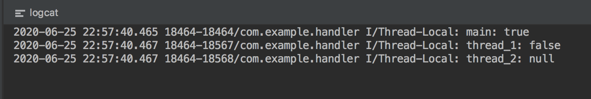
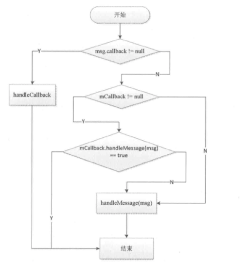

#### 1.Handler消息机制概述

android中的消息机制是指Handler的运行机制,Handler的运行需要底层的MessageQueue和Looper的支撑

- **MessageQueue**:消息队列,其实不是队列是一个单链表的数据结构来存储消息列表
- **Looper**:是一个消息循环,他会以无限循环的形式去查找是否有新消息
- **ThreadLocal**:每个线程中存储数据

所以,**Android中的消息机制是指Handler的运行机制以及Handler所附带的MessageQueue和Looper的工作过程**

Handler最常见的作用是任务的线程切换;**因为很多时候,在android中为了防止ANR,子线程要去处理耗时操作,然后处理完成需要在UI线程中更新UI**

android中UI处理必须在UI线程中执行,耗时操作不建议在UI线程中执行

下面看下 `ViewRootImpl`中的thread检查:

```java
// 在requstLayout时候会有thread-check
void checkThread() {
    if (mThread != Thread.currentThread()) {
        throw new CalledFromWrongThreadException(
                "Only the original thread that created a view hierarchy can touch its views.");
    }
}
```

所以Handler是为了解决子线程不能更新UI的痛点

**android系统不允许在子线程访问UI的原因**

android UI控件不是线程安全的,如果在多线程中并发访问可能会导致UI控件出于不可预期的状态

- 如果加锁机制会让UI访问的逻辑复杂
- 如果加锁机制降低UI访问的效率

使用handler需要注意一下几点:

- handler实例化之前必须实例化Looper,主线程已经实例化完毕  `Looper.mylooper()`
- handler会post到looper所在线程去执行,即实例化handler所在线程,一个线程只有一个looper



#### 2. ThreadLocal

ThreadLocal就是一个线程的数据存储类;存储之后只有当前线程可以获取,他和线程是绑定在一起的

##### 2.1 ThreadLocal的简单使用

```java
@Override
protected void onCreate(Bundle savedInstanceState) {
    super.onCreate(savedInstanceState);
    setContentView(R.layout.activity_main);
    mBooleanThreadLocal.set(true);
    Log.i(TAG,Thread.currentThread().getName() + ": " + mBooleanThreadLocal.get());

    doWork();
}

private void doWork() {
    new Thread("thread_1"){
        @Override
        public void run() {
            mBooleanThreadLocal.set(false);
            Log.i(TAG,Thread.currentThread().getName() + ": " + mBooleanThreadLocal.get());
        }
    }.start();


    new Thread("thread_2"){
        @Override
        public void run() {
            Log.i(TAG,Thread.currentThread().getName() + ": " + mBooleanThreadLocal.get());
        }
    }.start();


}
```

运行结果:



可以看到ThreadLocal是和线程绑定的,每个线程的ThreadLocal维护一套副本互不干扰


使用场景:

- **场景1:**比如Handler中获取当前线程的looper就是使用的ThreadLocal

- **场景2:**复杂场景下的对象传递

##### 2.2 ThreadLocal 源码

######2.2.1 ThreadLocal构造

```java
public ThreadLocal() {
}
```

一个空构造无意义,继续看

######2.2.2.set()

```java
public void set(T value) {
    Thread t = Thread.currentThread();
    ThreadLocalMap map = getMap(t);
    if (map != null)
        map.set(this, value);
    else
        createMap(t, value);
}
```

首先获取当前线程`Thread.currentThread();`

根据当前线程获取一个`ThreadLocalMap`,这个`ThreadLocalMap`是线程中一个成员,每个线程仅有一个

下面的逻辑就很简单了:

- 如果当前线程的`ThreadLocalMap`为null,则创建

  ```java
   void createMap(Thread t, T firstValue) {
          t.threadLocals = new ThreadLocalMap(this, firstValue);
      }
  ```

- 如果存在直接set即可

###### 2.2.3 ThreadLocal.createMap

在`ThreadLocal.createMap`中实例化ThreadLocalmap

```java
ThreadLocalMap(ThreadLocal<?> firstKey, Object firstValue) {
    table = new Entry[INITIAL_CAPACITY];
    int i = firstKey.threadLocalHashCode & (INITIAL_CAPACITY - 1);
    table[i] = new Entry(firstKey, firstValue);
    size = 1;
    setThreshold(INITIAL_CAPACITY);
}
```

- 首先是实例化 table,这是一个Entry数组`private Entry[] table`

而Entry就是一个继承自弱引用的实体类

```java
static class Entry extends WeakReference<ThreadLocal<?>> {
    /** The value associated with this ThreadLocal. */
    Object value;

    Entry(ThreadLocal<?> k, Object v) {
        super(k);
        value = v;
    }
}
```

- `INITIAL_CAPACITY`这是一个`Entry[]`的length,为16

- `firstKey.threadLocalHashCode & (INITIAL_CAPACITY - 1);`这是一个位运算

  在计算机中,位运算运算效率高所以table中的索引使用位运算

  上面index获取是位运算 同等于  取模运算`%`

  `firstKey.threadLocalHashCode`每次获取hashCode就是在原来基础上加`0x61c88647`

  ```java
  private final int threadLocalHashCode = nextHashCode();
   private static final int HASH_INCREMENT = 0x61c88647;
  
      /**
       * Returns the next hash code.
       */
      private static int nextHashCode() {
          return nextHashCode.getAndAdd(HASH_INCREMENT);
      }
  ```

-    `table[i] = new Entry(firstKey, firstValue);`所以根据上面求得的索引进行threadLlocal和数据的存储

  

###### 2.2.4继续看set ` map.set(this, value);`

和前面讲的一致:  获取当前线程,根据当前线程获取`ThreadLocal.ThreadLocalMap`,然后判断map是否为空,为空就像上面的`createMap`,不是空就`   map.set(this, value);`   

```java
private void set(ThreadLocal<?> key, Object value) {

    // We don't use a fast path as with get() because it is at
    // least as common to use set() to create new entries as
    // it is to replace existing ones, in which case, a fast
    // path would fail more often than not.

    Entry[] tab = table;
    int len = tab.length;
  	// 获取索引
    int i = key.threadLocalHashCode & (len-1);
		
  	// 根据索引找table对应的index位置
    for (Entry e = tab[i];
         e != null;
         // 3. 如果既不是同一个ThreadLocal且对应位置Entry不为null;则索引后移继续之前1-2操作
         e = tab[i = nextIndex(i, len)]) {
        ThreadLocal<?> k = e.get();
				// 1. 判断目标位置的ThreadLocal是否是同一个ThreadLocal,是的花就覆盖数据并返回
        if (k == key) {
            e.value = value;
            return;
        }
				// 2. 判断目标位置的ThreadLocal不是同一个ThreadLocal,则判断是否为null,则重新设置并替换
        if (k == null) {
            replaceStaleEntry(key, value, i);
            return;
        }
    }

    tab[i] = new Entry(key, value);
    int sz = ++size;
    if (!cleanSomeSlots(i, sz) && sz >= threshold)
        rehash();
}
```

###### 2.2.5 `.get()`

```java
public T get() {
  	// 获取当前线程
    Thread t = Thread.currentThread();
  	// 获取当前线程的ThreadLocalMap
    ThreadLocalMap map = getMap(t);
    if (map != null) {
      	
        ThreadLocalMap.Entry e = map.getEntry(this);
        if (e != null) {
            @SuppressWarnings("unchecked")
            T result = (T)e.value;
            return result;
        }
    }
    return setInitialValue();
}

// 如果get不到就继续重新set
private T setInitialValue() {
        T value = initialValue();
        Thread t = Thread.currentThread();
        ThreadLocalMap map = getMap(t);
        if (map != null)
            map.set(this, value);
        else
            createMap(t, value);
        return value;
}

private Entry getEntry(ThreadLocal<?> key) {
  					// 根据当前TreadLocal的hashcode获取索引
            int i = key.threadLocalHashCode & (table.length - 1);
            Entry e = table[i];
  					// 如果Entry数组对应index的key是当前threadlocal就获取当前的entry
            if (e != null && e.get() == key)
                return e;
            else
               // 如果Entry数组对应index的key不是当前threadlocal
                return getEntryAfterMiss(key, i, e);
        }
// 如果Entry数组对应index的key不是当前threadlocal则index后推进行寻找
 private Entry getEntryAfterMiss(ThreadLocal<?> key, int i, Entry e) {
            Entry[] tab = table;
            int len = tab.length;

            while (e != null) {
                ThreadLocal<?> k = e.get();
                if (k == key)
                    return e;
                if (k == null)
                    expungeStaleEntry(i);
                else
                    i = nextIndex(i, len);
                e = tab[i];
            }
            return null;
        }
```

###### 2.2.6`.remove`

移除操作就是找到对应entry移除即可

#### 3.消息队列 MessageQueue

MessageQueue主要包含两个操作插入;读取操作本身会伴随着删除操作,插入和读取对应的方法分别为enqueueMessage和next;

- enquequeMessage是往消息队列中插入一条消息
- next作用是从消息队列中去取一条消息并将其从消息队列移除

##### 3.1 enqueueMessage

```java
boolean enqueueMessage(Message msg, long when) {
  	// check当前msg是否绑定handler
    if (msg.target == null) {
        throw new IllegalArgumentException("Message must have a target.");
    }
  	// check 当前msg是否在使用
    if (msg.isInUse()) {
        throw new IllegalStateException(msg + " This message is already in use.");
    }
		// 同步锁  保证handler中msg串行 或者同步
    synchronized (this) {
      	// 如果退出则回收msg
        if (mQuitting) {
            IllegalStateException e = new IllegalStateException(
                    msg.target + " sending message to a Handler on a dead thread");
            Log.w(TAG, e.getMessage(), e);
            msg.recycle();
            return false;
        }
				// 标记msg的使用状态
        msg.markInUse();
        msg.when = when;
        Message p = mMessages;
        boolean needWake;
        if (p == null || when == 0 || when < p.when) {
            // New head, wake up the event queue if blocked.
          	// 1.第一次创建
          	// 2.新建头部,比旧头部结点时效性高则作为新的头部插入
            msg.next = p;  // msg -> null
            mMessages = msg;  // mMessage = msg
            needWake = mBlocked;
        } else {
            // Inserted within the middle of the queue.  Usually we don't have to wake
            // up the event queue unless there is a barrier at the head of the queue
            // and the message is the earliest asynchronous message in the queue.
            needWake = mBlocked && p.target == null && msg.isAsynchronous();
            Message prev;
          	// 插入数据
            for (;;) {
              	//记录前一个位置
                prev = p;
              	// 位置后移
                p = p.next;
              	// p移动到末尾然后break
                if (p == null || when < p.when) {
                    break;
                }
                if (needWake && p.isAsynchronous()) {
                    needWake = false;
                }
            }
          	// 将 masg插入到末尾
            msg.next = p; // invariant: p == prev.next
            prev.next = msg;
        }

        // We can assume mPtr != 0 because mQuitting is false.
        if (needWake) {
            nativeWake(mPtr);
        }
    }
    return true;
}
```

上面就是一个单链表末位插入的操作,Messge就是一个单链表

##### 3.2 next

```java
@UnsupportedAppUsage
Message next() {
  
    .....

    int pendingIdleHandlerCount = -1; // -1 only during first iteration
    int nextPollTimeoutMillis = 0;
    for (;;) {
        ......
				// 同步锁,保证线程安全
        synchronized (this) {
            // Try to retrieve the next message.  Return if found.
            final long now = SystemClock.uptimeMillis();
            Message prevMsg = null;
            Message msg = mMessages;
          	// 单链表取末位的逻辑,因为next是从末位串行取数据
            if (msg != null && msg.target == null) {
                // Stalled by a barrier.  Find the next asynchronous message in the queue.
                do {
                    prevMsg = msg;
                    msg = msg.next;
                // msg.isAsynchronous()如果是异步就返回true,如果是同步就返回false
                } while (msg != null && !msg.isAsynchronous());
            }
      
            if (msg != null) {
                if (now < msg.when) {
                    // Next message is not ready.  Set a timeout to wake up when it is ready.
                  	// 检测
                    nextPollTimeoutMillis = (int) Math.min(msg.when - now, Integer.MAX_VALUE);
                } else {
                    // Got a message.
                    mBlocked = false;
                    if (prevMsg != null) {
                        prevMsg.next = msg.next;
                    } else {
                        mMessages = msg.next;
                    }
                    msg.next = null;
                    if (DEBUG) Log.v(TAG, "Returning message: " + msg);
                    msg.markInUse();
                    return msg;
                }
            } else {
                // No more messages.
                nextPollTimeoutMillis = -1;
            }

            // Process the quit message now that all pending messages have been handled.
            if (mQuitting) {
                dispose();
                return null;
            }

            // If first time idle, then get the number of idlers to run.
            // Idle handles only run if the queue is empty or if the first message
            // in the queue (possibly a barrier) is due to be handled in the future.
            if (pendingIdleHandlerCount < 0
                    && (mMessages == null || now < mMessages.when)) {
                pendingIdleHandlerCount = mIdleHandlers.size();
            }
            if (pendingIdleHandlerCount <= 0) {
                // No idle handlers to run.  Loop and wait some more.
                mBlocked = true;
                continue;
            }

            if (mPendingIdleHandlers == null) {
                mPendingIdleHandlers = new IdleHandler[Math.max(pendingIdleHandlerCount, 4)];
            }
            mPendingIdleHandlers = mIdleHandlers.toArray(mPendingIdleHandlers);
        }

        // Run the idle handlers.
        // We only ever reach this code block during the first iteration.
        for (int i = 0; i < pendingIdleHandlerCount; i++) {
            final IdleHandler idler = mPendingIdleHandlers[i];
            mPendingIdleHandlers[i] = null; // release the reference to the handler

            boolean keep = false;
            try {
                keep = idler.queueIdle();
            } catch (Throwable t) {
                Log.wtf(TAG, "IdleHandler threw exception", t);
            }

            if (!keep) {
                synchronized (this) {
                    mIdleHandlers.remove(idler);
                }
            }
        }

        // Reset the idle handler count to 0 so we do not run them again.
        pendingIdleHandlerCount = 0;

        // While calling an idle handler, a new message could have been delivered
        // so go back and look again for a pending message without waiting.
        nextPollTimeoutMillis = 0;
    }
}
```

可以发现next方法就是一个无限循环的方法,如果消息队列中没有消息,那么next方法会一直阻塞在这里,当有新消息到来时候.next方法会返回这条消息并将其从单链表中移除

####4 Looper的工作原理

Looper在android消息机制中扮演者消息循环的角色,其实就是不停的从MessageQueue中查看是否有新消息,如果有新消息就会立刻处理

##### 4.1  `.Looper`

```java
private Looper(boolean quitAllowed) {
    mQueue = new MessageQueue(quitAllowed);
    mThread = Thread.currentThread();
}
```

Looper构造中会初始化消息队列`MessageQueue`

我们知道Handler需要looper,没有looper的线程会报错,在实例化handler之前需要调用Looper.prepare(),接着就可以通过Looper.loop()来开启消息循环

##### 4.2 `.prepare()`

这个`.prepare()`就是给当前线程的`ThreadLocal`设置`Looper`

```java
private static void prepare(boolean quitAllowed) {
    if (sThreadLocal.get() != null) {
        throw new RuntimeException("Only one Looper may be created per thread");
    }
    sThreadLocal.set(new Looper(quitAllowed));
}
```

注意:主线程会自动创建looper,可以通过`getMainLooper`来获取:

```java
   public static Looper getMainLooper() {
        synchronized (Looper.class) {
            return sMainLooper;
        }
    }
    
```

Looper是可以退出的,有两种分别是`quit`和`quitSafely`

- `quit`:会直接退出Looper
- `quitSafely`:只是设定一个退出标记,然后把消息队列中的已有消息全部处理完毕之后才回退出

Looper退出后,handler `sendMsg`会失败,并返回false

##### 4.3`Looper.loop`

```java
public static void loop() {
    final Looper me = myLooper();
    if (me == null) {
        throw new RuntimeException("No Looper; Looper.prepare() wasn't called on this thread.");
    }
  	// 获取消息队列
    final MessageQueue queue = me.mQueue;

    ......
		
    // 死循环:一直从MessageQueue中获取msg
    for (;;) {
        Message msg = queue.next(); // might block
        ......

        
        try {
          	// 会调handler中的dispatchMessage
            msg.target.dispatchMessage(msg);
            dispatchEnd = needEndTime ? SystemClock.uptimeMillis() : 0;
        } finally {
            if (traceTag != 0) {
                Trace.traceEnd(traceTag);
            }
        }
        if (logSlowDelivery) {
            if (slowDeliveryDetected) {
                if ((dispatchStart - msg.when) <= 10) {
                    Slog.w(TAG, "Drained");
                    slowDeliveryDetected = false;
                }
            } else {
                if (showSlowLog(slowDeliveryThresholdMs, msg.when, dispatchStart, "delivery",
                        msg)) {
                    // Once we write a slow delivery log, suppress until the queue drains.
                    slowDeliveryDetected = true;
                }
            }
        }
        if (logSlowDispatch) {
            showSlowLog(slowDispatchThresholdMs, dispatchStart, dispatchEnd, "dispatch", msg);
        }

        if (logging != null) {
            logging.println("<<<<< Finished to " + msg.target + " " + msg.callback);
        }

        // Make sure that during the course of dispatching the
        // identity of the thread wasn't corrupted.
        final long newIdent = Binder.clearCallingIdentity();
        if (ident != newIdent) {
            Log.wtf(TAG, "Thread identity changed from 0x"
                    + Long.toHexString(ident) + " to 0x"
                    + Long.toHexString(newIdent) + " while dispatching to "
                    + msg.target.getClass().getName() + " "
                    + msg.callback + " what=" + msg.what);
        }

        msg.recycleUnchecked();
    }
}
```

核心代码` msg.target.dispatchMessage(msg);`

```java
public void dispatchMessage(Message msg) {
    if (msg.callback != null) {
        handleCallback(msg);
    } else {
        if (mCallback != null) {
            if (mCallback.handleMessage(msg)) {
                return;
            }
        }
        handleMessage(msg);
    }
}
```

最终回调handler的`handleMeassage`


#### 5. Handler的工作原理

Handler主要氛围发送和接收过程

##### 5.1 `.sendMessage`

```java
public final boolean sendMessage(Message msg)
{
    return sendMessageDelayed(msg, 0);
}

public final boolean sendMessageDelayed(Message msg, long delayMillis)
    {
        if (delayMillis < 0) {
            delayMillis = 0;
        }
  			// SystemClock.uptimeMillis() + delayMillis 就是msg的when,用于标记msg的执行时间
        return sendMessageAtTime(msg, SystemClock.uptimeMillis() + delayMillis);
}

 public boolean sendMessageAtTime(Message msg, long uptimeMillis) {
        MessageQueue queue = mQueue;
        if (queue == null) {
            RuntimeException e = new RuntimeException(
                    this + " sendMessageAtTime() called with no mQueue");
            Log.w("Looper", e.getMessage(), e);
            return false;
        }
        return enqueueMessage(queue, msg, uptimeMillis);
 }

// msg加入消息队列的入口
private boolean enqueueMessage(MessageQueue queue, Message msg, long uptimeMillis) {
  			// msg绑定target
        msg.target = this;
        if (mAsynchronous) {
            msg.setAsynchronous(true);
        }
        return queue.enqueueMessage(msg, uptimeMillis);
    }

```



其他流程类似上面的诸多点所讲

