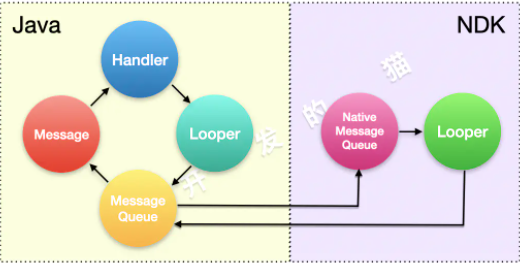

#### 1. Handler运作



- Handler作为一个对外暴露的工具,其内部包含了一个`Looper`
- `Looper`作为消息循环的核心,其内部包含了一个消息队列`MessageQueue`,用于记录所有待处理的对象

- `MessageQueue`则作为一个消息队列,则包含了一系列连接在一起的`Message`
- `Message`是消息体,内部又包含了一个目标处理器`target`,这个`target`正是最终处理他的`handler`


NDK使用`epoll`

`epoll`是Liunx中用来监听IO事件的工具,一个进入等待的句柄,一旦监听到时间发生就会唤醒,继续往下执行


下面源码流程化的剖析

#### 2. Handler构造

```java
public Handler() {
    this(null, false);
}

public Handler(Callback callback, boolean async) {
        if (FIND_POTENTIAL_LEAKS) {
            final Class<? extends Handler> klass = getClass();
            if ((klass.isAnonymousClass() || klass.isMemberClass() || klass.isLocalClass()) &&
                    (klass.getModifiers() & Modifier.STATIC) == 0) {
                Log.w(TAG, "The following Handler class should be static or leaks might occur: " +
                    klass.getCanonicalName());
            }
        }
				// 获取当前线程的looper
        mLooper = Looper.myLooper();
        if (mLooper == null) {
            throw new RuntimeException(
                "Can't create handler inside thread " + Thread.currentThread()
                        + " that has not called Looper.prepare()");
        }
  			// 持有MessageQueue
        mQueue = mLooper.mQueue;
  			// handler中的会调 在最后分发消息时候使用  同handler.post中的runable接口
        mCallback = callback;
  			// 同步或者异步
        mAsynchronous = async;
}

```

##### 2.1 `mLooper = Looper.myLooper();`

```java
// 从当前线程的ThreadLocal中获取looper
public static @Nullable Looper myLooper() {
    return sThreadLocal.get();
}
```

##### 2.2 传入Looper的构造

子线程实例化handler之前不实例化looper会抛出异常:

`java.lang.RuntimeException: Can't create handler inside thread Thread[thread_0,5,main] that has not called Looper.prepare()`

```java
public Handler(Looper looper) {
    this(looper, null, false);
}

public Handler(Looper looper, Callback callback, boolean async) {
        mLooper = looper;
        mQueue = looper.mQueue;
        mCallback = callback;
        mAsynchronous = async;
 }
```

注意如果是在子线程调用`Looper.prepare`,需要自己调用`Looper.loop`,主线程不用实现是因为在ap开启ActivityThread完成了调用

#### 3. handler  `sendMsg`

##### 3.1 消息创建

`handler.obtainMessage()`

```java
public final Message obtainMessage()
{
    return Message.obtain(this);
}

 public static Message obtain(Handler h) {
   			// 使用obtain可以复用message
        Message m = obtain();
   			// 绑定handler
        m.target = h;

        return m;
}
```

##### 3.2消息回收

那么既然`obtain`可以复用,那么消息是如何回收的,在后面的`Looper.loop`中每次取完消息会进行回收

```java
void recycleUnchecked() {
    // Mark the message as in use while it remains in the recycled object pool.
    // Clear out all other details.
    flags = FLAG_IN_USE;
    what = 0;
    arg1 = 0;
    arg2 = 0;
    obj = null;
    replyTo = null;
    sendingUid = -1;
    when = 0;
    target = null;
    callback = null;
    data = null;

    synchronized (sPoolSync) {
        if (sPoolSize < MAX_POOL_SIZE) {
            next = sPool;
            sPool = this;
            sPoolSize++;
        }
    }
}
```

不错这是一个 消息队列,且队列最大容量为`private static final int MAX_POOL_SIZE = 50;`

##### 3.3 消息发送

无论是  `handler.post`  还是 `handler.sendMessage`

```java
public final boolean sendMessage(Message msg)
{
    return sendMessageDelayed(msg, 0);
}

public final boolean sendMessageDelayed(Message msg, long delayMillis)
    {
        if (delayMillis < 0) {
            delayMillis = 0;
        }
  			// SystemClock.uptimeMillis() + delayMillis就是msg的when属性
        return sendMessageAtTime(msg, SystemClock.uptimeMillis() + delayMillis);
    }


public boolean sendMessageAtTime(Message msg, long uptimeMillis) {
        MessageQueue queue = mQueue;
        if (queue == null) {
            RuntimeException e = new RuntimeException(
                    this + " sendMessageAtTime() called with no mQueue");
            Log.w("Looper", e.getMessage(), e);
            return false;
        }
        return enqueueMessage(queue, msg, uptimeMillis);
    }

// 进入消息队列的入口
private boolean enqueueMessage(MessageQueue queue, Message msg, long uptimeMillis) {			
  			// msg再次绑定handler
        msg.target = this;
        if (mAsynchronous) {
            msg.setAsynchronous(true);
        }
        return queue.enqueueMessage(msg, uptimeMillis);
    }
```


#### 4. 轮询器Looper

主线程Looper是在ActivityThread调用`Looper.prepareMainLooper();`创建,并调用`Looper.loop();`开始轮询

子线程需要自己实现`Lopperprepare`和`Looper.loop`

##### 4.1 Looper初始化

`Looper.prepare`

```java
public static void prepare() {
    prepare(true);
}

 private static void prepare(boolean quitAllowed) {
        if (sThreadLocal.get() != null) {
            throw new RuntimeException("Only one Looper may be created per thread");
        }
   			// 每个线程的threadLocal去存储looper
        sThreadLocal.set(new Looper(quitAllowed));
    }
// Looper构造 每个Looper维护一个消息队列
private Looper(boolean quitAllowed) {
        mQueue = new MessageQueue(quitAllowed);
        mThread = Thread.currentThread();
    }
```

注意一个线程只能实例化一次Looper


##### 4.2 Looper.loop

这是开启消息轮询的逻辑

```java
public static void loop() {
  	// 根据当前线程获取当前线程的looper
    final Looper me = myLooper();
  	// 这里其实很关键  调用Looper.loop的逻辑代码所在线程必须和Looper实例化绑定的线程一致,不然会抛出异常
  	if (me == null) {
            throw new RuntimeException("No Looper; Looper.prepare() wasn't called on this thread.");
        }
    ......
    // 获取当前looper维护的消息队列
    final MessageQueue queue = me.mQueue;

    .......

    for (;;) {
      	// 通过消息队列获取带发送的msg
        Message msg = queue.next(); // might block
       
        .....

        		// msg同步到
            msg.target.dispatchMessage(msg);
            dispatchEnd = needEndTime ? SystemClock.uptimeMillis() : 0;
        ......
				// 回收msg
        msg.recycleUnchecked();
    }
```

##### 4.3  msg.target.dispatchMessage(msg);

这就是 线程切换之后的最终逻辑

调用`handler.dispatchMessage`,msg的target就是实例化的handler:

```java
public void dispatchMessage(Message msg) {
    if (msg.callback != null) {
        handleCallback(msg);
    } else {
      	// 如果使用handler.post则调用callback
        if (mCallback != null) {
            if (mCallback.handleMessage(msg)) {
                return;
            }
        }
      	// 使用sendmsg 则走他的子方法
        handleMessage(msg);
    }
}
```

#### 5.MessageQueue

上面looper的循环其实就是在操作消息队列 `MessageQueue`

先看下MessageQueue构造

```java
MessageQueue(boolean quitAllowed) {
    mQuitAllowed = quitAllowed;
  	// 调用jni创建了一个对象mPtr,这个对象就是NDK层的MativeMessageQueue
    mPtr = nativeInit();
}
```

##### 5.1 enqueueMessage 消息压入

```java
boolean enqueueMessage(Message msg, long when) {
   .....
    synchronized (this) {
        if (mQuitting) {
            IllegalStateException e = new IllegalStateException(
                    msg.target + " sending message to a Handler on a dead thread");
            Log.w(TAG, e.getMessage(), e);
            msg.recycle();
            return false;
        }
				
     		// 标记msg正在使用
        msg.markInUse();
        msg.when = when;
        Message p = mMessages;
        boolean needWake;
     		// 如果msg链表不为null,或者不延迟,又或者延迟时间比头部msg早,那么查到队列头部
        if (p == null || when == 0 || when < p.when) {
            // New head, wake up the event queue if blocked.
            msg.next = p;
            mMessages = msg;
            needWake = mBlocked;
        } else {
          	//	消息队列插入链表中间
            needWake = mBlocked && p.target == null && msg.isAsynchronous();
            Message prev;
            for (;;) {
                prev = p;
                p = p.next;
                if (p == null || when < p.when) {
                    break;
                }
                if (needWake && p.isAsynchronous()) {
                    needWake = false;
                }
            }
            msg.next = p; // invariant: p == prev.next
            prev.next = msg;
        }
				
     		// 唤醒线程
        // We can assume mPtr != 0 because mQuitting is false.
        if (needWake) {
            nativeWake(mPtr);
        }
    }
    return true;
}

```

- `mMessages`是第一个msg,用他来初始化p
- 判断消息队列是否是空,是则将当前消息放在链表头部;如果当前消息不需要延时或者当前消息的执行时间比头部消息早,也是放在链表头部

##### 5.2 消息出队列  next

```java
Message next() {
   	// 1.判断Native是否为空
    final long ptr = mPtr;
    if (ptr == 0) {
        return null;
    }

    ......
    for (;;) {
        if (nextPollTimeoutMillis != 0) {
            Binder.flushPendingCommands();
        }
				
      	// 2. 调用NDK方法,线程阻塞挂起,进入等待
      	// nextPollTimeoutMillis=-1时进入无线等待
        nativePollOnce(ptr, nextPollTimeoutMillis);

        synchronized (this) {

            final long now = SystemClock.uptimeMillis();
            Message prevMsg = null;
            Message msg = mMessages;
          	// 3. 判断是否插入了同步屏障,是则只执行异步消息<正常情况下target不为null>
            if (msg != null && msg.target == null) {
                do {
                    prevMsg = msg;
                    msg = msg.next;
                } while (msg != null && !msg.isAsynchronous());
            }
            if (msg != null) {
                if (now < msg.when) {
                    // 4. 消息没有到时间,重新计算时间
                    nextPollTimeoutMillis = (int) Math.min(msg.when - now, Integer.MAX_VALUE);
                } else {
                    // 5. 消息时间到,重新拼接链表并返回消息
                    mBlocked = false;
                    if (prevMsg != null) {
                      	// 6. 执行异步逻辑
                        prevMsg.next = msg.next;
                    } else {
                      	// 7. 执行同步的逻辑,因为同步不会走逻辑3
                        mMessages = msg.next;
                    }
                    msg.next = null;
                    if (DEBUG) Log.v(TAG, "Returning message: " + msg);
                    msg.markInUse();
                    return msg;
                }
            } else {
                // 8. 没有消息则进入无限等到
                nextPollTimeoutMillis = -1;
            }
            if (mQuitting) {
                dispose();
                return null;
            }

            // 9. 判断是否有空闲监听器,有则进行回调
            if (pendingIdleHandlerCount < 0
                    && (mMessages == null || now < mMessages.when)) {
                pendingIdleHandlerCount = mIdleHandlers.size();
            }
          	// 10. 只有第一次为-1,执行一次pendingIdleHandlerCount变为0,不再进行空闲会调
            if (pendingIdleHandlerCount <= 0) {
                // No idle handlers to run.  Loop and wait some more.
                mBlocked = true;
                continue;
            }

            if (mPendingIdleHandlers == null) {
                mPendingIdleHandlers = new IdleHandler[Math.max(pendingIdleHandlerCount, 4)];
            }
            mPendingIdleHandlers = mIdleHandlers.toArray(mPendingIdleHandlers);
        }

        // 11. 回调空闲监听器
        for (int i = 0; i < pendingIdleHandlerCount; i++) {
            final IdleHandler idler = mPendingIdleHandlers[i];
            mPendingIdleHandlers[i] = null; // release the reference to the handler

            boolean keep = false;
            try {
                keep = idler.queueIdle();
            } catch (Throwable t) {
                Log.wtf(TAG, "IdleHandler threw exception", t);
            }

            if (!keep) {
                synchronized (this) {
                    mIdleHandlers.remove(idler);
                }
            }
        }
      	// 设置为0,则上面的空闲监听不再执行,这时候可以去执行一些其他任务
        pendingIdleHandlerCount = 0;
        nextPollTimeoutMillis = 0;
    }
}
```

1. 调用NDK方法`nativePollOnce`,线程阻塞挂起,进入等待nextPollTimeoutMillis=-1(没有消息时候)时进入无限等待,第一次进入等待时间为0
2. 判断队列是否插入了同步屏障,是则只执行异步消息,如果没有同步屏障则只获取头部msg,next顺序取msg
3. `nextPollTimeoutMillis`决定当前msg的delay时间
4. 如果执行时间到,NDK唤醒,重新拼接链表,并返回消息,此时`Looper`将会得到一个消息,把它分发给Handler处理
5. 最后是一个空闲监听器,作用是当队列中没有需要执行的消息时候,说明线程进入了空闲状态这时候


#### 6.唤醒线程

刚刚在next时候,有讲到没有消息时候底层会无限制的挂起Looper,这时候如果有msg会如何让唤醒线程?

会在MesageQueue的`enqueueMessage`中进行唤醒

```java
boolean enqueueMessage(Message msg, long when) {
   .....
   // 前面是一系列的插入操作  上面有提到,这里略
     needWake = mBlocked;
  .....
				
     		// 唤醒线程  -- 调用ndk的nativeWake
        // We can assume mPtr != 0 because mQuitting is false.
        if (needWake) {
            nativeWake(mPtr);
        }
    }
    return true;
}
```

两种情况下会唤醒线程:

- 队列为空||消息无需延时||或者消息执行时间比队列头部早&&线程出于挂起状态 mBlocked =  true

- 线程挂起 && 消息循环出于同步屏障状态,这时候如果插入一个异步msg,则需要唤起线程

#### 7. Handler同步消息屏障

在上面多次提到同步屏障,到底什么是同步消息屏障?

在Handler中`消息同步屏障是用来阻挡同步消息执行的`

##### 7.1 Handler的同步和异步

- 通过handler实现异步(不可行)

首先还是看handler的构造

```java

public Handler() {
     this(null, false);
}
public Handler(Callback callback, boolean async) {
    if (FIND_POTENTIAL_LEAKS) {
        final Class<? extends Handler> klass = getClass();
        if ((klass.isAnonymousClass() || klass.isMemberClass() || klass.isLocalClass()) &&
                (klass.getModifiers() & Modifier.STATIC) == 0) {
            Log.w(TAG, "The following Handler class should be static or leaks might occur: " +
                klass.getCanonicalName());
        }
    }

    mLooper = Looper.myLooper();
    if (mLooper == null) {
        throw new RuntimeException(
            "Can't create handler inside thread " + Thread.currentThread()
                    + " that has not called Looper.prepare()");
    }
    mQueue = mLooper.mQueue;
    mCallback = callback;
    mAsynchronous = async;
}
```

这里的一部就是`mAsynchronous`,很明显开发者不能设置

那么有没有直接设置`mAsynchronous`的构造呢?

有的:

```java
 *
 * @hide
 */
public Handler(boolean async) {
    this(null, async);
}
```

但是这是一个系统hide掉的方法,我们不能设置

- 所以开发者不能实现handler的异步,但是可以通过msg设置:

```java
private boolean enqueueMessage(MessageQueue queue, Message msg, long uptimeMillis) {
    msg.target = this;
    if (mAsynchronous) {
        msg.setAsynchronous(true);
    }
    return queue.enqueueMessage(msg, uptimeMillis);
}
```

这是 sendMsg的后续逻辑,不错看到这里我们知道,可以通过  `msg.setAsynchronous(true);`来设置

其实实现了异步也就实现了同步屏障

我们可以异步MessgeQueue中的next来分析

```java
Message next() {
   ......

    ......
    for (;;) {
      ......
          	// 3. 判断是否插入了同步屏障,是则只执行异步消息<正常情况下target不为null>
            if (msg != null && msg.target == null) {
                do {
                    prevMsg = msg;
                    msg = msg.next;
                } while (msg != null && !msg.isAsynchronous());
            }
            if (msg != null) {
                if (now < msg.when) {
                    // 4. 消息没有到时间,重新计算时间
                    nextPollTimeoutMillis = (int) Math.min(msg.when - now, Integer.MAX_VALUE);
                } else {
                    // 5. 消息时间到,重新拼接链表并返回消息
                    mBlocked = false;
                    if (prevMsg != null) {
                      	// 6. 执行异步逻辑
                        prevMsg.next = msg.next;
                    } else {
                      	// 7. 执行同步的逻辑,因为同步不会走逻辑3
                        mMessages = msg.next;
                    }
                    msg.next = null;
                    if (DEBUG) Log.v(TAG, "Returning message: " + msg);
                    msg.markInUse();
                    return msg;
                }
            } else {
                // 8. 没有消息则进入无限等到
                nextPollTimeoutMillis = -1;
            }

   .......
}
```

不错就是这个do-while循环

```java
do {
                    prevMsg = msg;
                    msg = msg.next;
                } while (msg != null && !msg.isAsynchronous());
```

实现异步之后不同不会再走

##### 7.2 启动/移除同步消息屏障

在`MessageQueue中实现`

```java
 *
 * @hide
 */
// 开启同步屏障
public int postSyncBarrier() {
    return postSyncBarrier(SystemClock.uptimeMillis());
}

private int postSyncBarrier(long when) {
    // Enqueue a new sync barrier token.
    // We don't need to wake the queue because the purpose of a barrier is to stall it.
    synchronized (this) {
        final int token = mNextBarrierToken++;
        final Message msg = Message.obtain();
        msg.markInUse();
        msg.when = when;
        msg.arg1 = token;

        Message prev = null;
        Message p = mMessages;
        if (when != 0) {
            while (p != null && p.when <= when) {
                prev = p;
                p = p.next;
            }
        }
        if (prev != null) { // invariant: p == prev.next
            msg.next = p;
            prev.next = msg;
        } else {
            msg.next = p;
            mMessages = msg;
        }
        return token;
    }
}

  *
     * @hide
     */
     
// 移除同步屏障
    public void removeSyncBarrier(int token) {
        // Remove a sync barrier token from the queue.
        // If the queue is no longer stalled by a barrier then wake it.
        synchronized (this) {
            Message prev = null;
            Message p = mMessages;
            while (p != null && (p.target != null || p.arg1 != token)) {
                prev = p;
                p = p.next;
            }
            if (p == null) {
                throw new IllegalStateException("The specified message queue synchronization "
                        + " barrier token has not been posted or has already been removed.");
            }
            final boolean needWake;
            if (prev != null) {
                prev.next = p.next;
                needWake = false;
            } else {
                mMessages = p.next;
                needWake = mMessages == null || mMessages.target != null;
            }
            p.recycleUnchecked();

            // If the loop is quitting then it is already awake.
            // We can assume mPtr != 0 when mQuitting is false.
            if (needWake && !mQuitting) {
                nativeWake(mPtr);
            }
        }
    }
```

启动— `postSyncBarrier`,移除— `removeSyncBarrier`

但是 同样是hide  开发者不能用,只有系统能用


##### 7.3 同步屏障的作用:

在View绘制的源码中:

首先我们知道是Handler驱动的

当请求view时候,调用在`ViewRootImpl`

```java
// ViewRootImpl.java

void scheduleTraversals() {
    if (!mTraversalScheduled) {
        mTraversalScheduled = true;
        
        // 启动同步消息屏障
        mTraversalBarrier = mHandler.getLooper().getQueue().postSyncBarrier();
        mChoreographer.postCallback(
                Choreographer.CALLBACK_TRAVERSAL, mTraversalRunnable, null);
        if (!mUnbufferedInputDispatch) {
            scheduleConsumeBatchedInput();
        }
        notifyRendererOfFramePending();
        pokeDrawLockIfNeeded();
    }
}
```

动同步消息屏障，之后 `mChoreographer` 中的消息都采用了异步的方式，保证消息的流畅，最终会回调 `mTraversalRunnable` 。最后在绘制时，解除同步消息屏障，详见以下代码：

```java
// ViewRootImpl.java

final TraversalRunnable mTraversalRunnable = new TraversalRunnable();

final class TraversalRunnable implements Runnable {
    @Override
    public void run() {
        doTraversal();
    }
}

void doTraversal() {
    if (mTraversalScheduled) {
        mTraversalScheduled = false;
        
        // 清除同步消息屏障
        mHandler.getLooper().getQueue().removeSyncBarrier(mTraversalBarrier);

        if (mProfile) {
            Debug.startMethodTracing("ViewAncestor");
        }
        
        // 启动绘制流程
        performTraversals();

        if (mProfile) {
            Debug.stopMethodTracing();
            mProfile = false;
        }
    }
}
```

