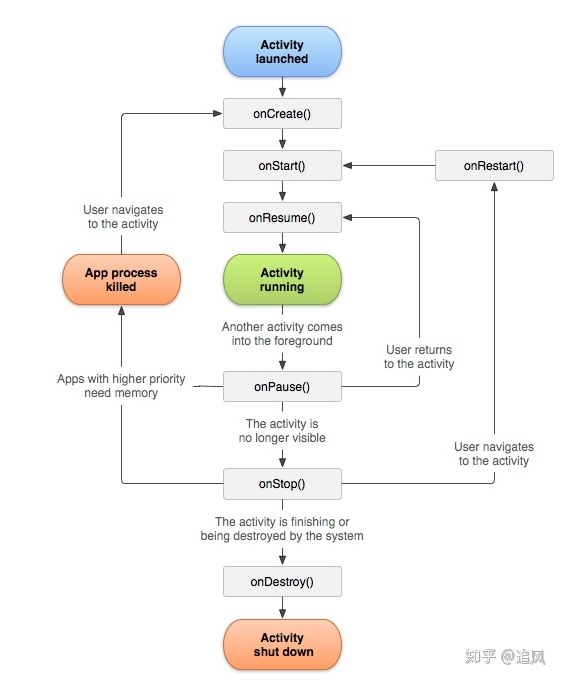
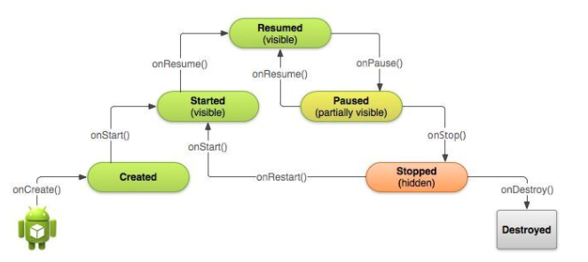

#### 1.Activity生命周期





#### 2.Activity生命周期详解(附场景)

##### 2.1正常启动&退出ap

```java
// 正常启动ap
06-09 14:14:59.388 17979-17979/? I/life_cycle: onCreate  // 创建view
06-09 14:14:59.393 17979-17979/? I/life_cycle: onStart  //视图 展示
06-09 14:14:59.397 17979-17979/? I/life_cycle: onResume // 视图可交互
// 退出ap
06-09 14:18:41.183 18248-18248/component.m.com.example.test I/life_cycle: onPause  // 失去交互
06-09 14:18:41.778 18248-18248/component.m.com.example.test I/life_cycle: onStop // 视图不可见
06-09 14:18:41.782 18248-18248/component.m.com.example.test I/life_cycle: onDestroy // 销毁视图

```

周期分析:

**onCreate:**

Activity调起时候调用,可以在该方法进行初始化操作,调用**setContentView(int)** 来绘制UI(也就是Layout),通过findViewById与xml中的新部件进行交互

**onStart:**

onCreate之后调用,Activity可见时候调用

**onResume:**

**onRestoreInstanceState&onRestart&onPause&onStart**之后调用,该func中可以进行ui和用户的交互逻辑,如animal

**onPause:**

当某个活动进入后台且进程尚未被杀死(此时用户不可交互)

**onStop:**

当您不再对用户可见时调用

**onDestroy:**

Activity销毁时候调用


##### 2.2 长按home键 & 多窗口模式退出

**长按home键**

```java
06-09 14:53:44.041 25537-25537/component.m.com.example.test I/life_cycle: onCreate
06-09 14:53:44.046 25537-25537/component.m.com.example.test I/life_cycle: onStart
06-09 14:53:44.050 25537-25537/component.m.com.example.test I/life_cycle: onResume
06-09 14:53:47.061 25537-25537/component.m.com.example.test I/life_cycle: onPause
06-09 14:53:47.097 25537-25537/component.m.com.example.test I/life_cycle: onStop
// 重新进入
06-09 14:54:38.848 25537-25537/component.m.com.example.test I/life_cycle: onStart
06-09 14:54:38.850 25537-25537/component.m.com.example.test I/life_cycle: onResume
```

**多窗口模式退出**

```java
06-09 14:55:32.549 25677-25677/component.m.com.example.test I/life_cycle: onCreate
06-09 14:55:32.554 25677-25677/component.m.com.example.test I/life_cycle: onStart
06-09 14:55:32.557 25677-25677/component.m.com.example.test I/life_cycle: onResume
06-09 14:55:34.427 25677-25677/component.m.com.example.test I/life_cycle: onPause
06-09 14:55:34.463 25677-25677/component.m.com.example.test I/life_cycle: onStop
// 重新进入
06-09 14:55:37.770 25729-25729/? I/life_cycle: onCreate
06-09 14:55:37.775 25729-25729/? I/life_cycle: onStart
06-09 14:55:37.778 25729-25729/? I/life_cycle: onResume

```

##### 2.3 异常— 旋转屏幕

```java
06-09 15:00:09.911 26218-26218/component.m.com.example.test I/life_cycle: onCreate
06-09 15:00:09.916 26218-26218/component.m.com.example.test I/life_cycle: onStart
06-09 15:00:09.921 26218-26218/component.m.com.example.test I/life_cycle: onResume
06-09 15:00:14.513 26218-26218/component.m.com.example.test I/life_cycle: onPause
// 旋转屏幕 异常退出保存状态
06-09 15:00:14.516 26218-26218/component.m.com.example.test I/life_cycle: onSaveInstanceState
06-09 15:00:14.518 26218-26218/component.m.com.example.test I/life_cycle: onStop
06-09 15:00:14.519 26218-26218/component.m.com.example.test I/life_cycle: onDestroy
// 重新开启Activity
06-09 15:00:14.604 26218-26218/component.m.com.example.test I/life_cycle: onCreate
06-09 15:00:14.609 26218-26218/component.m.com.example.test I/life_cycle: onStart
// 复位保存的状态
06-09 15:00:14.610 26218-26218/component.m.com.example.test I/life_cycle: onRestoreInstanceState
06-09 15:00:14.611 26218-26218/component.m.com.example.test I/life_cycle: onResume
```


#### 3.android launchmode

##### 3.1标准模式  Standard

A->B->C->C

```java
Running activities (most recent first):
      TaskRecord{fe75d72 #24031 A=component.m.com.example.test U=0 StackId=285 sz=4}
        Run #3: ActivityRecord{239c64f u0 component.m.com.example.test/.CActivity t24031}
        Run #2: ActivityRecord{90aaeb2 u0 component.m.com.example.test/.CActivity t24031}
        Run #1: ActivityRecord{cd5f611 u0 component.m.com.example.test/.BActivity t24031}
        Run #0: ActivityRecord{1fc81b7 u0 component.m.com.example.test/.AActivity t24031}

```

##### 3.2 SingleTop 栈顶复用


```java
//A->B->C->C 在栈顶
Running activities (most recent first):
      TaskRecord{2c400d #24033 A=component.m.com.example.test U=0 StackId=287 sz=3}
        Run #2: ActivityRecord{641746b u0 component.m.com.example.test/.CActivity t24033}
        Run #1: ActivityRecord{996835f u0 component.m.com.example.test/.BActivity t24033}
        Run #0: ActivityRecord{a0d55bf u0 component.m.com.example.test/.AActivity t24033}

    mResumedActivity: ActivityRecord{641746b u0 component.m.com.example.test/.CActivity t24033}
// A->B->C->A 不在栈顶
Running activities (most recent first):
      TaskRecord{8916f4f #24034 A=component.m.com.example.test U=0 StackId=288 sz=4}
        Run #3: ActivityRecord{c262326 u0 component.m.com.example.test/.AActivity t24034}
        Run #2: ActivityRecord{729b8dd u0 component.m.com.example.test/.CActivity t24034}
        Run #1: ActivityRecord{d52cc9f u0 component.m.com.example.test/.BActivity t24034}
        Run #0: ActivityRecord{76a4289 u0 component.m.com.example.test/.AActivity t24034}

    mResumedActivity: ActivityRecord{c262326 u0 component.m.com.example.test/.AActivity t24034}

```

如果目标Activity在栈顶那么直接复用即可,如果不在则需要重新重建

##### 3.3 SingleTask  栈复用

```
A->B->C->B
 Running activities (most recent first):
      TaskRecord{9694cd7 #24036 A=component.m.com.example.test U=0 StackId=290 sz=2}
        Run #1: ActivityRecord{908c170 u0 component.m.com.example.test/.BActivity t24036}
        Run #0: ActivityRecord{be57b9d u0 component.m.com.example.test/.AActivity t24036}

```


如果栈中有Activity,则会复用栈中Activity,其上Activity全部出栈


##### 3.4 singleInstance

```java
// A->B->C->A->B
// B设置singleinstance
Running activities (most recent first):
      TaskRecord{941ce23 #24055 A=component.m.com.example.test U=0 StackId=309 sz=1}
        Run #0: ActivityRecord{bb54a7e u0 component.m.com.example.test/.BActivity t24055}

Running activities (most recent first):
      TaskRecord{f0f0db7 #24054 A=component.m.com.example.test U=0 StackId=308 sz=3}
        Run #2: ActivityRecord{8f084b5 u0 component.m.com.example.test/.AActivity t24054}
        Run #1: ActivityRecord{220c924 u0 component.m.com.example.test/.CActivity t24054}
        Run #0: ActivityRecord{a6d1e72 u0 component.m.com.example.test/.AActivity t24054}


```


##### 3.5 taskAffinity

```java 
// A->B->C->A
其中B制定task 且为singleTask
// A
Running activities (most recent first):
      TaskRecord{f427ac1 #24048 A=component.m.com.example.test U=0 StackId=302 sz=1}
        Run #0: ActivityRecord{b8b1d4b u0 component.m.com.example.test/.AActivity t24048}

// B->...
Running activities (most recent first):
      TaskRecord{bda3fa8 #24049 A=.task1 U=0 StackId=303 sz=3}
        Run #2: ActivityRecord{d464219 u0 component.m.com.example.test/.AActivity t24049}
        Run #1: ActivityRecord{14a9071 u0 component.m.com.example.test/.CActivity t24049}
        Run #0: ActivityRecord{66b1007 u0 component.m.com.example.test/.BActivity t24049}

```


####4.android launchmode使用场景

- standrad — 在一系列启动 Activity 的过程中需要保留用户操作的 Activity 的页面。比如： 社交应用中，点击查看用户 A 信息 -> 查看用户 A 粉丝 -> 在粉丝中挑选查看用户 B 信息 -> 查看用户 B 粉丝。
- singleTop — 假设你在当前的 Activity 中又要启动同类型的 Activity，此时建议将此类型 Activity 的启动模式指定为 singleTop，能够减少 Activity 的创建，节省内存。
- singleTask — 一般应用主页面可以用 singleTask 方式。比如用户在主页跳转到其他页面，运行多次操作后想返回到主页。
- singleInstance — singleInstance 模式常应用于独立栈操作的应用，如闹钟的提醒页面，当你在A应用中看视频时，闹钟响了，你点击闹钟提醒通知后进入提醒详情页面，然后点击返回就再次回到A的视频页面，这样就不会过多干扰到用户先前的操作了

#### 5.android launchmode — Intent Flags

这里有些不一样

##### 5.1.FLAG_ACTIVITY_NEW_TASK  

等同于"singleTask"

##### 5.2 FLAG_ACTIVITY_SINGLE_TOP 

等同于"singleTop"

#####5.3 FLAG_ACTIVITY_CLEAR_TOP 

清除包含目标Activity的任务栈中位于该Activity实例之上的其他 Activity实例,但是复用已有的目标Activity,还是先删除后创建

- 若使用FLAG_ACTIVITY_SINGLE_TOP 和FLAG_ACTIVITY_CLEAR_TOP 标志位组合,那么不管目标Activity是什么启动模式都会被复用
- 若单独使用FLAG_ACTIVITY_CLEAR_TOP,那么只有非standard启动模式的目标Activity才会被复用,否则都先被删除,然后被重新创建并入栈

##### 5.4 FLAG_ACTIVITY_CLEAR_TASK

首先清空已经存在的目标Activity实例所在的任务栈,这自然也就清除了之前存在的目标Activity实例,然后创建新的目标Activity实例并入栈


#### 6 Intent Flags

##### 6.1 单独使用**FLAG_ACTIVITY_NEW_TASK**

- taskAffinity相同

```java
   TaskRecord{edba11b #24073 A=component.m.com.example.test U=0 StackId=327 sz=4}
        Run #3: ActivityRecord{816f1e9 u0 component.m.com.example.test/.BActivity t24073}
        Run #2: ActivityRecord{90c140 u0 component.m.com.example.test/.CActivity t24073}
        Run #1: ActivityRecord{b84fb0d u0 component.m.com.example.test/.BActivity t24073}
        Run #0: ActivityRecord{c23324d u0 component.m.com.example.test/.AActivity t24073}

```

- taskAffinity不同

```java
 Running activities (most recent first):
      TaskRecord{7e401bc #24074 A=.Task1 U=0 StackId=328 sz=1}
        Run #0: ActivityRecord{f3aa1e2 u0 component.m.com.example.test/.AActivity t24074}

 Running activities (most recent first):
      TaskRecord{6465630 #24075 A=.Task2 U=0 StackId=329 sz=1}
        Run #0: ActivityRecord{bc4534c u0 component.m.com.example.test/.BActivity t24075}

 Running activities (most recent first):
      TaskRecord{fdfe9af #24076 A=.Task3 U=0 StackId=330 sz=1}
        Run #0: ActivityRecord{8aea821 u0 component.m.com.example.test/.CActivity t24076}

```

taskAffinity生效  但是singleTask还是没有生效 每次有单独的Task

**所以单独使用没有任何效果**


##### 6.2 **FLAG_ACTIVITY_NEW_TASK + FLAG_ACTIVITY_CLEAR_TOP**

-  taskAffinity相同

```java
  Running activities (most recent first):
      TaskRecord{a4a39a1 #24080 A=component.m.com.example.test U=0 StackId=334 sz=2}
        Run #1: ActivityRecord{d329f u0 component.m.com.example.test/.BActivity t24080}
        Run #0: ActivityRecord{a1d87c5 u0 component.m.com.example.test/.AActivity t24080}

```

singleTask生效,但是会清楚目标Activity及之上所有Activity,然后进行重新创建新的目标Activity

- taskAffinity不同

```java
//A->B->C->B
Running activities (most recent first):
      TaskRecord{b7e6ffe #24081 A=.Task1 U=0 StackId=335 sz=1}
        Run #0: ActivityRecord{cd0eed4 u0 component.m.com.example.test/.AActivity t24081}
// B&C  Task相同        
Running activities (most recent first):
      TaskRecord{7948b64 #24082 A=.Task2 U=0 StackId=336 sz=1}
        Run #0: ActivityRecord{1001cd u0 component.m.com.example.test/.BActivity t24082}


```

singleTask生效


##### 6.3 FLAG_ACTIVITY_NEW_TASK + FLAG_ACTIVITY_CLEAR_TASK

```java
// A->B->C->C
Running activities (most recent first):
      TaskRecord{8c02407 #24091 A=.Task1 U=0 StackId=345 sz=1}
        Run #0: ActivityRecord{96d608c u0 component.m.com.example.test/.AActivity t24091}

// B&C task 相同  C->C会清空BC栈  重新创建C
Running activities (most recent first):
      TaskRecord{c674a46 #24092 A=.Task2 U=0 StackId=346 sz=1}
        Run #0: ActivityRecord{c65304b u0 component.m.com.example.test/.CActivity t24092}

```


##### 6.4 单独使用FLAG_ACTIVITY_CLEAR_TO

**单独使用 FLAG_ACTIVITY_CLEAR_TOP，那么只有非 standard 启动模式的目标 Activity 才会被复用，否则都先被删除，然后被重新创建并入栈。**


##### 6.5  FLAG_ACTIVITY_CLEAR_TOP + FLAG_ACTIVITY_SINGLE_TOP

**使用 FLAG_ACTIVITY_SINGLE_TOP 和 FLAG_ACTIVITY_CLEAR_TOP 标志位组合，那么不管目标 Activity 是什么启动模式，都会被复用。**


