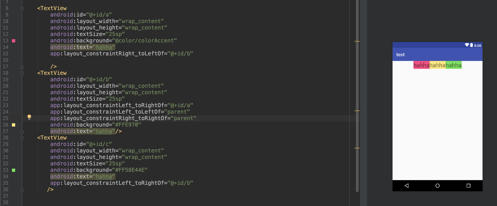

#### 1.介绍

ConstraintLayout是一个ViewGroup,兼容到Api9,也就是android2.3,他的出现主要是为了解决嵌套层数过多的问题,as2.3起,官方模板使用ConstraintLayout


####2.为什么使用ConstraintLayout


以上的布局,需要用两个linearlayout,横向的linearlayout和纵向的linearlayout,这样来看布局是两层

使用RelativeLayout可以降低布局层次,有效缓解绘制的性能消耗

ConstraintLayout可以按照比例约束空间位置和尺寸,能够更好地适配屏幕大小不同的机型


#### 3.使用ConstraintLayout

##### 1.相对定位


这样就是相对布局,id2的左边在id1的右边,id3的左边在id2的右边

这是常用的属性

layout_constraintLeft_toLeftOf
 layout_constraintLeft_toRightOf
 layout_constraintRight_toLeftOf
 layout_constraintRight_toRightOf
 layout_constraintTop_toTopOf
 layout_constraintTop_toBottomOf
 layout_constraintBottom_toTopOf
 layout_constraintBottom_toBottomOf
 layout_constraintBaseline_toBaselineOf
 layout_constraintStart_toEndOf
 layout_constraintStart_toStartOf
 layout_constraintEnd_toStartOf
 layout_constraintEnd_toEndOf

分开来记忆

constraint代表当前view的边界,toxxx在目标view的相对位置


如果空间大小不一致,我们需要将其baseline对其


##### 2.角度问题


```xml
app:layout_constraintCircle="@id/id1"  // 指定相对角度的目标View
app:layout_constraintCircleAngle="120" // 指定的角度
app:layout_constraintCircleRadius="50dp" // 指定的距离
```


##### 3.边距


就是margin的正常使用,但是需要注意的是需要指定相对位置的目标view


layout_goneMarginStart
 layout_goneMarginEnd
 layout_goneMarginLeft
 layout_goneMarginTop
 layout_goneMarginRight
 layout_goneMarginBottom

  gone掉之后会在目标view的基础上重新补margin


##### 4.居中和偏移


居中就是上下左右拉扯一致即可


设置居中之后可以设置偏移属性

1. 设置magein


2.设置水平和垂直的bias


设置水平bias=0.3则居左侧,如果设置为1则在最右侧,数值也是这样


##### 5.尺寸约束

- 使用指定尺寸

- 使用wrap_content,让控件自己计算大小,同时可以设置最大和最小值

  android:minWidth 最小的宽度
  android:minHeight 最小的高度
  android:maxWidth 最大的宽度
  android:maxHeight 最大的高度

  

  在constraintLayout1.1版本时候,会使用如下属性进行强制约束,如下所示:

  app:constrainedWidth=”true”
  app:constrainedHeight=”true”

- 在ConstraintLayout中如果使用march_parent,推荐使用0dp

- 设置宽高比


```xml
app:layout_constraintDimensionRatio="1:1"
```

设置宽高比(也可以指定):

app:layout_constraintDimensionRatio="H,2:3"指的是  高:宽=2:3
 app:layout_constraintDimensionRatio="W,2:3"指的是  宽:高=2:3


##### 6 链

我们来看横向链(纵向同理)


CHAIN_SPREAD —— 展开元素 (默认)；


CHAIN_SPREAD_INSIDE —— 展开元素，但链的两端贴近parent；


CHAIN_PACKED —— 链的元素将被打包在一起。




#### 4 辅助工具

##### 4.1 Optimizer

当使用match_constraint时,ConstraintLayout将对控件进行2次测量

ConstraintLayout在1.1中可以通过设置layout_optimizationLevel进行优化,可以设置的值有:

none：无优化
standard：仅优化直接约束和屏障约束（默认）
direct：优化直接约束
barrier：优化屏障约束
chain：优化链约束
dimensions：优化尺寸测量


##### 4.2 Barrier


假设有3个控件ABC,C在AB的右边,但是AB的宽是不固定的,这个时候C无论约束在A的右边或者B的右边都不对;当出现这种情况可以用Barrier来解决.Barrier可以在多个空间的一侧建立一个屏障,如下所示:


屏障可以认为是一个独立区域

```xml
app:barrierDirection                   // 屏障方向  可以设置  bottom, end, left, right, top
app:constraint_referenced_ids="a,b"    // 引用屏障的控件
```

##### 4.3 Group


group可以将控件归为一组然后设置其可见性


这里指定group包含的id统一操作


##### 4.4 Placehodler

Placehodler是占位符,在Placehodler中可使用setContent()设置另一个控件的id,使这个空间移动到占位符位置


将id通过setContent()设置给placeholder即可