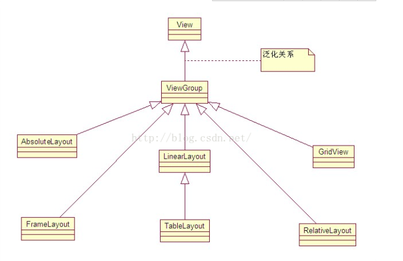
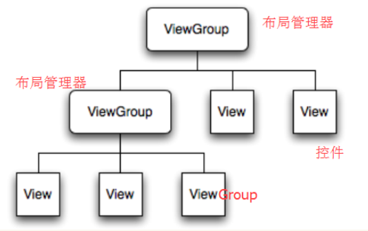
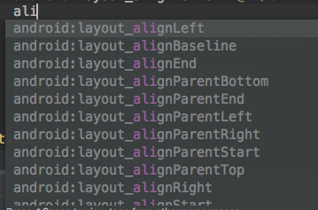
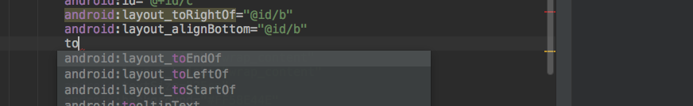
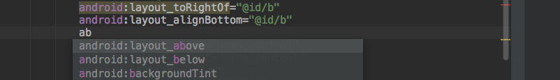

##### 1. android中原始的六大布局

线性布局 LinearLayout, 表格布局TableLayout, 相对布局RelativeLayout, 层布局 FrameLayout, 绝对布局AbsoluteLayout, 网格布局GridLayout

##### 2. android布局管理器图:

View  — implement **Drawable.Callback, KeyEvent.Callback** (响应默认的事件)

- Drawable是"可以绘制的东西"的一般抽象.大多数情况下.会把Drawable当做资源绘制到屏幕上的资源类型.Drawble类提供了用于处理可能采用多种形式的基础视觉API
- Drawable没有任何功能来接收事件或者与用户进行交互

—— |__ViewGroup  implements ViewParent, ViewManager

- ViewParent视图交互的API 

- ViewManager 控制布局中view的添加&更新&移除

  ​	——|__ 之后的依赖如上图

##### 3.android中XML布局

##### 4.6大布局的比较

- Linearlayout  一般是水平和竖直的嵌套

  - 整体布局设置 **android:orientation="horizontal"  or android:orientation="vertical"**(水平&竖直)
  - 单模块  设置content级别可以设置**gravity**  模块级别设置**layout_gravity**

- Relativelayout  默认从左上角进行堆叠,所以要A基于B做相对布局的处理,这样的话,层级在一般的业务中要优于Linearlayout

  - 模块之间的对齐

  

  - 模块之间的相对位置

    

    

  当然 API很多就不一一列举了

- FrameLayout默认也是左上角进行堆叠,比较纯净一般作为闲置布局来占位

  

