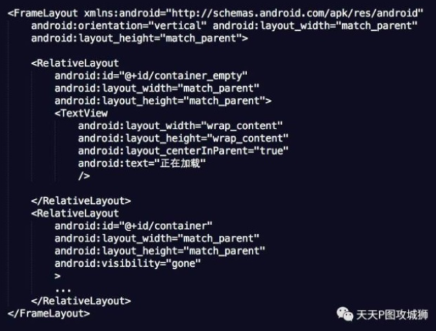

#### 1.Fragment介绍

fragment简称碎片,是android 3.0(API 11)提出的,为了兼容低版本,support-v4库中也开发了一套Fragment API,最低兼容到android 1.6


#####1.1Fragment官方定义

- Fragment是依赖于Activity的,不能独立存在
- 一个Activity里可以有多个Fragment
- 一个Fragment可以被多个Activity重用
- Fragment有自己的生命周期,并能接收输入事件
- 我们能在Activity运行时动态地添加或者删除Fragment


#####1.2Fragment优点

- 模块化:我们不必把Activity所有代码全写在Activity中,而是把代码写在各自的Fragment中
- 可重用:多个Activity可以重用一个Fragment
- 可适配:根据硬件的屏幕尺寸,屏幕方向,能够方便地实现不同的布局,这样用户体验更好


##### 1.3Fragment核心类:

- Fragment:Fragment的基类,任何创建的Fragment都需要继承该类
- FragmentManager:管理和维护Fragment.他是抽象类,具体的实现类是FragmentManagerImpl
- FragmentTransaction:对Fragment的添加,删除等操作都需要通过事务进行,他是抽象类,具体的实现类是BackStackRecord

Nested Fragment(Fragment内部嵌套Fragment的能力)是android 4.2提出的,support-fragment库可以兼容到1.6.通过getChildFragmentManager()能够获得管理子Fragment的FragmentManager,在子Fragment可以通过getParentFragment()获得父Fragment


#### 2. Fragment使用

##### 2.1实例化fragment

```java
public class AFragment extends Fragment {

    private View mRoot;
    private Activity mActivity;
    private static String ARG_PARAM = "param_key";
    private String mParam;

    @Override
    public void onCreate(@Nullable Bundle savedInstanceState) {
        super.onCreate(savedInstanceState);
    }

    @Override
    public void onAttach(Context context) {
        super.onAttach(context);
        // 建议再次获取父Activity
        mActivity = (Activity) context;
        // 获取Argment存取的参数
        mParam = getArguments().getString(ARG_PARAM);
    }

    @Nullable
    @Override
    public View onCreateView(@NonNull LayoutInflater inflater, @Nullable ViewGroup container, @Nullable Bundle savedInstanceState) {
        // inflater初始化碎片视图时候第三个参数要设置为false,因为在fragment内部实现中,会把布局添加到
        // container中,如果设置为true,那么就会重复添加两次,会抛出异常
        mRoot = inflater.inflate(R.layout.fragment_a, container, false);
        TextView tx = mRoot.findViewById(R.id.content);
        tx.setText(mParam);
        return mRoot;
    }

    public static AFragment newInstance(String str){
        AFragment aFragment = new AFragment();
        Bundle bundle = new Bundle();
        bundle.putString(ARG_PARAM,str);
        aFragment.setArguments(bundle);
        return aFragment;
    }
}
```

##### 2.2 fragment绑定Activity

在Activity中添加fragment有两种方式

- 静态添加(在xml中使用**<fragment>**,并制定name)


- 动态添加

```xml
<FrameLayout
    android:id="@+id/fr"
    android:layout_width="0dp"
    android:layout_height="0dp"
    app:layout_constraintBottom_toBottomOf="parent"
    app:layout_constraintLeft_toLeftOf="parent"
    app:layout_constraintRight_toRightOf="parent"
    app:layout_constraintTop_toTopOf="parent"/>
```

```java
@Override
protected void onCreate(Bundle savedInstanceState) {
    super.onCreate(savedInstanceState);
    setContentView(R.layout.activity_main);

    // Fragment fg = findViewById(R.id.fg);
    if(savedInstanceState == null){
        getSupportFragmentManager()
                .beginTransaction()
                .add(R.id.fr,AFragment.newInstance("你好,LiSa"),"A")
                .addToBackStack("A_f")
                .commit();
    }
}
```

- 使用support库的fragment,因此需要使用getSupportFragmentManager()获取FragmentManager

- add && hide && remove && replace 均是fragment与Activity的交互操作

- 在一次事务中可以做多个操作,比如同时做 add hide remove replace等

- commit操作是异步的,内部通过**mManager.enqueueAction**加入队列,然后通过handler进行分发

  - 对应的同步方法为  commitNow() 
  - commit不能在onSaveInstanceState之后调用,调用会抛出异常

  ```java
     private void checkStateLoss() {
          if (isStateSaved()) {
              throw new IllegalStateException(
                      "Can not perform this action after onSaveInstanceState");
          }
          if (mNoTransactionsBecause != null) {
              throw new IllegalStateException(
                      "Can not perform this action inside of " + mNoTransactionsBecause);
          }
      }
  ```

  - 为了解决commit不能在onSaveInstanceState  我们可以使用**commitAllowingStateLoss**,但是不推荐使用

-  .addToBackStack("A_f")是将fragment加入回退栈,类似与Activity的任务栈,如果添加了Activity的任务栈,如果添加了该语句,就把事务加入回退栈,当用户点击返回按钮,会回退该事务(回退指的是如果事务是add(frag));back之后就是remove,如果不添加回退栈就是直接销毁activity

- Fragment有一个常见的问题，即Fragment重叠问题，这是由于Fragment被系统杀掉，并重新初始化时再次将fragment加入activity，因此通过在外围加if语句能判断此时是否是被系统杀掉并重新初始化的情况。


#### 3.fragment异常

- 1. 在添加fragment时候要判断之前的fragment是否会被还原,防止fragment重叠
- 2. 使用commit提交事务要确保执行在onSaveInstanceState之前.所以不建议将fragment事务放在异步线程中处理,实在不行可以使用commitAllowingStateLoss


#### 4.fragment生命周期


- onAttch():  Fragment和Activity相关联时调用,**可以通过改方法获取Activity的引用,还可以通过getArguments()获取参数**
- onCreate():Fragment被创建时调用  —— 可以进行一部分初始化操作
- onCreateView():创建fragment布局
- onActivityCreated():当Activity完成onCreate()时调用
- onStart():当Fragment可见时调用
- onResum():fragment可见且可交互时候调用,这时候可以加载 一些动画之类的
- onPause():当Fragment可见且不可交互时候调用
- onStop():当Fragment不可见时候调用
- onDestory():销毁fragment时候调用
- onDetach():当fragment和Activity解除关联时调用


上面方式只有onCreateView重写时候不需要重写super方法,因为:

```java
  @Nullable
    public View onCreateView(@NonNull LayoutInflater inflater, @Nullable ViewGroup container,
            @Nullable Bundle savedInstanceState) {
        return null;
    }
    
```

因为父类返回的view为null


#### 5.Fragment  — Activity生命周期比较

由于fragment依赖Activity,所以有必要一一映射的来看下Fragment和Activity生命周期


这是一个完整流程:

```java
06-10 16:19:29.197 7518-7518/? I/life0: 1:onCreate-start
06-10 16:19:29.323 7518-7518/? I/life0: 1:onCreate-end
// Activity  onCreate完毕
06-10 16:19:29.327 7518-7518/? I/life0: 1:onStart-start
// Activity onStart()开始 
// fragment一次执行 onAttch --> onCreate ---> onCreateView ---> onActivityCreated
06-10 16:19:29.331 7518-7518/? I/life0: 2A:onAttach  // 绑定Activity
    2A:onCreate // 实例化fragment
06-10 16:19:29.335 7518-7518/? I/life0: 2A:onCreateView
    2A:onActivityCreated 
06-10 16:19:29.336 7518-7518/? I/life0: 2A:onStart  // fragment可见
// Activity onStart() 结束
06-10 16:19:29.336 7518-7518/? I/life0: 1:onStart-end  

06-10 16:19:29.338 7518-7518/? I/life0: 1:onResume-start
06-10 16:19:29.339 7518-7518/? I/life0: 1:onResume-end
// fragment onResume Activity onResume之后运行
    2A:onResume
06-10 16:19:59.048 7518-7518/component.m.com.example.fragment_test I/life0: 1:onPause-start
// Activity执行onPause

    2A:onPause // fragment执行onPause
// Activity执行onPause结束
06-10 16:19:59.049 7518-7518/component.m.com.example.fragment_test I/life0: 1:onPause-end
06-10 16:19:59.666 7518-7518/component.m.com.example.fragment_test I/life0: 1:onStop-start
//  Activity执行onStop
06-10 16:19:59.667 7518-7518/component.m.com.example.fragment_test I/life0: 2A:onStop
//  Activity执行结束
    1:onStop-end
06-10 16:19:59.674 7518-7518/component.m.com.example.fragment_test I/life0: 1:onDestroy-start
//   Activity执行onDestroy
// 接着 fragment执行onDestroyView-->onDestroy-->onDetach
06-10 16:19:59.675 7518-7518/component.m.com.example.fragment_test I/life0: 2A:onDestroyView
06-10 16:19:59.678 7518-7518/component.m.com.example.fragment_test I/life0: 2A:onDestroy
    2A:onDetach
//   Activity执行onDestroy结束
    1:onDestroy-end
```


FragmentTransaction有一些基本方法，下面给出调用这些方法时，Fragment生命周期的变化：

- add(): onAttach()->…->onResume()。
- remove(): onPause()->…->onDetach()。
- replace(): 相当于旧Fragment调用remove()，新Fragment调用add()。
- show(): 不调用任何生命周期方法，调用该方法的前提是要显示的Fragment已经被添加到容器，只是纯粹把Fragment UI的setVisibility为true。
- hide(): 不调用任何生命周期方法，调用该方法的前提是要显示的Fragment已经被添加到容器，只是纯粹把Fragment UI的setVisibility为false。
- detach(): onPause()->onStop()->onDestroyView()。UI从布局中移除，但是仍然被FragmentManager管理。
- attach(): onCreateView()->onStart()->onResume()。

**注意 show和hide不走任何生命周期方法**

#### 6.Fragmen回退栈实践

> 场景:Fragment优先加载A界面  点击btn1跳转B界面 点击btn2跳转C,点击btn3跳转回到A

```java
@Override
protected void onCreate(Bundle savedInstanceState) {
    Log.i("life0","1:onCreate-start");
    super.onCreate(savedInstanceState);
    setContentView(R.layout.activity_main);

    af = AFragment.newInstance("哈哈 A");
    bf = BFragment.newInstance("哈哈 B");
    cf = CFragment.newInstance("哈哈 C");
    if(savedInstanceState == null){
        getSupportFragmentManager()
                .beginTransaction()
                .add(R.id.fr,af,"A")
                .addToBackStack(AFragment.class.getSimpleName())
                .commit();
    }
    Button id1 = findViewById(R.id.id1);
    Button id2 = findViewById(R.id.id2);
    Button id3 = findViewById(R.id.id3);
    id1.setOnClickListener(this);
    id2.setOnClickListener(this);
    id3.setOnClickListener(this);
}


 @Override
    public void onClick(View v) {
        switch (v.getId()){
            case R.id.id1:
                replaceFragment(0);
                break;
            case R.id.id2:
                replaceFragment(1);
                break;
            case R.id.id3:
                replaceFragment(2);
                break;
        }
    }


    public void  replaceFragment(int index){
        FragmentTransaction transaction = getSupportFragmentManager().beginTransaction();
        switch (index){
            case 0:
                transaction.replace(R.id.fr,bf,"B")
                        .addToBackStack(BFragment.class.getSimpleName())
                        .commit();
                break;
            case 1:
                transaction.replace(R.id.fr,cf,"C")
                        .addToBackStack(CFragment.class.getSimpleName())
                        .commit();
                break;
            case 2:
                getSupportFragmentManager().popBackStack(BFragment.class.getSimpleName(),
                        FragmentManager.POP_BACK_STACK_INCLUSIVE);
        }
    }
```


```java
@Override
public void popBackStack(final String name, final int flags) {
    enqueueAction(new PopBackStackState(name, -1, flags), false);
}
```

popBackStack类似与launch mode中的single top

- flag = 0 : 只弹出当前fragment以上的fragment
- flag = POP_BACK_STACK_INCLUSIVE:弹出包含当前fragment以及以上所有元素


#### 7.Fragment之间的通信

Fragment—>Activity通信

```java
// 定义通信接口
public interface Chatimpl {

    void onF2A(String s);
}

// Activity实现接口
public class MainActivity extends AppCompatActivity implements View.OnClickListener,Chatimpl{
  @Override
    public void onF2A(String s) {
        Toast.makeText(this,s,Toast.LENGTH_LONG).show();
    }

// Fragment获取接口实例,并调用接口
     @Override
    public void onAttach(Context context) {
        super.onAttach(context);
        // 建议再次获取父Activity
        mActivity = (Chatimpl) context;
        mActivity.onF2A("this is A");
        // 获取Argment存取的参数
      	....

    }
```

Acticvity —> Fragment

- 使用上述接口模式,接收信息方实现接口,发信息方获取接口实例,并在合适时机回调接口
- setArgments()  —— Fragment的API

Fragment—>Fragment  略


#### 8.DialogFragment

DialogFragment是Android 3.0提出的,代替了Dialog,由于实现对话框,他的优点是:即使旋转屏幕,也可以保留对话框


#### 9.ViewPager+Fragment

##### 9.1 step1:MainActivty Layout中设置viewpager


上面是ViewPager,下面是导航tab

##### 9.2 step2:设置viewPager的adapter

```java
class TabFragmentPagerAdapter extends FragmentPagerAdapter {


    private  List<Fragment> mList;

    public TabFragmentPagerAdapter(FragmentManager fm, List<Fragment> list) {
        super(fm);
        this.mList = list;
    }

    @Override
    public Fragment getItem(int i) {
        return mList.get(i);
    }

    @Override
    public void setPrimaryItem(@NonNull ViewGroup container, int position, @NonNull Object object) {
        super.setPrimaryItem(container, position, object);
    }

    @Override
    public int getCount() {
        return mList.size();
    }
}
```


##### 9.3 在ACtivity中初始化ViewPager

```java
@Override
protected void onCreate(Bundle savedInstanceState) {
    Log.i("life0","1:onCreate-start");
    super.onCreate(savedInstanceState);
    setContentView(R.layout.activity_main);

   // 初始化ViewPager
    mViewPager = findViewById(R.id.viewPager);
    // 绑定点击时间
    mViewPager.setOnPageChangeListener(new MyPagerChangeListener());

    // 将fragemnt加入集合
    ArrayList<Fragment> list = new ArrayList<>();
    Fragment aFragment = AFragment.newInstance("11111");
    Fragment bFragment = BFragment.newInstance("22222");
    Fragment cFragment = CFragment.newInstance("33333");
    list.add(aFragment);
    list.add(bFragment);
    list.add(cFragment);


    TabFragmentPagerAdapter tabFragmentPagerAdapter = new TabFragmentPagerAdapter(getSupportFragmentManager(), list);
    mViewPager.setAdapter(tabFragmentPagerAdapter);

    // 设置缓存个数
    mViewPager.setOffscreenPageLimit(3);
    // 初始化第一个
    mViewPager.setCurrentItem(1);


}

public class MyPagerChangeListener implements ViewPager.OnPageChangeListener {

    @Override
    public void onPageScrolled(int i, float v, int i1) {

    }

    @Override
    public void onPageSelected(int i) {

    }

    @Override
    public void onPageScrollStateChanged(int i) {
			// 这里可以写page滑动到目标页面 底部tab或者头部title转变的逻辑
    }
}
```

 


默认，ViewPager会缓存当前页相邻的界面，比如当滑动到第2页时，会初始化第1页和第3页的界面（**即Fragment对象，且生命周期函数运行到onResume()**），可以通过setOffscreenPageLimit(count)设置离线缓存的界面个数。

FragmentPagerAdapter和FragmentStatePagerAdapter需要重写的方法都一样，常见的重写方法如下：

- `public FragmentPagerAdapter(FragmentManager fm)`: 构造函数，参数为FragmentManager。如果是嵌套Fragment场景，子PagerAdapter的参数传入getChildFragmentManager()。
- `Fragment getItem(int position)`: 返回第position位置的Fragment，必须重写。
- `int getCount()`: 返回ViewPager的页数，必须重写。
- `Object instantiateItem(ViewGroup container, int position)`: container是ViewPager对象，返回第position位置的Fragment。
- `void destroyItem(ViewGroup container, int position, Object object)`: container是ViewPager对象，object是Fragment对象。
- `getItemPosition(Object object)`: object是Fragment对象，如果返回POSITION_UNCHANGED，则表示当前Fragment不刷新，如果返回POSITION_NONE，则表示当前Fragment需要调用`destroyItem()`和`instantiateItem()`进行销毁和重建。 默认情况下返回POSITION_UNCHANGED。


作者：腾讯云技术社区

链接：https://zhuanlan.zhihu.com/p/33784071

来源：知乎

著作权归作者所有。商业转载请联系作者获得授权，非商业转载请注明出处。

**懒加载**

懒加载主要用于ViewPager且每页是Fragment的情况，场景为微信主界面，底部有4个tab，当滑到另一个tab时，先显示”正在加载”，过一会才会显示正常界面。

默认情况，ViewPager会缓存当前页和左右相邻的界面。实现懒加载的主要原因是：用户没进入的界面需要有一系列的网络、数据库等耗资源、耗时的操作，预先做这些数据加载是不必要的。

这里懒加载的实现思路是：用户不可见的界面，只初始化UI，但是不会做任何数据加载。等滑到该页，才会异步做数据加载并更新UI。

这里就实现类似微信那种效果，整个UI布局为：底部用PagerBottomTabStrip项目实现，上面是ViewPager，使用FragmentPagerAdapter。逻辑为：当用户滑到另一个界面，首先会显示正在加载，等数据加载完毕后（这里用睡眠1秒钟代替）显示正常界面。

ViewPager默认缓存左右相邻界面，为了避免不必要的重新数据加载（重复调用`onCreateView()`），因为有4个tab，因此将离线缓存的半径设置为3，即`setOffscreenPageLimit(3)`。

懒加载主要依赖Fragment的`setUserVisibleHint(boolean isVisible)`方法，当Fragment变为可见时，会调用`setUserVisibleHint(true)`；当Fragment变为不可见时，会调用`setUserVisibleHint(false)`，且该方法调用时机：

- `onAttach()`之前，调用`setUserVisibleHint(false)`。
- `onCreateView()`之前，如果该界面为当前页，则调用`setUserVisibleHint(true)`，否则调用`setUserVisibleHint(false)`。
- 界面变为可见时，调用`setUserVisibleHint(true)`。
- 界面变为不可见时，调用`setUserVisibleHint(false)`。

懒加载Fragment的实现：


**注意点：**

- 在Fragment中有两个变量控制是否需要做数据加载：

- - mIsPrepared：表示UI是否准备好，因为数据加载后需要更新UI，如果UI还没有inflate，就不需要做数据加载，因为`setUserVisibleHint()`会在`onCreateView()`之前调用一次，如果此时调用，UI还没有inflate，因此不能加载数据。
  - mIsInited：表示是否已经做过数据加载，如果做过了就不需要做了。因为`setUserVisibleHint(true)`在界面可见时都会调用，如果滑到该界面做过数据加载后，滑走，再滑回来，还是会调用`setUserVisibleHint(true)`，此时由于mIsInited=true，因此不会再做一遍数据加载。


- lazyLoad()：懒加载的核心类，在该方法中，只有界面可见（getUserVisibleHint()==true）、UI准备好（mIsPrepared==true）、过去没做过数据加载（mIsInited==false）时，才需要调`loadData()`做数据加载，数据加载做完后把mIsInited置为true。

布局XML主要分两个container，一个是初始显示的状态，即R.id.container_empty，当数据加载完成，就显示R.id.container：




