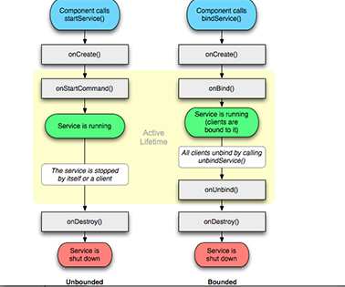

#### 1. Activity

##### 静态在xml填充fragment

```java
2020-07-24 13:38:16.555 7655-7655/component.m.com.example.fragment_test I/life0: 1:onCreate-start
2020-07-24 13:38:16.771 7655-7655/component.m.com.example.fragment_test I/life0: 2A:onAttach
2020-07-24 13:38:16.771 7655-7655/component.m.com.example.fragment_test I/life0: 2A:onCreate
2020-07-24 13:38:16.776 7655-7655/component.m.com.example.fragment_test I/life0: 2A:onCreateView
2020-07-24 13:38:16.783 7655-7655/component.m.com.example.fragment_test I/life0: 1:onStart-start
2020-07-24 13:38:16.783 7655-7655/component.m.com.example.fragment_test I/life0: 2A:onActivityCreated
2020-07-24 13:38:16.783 7655-7655/component.m.com.example.fragment_test I/life0: 2A:onStart
2020-07-24 13:38:16.784 7655-7655/component.m.com.example.fragment_test I/life0: 1:onStart-end
```

这里会有变化,其他一致


##### 动态在onCreate创建fragment

MainActivity中:

```java
2020-07-16 21:33:20.021 26491-26491/component.m.com.example.fragment_test I/life0: 1:onCreate-start
2020-07-16 21:33:20.657 26491-26491/component.m.com.example.fragment_test I/life0: 1:onStart-start  --- 先调用Activity的  onStart()
2020-07-16 21:33:20.669 26491-26491/component.m.com.example.fragment_test I/life0: 2A:onAttach
2020-07-16 21:33:20.669 26491-26491/component.m.com.example.fragment_test I/life0: 2A:onCreate
2020-07-16 21:33:20.673 26491-26491/component.m.com.example.fragment_test I/life0: 2A:onCreateView
2020-07-16 21:33:20.675 26491-26491/component.m.com.example.fragment_test I/life0: 2A:onActivityCreated
2020-07-16 21:33:20.675 26491-26491/component.m.com.example.fragment_test I/life0: 2A:onStart  
2020-07-16 21:33:20.675 26491-26491/component.m.com.example.fragment_test I/life0: 1:onStart-end --- 执行完Activity super.onStart()
2020-07-16 21:33:20.678 26491-26491/component.m.com.example.fragment_test I/life0: 1:onResume-start  --- 调用Activity的 onResume()
2020-07-16 21:33:20.679 26491-26491/component.m.com.example.fragment_test I/life0: 1:onResume-end --- 执行完Activity的 super.onResume()
2020-07-16 21:33:20.679 26491-26491/component.m.com.example.fragment_test I/life0: 2A:onResume
```

```java
----------------------------------------destory---------------------------------------------
  
2020-07-16 21:46:20.504 26491-26491/component.m.com.example.fragment_test I/life0: 1:onPause-start --- 调用Activity中的 onPause()
2020-07-16 21:46:20.505 26491-26491/component.m.com.example.fragment_test I/life0: 2A:onPause
2020-07-16 21:46:20.505 26491-26491/component.m.com.example.fragment_test I/life0: 1:onPause-end --- 执行完Activity super.onPause()
2020-07-16 21:46:21.167 26491-26491/component.m.com.example.fragment_test I/life0: 1:onStop-start --- 调用Activity onStop
2020-07-16 21:46:21.168 26491-26491/component.m.com.example.fragment_test I/life0: 2A:onStop
2020-07-16 21:46:21.169 26491-26491/component.m.com.example.fragment_test I/life0: 1:onStop-end --- 执行完Activity super.onStop()
2020-07-16 21:46:21.175 26491-26491/component.m.com.example.fragment_test I/life0: 1:onDestroy-start  --- 执行Activity onDestroy()
2020-07-16 21:46:21.176 26491-26491/component.m.com.example.fragment_test I/life0: 2A:onDestroyView
2020-07-16 21:46:21.185 26491-26491/component.m.com.example.fragment_test I/life0: 2A:onDestroy
2020-07-16 21:46:21.185 26491-26491/component.m.com.example.fragment_test I/life0: 2A:onDetach
2020-07-16 21:46:21.186 26491-26491/component.m.com.example.fragment_test I/life0: 1:onDestroy-end  --- 执行完Activity super.onDestroy();
```


AFragment跳转另一个AActivity

```java
2020-07-16 22:46:16.769 10605-10605/component.m.com.example.fragment_test I/life0: 1:onPause-start  --- MainActivity 执行 onPause()
2020-07-16 22:46:16.770 10605-10605/component.m.com.example.fragment_test I/life0: 2A:onPause
2020-07-16 22:46:16.770 10605-10605/component.m.com.example.fragment_test I/life0: 1:onPause-end --- MainActivity调用完 super.onpause()
2020-07-16 22:46:16.793 10605-10605/component.m.com.example.fragment_test I/life0: 3:onCreate-start --- AActivity 创建  调用 onCreate()
2020-07-16 22:46:16.830 10605-10605/component.m.com.example.fragment_test I/life0: 3:onStart
--- AActivity 可见  调用 onStart()
2020-07-16 22:46:16.831 10605-10605/component.m.com.example.fragment_test I/life0: 3:onResume --- AActivity 可交互  调用 onResume()
2020-07-16 22:46:17.144 10605-10605/component.m.com.example.fragment_test I/life0: 1:onStop-start --- MainActivity 调用 onStop()
2020-07-16 22:46:17.145 10605-10605/component.m.com.example.fragment_test I/life0: 2A:onStop
2020-07-16 22:46:17.145 10605-10605/component.m.com.example.fragment_test I/life0: 1:onStop-end --- MainActivity 执行完 super.onStop()
```


切换后台走onStop切换回来是

```java
2020-07-16 21:56:28.867 29003-29003/component.m.com.example.fragment_test I/life0: 1:onRestart
2020-07-16 21:56:28.915 29003-29003/component.m.com.example.fragment_test I/life0: 1:onStart
2020-07-16 21:56:28.915 29003-29003/component.m.com.example.fragment_test I/life0: 1:onResume
```


#### 2. Service




```java
// 第一次startService
2020-07-16 22:59:48.382 11617-11617/component.m.com.example.fragment_test I/life1: onCreate
2020-07-16 22:59:48.382 11617-11617/component.m.com.example.fragment_test I/life1: 
// 第二次startService
onStartCommand
2020-07-16 22:59:50.508 11617-11617/component.m.com.example.fragment_test I/life1: 
// 第三次startService
onStartCommand
2020-07-16 22:59:51.721 11617-11617/component.m.com.example.fragment_test I/life1: 
// 第四次startService
onStartCommand
2020-07-16 22:59:52.879 11617-11617/component.m.com.example.fragment_test I/life1: 
// 第五次startService
onStartCommand
2020-07-16 22:59:54.048 11617-11617/component.m.com.example.fragment_test I/life1:
// 多次bindService
onBind
```


#### 3. BroadCast

