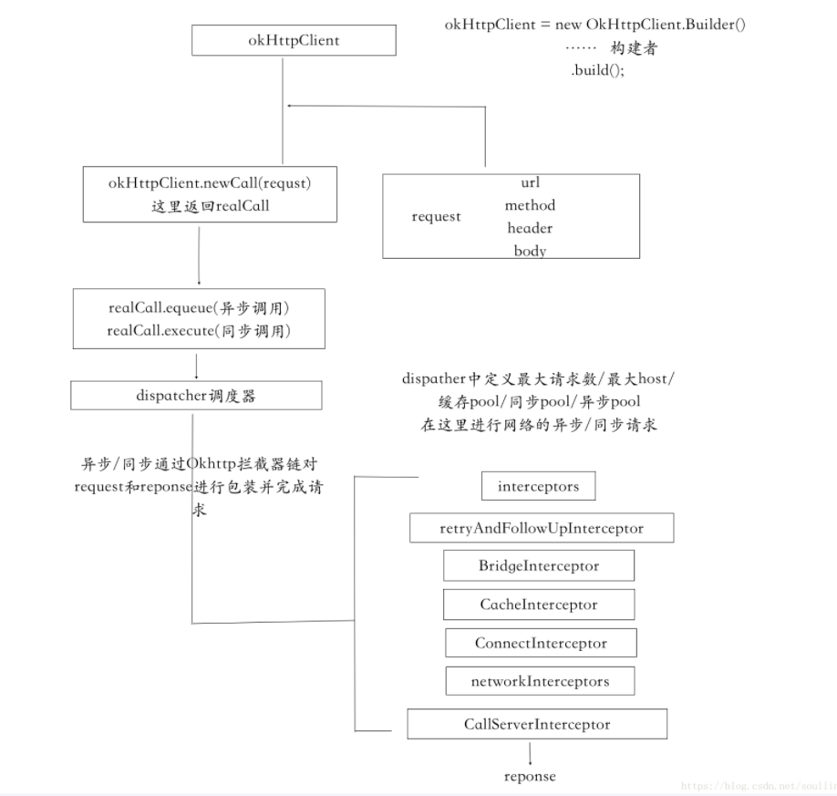

#### 1. OkHttp概述



#### 2. OkHttp.Builder  — OkHttp初始化

```java
public Builder() {
  // 初始化调度器
  dispatcher = new Dispatcher();
  protocols = DEFAULT_PROTOCOLS;
  connectionSpecs = DEFAULT_CONNECTION_SPECS;
  proxySelector = ProxySelector.getDefault();
  cookieJar = CookieJar.NO_COOKIES;
  socketFactory = SocketFactory.getDefault();
  hostnameVerifier = OkHostnameVerifier.INSTANCE;
  certificatePinner = CertificatePinner.DEFAULT;
  proxyAuthenticator = Authenticator.NONE;
  authenticator = Authenticator.NONE;
  // 初始化复连接池
  connectionPool = new ConnectionPool();
  dns = Dns.SYSTEM;
  followSslRedirects = true;
  followRedirects = true;
  retryOnConnectionFailure = true;
  connectTimeout = 10_000;
  readTimeout = 10_000;
  writeTimeout = 10_000;
}
```

在Builder成员中用两个不可变量来存放拦截器

```java
final List<Interceptor> interceptors = new ArrayList<>();
final List<Interceptor> networkInterceptors = new ArrayList<>();
```

开发中可以使用来接起来做hook一类的操作:

```java
okHttpClient = new OkHttpClient.Builder()
                    .connectTimeout(10, TimeUnit.SECONDS)
                    .writeTimeout(10, TimeUnit.SECONDS)
                    .readTimeout(30, TimeUnit.SECONDS)
                    .addInterceptor(new NetInterceptor())
                    .build();
public class NetInterceptor implements Interceptor {


    //拦截网络
    @Override
    public Response intercept(Chain chain) throws IOException {
        Request request = chain.request();

        //打印请求头 请求体
        //添加修改请求head等
      	// 请求前的hook操作
        ....

        Response response = chain.proceed(request);
        //添加修改响应头等
      	// 响应前的hook操作
        ....
        return response;
    }
}

```

#### 3. Request

Request也是使用构建者模式来进行初始化成员`url,head,body,method`等,接着看他的构造,他的设计模式仍然是一个构建者模式

```java
public static class Builder {
  private HttpUrl url;
  private String method;
  private Headers.Builder headers;
  private RequestBody body;
  private Object tag;

  public Builder() {
    this.method = "GET";
    this.headers = new Headers.Builder();
  }

  private Builder(Request request) {
    this.url = request.url;
    this.method = request.method;
    this.body = request.body;
    this.tag = request.tag;
    this.headers = request.headers.newBuilder();
  }

  public Builder url(HttpUrl url) {
    if (url == null) throw new NullPointerException("url == null");
    this.url = url;
    return this;
  }
  ......
   public Builder url(String url) {
      if (url == null) throw new NullPointerException("url == null");

      // Silently replace websocket URLs with HTTP URLs.
      if (url.regionMatches(true, 0, "ws:", 0, 3)) {
        url = "http:" + url.substring(3);
      } else if (url.regionMatches(true, 0, "wss:", 0, 4)) {
        url = "https:" + url.substring(4);
      }

      HttpUrl parsed = HttpUrl.parse(url);
      if (parsed == null) throw new IllegalArgumentException("unexpected url: " + url);
      return url(parsed);
   }
  
  ....
  // post(RequstBody body)  header(String name,String value)
  // 可以添加请求头  请求体等

```

这里简单说下RequstBody:

```java
public static RequestBody create(MediaType contentType, String content) {
  Charset charset = Util.UTF_8;
  if (contentType != null) {
    charset = contentType.charset();
    if (charset == null) {
      charset = Util.UTF_8;
      contentType = MediaType.parse(contentType + "; charset=utf-8");
    }
  }
  byte[] bytes = content.getBytes(charset);
  return create(contentType, bytes);
}

/** Returns a new request body that transmits {@code content}. */
public static RequestBody create(final MediaType contentType, final ByteString content) {
  return new RequestBody() {
    @Override public MediaType contentType() {
      return contentType;
    }

    @Override public long contentLength() throws IOException {
      return content.size();
    }

    @Override public void writeTo(BufferedSink sink) throws IOException {
      sink.write(content);
    }
  };
}
```

这是生成`RequestBody`的一些方法,我们可以通过指明type,传入json来生成`RequestBody`

#### 4. Dispatcher — 调度器

这是网络请求的部分,首先来介绍`Dispatcher`,`OkHttp`的调度器,负责OkHttp的同步和异步,限制最大的host和request等的调度:

`mOkHttpClient.build().newCall(request);`

```java
// request入口
@Override public Call newCall(Request request) {
  return new RealCall(this, request);
}
```

就是实例化一个`RealCall`,接着看源码`RealCall`到底是什么

```java
protected RealCall(OkHttpClient client, Request originalRequest) {
  // 保存OkHttpClient和Requst
  this.client = client;
  this.originalRequest = originalRequest;
  this.forWebSocket = forWebSocket;
}
```

就是保存了 OkHttpClient(*其中初始化了调度器,复连接池,超时时间,缓存,dns等*),同时保存了Requst(*其中初始化请求相关,比如url.method,head,body等*)

**到此为止拿到一个包含OkHttpClient和Request的对象-RealCall,他是网络请求的执行体,其中包含了网络请求的同步和异步的方法**

接着开始请求网络:

`call.enqueue`或者`call.execute`,这里的call就是**RealCall**,前者是异步(需要传入callback)后者是同步

看其源码:

```java
@Override public void enqueue(Callback responseCallback) {
    synchronized (this) {
      if (executed) throw new IllegalStateException("Already Executed");
      executed = true;
    }
    transmitter.callStart();
  	// 核心代码
    client.dispatcher().enqueue(new AsyncCall(responseCallback));
}
```

我们首先看下`核心代码`入参,在 callback外面包装了一个`AsyncCall`

首先`AsyncCall extends NamedRunnable`AsyncCall继承自Runnable`NamedRunnable implements Runnable`,然后会重写其run方法

```java
public abstract class NamedRunnable implements Runnable {
  protected final String name;

  public NamedRunnable(String format, Object... args) {
    this.name = Util.format(format, args);
  }

  @Override public final void run() {
    String oldName = Thread.currentThread().getName();
    Thread.currentThread().setName(name);
    try {
      execute();
    } finally {
      Thread.currentThread().setName(oldName);
    }
  }

  protected abstract void execute();
}
```

run方法调用子类的`execute()`,也就是AsyncCall的`execute`:

```java
  @Override protected void execute() {
    boolean signalledCallback = false;
    try {
      Response response = getResponseWithInterceptorChain(forWebSocket);
      if (canceled) {
        signalledCallback = true;
        responseCallback.onFailure(RealCall.this, new IOException("Canceled"));
      } else {
        signalledCallback = true;
        responseCallback.onResponse(RealCall.this, response);
      }
    } catch (IOException e) {
      if (signalledCallback) {
        // Do not signal the callback twice!
        Platform.get().log(INFO, "Callback failure for " + toLoggableString(), e);
      } else {
        responseCallback.onFailure(RealCall.this, e);
      }
    } finally {
      client.dispatcher().finished(this);
    }
  }
}
```

主要是处理callback的请求成功和失败的回调

我们继续看`client.dispatcher().enqueue(new AsyncCall(responseCallback, forWebSocket));`

```java
  void enqueue(AsyncCall call) {
    synchronized (this) {
      // target1
      readyAsyncCalls.add(call);

      // Mutate the AsyncCall so that it shares the AtomicInteger of an existing running call to
      // the same host.
      // target2
      if (!call.get().forWebSocket) {
        AsyncCall existingCall = findExistingCallWithHost(call.host());
        if (existingCall != null) call.reuseCallsPerHostFrom(existingCall);
      }
    }
    //tartget3
    promoteAndExecute();
  }
```

**旧版本**

- 当小于maxRequests&maxRequestsPerHost,request加入运行队列,线程池执行该task
- 否则加入等待队列

**新版本**

`target1`: 将传入的请求加入ready队列

`target2`:将传入的请求host在ready和running队列查找如果有相同的host就返回

继续看`target3`的源码:

```java
private boolean promoteAndExecute() {
  assert (!Thread.holdsLock(this));

  List<AsyncCall> executableCalls = new ArrayList<>();
  boolean isRunning;
  synchronized (this) {
    for (Iterator<AsyncCall> i = readyAsyncCalls.iterator(); i.hasNext(); ) {
      AsyncCall asyncCall = i.next();
			// 判断 host和requst限制
      if (runningAsyncCalls.size() >= maxRequests) break; // Max capacity.
      if (asyncCall.callsPerHost().get() >= maxRequestsPerHost) continue; // Host max capacity.

      i.remove();
      asyncCall.callsPerHost().incrementAndGet();
      // 将其加入重新创建的队列
      executableCalls.add(asyncCall);
      // 将ready队列的加入running队列
      runningAsyncCalls.add(asyncCall);
    }
    isRunning = runningCallsCount() > 0;
  }
	// 线程池执行--AsyncCall
  for (int i = 0, size = executableCalls.size(); i < size; i++) {
    AsyncCall asyncCall = executableCalls.get(i);
    asyncCall.executeOn(executorService());
  }

  return isRunning;
}
```


我们看到出来这里有`maxRequests`最大请求数,和`maxRequestsPerHost`最大host的限制

其实调度器就是维护了一个线程池并限制了其host数和requst数,下面看下其线程池:

```java
public synchronized ExecutorService executorService() {
  if (executorService == null) {
    executorService = new ThreadPoolExecutor(0, Integer.MAX_VALUE, 60, TimeUnit.SECONDS,
        new SynchronousQueue<Runnable>(), Util.threadFactory("OkHttp Dispatcher", false));
  }
  return executorService;
}
```

核心线程为0,最大线程数为无限大,超时时间是60s,并维护了一个同步队列,线程池就不多说了,如果小于核心线程就创建线程执行task,如果核心线程满了就存入同步队列,同步队列满了就新起线程,但是不能超过最大线程数


这样AsyncCall就被线程池内部封装成一个Worker,执行Worker的run,然后执行Worker的`runWorker`然后执行worker包装的task,也就是AcyncCall的run方法,然后AcyncCall的run方法执行其`execute()`

```java
   @Override protected void execute() {
      boolean signalledCallback = false;
      transmitter.timeoutEnter();
      try {
        Response response = getResponseWithInterceptorChain();
        signalledCallback = true;
        responseCallback.onResponse(RealCall.this, response);
      } catch (IOException e) {
        if (signalledCallback) {
          // Do not signal the callback twice!
          Platform.get().log(INFO, "Callback failure for " + toLoggableString(), e);
        } else {
          responseCallback.onFailure(RealCall.this, e);
        }
      } finally {
        client.dispatcher().finished(this);
      }
    }
```

**旧版本**请求结束之后会有一个操作` client.dispatcher().finished(this);`因为旧版本会先将请求加入running队列,如果超出request和host限制加入ready队列,在调用execute()时候在每次请求完取check ready队列是否执行,其check标准还是requst和host

```java
/** Used by {@code AsyncCall#run} to signal completion. */
synchronized void finished(AsyncCall call) {
  if (!runningAsyncCalls.remove(call)) throw new AssertionError("AsyncCall wasn't running!");
  promoteCalls();
}

// 核心代码
 private void promoteCalls() {
    // 判断运行队列是否超出最大request限制数
    if (runningAsyncCalls.size() >= maxRequests) return; // Already running max capacity.
    // 等待队列是否为空
    if (readyAsyncCalls.isEmpty()) return; // No ready calls to promote.
		// 执行等待队列 
    for (Iterator<AsyncCall> i = readyAsyncCalls.iterator(); i.hasNext(); ) {
      AsyncCall call = i.next();

      if (runningCallsForHost(call) < maxRequestsPerHost) {
        i.remove();
        runningAsyncCalls.add(call);
        executorService().execute(call);
      }

      if (runningAsyncCalls.size() >= maxRequests) return; // Reached max capacity.
    }
  }
```

这样每次请求完都是尝试执行等待队列的request

再次回到最终调用请求的地方AsyncCall的`execute`

请求网络的核心代码是`  Response response = getResponseWithInterceptorChain(forWebSocket);`,然后请求完成之后,就会回调开发者者传入的callback接口

#### 5. 拦截器

我们看请求网络的代码

```java
    @Override protected void execute() {
      boolean signalledCallback = false;
      transmitter.timeoutEnter();
      try {
        // 开始请求
        Response response = getResponseWithInterceptorChain();
        signalledCallback = true;
        responseCallback.onResponse(RealCall.this, response);
      } catch (IOException e) {
        if (signalledCallback) {
          // Do not signal the callback twice!
          Platform.get().log(INFO, "Callback failure for " + toLoggableString(), e);
        } else {
          responseCallback.onFailure(RealCall.this, e);
        }
      } finally {
        client.dispatcher().finished(this);
      }
    }
```

核心代码是`Response response = getResponseWithInterceptorChain(forWebSocket);`不错在这里使用了拦截器

```java
Response getResponseWithInterceptorChain() throws IOException {
    // Build a full stack of interceptors.
    List<Interceptor> interceptors = new ArrayList<>();
    interceptors.addAll(client.interceptors());
    interceptors.add(new RetryAndFollowUpInterceptor(client));
    interceptors.add(new BridgeInterceptor(client.cookieJar()));
    interceptors.add(new CacheInterceptor(client.internalCache()));
    interceptors.add(new ConnectInterceptor(client));
    if (!forWebSocket) {
      interceptors.addAll(client.networkInterceptors());
    }
    interceptors.add(new CallServerInterceptor(forWebSocket));

    Interceptor.Chain chain = new RealInterceptorChain(interceptors, transmitter, null, 0,
        originalRequest, this, client.connectTimeoutMillis(),
        client.readTimeoutMillis(), client.writeTimeoutMillis());

    boolean calledNoMoreExchanges = false;
    try {
      Response response = chain.proceed(originalRequest);
      if (transmitter.isCanceled()) {
        closeQuietly(response);
        throw new IOException("Canceled");
      }
      return response;
    } catch (IOException e) {
      calledNoMoreExchanges = true;
      throw transmitter.noMoreExchanges(e);
    } finally {
      if (!calledNoMoreExchanges) {
        transmitter.noMoreExchanges(null);
      }
    }
  }
```

可以看到有两个拦截器加入到interceptors中;

还有一个RealInterceptorChain负责总调度

##### 5.1 RealInterceptorChain

**RealInterceptorChain是一个控制的角色:**

我们基于上述代码,看下RealInterceptorChain的`proceed`

```java
public Response proceed(Request request, Transmitter transmitter, @Nullable Exchange exchange)
    throws IOException {
  if (index >= interceptors.size()) throw new AssertionError();

  calls++;

  // 如果已经有一个stream.那么requst默认使用
  if (this.exchange != null && !this.exchange.connection().supportsUrl(request.url())) {
    throw new IllegalStateException("network interceptor " + interceptors.get(index - 1)
        + " must retain the same host and port");
  }

  // 如果已经有一个stream,确保他是位移使用
  if (this.exchange != null && calls > 1) {
    throw new IllegalStateException("network interceptor " + interceptors.get(index - 1)
        + " must call proceed() exactly once");
  }

  // Call the next interceptor in the chain.
  // 调用下一个拦截器
  RealInterceptorChain next = new RealInterceptorChain(interceptors, transmitter, exchange,
      index + 1, request, call, connectTimeout, readTimeout, writeTimeout);
  // 如果没有用户自定义拦截器,那么调用RetryAndFollowUpInterceptor并传入RealInterceptorChain,index+1
  Interceptor interceptor = interceptors.get(index);
  Response response = interceptor.intercept(next);

  // Confirm that the next interceptor made its required call to chain.proceed().
  if (exchange != null && index + 1 < interceptors.size() && next.calls != 1) {
    throw new IllegalStateException("network interceptor " + interceptor
        + " must call proceed() exactly once");
  }

  // Confirm that the intercepted response isn't null.
  if (response == null) {
    throw new NullPointerException("interceptor " + interceptor + " returned null");
  }

  if (response.body() == null) {
    throw new IllegalStateException(
        "interceptor " + interceptor + " returned a response with no body");
  }

  return response;
}
```

在这里会调用下一个拦截器,(如果没有开发者自定义的拦截器)那么下一个拦截器是RetryAndFollowUpInterceptor,调用其`intercept`方法,并将重新初始化后的`RealInterceptorChain`作为入参传入

##### 5.2 RetryAndFollowUpInterceptor

**RetryAndFollowUpInterceptor:负责失败重试和重定向**

```java
@Override public Response intercept(Chain chain) throws IOException {
  Request request = chain.request();
  // 初始化 Transmitter
  RealInterceptorChain realChain = (RealInterceptorChain) chain;
  Transmitter transmitter = realChain.transmitter();

  int followUpCount = 0;
  Response priorResponse = null;
  while (true) {
    // 查看是否已经连接  & 进行连接工作
    transmitter.prepareToConnect(request);

    if (transmitter.isCanceled()) {
      throw new IOException("Canceled");
    }

    Response response;
    boolean success = false;
    try {
      // 回到RealInterceptorChain遍历下一个,这是一个递归
      response = realChain.proceed(request, transmitter, null);
      success = true;
    } catch (RouteException e) {
      // The attempt to connect via a route failed. The request will not have been sent.
      if (!recover(e.getLastConnectException(), transmitter, false, request)) {
        throw e.getFirstConnectException();
      }
      continue;
    } catch (IOException e) {
      // An attempt to communicate with a server failed. The request may have been sent.
      boolean requestSendStarted = !(e instanceof ConnectionShutdownException);
      if (!recover(e, transmitter, requestSendStarted, request)) throw e;
      continue;
    } finally {
      // The network call threw an exception. Release any resources.
      if (!success) {
        transmitter.exchangeDoneDueToException();
      }
    }

    // Attach the prior response if it exists. Such responses never have a body.
    // 如果有先前的响应就附加先前的响应
    if (priorResponse != null) {
      response = response.newBuilder()
          .priorResponse(priorResponse.newBuilder()
                  .body(null)
                  .build())
          .build();
    }
		
    
    Exchange exchange = Internal.instance.exchange(response);
    Route route = exchange != null ? exchange.connection().route() : null;
    Request followUp = followUpRequest(response, route);

    if (followUp == null) {
      if (exchange != null && exchange.isDuplex()) {
        transmitter.timeoutEarlyExit();
      }
      return response;
    }

    RequestBody followUpBody = followUp.body();
    if (followUpBody != null && followUpBody.isOneShot()) {
      return response;
    }

    closeQuietly(response.body());
    if (transmitter.hasExchange()) {
      exchange.detachWithViolence();
    }

    if (++followUpCount > MAX_FOLLOW_UPS) {
      throw new ProtocolException("Too many follow-up requests: " + followUpCount);
    }

    request = followUp;
    priorResponse = response;
  }
}
```

调用成功之后会继续回到RealInterceptorChain遍历下一个

```java
  // 调用下一个拦截器
  RealInterceptorChain next = new RealInterceptorChain(interceptors, transmitter, exchange,
      index + 1, request, call, connectTimeout, readTimeout, writeTimeout);
  // 如果没有用户自定义拦截器,那么调用RetryAndFollowUpInterceptor并传入RealInterceptorChain,index+1
  Interceptor interceptor = interceptors.get(index);
  Response response = interceptor.intercept(next);
```

此时index继续加一,并再次初始化RealInterceptorChain,再次作为入参调用下一个拦截器

##### 5.3 BridgeInterceptor

**BridgeInterceptor:就是一个转化和封装,将request转化为可以请求后台的request,或者把服务器返回的reponse转化为用户易于解析的友好reponse;**

```java
@Override public Response intercept(Chain chain) throws IOException {
  Request userRequest = chain.request();
  Request.Builder requestBuilder = userRequest.newBuilder();
	
  // 修改body
  RequestBody body = userRequest.body();
  if (body != null) {
    MediaType contentType = body.contentType();
    if (contentType != null) {
      requestBuilder.header("Content-Type", contentType.toString());
    }

    long contentLength = body.contentLength();
    if (contentLength != -1) {
      requestBuilder.header("Content-Length", Long.toString(contentLength));
      requestBuilder.removeHeader("Transfer-Encoding");
    } else {
      requestBuilder.header("Transfer-Encoding", "chunked");
      requestBuilder.removeHeader("Content-Length");
    }
  }

  if (userRequest.header("Host") == null) {
    requestBuilder.header("Host", hostHeader(userRequest.url(), false));
  }

  if (userRequest.header("Connection") == null) {
    requestBuilder.header("Connection", "Keep-Alive");
  }

  // If we add an "Accept-Encoding: gzip" header field we're responsible for also decompressing
  // the transfer stream.
  boolean transparentGzip = false;
  if (userRequest.header("Accept-Encoding") == null && userRequest.header("Range") == null) {
    transparentGzip = true;
    requestBuilder.header("Accept-Encoding", "gzip");
  }

  List<Cookie> cookies = cookieJar.loadForRequest(userRequest.url());
  if (!cookies.isEmpty()) {
    requestBuilder.header("Cookie", cookieHeader(cookies));
  }

  if (userRequest.header("User-Agent") == null) {
    requestBuilder.header("User-Agent", Version.userAgent());
  }
	
  // 调用下一个拦截器
  Response networkResponse = chain.proceed(requestBuilder.build());
	
  // 修改Response
  HttpHeaders.receiveHeaders(cookieJar, userRequest.url(), networkResponse.headers());

  Response.Builder responseBuilder = networkResponse.newBuilder()
      .request(userRequest);

  if (transparentGzip
      && "gzip".equalsIgnoreCase(networkResponse.header("Content-Encoding"))
      && HttpHeaders.hasBody(networkResponse)) {
    GzipSource responseBody = new GzipSource(networkResponse.body().source());
    Headers strippedHeaders = networkResponse.headers().newBuilder()
        .removeAll("Content-Encoding")
        .removeAll("Content-Length")
        .build();
    responseBuilder.headers(strippedHeaders);
    String contentType = networkResponse.header("Content-Type");
    responseBuilder.body(new RealResponseBody(contentType, -1L, Okio.buffer(responseBody)));
  }

  return responseBuilder.build();
}
```

在BridgeInterceptor主要是对request or reponse的header之类的进行必要性的优化,同时可以在请求头中添加特定的头来实现默认的规则:

- 如:如果我们添加一个“接受编码：GZIP”标题,我们也负责解压

就是一些 request和reponse的修改工作,同样回到`RealInterceptorChain`index+1,然后继续遍历下一个拦截器


##### 5.4 CacheInterceptor

**CacheInterceptor:OkHttp的缓存机制**

```java
@Override public Response intercept(Chain chain) throws IOException {
  Response cacheCandidate = cache != null
      ? cache.get(chain.request())
      : null;

  long now = System.currentTimeMillis();

  CacheStrategy strategy = new CacheStrategy.Factory(now, chain.request(), cacheCandidate).get();
  Request networkRequest = strategy.networkRequest;
  Response cacheResponse = strategy.cacheResponse;

  if (cache != null) {
    cache.trackResponse(strategy);
  }
	
  // 候选缓存不适用关闭他
  if (cacheCandidate != null && cacheResponse == null) {
    closeQuietly(cacheCandidate.body()); // The cache candidate wasn't applicable. Close it.
  }

  // If we're forbidden from using the network and the cache is insufficient, fail.
  // 禁止使用网络且缓存不足就关闭他
  if (networkRequest == null && cacheResponse == null) {
    return new Response.Builder()
        .request(chain.request())
        .protocol(Protocol.HTTP_1_1)
        .code(504)
        .message("Unsatisfiable Request (only-if-cached)")
        .body(Util.EMPTY_RESPONSE)
        .sentRequestAtMillis(-1L)
        .receivedResponseAtMillis(System.currentTimeMillis())
        .build();
  }

  // If we don't need the network, we're done.
  // 如果不需要网络就执行缓存
  if (networkRequest == null) {
    return cacheResponse.newBuilder()
        .cacheResponse(stripBody(cacheResponse))
        .build();
  }

  Response networkResponse = null;
  try {
    // 进入下一个拦截器的遍历
    networkResponse = chain.proceed(networkRequest);
  } finally {
    // If we're crashing on I/O or otherwise, don't leak the cache body.
    // 如果I/O crash,不要暴露主体缓存
    if (networkResponse == null && cacheCandidate != null) {
      closeQuietly(cacheCandidate.body());
    }
  }

  // If we have a cache response too, then we're doing a conditional get.
  // 如果响应有缓存就做一个有条件的获取
  if (cacheResponse != null) {
    if (networkResponse.code() == HTTP_NOT_MODIFIED) {
      Response response = cacheResponse.newBuilder()
          .headers(combine(cacheResponse.headers(), networkResponse.headers()))
          .sentRequestAtMillis(networkResponse.sentRequestAtMillis())
          .receivedResponseAtMillis(networkResponse.receivedResponseAtMillis())
          .cacheResponse(stripBody(cacheResponse))
          .networkResponse(stripBody(networkResponse))
          .build();
      networkResponse.body().close();

      // Update the cache after combining headers but before stripping the
      // Content-Encoding header (as performed by initContentStream()).
      cache.trackConditionalCacheHit();
      cache.update(cacheResponse, response);
      return response;
    } else {
      closeQuietly(cacheResponse.body());
    }
  }

  Response response = networkResponse.newBuilder()
      .cacheResponse(stripBody(cacheResponse))
      .networkResponse(stripBody(networkResponse))
      .build();

  if (cache != null) {
    if (HttpHeaders.hasBody(response) && CacheStrategy.isCacheable(response, networkRequest)) {
      // Offer this request to the cache.
      // 将请求写入缓存
      CacheRequest cacheRequest = cache.put(response);
      return cacheWritingResponse(cacheRequest, response);
    }

    if (HttpMethod.invalidatesCache(networkRequest.method())) {
      try {
        cache.remove(networkRequest);
      } catch (IOException ignored) {
        // The cache cannot be written.
      }
    }
  }

  return response;
}
```

大致就是缓存的读写以及缓存策略下是否进行网络等

1.在OkHttp中request and reponse均有缓存机制:

```java
    //获取缓存的request and  reponse
    Request networkRequest = strategy.networkRequest;
    Response cacheResponse = strategy.cacheResponse;
```


2.在缓存的拦截器中OkHttp中提供一些策略:从缓存中获取,如果没有则请求网络;当无网络且缓存中没有相应缓存或者内存不足时返回error;
3.I/O异常时候,关闭缓存体,防止内存泄露;


继续看下一个拦截器

#### 5.5 ConnectInterceptor

**ConnectInterceptor:负责连接服务器的拦截器**

```java
@Override public Response intercept(Chain chain) throws IOException {
  RealInterceptorChain realChain = (RealInterceptorChain) chain;
  Request request = realChain.request();
  Transmitter transmitter = realChain.transmitter();

  // We need the network to satisfy this request. Possibly for validating a conditional GET.
  boolean doExtensiveHealthChecks = !request.method().equals("GET");
  Exchange exchange = transmitter.newExchange(chain, doExtensiveHealthChecks);

  return realChain.proceed(request, transmitter, exchange);
}
```

其实是验证请求条件,查找连接并返回

##### 5.6 client.networkInterceptors()

如果是webSocket就使用这个

##### 5.7CallServerInterceptor

**CallServerInterceptor:负责请求发出并返回reponse**

```java
@Override public Response intercept(Chain chain) throws IOException {
  RealInterceptorChain realChain = (RealInterceptorChain) chain;
  Exchange exchange = realChain.exchange();
  Request request = realChain.request();

  long sentRequestMillis = System.currentTimeMillis();

  exchange.writeRequestHeaders(request);

  boolean responseHeadersStarted = false;
  Response.Builder responseBuilder = null;
  if (HttpMethod.permitsRequestBody(request.method()) && request.body() != null) {
    // If there's a "Expect: 100-continue" header on the request, wait for a "HTTP/1.1 100
    // Continue" response before transmitting the request body. If we don't get that, return
    // what we did get (such as a 4xx response) without ever transmitting the request body.
    if ("100-continue".equalsIgnoreCase(request.header("Expect"))) {
      exchange.flushRequest();
      responseHeadersStarted = true;
      exchange.responseHeadersStart();
      responseBuilder = exchange.readResponseHeaders(true);
    }

    if (responseBuilder == null) {
      if (request.body().isDuplex()) {
        // Prepare a duplex body so that the application can send a request body later.
        exchange.flushRequest();
        BufferedSink bufferedRequestBody = Okio.buffer(
            exchange.createRequestBody(request, true));
        request.body().writeTo(bufferedRequestBody);
      } else {
        // Write the request body if the "Expect: 100-continue" expectation was met.
        BufferedSink bufferedRequestBody = Okio.buffer(
            exchange.createRequestBody(request, false));
        request.body().writeTo(bufferedRequestBody);
        bufferedRequestBody.close();
      }
    } else {
      exchange.noRequestBody();
      if (!exchange.connection().isMultiplexed()) {
        // If the "Expect: 100-continue" expectation wasn't met, prevent the HTTP/1 connection
        // from being reused. Otherwise we're still obligated to transmit the request body to
        // leave the connection in a consistent state.
        exchange.noNewExchangesOnConnection();
      }
    }
  } else {
    exchange.noRequestBody();
  }

  if (request.body() == null || !request.body().isDuplex()) {
    exchange.finishRequest();
  }

  if (!responseHeadersStarted) {
    exchange.responseHeadersStart();
  }

  if (responseBuilder == null) {
    responseBuilder = exchange.readResponseHeaders(false);
  }

  Response response = responseBuilder
      .request(request)
      .handshake(exchange.connection().handshake())
      .sentRequestAtMillis(sentRequestMillis)
      .receivedResponseAtMillis(System.currentTimeMillis())
      .build();

  int code = response.code();
  if (code == 100) {
    // server sent a 100-continue even though we did not request one.
    // try again to read the actual response
    response = exchange.readResponseHeaders(false)
        .request(request)
        .handshake(exchange.connection().handshake())
        .sentRequestAtMillis(sentRequestMillis)
        .receivedResponseAtMillis(System.currentTimeMillis())
        .build();

    code = response.code();
  }

  exchange.responseHeadersEnd(response);

  if (forWebSocket && code == 101) {
    // Connection is upgrading, but we need to ensure interceptors see a non-null response body.
    response = response.newBuilder()
        .body(Util.EMPTY_RESPONSE)
        .build();
  } else {
    response = response.newBuilder()
        .body(exchange.openResponseBody(response))
        .build();
  }

  if ("close".equalsIgnoreCase(response.request().header("Connection"))
      || "close".equalsIgnoreCase(response.header("Connection"))) {
    exchange.noNewExchangesOnConnection();
  }

  if ((code == 204 || code == 205) && response.body().contentLength() > 0) {
    throw new ProtocolException(
        "HTTP " + code + " had non-zero Content-Length: " + response.body().contentLength());
  }

  return response;
}
```

负责将流写入requst.body,然后请求网络返回response

