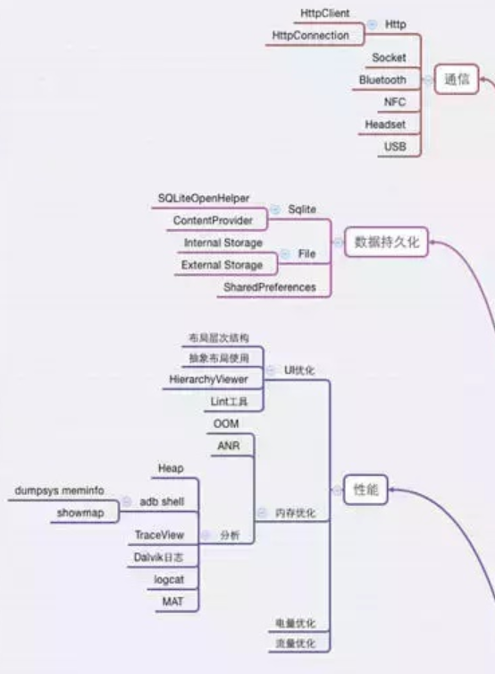
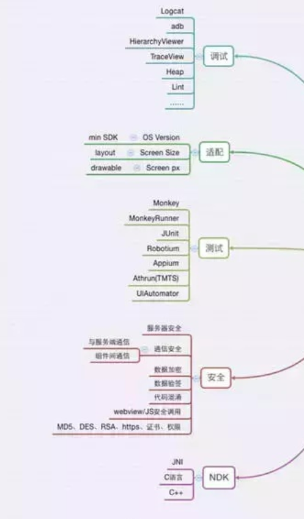
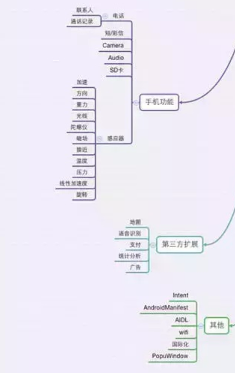
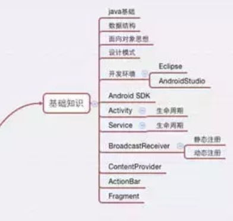
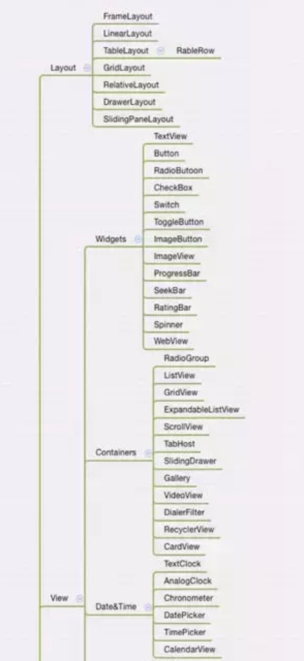
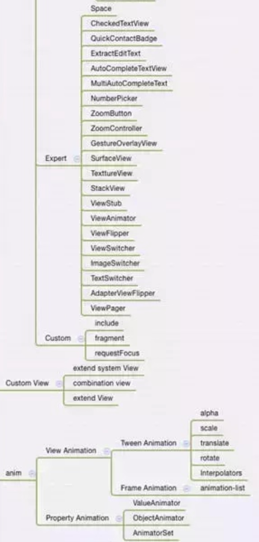
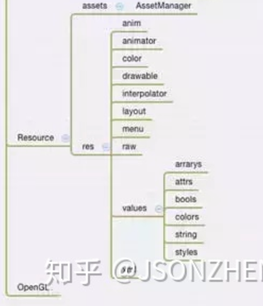

#### 简历编写

著名的star法则，即情境(situation)、任务(task)、行动(action)、结果(result)

> 在什么场景下，采用了什么技术方案，取得了什么成果，通俗来讲，还是提取项目中的技术亮点和能体现你能力的地方。比如说，对应用启动的做了xx优化，启动速度快了30%，比竞品厉害了多少。

#### android 学习架构

##### 通信 & 持久化 & 性能

#####  调试&适配&安全&NDK

##### 手机功能 & 第三方扩展 & 其他

##### 基础知识

##### Layout&Widget&Containers&Data& Time

##### Expert & Custom View & Anim

##### Resource & openGL

