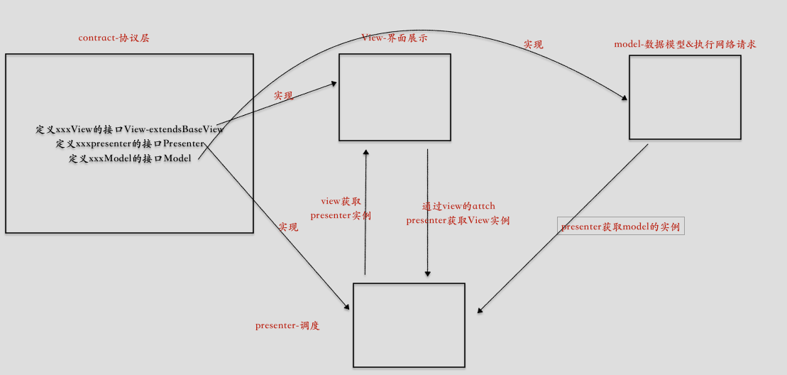

#### 1.MVP介绍

MVP的使用，使Activity中的网络请求剥离出来 成为model、presenter，model只负责网络的请求、pesenter负责处理请求网络后的数据处理：加载中 成功 or 失败 取消加载；最后View进行界面的展示




这是一个完整的mvp架构图

#### 2. Contract

contract是对 `view-presenter-model`接口的一个业务约束,增加可阅读性以及逻辑管理

```java
// 协议层 用来梳理逻辑接口
public interface MainContract {
    //model接口
    interface Model {
        Observable<BaseObjectBean<LoginBean>> login(String username, String password);
    }

    // view的接口
    interface View extends BaseView {
        @Override
        void showLoading();

        @Override
        void hideLoading();

        @Override
        void onError(String errMessage);

        void onSuccess(BaseObjectBean<LoginBean> bean);
    }

    // presenter 接口
    interface Presenter {
        /**
         * 登陆
         *
         * @param username
         * @param password
         */
        void login(String username, String password);
    }
}
```

在MainContract 中
 Model接口 创建对应的联网请求的方法，将Presenter提交的字段放到联网请求中，发送给服务器
 View 接口 创建在界面上显示加载中、取消加载以及登陆成功、失败的方法
 Presenter 接口 创建 登陆的方法，以及需要提交的字段 (username、password)

具体的view,presenter以及model会先后实现contract中定义的接口


#### 3. View

```java
public class MainActivity extends BaseMvpActivity<MainPresenter> implements MainContract.View {

    TextInputEditText etUsernameLogin;
    TextInputEditText etPasswordLogin;
    Button btnSigninLogin;

    @Override
    public int getLayoutId() {
        return R.layout.activity_main;
    }

    @Override
    public void initView() {
        etUsernameLogin = findViewById(R.id.et_username_login);
        etPasswordLogin = findViewById(R.id.et_password_login);
        btnSigninLogin = findViewById(R.id.btn_signin_login);

        // 初始化presenter
        mPresenter = new MainPresenter();
        // presenter 绑定view
        mPresenter.attachView(this);
        btnSigninLogin.setOnClickListener(new View.OnClickListener() {
            @Override
            public void onClick(View v) {
                if (getUsername().isEmpty() || getPassword().isEmpty()) {
                    Toast.makeText(MainActivity.this, "帐号密码不能为空", Toast.LENGTH_SHORT).show();
                    return;
                }
                mPresenter.login(getUsername(), getPassword());
            }
        });

    }

    /**
     * @return 帐号
     */
    private String getUsername() {
        return etUsernameLogin.getText().toString().trim();
    }

    /**
     * @return 密码
     */
    private String getPassword() {
        return etPasswordLogin.getText().toString().trim();
    }
		
  	// 请求成功
    @Override
    public void onSuccess(BaseObjectBean bean) {

        Toast.makeText(this, bean.getErrorMsg(), Toast.LENGTH_SHORT).show();

    }

    @Override
    public void showLoading() {

    }

    @Override
    public void hideLoading() {

    }
		
  	// 请求失败
    @Override
    public void onError(String errMessage) {

    }

}
```

`public class MainActivity extends BaseMvpActivity<MainPresenter> implements MainContract.View`

首先是实现`MainContract.View`接口在`mPresenter.attachView(this);`将view传给presenter,这样presenter就可以控制view的逻辑

```java
public abstract class BaseMvpActivity<T extends BasePresenter> extends BaseActivity implements BaseView {

    protected T mPresenter;

    @Override
    protected void onCreate(@Nullable Bundle savedInstanceState) {
        super.onCreate(savedInstanceState);

    }

		// 解绑presenter
    @Override
    protected void onDestroy() {
        if (mPresenter != null) {
            mPresenter.detachView();
        }

        super.onDestroy();
    }

    /**
     * 绑定生命周期 防止MVP内存泄漏
     * 利用观察者进行周期绑定
     * @param <T>
     * @return
     */
    @Override
    public <T> AutoDisposeConverter<T> bindAutoDispose() {
        return AutoDispose.autoDisposable(AndroidLifecycleScopeProvider
                .from(this, Lifecycle.Event.ON_DESTROY));
    }
}
```

`extends BaseMvpActivity<MainPresenter>`是为了在base类进行presenter的解绑和周期控制,由于是通用逻辑所以直接抽象到抽象类**注意抽象类是静态模式通用方法的抽象,接口是对行为的扩展**


#### 4. Presenter — 调度

```java
public class MainPresenter extends BasePresenter<MainContract.View> implements MainContract.Presenter {

    private MainContract.Model model;

    public MainPresenter() {
      	// 获取model
        model = new MainModel();
    }

    @Override
    public void login(String username, String password) {
        //View是否绑定 如果没有绑定，就不执行网络请求
        if (!isViewAttached()) {
            return;
        }
      	// model请求网络
        model.login(username, password)
                .compose(RxScheduler.Obs_io_main())
                .to(mView.bindAutoDispose())//解决内存泄漏
                .subscribe(new Observer<BaseObjectBean<LoginBean>>() {
                    @Override
                    public void onSubscribe(@NonNull Disposable d) {
                        mView.showLoading();
                    }

                    @Override
                    public void onNext(@NonNull BaseObjectBean<LoginBean> loginBeanBaseObjectBean) {
                        // 实现view的逻辑1 请求成功
                        mView.onSuccess(loginBeanBaseObjectBean);
                    }

                    @Override
                    public void onError(@NonNull Throwable e) {
                      	// 实现view逻辑2 请求失败&隐藏loading
                        mView.onError(e.getMessage());
                        mView.hideLoading();
                    }

                    @Override
                    public void onComplete() {
                      	// 实现view逻辑3 请求完成-隐藏loading
                        mView.hideLoading();
                    }
                });

    }
}
```

在presenter中`BasePresenter`实现view的绑定和解绑以及是否绑定的判断逻辑

```java
public class BasePresenter<V extends BaseView> {
    protected V mView;


    /**
     * 绑定view，一般在初始化中调用该方法
     *
     * @param view view
     */
    public void attachView(V view) {
        this.mView = view;
    }

    /**
     * 解除绑定view，一般在onDestroy中调用
     */

    public void detachView() {
        this.mView = null;
    }

    /**
     * View是否绑定
     *
     * @return
     */
    public boolean isViewAttached() {
        return mView != null;
    }


}
```

然后presenter的`login`中进行网络请求,使用rx-java,进行周期管理`to(mView.bindAutoDispose())//解决内存泄漏`,然后在请求的回调接口进行view逻辑的处理

#### 5. Model

其实就是处理耗时逻辑的类:

```java
public class MainModel  implements MainContract.Model {
  	// login接口
    @Override
    public Observable<BaseObjectBean<LoginBean>> login(String username, String password) {
        return RetrofitClient.getInstance().getApi().login(username,password);
    }
}
```

其实presenter里面不应该进行网络请求,应该仅仅执行回调即可