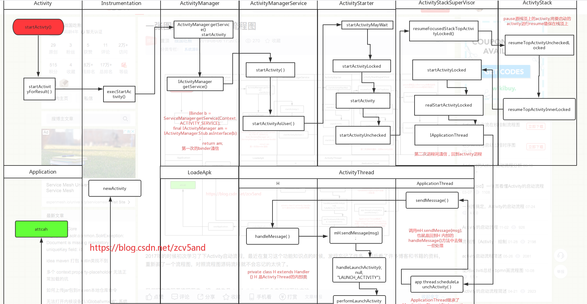

#### 1.startActivity

```java
// ### class:Activity
@Override
public void startActivity(Intent intent) {
    this.startActivity(intent, null);
}

// 重载 方法 -- startActivity
@Override
public void startActivity(Intent intent, @Nullable Bundle options) {
        if (options != null) {
          	// startActivity会走到这里
            startActivityForResult(intent, -1, options);
        } else {
            // Note we want to go through this call for compatibility with
            // applications that may have overridden the method.
            startActivityForResult(intent, -1);
        }
}


```

最终均会走到`startActivityForResult`:

```java
public void startActivityForResult(@RequiresPermission Intent intent, int requestCode,
        @Nullable Bundle options) {
  	// target1 : mParent就是要启动的Activity
    if (mParent == null) {
        options = transferSpringboardActivityOptions(options);
      	// target2 
        Instrumentation.ActivityResult ar =
            mInstrumentation.execStartActivity(
                this, mMainThread.getApplicationThread(), mToken, this,
                intent, requestCode, options);
        if (ar != null) {
            mMainThread.sendActivityResult(
                mToken, mEmbeddedID, requestCode, ar.getResultCode(),
                ar.getResultData());
        }
        if (requestCode >= 0) {
            mStartedActivity = true;
        }

        cancelInputsAndStartExitTransition(options);
    } else {
        if (options != null) {
            mParent.startActivityFromChild(this, intent, requestCode, options);
        } else {
            mParent.startActivityFromChild(this, intent, requestCode);
        }
    }
}
```

- Target1: 就是将要启动的目标Activity,可以debug简单check一下
- Target2: 这里是核心代码,`Instrumentation`的作用是监控整个app**运行流程,交互流程**,使用`Instrumentation`,`mInstrumentation.execStartActivity`启动Activity:

####2.Instrumentation

```java
/**
 * Base class for implementing application instrumentation code.  When running
 * with instrumentation turned on, this class will be instantiated for you
 * before any of the application code, allowing you to monitor all of the
 * interaction the system has with the application.  An Instrumentation
 * implementation is described to the system through an AndroidManifest.xml's
 * &lt;instrumentation&gt; tag.
 */
public class Instrumentation {
```

`Instrumentation`可以认为是一个代理类,可以在启动ap之前进行检查之类,如清单文件Activity的判断等

继续看 `mInstrumentation.execStartActivity`

```java
// #### class Instrumentation  启动Activity的入口
public ActivityResult execStartActivity(
        Context who, IBinder contextThread, IBinder token, Activity target,
        Intent intent, int requestCode, Bundle options) {
    IApplicationThread whoThread = (IApplicationThread) contextThread;
    Uri referrer = target != null ? target.onProvideReferrer() : null;
    if (referrer != null) {
        intent.putExtra(Intent.EXTRA_REFERRER, referrer);
    }
    if (mActivityMonitors != null) {
        synchronized (mSync) {
            final int N = mActivityMonitors.size();
            for (int i=0; i<N; i++) {
                final ActivityMonitor am = mActivityMonitors.get(i);
                ActivityResult result = null;
                if (am.ignoreMatchingSpecificIntents()) {
                    result = am.onStartActivity(intent);
                }
                if (result != null) {
                    am.mHits++;
                    return result;
                } else if (am.match(who, null, intent)) {
                    am.mHits++;
                    if (am.isBlocking()) {
                        return requestCode >= 0 ? am.getResult() : null;
                    }
                    break;
                }
            }
        }
    }
    try {
        intent.migrateExtraStreamToClipData();
        intent.prepareToLeaveProcess(who);
      	// target1
        int result = ActivityManager.getService()
            .startActivity(whoThread, who.getBasePackageName(), intent,
                    intent.resolveTypeIfNeeded(who.getContentResolver()),
                    token, target != null ? target.mEmbeddedID : null,
                    requestCode, 0, null, options);
      	// target2
        checkStartActivityResult(result, intent);
    } catch (RemoteException e) {
        throw new RuntimeException("Failure from system", e);
    }
    return null;
}


```

##### 2.1 target2 ` checkStartActivityResult(result, intent)`对启动结果进行检查

```java
public static void checkStartActivityResult(int res, Object intent) {
    if (!ActivityManager.isStartResultFatalError(res)) {
        return;
    }

    switch (res) {
        case ActivityManager.START_INTENT_NOT_RESOLVED:
        case ActivityManager.START_CLASS_NOT_FOUND:
            if (intent instanceof Intent && ((Intent)intent).getComponent() != null)
                throw new ActivityNotFoundException(
                        "Unable to find explicit activity class "
                        + ((Intent)intent).getComponent().toShortString()
                        + "; have you declared this activity in your AndroidManifest.xml?");
            throw new ActivityNotFoundException(
                    "No Activity found to handle " + intent);
        case ActivityManager.START_PERMISSION_DENIED:
            throw new SecurityException("Not allowed to start activity "
                    + intent);
        case ActivityManager.START_FORWARD_AND_REQUEST_CONFLICT:
            throw new AndroidRuntimeException(
                    "FORWARD_RESULT_FLAG used while also requesting a result");
        case ActivityManager.START_NOT_ACTIVITY:
            throw new IllegalArgumentException(
                    "PendingIntent is not an activity");
        case ActivityManager.START_NOT_VOICE_COMPATIBLE:
            throw new SecurityException(
                    "Starting under voice control not allowed for: " + intent);
        case ActivityManager.START_VOICE_NOT_ACTIVE_SESSION:
            throw new IllegalStateException(
                    "Session calling startVoiceActivity does not match active session");
        case ActivityManager.START_VOICE_HIDDEN_SESSION:
            throw new IllegalStateException(
                    "Cannot start voice activity on a hidden session");
        case ActivityManager.START_ASSISTANT_NOT_ACTIVE_SESSION:
            throw new IllegalStateException(
                    "Session calling startAssistantActivity does not match active session");
        case ActivityManager.START_ASSISTANT_HIDDEN_SESSION:
            throw new IllegalStateException(
                    "Cannot start assistant activity on a hidden session");
        case ActivityManager.START_CANCELED:
            throw new AndroidRuntimeException("Activity could not be started for "
                    + intent);
        default:
            throw new AndroidRuntimeException("Unknown error code "
                    + res + " when starting " + intent);
    }
}
```

就是对Activity进行检查,看第一个case,**就是对当前ACtivity是否在当前清单中进行注册检查**


#### 3.ActivityManager


target1 获取ActivityManager的服务(AMS)来启动Activity

`ActivityManager.getService()`

```java
/**
 * @hide
 */
// 通过IPC获取AMS的远程代理
public static IActivityManager getService() {
  	// target1
    return IActivityManagerSingleton.get();
}

private static final Singleton<IActivityManager> IActivityManagerSingleton =
        new Singleton<IActivityManager>() {
            @Override
            protected IActivityManager create() {
              	// target 2
                final IBinder b = ServiceManager.getService(Context.ACTIVITY_SERVICE);
              	// target 3
                final IActivityManager am = IActivityManager.Stub.asInterface(b);
                return am;
            }
        };
```

- Target1 :通过`IActivityManagerSingleton`返回AMS的代理对象
- Target2: 获取系统级别的服务`ServiceManager.getService(Context.ACTIVITY_SERVICE)`
- Target3:其实就是一个AIDL进程间的IPC通信,通过IBinder的AIDL方式来获取远程服务的代理类`IActivityManager`

继续看`IActivityManager`的实现类也就是我们常说的AMS

#### 4. ActivityManagerService(AMS)

```java
package com.android.server.am;

// 这就是远程服务代理的实现类
public class ActivityManagerService extends IActivityManager.Stub
        implements Watchdog.Monitor, BatteryStatsImpl.BatteryCallback {
```

接上上面的

```java
int result = ActivityManager.getService()
					.startActivity(whoThread, who.getBasePackageName(), intent,
						intent.resolveTypeIfNeeded(who.getContentResolver()),
						token, target != null ? target.mEmbeddedID : null,
						requestCode, 0, null, options);
```

启动Activity的最终入口就在AMS中

```java
@Override
public final int startActivity(IApplicationThread caller, String callingPackage,
        Intent intent, String resolvedType, IBinder resultTo, String resultWho, int requestCode,
        int startFlags, ProfilerInfo profilerInfo, Bundle bOptions) {
    return startActivityAsUser(caller, callingPackage, intent, resolvedType, resultTo,
            resultWho, requestCode, startFlags, profilerInfo, bOptions,
            UserHandle.getCallingUserId());
}

@Override
public final int startActivityAsUser(IApplicationThread caller, String callingPackage,
        Intent intent, String resolvedType, IBinder resultTo, String resultWho, int requestCode,
        int startFlags, ProfilerInfo profilerInfo, Bundle bOptions, int userId) {
    return startActivityAsUser(caller, callingPackage, intent, resolvedType, resultTo,
            resultWho, requestCode, startFlags, profilerInfo, bOptions, userId,
            true /*validateIncomingUser*/);
}


public final int startActivityAsUser(IApplicationThread caller, String callingPackage,
        Intent intent, String resolvedType, IBinder resultTo, String resultWho, int requestCode,
        int startFlags, ProfilerInfo profilerInfo, Bundle bOptions, int userId,
        boolean validateIncomingUser) {
    enforceNotIsolatedCaller("startActivity");

    userId = mActivityStartController.checkTargetUser(userId, validateIncomingUser,
            Binder.getCallingPid(), Binder.getCallingUid(), "startActivityAsUser");

    // TODO: Switch to user app stacks here.
    return mActivityStartController.obtainStarter(intent, "startActivityAsUser")
            .setCaller(caller)
            .setCallingPackage(callingPackage)
            .setResolvedType(resolvedType)
            .setResultTo(resultTo)
            .setResultWho(resultWho)
            .setRequestCode(requestCode)
            .setStartFlags(startFlags)
            .setProfilerInfo(profilerInfo)
            .setActivityOptions(bOptions)
            .setMayWait(userId)
            .execute();

}
```

核心代码 

```java
// TODO: Switch to user app stacks here.
    return mActivityStartController.obtainStarter(intent, "startActivityAsUser")
            .setCaller(caller)
            .setCallingPackage(callingPackage)
            .setResolvedType(resolvedType)
            .setResultTo(resultTo)
            .setResultWho(resultWho)
            .setRequestCode(requestCode)
            .setStartFlags(startFlags)
            .setProfilerInfo(profilerInfo)
            .setActivityOptions(bOptions)
            .setMayWait(userId)
            .execute();
```

注释: **在此将切换到用户的应用堆栈**

也就是说 我们可以认为 **AMS**是system_server,自此分发之后会进去**app_server**

#### 5. ActivityStartController & ActivityStarter

需要先了解下 `ActivityStartController`和`.obtainStarter`

```jAVA

// 委派活动的启动控制器
public class ActivityStartController {
  
// 
ActivityStarter obtainStarter(Intent intent, String reason) {
        return mFactory.obtain().setIntent(intent).setReason(reason);
 }
```

最终启动Activity的类是 `ActivityStarter`

```java
/**
 * Controller for interpreting how and then launching an activity.
 *
 * This class collects all the logic for determining how an intent and flags should be turned into
 * an activity and associated task and stack.
 */
class ActivityStarter {
```

ActivityStarter是专门把`intent``flag`转变为Activity

```java
int execute() {
    try {
        // TODO(b/64750076): Look into passing request directly to these methods to allow
        // for transactional diffs and preprocessing.
        if (mRequest.mayWait) {
          	// target1
            return startActivityMayWait(mRequest.caller, mRequest.callingUid,
                    mRequest.callingPackage, mRequest.intent, mRequest.resolvedType,
                    mRequest.voiceSession, mRequest.voiceInteractor, mRequest.resultTo,
                    mRequest.resultWho, mRequest.requestCode, mRequest.startFlags,
                    mRequest.profilerInfo, mRequest.waitResult, mRequest.globalConfig,
                    mRequest.activityOptions, mRequest.ignoreTargetSecurity, mRequest.userId,
                    mRequest.inTask, mRequest.reason,
                    mRequest.allowPendingRemoteAnimationRegistryLookup);
        } else {
          	// target2
            return startActivity(mRequest.caller, mRequest.intent, mRequest.ephemeralIntent,
                    mRequest.resolvedType, mRequest.activityInfo, mRequest.resolveInfo,
                    mRequest.voiceSession, mRequest.voiceInteractor, mRequest.resultTo,
                    mRequest.resultWho, mRequest.requestCode, mRequest.callingPid,
                    mRequest.callingUid, mRequest.callingPackage, mRequest.realCallingPid,
                    mRequest.realCallingUid, mRequest.startFlags, mRequest.activityOptions,
                    mRequest.ignoreTargetSecurity, mRequest.componentSpecified,
                    mRequest.outActivity, mRequest.inTask, mRequest.reason,
                    mRequest.allowPendingRemoteAnimationRegistryLookup);
        }
    } finally {
        onExecutionComplete();
    }
}
```

上一步设置  `.mayWait`为true,则会走target1

```java
private int startActivityMayWait(IApplicationThread caller, int callingUid,
        String callingPackage, Intent intent, String resolvedType,
        IVoiceInteractionSession voiceSession, IVoiceInteractor voiceInteractor,
        IBinder resultTo, String resultWho, int requestCode, int startFlags,
        ProfilerInfo profilerInfo, WaitResult outResult,
        Configuration globalConfig, SafeActivityOptions options, boolean ignoreTargetSecurity,
        int userId, TaskRecord inTask, String reason,
        boolean allowPendingRemoteAnimationRegistryLookup) {
    ......
    mSupervisor.getActivityMetricsLogger().notifyActivityLaunching();
    boolean componentSpecified = intent.getComponent() != null;

    final int realCallingPid = Binder.getCallingPid();
    final int realCallingUid = Binder.getCallingUid();

    ......
    // 解析  intent数据
    ResolveInfo rInfo = mSupervisor.resolveIntent(intent, resolvedType, userId,
            0 /* matchFlags */,
                    computeResolveFilterUid(
                            callingUid, realCallingUid, mRequest.filterCallingUid));
    ......
    // Collect information about the target of the Intent.
    // 解析intent数据
    ActivityInfo aInfo = mSupervisor.resolveActivity(intent, rInfo, startFlags, profilerInfo);

    ......
				// 记录Activity的数据
        final ActivityRecord[] outRecord = new ActivityRecord[1];
        int res = startActivity(caller, intent, ephemeralIntent, resolvedType, aInfo, rInfo,
                voiceSession, voiceInteractor, resultTo, resultWho, requestCode, callingPid,
                callingUid, callingPackage, realCallingPid, realCallingUid, startFlags, options,
                ignoreTargetSecurity, componentSpecified, outRecord, inTask, reason,
                allowPendingRemoteAnimationRegistryLookup);

        .....
    }
}
```

继续看 `startActivity`:

```JAVA
private int startActivity(IApplicationThread caller, Intent intent, Intent ephemeralIntent,
        String resolvedType, ActivityInfo aInfo, ResolveInfo rInfo,
        IVoiceInteractionSession voiceSession, IVoiceInteractor voiceInteractor,
        IBinder resultTo, String resultWho, int requestCode, int callingPid, int callingUid,
        String callingPackage, int realCallingPid, int realCallingUid, int startFlags,
        SafeActivityOptions options, boolean ignoreTargetSecurity, boolean componentSpecified,
        ActivityRecord[] outActivity, TaskRecord inTask, String reason,
        boolean allowPendingRemoteAnimationRegistryLookup) {

    if (TextUtils.isEmpty(reason)) {
        throw new IllegalArgumentException("Need to specify a reason.");
    }
    mLastStartReason = reason;
    mLastStartActivityTimeMs = System.currentTimeMillis();
    mLastStartActivityRecord[0] = null;
		// 启动Activity
    mLastStartActivityResult = startActivity(caller, intent, ephemeralIntent, resolvedType,
            aInfo, rInfo, voiceSession, voiceInteractor, resultTo, resultWho, requestCode,
            callingPid, callingUid, callingPackage, realCallingPid, realCallingUid, startFlags,
            options, ignoreTargetSecurity, componentSpecified, mLastStartActivityRecord,
            inTask, allowPendingRemoteAnimationRegistryLookup);

    if (outActivity != null) {
        // mLastStartActivityRecord[0] is set in the call to startActivity above.
        outActivity[0] = mLastStartActivityRecord[0];
    }

    return getExternalResult(mLastStartActivityResult);
}
```

继续看 重载方法:

```java
private int startActivity(IApplicationThread caller, Intent intent, Intent ephemeralIntent,
        String resolvedType, ActivityInfo aInfo, ResolveInfo rInfo,
        IVoiceInteractionSession voiceSession, IVoiceInteractor voiceInteractor,
        IBinder resultTo, String resultWho, int requestCode, int callingPid, int callingUid,
        String callingPackage, int realCallingPid, int realCallingUid, int startFlags,
        SafeActivityOptions options,
        boolean ignoreTargetSecurity, boolean componentSpecified, ActivityRecord[] outActivity,
        TaskRecord inTask, boolean allowPendingRemoteAnimationRegistryLookup) {
    int err = ActivityManager.START_SUCCESS;
    // Pull the optional Ephemeral Installer-only bundle out of the options early.
    final Bundle verificationBundle
            = options != null ? options.popAppVerificationBundle() : null;

    ProcessRecord callerApp = null;
    ......
    // 检查启动Activity的权限
    boolean abort = !mSupervisor.checkStartAnyActivityPermission(intent, aInfo, resultWho,
            requestCode, callingPid, callingUid, callingPackage, ignoreTargetSecurity,
            inTask != null, callerApp, resultRecord, resultStack);
    abort |= !mService.mIntentFirewall.checkStartActivity(intent, callingUid,
            callingPid, resolvedType, aInfo.applicationInfo);


   .......
    if (mService.mDidAppSwitch) {
        // This is the second allowed switch since we stopped switches,
        // so now just generally allow switches.  Use case: user presses
        // home (switches disabled, switch to home, mDidAppSwitch now true);
        // user taps a home icon (coming from home so allowed, we hit here
        // and now allow anyone to switch again).
        mService.mAppSwitchesAllowedTime = 0;
    } else {
        mService.mDidAppSwitch = true;
    }

    mController.doPendingActivityLaunches(false);

    return startActivity(r, sourceRecord, voiceSession, voiceInteractor, startFlags,
            true /* doResume */, checkedOptions, inTask, outActivity);
}
```

最后执行  `startActivity`

```java
private int startActivity(final ActivityRecord r, ActivityRecord sourceRecord,
            IVoiceInteractionSession voiceSession, IVoiceInteractor voiceInteractor,
            int startFlags, boolean doResume, ActivityOptions options, TaskRecord inTask,
            ActivityRecord[] outActivity) {
    int result = START_CANCELED;
    try {
        mService.mWindowManager.deferSurfaceLayout();
      	// target1
        result = startActivityUnchecked(r, sourceRecord, voiceSession, voiceInteractor,
                startFlags, doResume, options, inTask, outActivity);
    } finally {
        // If we are not able to proceed, disassociate the activity from the task. Leaving an
        // activity in an incomplete state can lead to issues, such as performing operations
        // without a window container.
      	// 获取Activity任务栈
        final ActivityStack stack = mStartActivity.getStack();
        if (!ActivityManager.isStartResultSuccessful(result) && stack != null) {
            stack.finishActivityLocked(mStartActivity, RESULT_CANCELED,
                    null /* intentResultData */, "startActivity", true /* oomAdj */);
        }
        mService.mWindowManager.continueSurfaceLayout();
    }

    postStartActivityProcessing(r, result, mTargetStack);

    return result;
}
```

继续看target1的`startActivityUnchecked`

#### 6.ActivityStackSupervisor


```java
private int startActivityUnchecked(final ActivityRecord r, ActivityRecord sourceRecord,
        IVoiceInteractionSession voiceSession, IVoiceInteractor voiceInteractor,
        int startFlags, boolean doResume, ActivityOptions options, TaskRecord inTask,
        ActivityRecord[] outActivity) {

    setInitialState(r, options, inTask, doResume, startFlags, sourceRecord, voiceSession,
            voiceInteractor);

    computeLaunchingTaskFlags();

    computeSourceStack();

    ......
      	// 根据Activity的启动模式来设置栈
        if (mStartActivity.getTask() == null && !clearTopAndResetStandardLaunchMode) {
            mStartActivity.setTask(reusedActivity.getTask());
        }

        if (reusedActivity.getTask().intent == null) {
            // This task was started because of movement of the activity based on affinity...
            // Now that we are actually launching it, we can assign the base intent.
            reusedActivity.getTask().setIntent(mStartActivity);
        }

       ......
        reusedActivity = setTargetStackAndMoveToFrontIfNeeded(reusedActivity);

        .......
    // 根据Activity的启动模式来判断是直接插入已存在的栈顶还是新开栈插入      
    mTargetStack.startActivityLocked(mStartActivity, topFocused, newTask, mKeepCurTransition,
            mOptions);
    if (mDoResume) {
        final ActivityRecord topTaskActivity =
                mStartActivity.getTask().topRunningActivityLocked();
        if (!mTargetStack.isFocusable()
                || (topTaskActivity != null && topTaskActivity.mTaskOverlay
                && mStartActivity != topTaskActivity)) {
    			
            mTargetStack.ensureActivitiesVisibleLocked(null, 0, !PRESERVE_WINDOWS);
            
            mService.mWindowManager.executeAppTransition();
        } else {
          
            if (mTargetStack.isFocusable() && !mSupervisor.isFocusedStack(mTargetStack)) {
                mTargetStack.moveToFront("startActivityUnchecked");
            }
          	// target1
            mSupervisor.resumeFocusedStackTopActivityLocked(mTargetStack, mStartActivity,
                    mOptions);
        }
    } else if (mStartActivity != null) {
        mSupervisor.mRecentTasks.add(mStartActivity.getTask());
    }
    mSupervisor.updateUserStackLocked(mStartActivity.userId, mTargetStack);

    mSupervisor.handleNonResizableTaskIfNeeded(mStartActivity.getTask(), preferredWindowingMode,
            preferredLaunchDisplayId, mTargetStack);

    return START_SUCCESS;
}
```

#### 7. ActivityStack

继续看target1 `mSupervisor.resumeFocusedStackTopActivityLocked`

```java
boolean resumeFocusedStackTopActivityLocked(
        ActivityStack targetStack, ActivityRecord target, ActivityOptions targetOptions) {

    if (!readyToResume()) {
        return false;
    }

    if (targetStack != null && isFocusedStack(targetStack)) {
        return targetStack.resumeTopActivityUncheckedLocked(target, targetOptions);
    }

    final ActivityRecord r = mFocusedStack.topRunningActivityLocked();
    if (r == null || !r.isState(RESUMED)) {
        mFocusedStack.resumeTopActivityUncheckedLocked(null, null);
    } else if (r.isState(RESUMED)) {
        // Kick off any lingering app transitions form the MoveTaskToFront operation.
        mFocusedStack.executeAppTransition(targetOptions);
    }

    return false;
}
```

上面代码 targetStack不为空,且 `isFocusedStack(targetStack)`,则执行`targetStack.resumeTopActivityUncheckedLocked`:


```java
boolean resumeTopActivityUncheckedLocked(ActivityRecord prev, ActivityOptions options) {
    if (mStackSupervisor.inResumeTopActivity) {
        // Don't even start recursing.
        return false;
    }

    boolean result = false;
    try {
        // Protect against recursion.
        mStackSupervisor.inResumeTopActivity = true;
        result = resumeTopActivityInnerLocked(prev, options); // target1

        // When resuming the top activity, it may be necessary to pause the top activity (for
        // example, returning to the lock screen. We suppress the normal pause logic in
        // {@link #resumeTopActivityUncheckedLocked}, since the top activity is resumed at the
        // end. We call the {@link ActivityStackSupervisor#checkReadyForSleepLocked} again here
        // to ensure any necessary pause logic occurs. In the case where the Activity will be
        // shown regardless of the lock screen, the call to
        // {@link ActivityStackSupervisor#checkReadyForSleepLocked} is skipped.
        final ActivityRecord next = topRunningActivityLocked(true /* focusableOnly */);
        if (next == null || !next.canTurnScreenOn()) {
            checkReadyForSleep();
        }
    } finally {
        mStackSupervisor.inResumeTopActivity = false;
    }

    return result;
}
```

继续看target1: `resumeTopActivityInnerLocked`

```java
@GuardedBy("mService")
private boolean resumeTopActivityInnerLocked(ActivityRecord prev, ActivityOptions options) {
    if (!mService.mBooting && !mService.mBooted) {
        // Not ready yet!
        return false;
    }

    // Find the next top-most activity to resume in this stack that is not finishing and is
    // focusable. If it is not focusable, we will fall into the case below to resume the
    // top activity in the next focusable task.
    final ActivityRecord next = topRunningActivityLocked(true /* focusableOnly */);

    ........
                mStackSupervisor.startSpecificActivityLocked(next, true, false);
     ........
}
```

#### 8.ActivityStackSupervisor

继续走`mStackSupervisor.startSpecificActivityLocked`

```java
void startSpecificActivityLocked(ActivityRecord r,
        boolean andResume, boolean checkConfig) {
    // Is this activity's application already running?
    ProcessRecord app = mService.getProcessRecordLocked(r.processName,
            r.info.applicationInfo.uid, true);

    getLaunchTimeTracker().setLaunchTime(r);

    if (app != null && app.thread != null) {
        try {
            if ((r.info.flags&ActivityInfo.FLAG_MULTIPROCESS) == 0
                    || !"android".equals(r.info.packageName)) {
                // Don't add this if it is a platform component that is marked
                // to run in multiple processes, because this is actually
                // part of the framework so doesn't make sense to track as a
                // separate apk in the process.
                app.addPackage(r.info.packageName, r.info.applicationInfo.longVersionCode,
                        mService.mProcessStats);
            }
            realStartActivityLocked(r, app, andResume, checkConfig); //target1
            return;
        } catch (RemoteException e) {
            Slog.w(TAG, "Exception when starting activity "
                    + r.intent.getComponent().flattenToShortString(), e);
        }

        // If a dead object exception was thrown -- fall through to
        // restart the application.
    }

    mService.startProcessLocked(r.processName, r.info.applicationInfo, true, 0,
            "activity", r.intent.getComponent(), false, false, true);
}
```

继续看target1 `realStartActivityLocked(r, app, andResume, checkConfig)`

```java
final boolean realStartActivityLocked(ActivityRecord r, ProcessRecord app,
        boolean andResume, boolean checkConfig) throws RemoteException {

    if (!allPausedActivitiesComplete()) {
        // While there are activities pausing we skipping starting any new activities until
        // pauses are complete. NOTE: that we also do this for activities that are starting in
        // the paused state because they will first be resumed then paused on the client side.
        if (DEBUG_SWITCH || DEBUG_PAUSE || DEBUG_STATES) Slog.v(TAG_PAUSE,
                "realStartActivityLocked: Skipping start of r=" + r
                + " some activities pausing...");
        return false;
    }

   .......
     				// target2 核心代码
            // Create activity launch transaction
     				// `ClientTransaction` 管理了Activity启动过程
            final ClientTransaction clientTransaction = ClientTransaction.obtain(app.thread,
                    r.appToken);
            clientTransaction.addCallback(LaunchActivityItem.obtain(new Intent(r.intent),
                    System.identityHashCode(r), r.info,
                    // TODO: Have this take the merged configuration instead of separate global
                    // and override configs.
                    mergedConfiguration.getGlobalConfiguration(),
                    mergedConfiguration.getOverrideConfiguration(), r.compat,
                    r.launchedFromPackage, task.voiceInteractor, app.repProcState, r.icicle,
                    r.persistentState, results, newIntents, mService.isNextTransitionForward(),
                    profilerInfo));

            // Set desired final state.
            final ActivityLifecycleItem lifecycleItem;
            if (andResume) {
                lifecycleItem = ResumeActivityItem.obtain(mService.isNextTransitionForward());
            } else {
                lifecycleItem = PauseActivityItem.obtain();
            }
            clientTransaction.setLifecycleStateRequest(lifecycleItem);

            // Schedule transaction.
            mService.getLifecycleManager().scheduleTransaction(clientTransaction);


          ......
    return true;
}
```

请看  target2: 

- 8.0直接使用主线程调度`app.thread.scheduleLaunchActivity`
- 9.0使用事务机制
  - ClientTransaction来管理Activity的启动过程,该类包含了客户端(app)的一系列信息,可以对这些信息做出会调,并且发送给客户端,让客户端取执行回调,完成具体的消息执行和整个生命周期的调度执行
  - 最后`scheduleTransaction

#### 9 ClientLifecycleManager

接着看`scheduleTransaction`:

```java
void scheduleTransaction(ClientTransaction transaction) throws RemoteException {
    final IApplicationThread client = transaction.getClient();
    transaction.schedule(); // target1
    if (!(client instanceof Binder)) {
        // If client is not an instance of Binder - it's a remote call and at this point it is
        // safe to recycle the object. All objects used for local calls will be recycled after
        // the transaction is executed on client in ActivityThread.
        transaction.recycle();
    }
}
```

####10 ClientTransaction

继续看target1:

```java
public void schedule() throws RemoteException {
        mClient.scheduleTransaction(this);
    }
```

mClicent就是`private IApplicationThread mClient;`

在上面`realStartActivityLocked`中实例化`ClientTransaction`

`ClientTransaction.obtain(app.thread,r.appToken);`

```java
/** Obtain an instance initialized with provided params. */
public static ClientTransaction obtain(IApplicationThread client, IBinder activityToken) {
    ClientTransaction instance = ObjectPool.obtain(ClientTransaction.class);
    if (instance == null) {
        instance = new ClientTransaction();
    }
    instance.mClient = client;
    instance.mActivityToken = activityToken;

    return instance;
}
```

mClient在实例化ClientTransaction时候已经赋值,这个mClient就是`ActivityThread`的内部的`ApplicationThread`


#### 11.ActivityThread  — app进程

继续看ApplicationThread的`.scheduleTransaction`


```java
@Override
public void scheduleTransaction(ClientTransaction transaction) throws RemoteException {
    ActivityThread.this.scheduleTransaction(transaction);
}
```

这里我们调用ActivityThread的`.scheduleTransaction`

由于ActivityThread继承自`ClientTransactionHandler`且没有重写

所以调用 的 `scheduleTransaction`:

```java
void scheduleTransaction(ClientTransaction transaction) {
    transaction.preExecute(this);
    sendMessage(ActivityThread.H.EXECUTE_TRANSACTION, transaction);
}
```

这个`sendMessage`调用handler的sendMessage,最后ActivityThread的H(继承自handler)类会接收

```java
class H extends Handler {
......
  case EXECUTE_TRANSACTION:
                    final ClientTransaction transaction = (ClientTransaction) msg.obj;
                    mTransactionExecutor.execute(transaction);  // target1
                    if (isSystem()) {
                        transaction.recycle();
                    }
                
                    break;
......                    
}
```

看target1,之后流转到`TransactionExecutor`处理

#### 12 TransactionExecutor

关于TransactionExecutor` Class that manages transaction execution in the correct order.`- 以正确的顺序管理事务执行的类。

继续看 `.execute`

```java
public void execute(ClientTransaction transaction) {
    final IBinder token = transaction.getActivityToken();
    log("Start resolving transaction for client: " + mTransactionHandler + ", token: " + token);

    executeCallbacks(transaction);  // target1

    executeLifecycleState(transaction);
    mPendingActions.clear();
    log("End resolving transaction");
}
```

继续看target1`executeCallbacks(transaction)`

```java
/** Cycle through all states requested by callbacks and execute them at proper times. */
@VisibleForTesting
public void executeCallbacks(ClientTransaction transaction) {
    final List<ClientTransactionItem> callbacks = transaction.getCallbacks();
    if (callbacks == null) {
        // No callbacks to execute, return early.
        return;
    }
    log("Resolving callbacks");
		
  	// 从服务中获取客户端app(自己正在使用的app)
    final IBinder token = transaction.getActivityToken();
    ActivityClientRecord r = mTransactionHandler.getActivityClient(token);

		
    final ActivityLifecycleItem finalStateRequest = transaction.getLifecycleStateRequest();
    final int finalState = finalStateRequest != null ? finalStateRequest.getTargetState()
            : UNDEFINED;
    // Index of the last callback that requests some post-execution state.
    final int lastCallbackRequestingState = lastCallbackRequestingState(transaction);

    final int size = callbacks.size();
    for (int i = 0; i < size; ++i) {
        final ClientTransactionItem item = callbacks.get(i);
        log("Resolving callback: " + item);
        final int postExecutionState = item.getPostExecutionState();
        final int closestPreExecutionState = mHelper.getClosestPreExecutionState(r,
                item.getPostExecutionState());
        if (closestPreExecutionState != UNDEFINED) {
            cycleToPath(r, closestPreExecutionState);
        }
				// 启动Activity逻辑
        item.execute(mTransactionHandler, token, mPendingActions);  
        item.postExecute(mTransactionHandler, token, mPendingActions);
        if (r == null) {
            // Launch activity request will create an activity record.
            r = mTransactionHandler.getActivityClient(token);
        }

        if (postExecutionState != UNDEFINED && r != null) {
            // Skip the very last transition and perform it by explicit state request instead.
            final boolean shouldExcludeLastTransition =
                    i == lastCallbackRequestingState && finalState == postExecutionState;
            cycleToPath(r, postExecutionState, shouldExcludeLastTransition);
        }
    }
}
```

启动Activity  `        item.execute(mTransactionHandler, token, mPendingActions);  `,item是`ClientTransactionItem`,他是作为系统和客户端(app)回调的枢纽,比如配置变化,多窗口模式改变,Activity启动等

而这个`ClientTransactionItem`是怎么来的呢 ?`transaction.getCallbacks()`这里`transaction`就是`ClientTransaction`


```java
public abstract class ClientTransactionItem implements BaseClientRequest, Parcelable {
```

这是`ClientTransactionItem`我们来看其具体实现类

我们来看`7.`中`realStartActivityLocked`

有这么一句

```java
clientTransaction.addCallback(LaunchActivityItem.obtain(new Intent(r.intent),
                        System.identityHashCode(r), r.info,

                        mergedConfiguration.getGlobalConfiguration(),
                        mergedConfiguration.getOverrideConfiguration(), r.compat,
                        r.launchedFromPackage, task.voiceInteractor, app.repProcState, r.icicle,
                        r.persistentState, results, newIntents, mService.isNextTransitionForward(),
                        profilerInfo));
```

这里`clientTransaction`add的callback就是`ClientTransactionItem`,这里我们用ClientTransactionItem的实现类`LaunchActivityItem`

ok,接着上面的调用

`item.execute(mTransactionHandler, token, mPendingActions)`


#### 13.LaunchActivityItem

```java
@Override
public void execute(ClientTransactionHandler client, IBinder token,
        PendingTransactionActions pendingActions) {
    Trace.traceBegin(TRACE_TAG_ACTIVITY_MANAGER, "activityStart");
    ActivityClientRecord r = new ActivityClientRecord(token, mIntent, mIdent, mInfo,
            mOverrideConfig, mCompatInfo, mReferrer, mVoiceInteractor, mState, mPersistentState,
            mPendingResults, mPendingNewIntents, mIsForward,
            mProfilerInfo, client);
    client.handleLaunchActivity(r, pendingActions, null /* customIntent */); // 跳转代码
    Trace.traceEnd(TRACE_TAG_ACTIVITY_MANAGER);
}
```

核心代码`client.handleLaunchActivity(r, pendingActions, null /* customIntent */); // 跳转代码`

我们需要知道client到底是什么?

我们需要看下`execute`的调用

```java
class H extends Handler {
......
  case EXECUTE_TRANSACTION:
                    final ClientTransaction transaction = (ClientTransaction) msg.obj;
                    mTransactionExecutor.execute(transaction);  // target1
                    if (isSystem()) {
                        transaction.recycle();
                    }
                
                    break;
......                    
}
```

显而易见 client就是在这传入的,因为`ActivityThread extents ClientTransaction`,所以this就是ActivityThread

所以client就是`ActivityThread`

所以` client.handleLaunchActivity` 就是 `ActivityThread.handleLaunchActivity`

#### 14. ActivityThread - handleLaunchActivity

```java
@Override
public Activity handleLaunchActivity(ActivityClientRecord r,
        PendingTransactionActions pendingActions, Intent customIntent) {
    // If we are getting ready to gc after going to the background, well
    // we are back active so skip it.
    unscheduleGcIdler();
    mSomeActivitiesChanged = true;

    if (r.profilerInfo != null) {
        mProfiler.setProfiler(r.profilerInfo);
        mProfiler.startProfiling();
    }

    // Make sure we are running with the most recent config.
    handleConfigurationChanged(null, null);

    if (localLOGV) Slog.v(
        TAG, "Handling launch of " + r);

    // Initialize before creating the activity
    if (!ThreadedRenderer.sRendererDisabled) {
        GraphicsEnvironment.earlyInitEGL();
    }
    WindowManagerGlobal.initialize();

    final Activity a = performLaunchActivity(r, customIntent); // target1

    if (a != null) {
        r.createdConfig = new Configuration(mConfiguration);
        reportSizeConfigurations(r);
        if (!r.activity.mFinished && pendingActions != null) {
            pendingActions.setOldState(r.state);
            pendingActions.setRestoreInstanceState(true);
            pendingActions.setCallOnPostCreate(true);
        }
    } else {
        // If there was an error, for any reason, tell the activity manager to stop us.
        try {
            ActivityManager.getService()
                    .finishActivity(r.token, Activity.RESULT_CANCELED, null,
                            Activity.DONT_FINISH_TASK_WITH_ACTIVITY);
        } catch (RemoteException ex) {
            throw ex.rethrowFromSystemServer();
        }
    }

    return a;
}
```

继续看target1`performLaunchActivity(r, customIntent)`

```java
private Activity performLaunchActivity(ActivityClientRecord r, Intent customIntent) {
    ActivityInfo aInfo = r.activityInfo;
    if (r.packageInfo == null) {
        r.packageInfo = getPackageInfo(aInfo.applicationInfo, r.compatInfo,
                Context.CONTEXT_INCLUDE_CODE);
    }

    ComponentName component = r.intent.getComponent();
    if (component == null) {
        component = r.intent.resolveActivity(
            mInitialApplication.getPackageManager());
        r.intent.setComponent(component);
    }
		
    if (r.activityInfo.targetActivity != null) {
        component = new ComponentName(r.activityInfo.packageName,
                r.activityInfo.targetActivity);
    }
		// 创建Activity的context
    ContextImpl appContext = createBaseContextForActivity(r);
    Activity activity = null;
    try {
      	// classloader创建Activity实例
        java.lang.ClassLoader cl = appContext.getClassLoader();
        activity = mInstrumentation.newActivity(
                cl, component.getClassName(), r.intent);
        StrictMode.incrementExpectedActivityCount(activity.getClass());
        r.intent.setExtrasClassLoader(cl);
        r.intent.prepareToEnterProcess();
        if (r.state != null) {
            r.state.setClassLoader(cl);
        }
    } catch (Exception e) {
        if (!mInstrumentation.onException(activity, e)) {
            throw new RuntimeException(
                "Unable to instantiate activity " + component
                + ": " + e.toString(), e);
        }
    }

    try {
        Application app = r.packageInfo.makeApplication(false, mInstrumentation);

        if (localLOGV) Slog.v(TAG, "Performing launch of " + r);
        if (localLOGV) Slog.v(
                TAG, r + ": app=" + app
                + ", appName=" + app.getPackageName()
                + ", pkg=" + r.packageInfo.getPackageName()
                + ", comp=" + r.intent.getComponent().toShortString()
                + ", dir=" + r.packageInfo.getAppDir());

        if (activity != null) {
            CharSequence title = r.activityInfo.loadLabel(appContext.getPackageManager());
            Configuration config = new Configuration(mCompatConfiguration);
            if (r.overrideConfig != null) {
                config.updateFrom(r.overrideConfig);
            }
            if (DEBUG_CONFIGURATION) Slog.v(TAG, "Launching activity "
                    + r.activityInfo.name + " with config " + config);
            Window window = null;
            if (r.mPendingRemoveWindow != null && r.mPreserveWindow) {
                window = r.mPendingRemoveWindow;
                r.mPendingRemoveWindow = null;
                r.mPendingRemoveWindowManager = null;
            }
            appContext.setOuterContext(activity);
          	// activity--attach
            activity.attach(appContext, this, getInstrumentation(), r.token,
                    r.ident, app, r.intent, r.activityInfo, title, r.parent,
                    r.embeddedID, r.lastNonConfigurationInstances, config,
                    r.referrer, r.voiceInteractor, window, r.configCallback);

            if (customIntent != null) {
                activity.mIntent = customIntent;
            }
            r.lastNonConfigurationInstances = null;
            checkAndBlockForNetworkAccess();
            activity.mStartedActivity = false;
            int theme = r.activityInfo.getThemeResource();
            if (theme != 0) {
                activity.setTheme(theme);
            }

            activity.mCalled = false;
            if (r.isPersistable()) {
              	// 调用Activity的onCreate
                mInstrumentation.callActivityOnCreate(activity, r.state, r.persistentState);
            } else {
                mInstrumentation.callActivityOnCreate(activity, r.state);
            }
            if (!activity.mCalled) {
                throw new SuperNotCalledException(
                    "Activity " + r.intent.getComponent().toShortString() +
                    " did not call through to super.onCreate()");
            }
            r.activity = activity;
        }
        r.setState(ON_CREATE);

        mActivities.put(r.token, r);

    } catch (SuperNotCalledException e) {
        throw e;

    } catch (Exception e) {
        if (!mInstrumentation.onException(activity, e)) {
            throw new RuntimeException(
                "Unable to start activity " + component
                + ": " + e.toString(), e);
        }
    }

    return activity;
}
```

继续看`callActivityOnCreate`源码:

```java
 public void callActivityOnCreate(Activity activity, Bundle icicle) {
        prePerformCreate(activity);
        activity.performCreate(icicle);
        postPerformCreate(activity);
    }
```

​    `activity.performCreate(icicle);`

#### 15.Activity

```java
final void performCreate(Bundle icicle) {
    performCreate(icicle, null);
}

final void performCreate(Bundle icicle, PersistableBundle persistentState) {
    mCanEnterPictureInPicture = true;
    restoreHasCurrentPermissionRequest(icicle);
    if (persistentState != null) {
        onCreate(icicle, persistentState);
    } else {
        onCreate(icicle);
    }
    writeEventLog(LOG_AM_ON_CREATE_CALLED, "performCreate");
    mActivityTransitionState.readState(icicle);

    mVisibleFromClient = !mWindow.getWindowStyle().getBoolean(
            com.android.internal.R.styleable.Window_windowNoDisplay, false);
    mFragments.dispatchActivityCreated();
    mActivityTransitionState.setEnterActivityOptions(this, getActivityOptions());
}
```

到此Activity启动结束

简单 看下流程图



