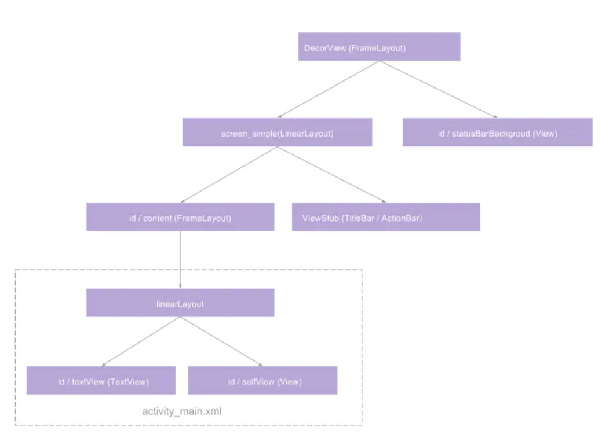
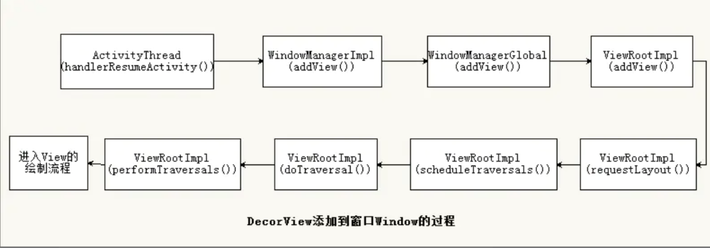

#### 1. setContentView()

在创建Activity时候,我们会通过setContentView 来将ACtivity和xml(layout进行关联),直接看源码:

```java
// ### class:Activity
// 关联xml到Activity
public void setContentView(@LayoutRes int layoutResID) {
    getWindow().setContentView(layoutResID);
    initWindowDecorActionBar();
}

private void initWindowDecorActionBar() {
        Window window = getWindow();

        // Initializing the window decor can change window feature flags.
        // Make sure that we have the correct set before performing the test below.
        window.getDecorView();

        if (isChild() || !window.hasFeature(Window.FEATURE_ACTION_BAR) || mActionBar != null) {
            return;
        }

        mActionBar = new WindowDecorActionBar(this);
        mActionBar.setDefaultDisplayHomeAsUpEnabled(mEnableDefaultActionBarUp);

        mWindow.setDefaultIcon(mActivityInfo.getIconResource());
        mWindow.setDefaultLogo(mActivityInfo.getLogoResource());
    }
```

- `initWindowDecorActionBar();`: 初始化 ActionBar

- 核心代码:`    getWindow().setContentView(layoutResID);`

```java
public Window getWindow() {
        return mWindow;
}

final void attach(Context context, ActivityThread aThread,
            Instrumentation instr, IBinder token, int ident,
            Application application, Intent intent, ActivityInfo info,
            CharSequence title, Activity parent, String id,
            NonConfigurationInstances lastNonConfigurationInstances,
            Configuration config, String referrer, IVoiceInteractor voiceInteractor,
            Window window, ActivityConfigCallback activityConfigCallback) {
       ......

        mWindow = new PhoneWindow(this, window, activityConfigCallback);
}
```

在Activity的源码中 `attch`会实例化这个`window`

这个`window`就是 `PhoneWindow`

#### 2. PhoneWindow

我们接着看phonewindow源码` getWindow().setContentView(layoutResID);`

```java
// ### class: PhoneWindow
@Override
public void setContentView(int layoutResID) {
    // Note: FEATURE_CONTENT_TRANSITIONS may be set in the process of installing the window
    // decor, when theme attributes and the like are crystalized. Do not check the feature
    // before this happens.
    if (mContentParent == null) {
        installDecor();
    } else if (!hasFeature(FEATURE_CONTENT_TRANSITIONS)) {
        mContentParent.removeAllViews();
    }

    if (hasFeature(FEATURE_CONTENT_TRANSITIONS)) {
        final Scene newScene = Scene.getSceneForLayout(mContentParent, layoutResID,
                getContext());
        transitionTo(newScene);
    } else {
        mLayoutInflater.inflate(layoutResID, mContentParent);
    }
    mContentParent.requestApplyInsets();
    final Callback cb = getCallback();
    if (cb != null && !isDestroyed()) {
        cb.onContentChanged();
    }
    mContentParentExplicitlySet = true;
}
```

这里的逻辑比较复杂且较核心:

#### 3.创建DecorView并添加至mContentParent

```java
if (mContentParent == null) {
        installDecor();
    } else if (!hasFeature(FEATURE_CONTENT_TRANSITIONS)) {
        mContentParent.removeAllViews();
    }
```

mContentParent为空时,调用installDecor():

```java
private void installDecor() {
    mForceDecorInstall = false;
  	// target1
    if (mDecor == null) {
        mDecor = generateDecor(-1);
        mDecor.setDescendantFocusability(ViewGroup.FOCUS_AFTER_DESCENDANTS);
        mDecor.setIsRootNamespace(true);
        if (!mInvalidatePanelMenuPosted && mInvalidatePanelMenuFeatures != 0) {
            mDecor.postOnAnimation(mInvalidatePanelMenuRunnable);
        }
    } else {
        mDecor.setWindow(this);
    }
    if (mContentParent == null) {
        // target2 
        mContentParent = generateLayout(mDecor);

        // Set up decor part of UI to ignore fitsSystemWindows if appropriate.
        mDecor.makeOptionalFitsSystemWindows();

        final DecorContentParent decorContentParent = (DecorContentParent) mDecor.findViewById(
                R.id.decor_content_parent);
			
      // 设置TitleView,BackGroud等资源
      // 设置有无转场动画
       ......
}
```

##### 3.1先看target1:

```
java
```


- 当decorView(mDecor)为空时候时候,实例化decorView

  ```
   protected DecorView generateDecor(int featureId) {
          // System process doesn't have application context and in that case we need to directly use
          // the context we have. Otherwise we want the application context, so we don't cling to the
          // activity.
          Context context;
          if (mUseDecorContext) {
              Context applicationContext = getContext().getApplicationContext();
              if (applicationContext == null) {
                  context = getContext();
              } else {
                  context = new DecorContext(applicationContext, getContext());
                  if (mTheme != -1) {
                      context.setTheme(mTheme);
                  }
              }
          } else {
              context = getContext();
          }
          return new DecorView(context, featureId, this, getAttributes());
      }
      
  ```

  DecorView继承自FramLayout,可以认为Activity布局的root载体

#####3.2 继续看target2

```java
    if (mContentParent == null) {
        // target2 
        mContentParent = generateLayout(mDecor);


```

首先需要明确什么是mContentParent

`// This is the view in which the window contents are placed. It is either
// mDecor itself, or a child of mDecor where the contents go.`

这是源码的注释::**这是放置Window内容的View,它或者是mDecor本身,或者是内容所在的mDecor的子元素**

接着看下面代码:

```java
 protected ViewGroup generateLayout(DecorView decor) {
        // Apply data from current theme.

        TypedArray a = getWindowStyle();

        if (false) {
        ......
        
        // 设置style是否为 window_windowNoTitle或者Window_WindowActionBar

        if (a.getBoolean(R.styleable.Window_windowNoTitle, false)) {
            requestFeature(FEATURE_NO_TITLE);
        } else if (a.getBoolean(R.styleable.Window_windowActionBar, false)) {
            // Don't allow an action bar if there is no title.
            requestFeature(FEATURE_ACTION_BAR);
        }

        ......
				// 设置是否全屏
        if (a.getBoolean(R.styleable.Window_windowFullscreen, false)) {
            setFlags(FLAG_FULLSCREEN, FLAG_FULLSCREEN & (~getForcedWindowFlags()));
        }

        ......// 加载style的逻辑省略
				
        // 根据gradle版本判断是否需要加载菜单栏
        final Context context = getContext();
        final int targetSdk = context.getApplicationInfo().targetSdkVersion;
        final boolean targetPreHoneycomb = targetSdk < android.os.Build.VERSION_CODES.HONEYCOMB;
        final boolean targetPreIcs = targetSdk < android.os.Build.VERSION_CODES.ICE_CREAM_SANDWICH;
        final boolean targetPreL = targetSdk < android.os.Build.VERSION_CODES.LOLLIPOP;
        final boolean targetHcNeedsOptions = context.getResources().getBoolean(
                R.bool.target_honeycomb_needs_options_menu);
        final boolean noActionBar = !hasFeature(FEATURE_ACTION_BAR) || hasFeature(FEATURE_NO_TITLE);

        if (targetPreHoneycomb || (targetPreIcs && targetHcNeedsOptions && noActionBar)) {
            setNeedsMenuKey(WindowManager.LayoutParams.NEEDS_MENU_SET_TRUE);
        } else {
            setNeedsMenuKey(WindowManager.LayoutParams.NEEDS_MENU_SET_FALSE);
        }

        // Inflate the window decor.

        int layoutResource;
        int features = getLocalFeatures();
        // System.out.println("Features: 0x" + Integer.toHexString(features));
        if ((features & (1 << FEATURE_SWIPE_TO_DISMISS)) != 0) {
            layoutResource = R.layout.screen_swipe_dismiss;
            setCloseOnSwipeEnabled(true);
        } else if ((features & ((1 << FEATURE_LEFT_ICON) | (1 << FEATURE_RIGHT_ICON))) != 0) {
            ...... // 加载 资源
        } else {
            // Embedded, so no decoration is needed.
          	// target3
            layoutResource = R.layout.screen_simple;
            // System.out.println("Simple!");
        }

        mDecor.startChanging();
     		.....

        ViewGroup contentParent = (ViewGroup)findViewById(ID_ANDROID_CONTENT);
        ......
        mDecor.finishChanging();

        return contentParent;
    }
```

- 首先根据style 或者设置的resource对`DecorView`进行装饰,例如全屏,titlebar等
- 为`DecorView`添加子View(同样也是ViewGroup),这里的子View就是`mContentParent`

**需要知道的是:`DecorView`是顶级View也就是rootView,其中包括状态栏,导航栏,内容区等**

**`mContentParent`是频幕显示的内容区,而我们设置的activity_main.xml布局就是其中的子集元素**

看上面的rarget3处的代码:

这是系统的顶级xml:

```xml
<LinearLayout xmlns:android="http://schemas.android.com/apk/res/android"
    android:layout_width="match_parent"
    android:layout_height="match_parent"
    android:fitsSystemWindows="true"
    android:orientation="vertical">
    <ViewStub android:id="@+id/action_mode_bar_stub"
              android:inflatedId="@+id/action_mode_bar"
              android:layout="@layout/action_mode_bar"
              android:layout_width="match_parent"
              android:layout_height="wrap_content"
              android:theme="?attr/actionBarTheme" />
    <FrameLayout
         android:id="@android:id/content"
         android:layout_width="match_parent"
         android:layout_height="match_parent"
         android:foregroundInsidePadding="false"
         android:foregroundGravity="fill_horizontal|top"
         android:foreground="?android:attr/windowContentOverlay" />
</LinearLayout>
```

然后这里的content就是我们的自定义 `activity_main.xml`的外部壳布局

```xml
<?xml version="1.0" encoding="utf-8"?>
<LinearLayout xmlns:android="http://schemas.android.com/apk/res/android"
    xmlns:app="http://schemas.android.com/apk/res-auto"
    xmlns:view_touch="http://schemas.android.com/apk/res"
    xmlns:tools="http://schemas.android.com/tools"
    android:layout_width="match_parent"
    android:layout_height="match_parent"
    tools:context=".MainActivity">

    <com.example.view_touch.MyLinearlayout
        android:layout_width="match_parent"
        android:layout_height="match_parent"
        android:gravity = "center"
        xmlns:app="http://schemas.android.com/apk/res-auto"
        >

        <com.example.view_touch.MyTextView
            android:id="@+id/my_text"
            android:layout_width="wrap_content"
            android:layout_height="wrap_content"
            android:text="Hello World!" />

    </com.example.view_touch.MyLinearlayout>
</LinearLayout>
```

下面我们用一张图来表征,系统xml和自定义xml的嵌套关系:



#### 4.PhoneWindow (下)

承接第二点继续看`setContent`的流程

```java
// ### class: PhoneWindow
@Override
public void setContentView(int layoutResID) {
    if (mContentParent == null) {
        installDecor();
    } else if (!hasFeature(FEATURE_CONTENT_TRANSITIONS)) {
        mContentParent.removeAllViews();
    }

    if (hasFeature(FEATURE_CONTENT_TRANSITIONS)) {
        final Scene newScene = Scene.getSceneForLayout(mContentParent, layoutResID,
                getContext());
        transitionTo(newScene);
    } else {
      	// target1
        mLayoutInflater.inflate(layoutResID, mContentParent);
    }
    mContentParent.requestApplyInsets();
  	// target2
    final Callback cb = getCallback();
    if (cb != null && !isDestroyed()) {
        cb.onContentChanged();
    }
    mContentParentExplicitlySet = true;
}
```

直接看target1`mLayoutInflater.inflate(layoutResID, mContentParent);`

`.inflate`有两个参数

```java
public View inflate(@LayoutRes int resource, @Nullable ViewGroup root) {
    return inflate(resource, root, root != null);
}
```

这里相当于将`activity_main.xml`转化为视图添加到`mContentParent`中

接着看target2这是一个会调的`callback`

```java
public void setCallback(Callback callback) {
    mCallback = callback;
}

/**
 * Return the current Callback interface for this window.
 */
public final Callback getCallback() {
    return mCallback;
}
public void onContentChanged() {
}
```

这是一个空的`callback`,个人认为无太大的意义,只不过调用时机实在 setContent之后,所以可以进行`findViewById`等一系列操作


当目前位置,layout的加载应结束;

**但是此时,我们的View是不可见的,因为仅仅是加载了布局,并没有对View进行任何的测量,布局,绘制工作**

后续步骤:**将DecorView添加到Window中**,经过一系列的过程**触发ViewRootImpl#performTraversals方法**,在改方法内部会正式开始测量,布局,绘制这三大流程


#### 5.将DecorView添加到Window并显示界面



