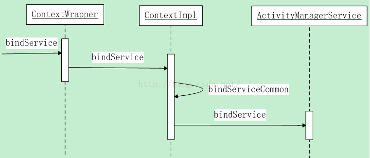
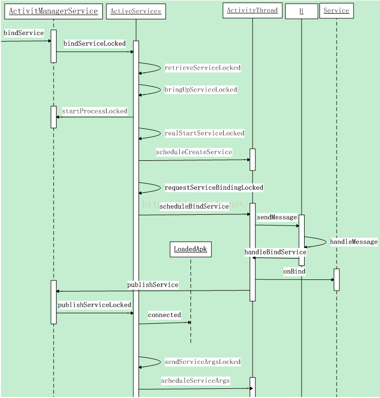

#### 1.AMS调用之前的流程图



####  2.`.bindService`

```java
// #### class  ContextWrapper
@Override
public boolean bindService(Intent service, ServiceConnection conn,
        int flags) {
    return mBase.bindService(service, conn, flags);
}
```

接着看 `Context`的实现类`class ContextImpl extends Context {`:

```java
@Override
public boolean bindService(Intent service, ServiceConnection conn,
        int flags) {
  	// log & 进程uid检测
    warnIfCallingFromSystemProcess();
    return bindServiceCommon(service, conn, flags, mMainThread.getHandler(), getUser());
}
```

```java
private boolean bindServiceCommon(Intent service, ServiceConnection conn, int flags, Handler
        handler, UserHandle user) {
    // Keep this in sync with DevicePolicyManager.bindDeviceAdminServiceAsUser.
    IServiceConnection sd;
    if (conn == null) {
        throw new IllegalArgumentException("connection is null");
    }
    
    // mPackageInfo是loadApk的实例,在构造方法中赋值
    if (mPackageInfo != null) {
    		// handler 就是 mMainThread.getHandler()  也就是ActivityThread的H类
        sd = mPackageInfo.getServiceDispatcher(conn, getOuterContext(), handler, flags);
    } else {
        throw new RuntimeException("Not supported in system context");
    }
    // 验证service的有效性  android 5.1之后不允许使用隐式调用
    validateServiceIntent(service);
    try {
        IBinder token = getActivityToken();
        if (token == null && (flags&BIND_AUTO_CREATE) == 0 && mPackageInfo != null
                && mPackageInfo.getApplicationInfo().targetSdkVersion
                < android.os.Build.VERSION_CODES.ICE_CREAM_SANDWICH) {
            flags |= BIND_WAIVE_PRIORITY;
        }
        // 准备离开app process,进入AMS进程
        service.prepareToLeaveProcess(this);
        // ActivityManager.getService()返回的是一个binder对象的远程接口,
        // 而ActivityManagerService就是他的aidl接口实现类
        // 所以之后的bindservice会走远程接口ActivityManagerService.bindService
        int res = ActivityManager.getService().bindService(
            mMainThread.getApplicationThread(), getActivityToken(), service,
            service.resolveTypeIfNeeded(getContentResolver()),
            sd, flags, getOpPackageName(), user.getIdentifier());
        if (res < 0) {
            throw new SecurityException(
                    "Not allowed to bind to service " + service);
        }
        return res != 0;
    } catch (RemoteException e) {
        throw e.rethrowFromSystemServer();
    }
}
```

- `sd = mPackageInfo.getServiceDispatcher(conn, getOuterContext(), handler, flags);`
  - loadApk类中`.getServiceDispatcher`返回的是一个 `IServiceConnection`对象,他是一个binder接口,之后传给AMS,AMS后续就是要通过这个binder对象和ServiceConnection通信的
- `ActivityManager.getService().bindService(`
  - 其实就是一个aidl的进程间通信,他会将参数  `_data`写入,然后调用`mRemote.transact`调用binder的RPC与远程的`systemService`进行通信,最终走到`system_service,`中AMS进行实现,此时`client`挂起,最终唤醒client,返回到client

#### 3.AMS之后的流程图



#### 4.AMS `.bindService`

```java
public int bindService(IApplicationThread caller, IBinder token, Intent service,
        String resolvedType, IServiceConnection connection, int flags, String callingPackage,
        int userId) throws TransactionTooLargeException {
  	// 执行根据调用者uid判断调用者不是独立进程操作
    enforceNotIsolatedCaller("bindService");

    // Refuse possible leaked file descriptors
    if (service != null && service.hasFileDescriptors() == true) {
        throw new IllegalArgumentException("File descriptors passed in Intent");
    }

    if (callingPackage == null) {
        throw new IllegalArgumentException("callingPackage cannot be null");
    }

    synchronized(this) {
       // mServices是ActiveServices
        return mServices.bindServiceLocked(caller, token, service,
                resolvedType, connection, flags, callingPackage, userId);
    }
}
```

####5. ActiveServices`.bindServiceLocked`

```java
int bindServiceLocked(IApplicationThread caller, IBinder token, Intent service,
        String resolvedType, final IServiceConnection connection, int flags,
        String callingPackage, final int userId) throws TransactionTooLargeException {
    if (DEBUG_SERVICE) Slog.v(TAG_SERVICE, "bindService: " + service
            + " type=" + resolvedType + " conn=" + connection.asBinder()
            + " flags=0x" + Integer.toHexString(flags));
  	// mAm是ActivityManagerService对象,在构造方法中完成初始化操作,通过ApplicationThread对象从
  	// AMS的成员变量mLruProcesses列表中查找启动服务的调用者
    final ProcessRecord callerApp = mAm.getRecordForAppLocked(caller);
    if (callerApp == null) {
        throw new SecurityException(
                "Unable to find app for caller " + caller
                + " (pid=" + Binder.getCallingPid()
                + ") when binding service " + service);
    }

    ActivityRecord activity = null;
    if (token != null) {
      	// 通过token将代表调用者的ActivityRecord取出
        activity = ActivityRecord.isInStackLocked(token);
        if (activity == null) {
            Slog.w(TAG, "Binding with unknown activity: " + token);
            return 0;
        }
    }

   .....

    final boolean callerFg = callerApp.setSchedGroup != ProcessList.SCHED_GROUP_BACKGROUND;
    final boolean isBindExternal = (flags & Context.BIND_EXTERNAL_SERVICE) != 0;
    final boolean allowInstant = (flags & Context.BIND_ALLOW_INSTANT) != 0;
		
  // 调用retrieveServiceLocked方法解析service,将解析结果保存在res.record中
  // 调用该方法后,为被调用者构造了对应的ServiceRecord对象
    ServiceLookupResult res =
        retrieveServiceLocked(service, resolvedType, callingPackage, Binder.getCallingPid(),
                Binder.getCallingUid(), userId, true, callerFg, isBindExternal,  		   allowInstant);
    if (res == null) {
        return 0;
    }
    if (res.record == null) {
        return -1;
    }
    ServiceRecord s = res.record;

    ......
    //可以添加关联唤醒的判断逻辑：如根据被调用者包名/类名前缀判断是否属于第三方push平台在开启服务，如果是则			//直接返回0
    //可以添加自启动的判断逻辑：如被调用者包名在禁止自启动的列表中，则直接返回0
    //另外：syncManager和JobScheduler都可以通过系统调用bindServiceAsUser把自己拉起来，故这里可以增加
    //对调用者是系统uid时候的判断逻辑：判断被调用者包名是否在禁止自启动列表中，如果在则直接返回0


    final long origId = Binder.clearCallingIdentity();

    try {
        if (unscheduleServiceRestartLocked(s, callerApp.info.uid, false)) {
            if (DEBUG_SERVICE) Slog.v(TAG_SERVICE, "BIND SERVICE WHILE RESTART PENDING: "
                    + s);
        }

        if ((flags&Context.BIND_AUTO_CREATE) != 0) {
            s.lastActivity = SystemClock.uptimeMillis();
            if (!s.hasAutoCreateConnections()) {
                // This is the first binding, let the tracker know.
                ServiceState stracker = s.getTracker();
                if (stracker != null) {
                    stracker.setBound(true, mAm.mProcessStats.getMemFactorLocked(),
                            s.lastActivity);
                }
            }
        }

        mAm.startAssociationLocked(callerApp.uid, callerApp.processName, callerApp.curProcState,
                s.appInfo.uid, s.name, s.processName);
        // Once the apps have become associated, if one of them is caller is ephemeral
        // the target app should now be able to see the calling app
        mAm.grantEphemeralAccessLocked(callerApp.userId, service,
                s.appInfo.uid, UserHandle.getAppId(callerApp.uid));
				
      
        AppBindRecord b = s.retrieveAppBindingLocked(service, callerApp);
      	// 将传进来的参数封装成一个ConnectionRecord,connection也是一个binder对象
        ConnectionRecord c = new ConnectionRecord(b, activity,
                connection, flags, clientLabel, clientIntent);

        IBinder binder = connection.asBinder();
        ArrayList<ConnectionRecord> clist = s.connections.get(binder);
        if (clist == null) {
            clist = new ArrayList<ConnectionRecord>();
            s.connections.put(binder, clist);
        }
      	// 多种方式保存ConnectionRecord对象c方便后序取出
        clist.add(c);
        b.connections.add(c);
        if (activity != null) {
            if (activity.connections == null) {
                activity.connections = new HashSet<ConnectionRecord>();
            }
            activity.connections.add(c);
        }
        b.client.connections.add(c);
        if ((c.flags&Context.BIND_ABOVE_CLIENT) != 0) {
            b.client.hasAboveClient = true;
        }
        if ((c.flags&Context.BIND_ALLOW_WHITELIST_MANAGEMENT) != 0) {
            s.whitelistManager = true;
        }
        if (s.app != null) {
            updateServiceClientActivitiesLocked(s.app, c, true);
        }
        clist = mServiceConnections.get(binder);
        if (clist == null) {
            clist = new ArrayList<ConnectionRecord>();
            mServiceConnections.put(binder, clist);
        }
        clist.add(c);

        if ((flags&Context.BIND_AUTO_CREATE) != 0) {
            s.lastActivity = SystemClock.uptimeMillis();
          	// 参数为BIND_AUTO_CREATE时,启动服务
            if (bringUpServiceLocked(s, service.getFlags(), callerFg, false,
                    permissionsReviewRequired) != null) {
                return 0;
            }
        }

        if (s.app != null) {
            if ((flags&Context.BIND_TREAT_LIKE_ACTIVITY) != 0) {
                s.app.treatLikeActivity = true;
            }
            if (s.whitelistManager) {
                s.app.whitelistManager = true;
            }
            // This could have made the service more important.
            mAm.updateLruProcessLocked(s.app, s.app.hasClientActivities
                    || s.app.treatLikeActivity, b.client);
            mAm.updateOomAdjLocked(s.app, true);
        }

        if (DEBUG_SERVICE) Slog.v(TAG_SERVICE, "Bind " + s + " with " + b
                + ": received=" + b.intent.received
                + " apps=" + b.intent.apps.size()
                + " doRebind=" + b.intent.doRebind);

        if (s.app != null && b.intent.received) {
            // Service is already running, so we can immediately
            // publish the connection.
            try {
              	// 如果服务已经运行直接执行链接成功的会调
                c.conn.connected(s.name, b.intent.binder, false);
            } catch (Exception e) {
                Slog.w(TAG, "Failure sending service " + s.shortName
                        + " to connection " + c.conn.asBinder()
                        + " (in " + c.binding.client.processName + ")", e);
            }

            // If this is the first app connected back to this binding,
            // and the service had previously asked to be told when
            // rebound, then do so.
            if (b.intent.apps.size() == 1 && b.intent.doRebind) {
                requestServiceBindingLocked(s, b.intent, callerFg, true);
            }
        } else if (!b.intent.requested) {
          	// 绑定该service
            requestServiceBindingLocked(s, b.intent, callerFg, false);
        }

        getServiceMapLocked(s.userId).ensureNotStartingBackgroundLocked(s);

    } finally {
        Binder.restoreCallingIdentity(origId);
    }

    return 1;
}
```

接着看绑定服务的流程:

#### 6.ActiveServices.`requestServiceBindingLocked`

```java
private final boolean requestServiceBindingLocked(ServiceRecord r, IntentBindRecord i,
        boolean execInFg, boolean rebind) throws TransactionTooLargeException {
    if (r.app == null || r.app.thread == null) {
        // If service is not currently running, can't yet bind.
        return false;
    }
    if (DEBUG_SERVICE) Slog.d(TAG_SERVICE, "requestBind " + i + ": requested=" + i.requested
            + " rebind=" + rebind);
    if ((!i.requested || rebind) && i.apps.size() > 0) {
        try {
            bumpServiceExecutingLocked(r, execInFg, "bind");
            r.app.forceProcessStateUpTo(ActivityManager.PROCESS_STATE_SERVICE);
          	// 通过AppThread这个binder接口调用ActivityThread的scheduleBindService
            r.app.thread.scheduleBindService(r, i.intent.getIntent(), rebind,
                    r.app.repProcState);
            if (!rebind) {
                i.requested = true;
            }
            i.hasBound = true;
            i.doRebind = false;
        } catch (TransactionTooLargeException e) {
            // Keep the executeNesting count accurate.
            if (DEBUG_SERVICE) Slog.v(TAG_SERVICE, "Crashed while binding " + r, e);
            final boolean inDestroying = mDestroyingServices.contains(r);
            serviceDoneExecutingLocked(r, inDestroying, inDestroying);
            throw e;
        } catch (RemoteException e) {
            if (DEBUG_SERVICE) Slog.v(TAG_SERVICE, "Crashed while binding " + r);
            // Keep the executeNesting count accurate.
            final boolean inDestroying = mDestroyingServices.contains(r);
            serviceDoneExecutingLocked(r, inDestroying, inDestroying);
            return false;
        }
    }
    return true;
}
```

通过binder驱动程序调用ActivityThread的scheduleBindService

#### 7.ActivityThread `.scheduleBindService`

```JAVA
public final void scheduleBindService(IBinder token, Intent intent,
        boolean rebind, int processState) {
    updateProcessState(processState, false);
    BindServiceData s = new BindServiceData();
    s.token = token;
    s.intent = intent;
    s.rebind = rebind;

    if (DEBUG_SERVICE)
        Slog.v(TAG, "scheduleBindService token=" + token + " intent=" + intent + " uid="
                + Binder.getCallingUid() + " pid=" + Binder.getCallingPid());
    sendMessage(H.BIND_SERVICE, s);
}
```

最后会调ActivityThread中H类

#### 8.Activity `class H`

```java
class H extends Handler {
    ........
    public void handleMessage(Message msg) {
        if (DEBUG_MESSAGES) Slog.v(TAG, ">>> handling: " + codeToString(msg.what));
        switch (msg.what) {
       			.......
            case BIND_SERVICE:
                Trace.traceBegin(Trace.TRACE_TAG_ACTIVITY_MANAGER, "serviceBind");
                handleBindService((BindServiceData)msg.obj);
                Trace.traceEnd(Trace.TRACE_TAG_ACTIVITY_MANAGER);
                break;
       			......
        }
        Object obj = msg.obj;
        if (obj instanceof SomeArgs) {
            ((SomeArgs) obj).recycle();
        }
        if (DEBUG_MESSAGES) Slog.v(TAG, "<<< done: " + codeToString(msg.what));
    }
}
```

然后继续看`handleMessage`

#### 9.ActivityThread `.handleMessage`

```java
private void handleBindService(BindServiceData data) {
    Service s = mServices.get(data.token);
    if (DEBUG_SERVICE)
        Slog.v(TAG, "handleBindService s=" + s + " rebind=" + data.rebind);
    if (s != null) {
        try {
            data.intent.setExtrasClassLoader(s.getClassLoader());
            data.intent.prepareToEnterProcess();
            try {
                if (!data.rebind) {
                  	// 回调service的onBind
                    IBinder binder = s.onBind(data.intent);
                  	// 通知AMS服务连接成功
                    ActivityManager.getService().publishService(
                            data.token, data.intent, binder);
                } else {
                    s.onRebind(data.intent);
                    ActivityManager.getService().serviceDoneExecuting(
                            data.token, SERVICE_DONE_EXECUTING_ANON, 0, 0);
                }
                ensureJitEnabled();
            } catch (RemoteException ex) {
                throw ex.rethrowFromSystemServer();
            }
        } catch (Exception e) {
            if (!mInstrumentation.onException(s, e)) {
                throw new RuntimeException(
                        "Unable to bind to service " + s
                        + " with " + data.intent + ": " + e.toString(), e);
            }
        }
    }
}
```

服务连接成功之后,通知AMS服务连接成功;

#### 10.AMS`.publishService`

```java
public void publishService(IBinder token, Intent intent, IBinder service) {
    // Refuse possible leaked file descriptors
    if (intent != null && intent.hasFileDescriptors() == true) {
        throw new IllegalArgumentException("File descriptors passed in Intent");
    }

    synchronized(this) {
        if (!(token instanceof ServiceRecord)) {
            throw new IllegalArgumentException("Invalid service token");
        }
        mServices.publishServiceLocked((ServiceRecord)token, intent, service);
    }
}
```

继续看ActiveServices中的`publishServiceLocked`

#### 11.ActiveServices `.publishServiceLocked`

```java
void publishServiceLocked(ServiceRecord r, Intent intent, IBinder service) {
    final long origId = Binder.clearCallingIdentity();
    try {
        if (DEBUG_SERVICE) Slog.v(TAG_SERVICE, "PUBLISHING " + r
                + " " + intent + ": " + service);
        if (r != null) {
            Intent.FilterComparison filter
                    = new Intent.FilterComparison(intent);
            IntentBindRecord b = r.bindings.get(filter);
            if (b != null && !b.received) {
                b.binder = service;
                b.requested = true;
                b.received = true;
                for (int conni=r.connections.size()-1; conni>=0; conni--) {
                    ArrayList<ConnectionRecord> clist = r.connections.valueAt(conni);
                    for (int i=0; i<clist.size(); i++) {
                        ConnectionRecord c = clist.get(i);
                        if (!filter.equals(c.binding.intent.intent)) {
                            if (DEBUG_SERVICE) Slog.v(
                                    TAG_SERVICE, "Not publishing to: " + c);
                            if (DEBUG_SERVICE) Slog.v(
                                    TAG_SERVICE, "Bound intent: " + c.binding.intent.intent);
                            if (DEBUG_SERVICE) Slog.v(
                                    TAG_SERVICE, "Published intent: " + intent);
                            continue;
                        }
                        if (DEBUG_SERVICE) Slog.v(TAG_SERVICE, "Publishing to: " + c);
                        try {
                          	// 执行连接成功回调,c.conn是IServiceConnection类型
                          	// 执行LoadedApk.ServiceDispatcher.InnerConnecttion.connected方
                          	// 法回调
                            c.conn.connected(r.name, service, false);
                        } catch (Exception e) {
                            Slog.w(TAG, "Failure sending service " + r.name +
                                  " to connection " + c.conn.asBinder() +
                                  " (in " + c.binding.client.processName + ")", e);
                        }
                    }
                }
            }

            serviceDoneExecutingLocked(r, mDestroyingServices.contains(r), false);
        }
    } finally {
        Binder.restoreCallingIdentity(origId);
    }
}
```

#### 12.LoadApk`.ServiceDispatcher.InnerConnection.connected`

```java
// InnerConnection
public void connected(ComponentName name, IBinder service, boolean dead)
        throws RemoteException {
    LoadedApk.ServiceDispatcher sd = mDispatcher.get();
    if (sd != null) {
      	// 调用ServiceDispatcher中的connected
        sd.connected(name, service, dead);
    }
}


public void connected(ComponentName name, IBinder service, boolean dead) {
            if (mActivityThread != null) {
              	// mActivityThread是一个Handler的实例
              	// 调用它的post方法后,就会把一个消息加入到ActivityThread的消息队列中
                mActivityThread.post(new RunConnection(name, service, 0, dead));
            } else {
                doConnected(name, service, dead);
            }
        }

 private final class RunConnection implements Runnable {
         ......
            public void run() {
                if (mCommand == 0) {
                  	// 执行连接成功操作
                    doConnected(mName, mService, mDead);
                } else if (mCommand == 1) {
                    doDeath(mName, mService);
                }
            }

          ......
        }

public void doConnected(ComponentName name, IBinder service, boolean dead) {
            ServiceDispatcher.ConnectionInfo old;
            ServiceDispatcher.ConnectionInfo info;

            synchronized (this) {
                if (mForgotten) {
                    // We unbound before receiving the connection; ignore
                    // any connection received.
                    return;
                }
                old = mActiveConnections.get(name);
                if (old != null && old.binder == service) {
                    // Huh, already have this one.  Oh well!
                    return;
                }

                if (service != null) {
                    // A new service is being connected... set it all up.
                    info = new ConnectionInfo();
                    info.binder = service;
                    info.deathMonitor = new DeathMonitor(name, service);
                    try {
                      	// 给Service设置死亡代理
                        service.linkToDeath(info.deathMonitor, 0);
                        mActiveConnections.put(name, info);
                    } catch (RemoteException e) {
                        // This service was dead before we got it...  just
                        // don't do anything with it.
                        mActiveConnections.remove(name);
                        return;
                    }

                } else {
                    // The named service is being disconnected... clean up.
                    mActiveConnections.remove(name);
                }

                if (old != null) {
                  	// service死亡时候通知死亡代理
                    old.binder.unlinkToDeath(old.deathMonitor, 0);
                }
            }

            // If there was an old service, it is now disconnected.
            if (old != null) {
              	// 回调  ServiceConnection的onServiceDisconnected
                mConnection.onServiceDisconnected(name);
            }
            if (dead) {
                mConnection.onBindingDied(name);
            }
            // If there is a new viable service, it is now connected.
            if (service != null) {
              	// 回调  ServiceConnection的onServiceConnected
                mConnection.onServiceConnected(name, service);
            } else {
                // The binding machinery worked, but the remote returned null from onBind().
                mConnection.onNullBinding(name);
            }
        }
```