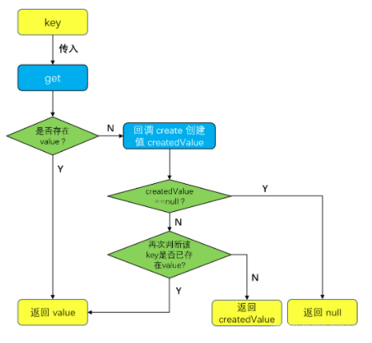
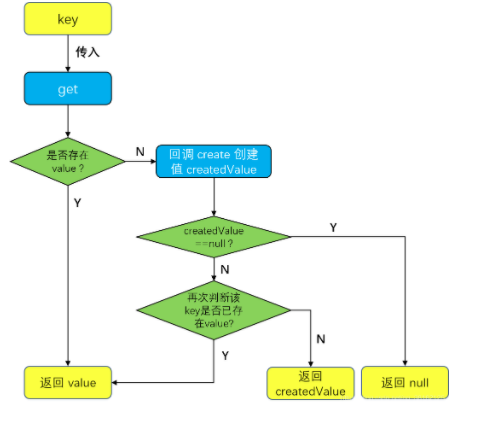

#### 1. 概述

LruCache 是一种内存缓存算法，全称为 Least Recently Used，即近期最少使用算法。当我们需要对一些数据进行缓存以便下次进行展示时，我们就可以考虑使用该类进行相关数据的缓存。它比较普遍的使用场景是对从网络中下载下来的图片进行缓存，一来可以节省再次加载时的网络资源消耗，二来可以提高再次加载时的速度，可见它还是非常有用的。

- 它是一个持有强引用类型的缓存。
- 每当访问缓存的值时，被访问值就会移动到缓存队列的头部。
- 当缓存队列存满时，它就会将队列尾部，也就是最不常被访问的值踢出去，以便保存新值。

而对于该算法的实现，其实没有想象中的那么复杂，这要归功于 **LinkedHashMap**，其实 LruCache 内部就是维护了一个 LinkedHashMap 的成员，通过对 LinkedHashMap 的操作，可以很简单地实现近期最少使用算法。接下来，笔者会对 LruCache 的使用进行举例，然后再对源码进行分析。


#### 2.LruCache的基本使用

##### 2.1 LruCache的初始化

```java
int maxMemory = (int) (Runtime.getRuntime().maxMemory() / 1024);
// 总容量大小占整体内存的1/8
int cacheSize = maxMemory / 8;
LruCache<String, Bitmap> cache = new LruCache<String, Bitmap>(cacheSize){
    @Override
    protected int sizeOf(@NonNull String key, @NonNull Bitmap value) {
        return value.getRowBytes() * value.getHeight();
    }
};
```

构造中传入的`cacheSize`就是缓存的大小

`sizeOf`是一个匿名内部类我们返回了bitmap的字节数,这个方法不重写默认返回1

`lruCache`内部维护了一个LinkedHashMap成员,根据其操作可以实现近期最少使用算法,所以他的存储是key-value的形式

##### 2.2 读写缓存

```java
        // 添加操作
        cache.put("tag_mao",bitmap);
        // 获取操作
        Bitmap tag_mao = cache.get("tag_mao");
        // 删除操作
        cache.remove("tag_mao");
        
```

通过 `LruCache#get` 方法，传入对应的 `key` 值，就可以读到我们之前的缓存了，要注意 `key` 值不能为空，并且在取得 `Bitmap` 的值之后应当进行非空判断才能使用，因为 `get` 方法有可能会返回 `null`。

##### 2.3 create

这个方法默认的返回值是 `null`，它是在 `get` 方法内部被调用的，如果在 LruCache 内部没有 `get` 方法传入的 key 所对应的值时，就会通过回调 `create` 方法来创建该 key 的值` createdValue`，需要注意的是如果此时该 key 值在 `create` 创建完该值之前恰好通过 put 方法缓存入了一个该 key 的新值，那么` createdValue` 就会和这个新值发生冲突，这时候的决策是放弃 `create` 方法产生的值。

它的回调流程可如下图所示：


##### 2.4 entryRemoved

这个方法默认是空实现:

`protected void entryRemoved(boolean evicted, K key, V oldValue, V newValue) {}`

第一个参数 evicted 是一个标志位，为 true 表示该缓存值要被移除，为 false表示该缓存值要被替换。
第二个参数表示的是要替换或者移除的 key 值。
第三个参数表示的是要替换或者移除的缓存值。
第四个参数表示的是要替换的新值，这个参数只有在 evicted 为 false 时才不为空。
**即如果缓存值中所持有的资源如果很明确地需要被释放掉，那么我们就可以重写该方法。它会在如下场景中被回调：**

- **key重复**在调用 LruCache#put 缓存一个新值时，如果该 key 已经存在于缓存队列中的话，就会回调该方法，回调传入的值为 entryRemoved(flase, key, oldValue, newValue)。

- **create时候key已经存在**在回调 create 方法产生一个新值时，如果 create 所产生的值 createdValue 所对应的 key 已经存在于缓存队列中了，也会回调该方法，回调传入的值为 entryRemoved(false, key, createdValue, mapValue)。

- **缓存满**当对缓存区由于缓存已满进行清理的时候，也会回调该方法，此时传入的值是 entryRemoved( true, key, value, null)，其中 key 和 value 代表被移除的键值对。

- **移除某个键值对**当我们调用 LruCache#remove 移除某个键值对时，只要该键值对的值不为空，就会回调该方法，此时传入的值是：entryRemoved(false, key, previous, null)。

### 源码分析

#### 1.LruCache成员

```java
public class LruCache<K, V> {
    private final LinkedHashMap<K, V> map;  // 缓存键值对的map
    private int size; // 已经缓存的大小
    private int maxSize; // 最大缓存值
  
    private int putCount; // put方法调用的次数
    private int createCount; // 通过create方法产生的缓存值的数量
    private int evictionCount; //由于缓存溢出时候移除的缓存数量
    private int hitCount; // 查找缓存的命中次数
    private int missCount; // 查找缓存的未命中次数
```


`map`是一个LinkedHashMap,用于缓存我们的键值对,他是LruCache的关键

`size`记录当前缓存的大小

`maxSize`记录最大缓存值,他的值在构造中传入


#### 2.LruCache构造

```java
public LruCache(int maxSize) {
  	// 最大缓存设置 小于0抛出异常
    if (maxSize <= 0) {
        throw new IllegalArgumentException("maxSize <= 0");
    } else {
      	// 通过入参设置最大缓存大小
        this.maxSize = maxSize;
      	// 初始化LinkedHashMap成员
      	//  第三个参数设置为true就是顺序访问
        this.map = new LinkedHashMap(0, 0.75F, true);
    }
}
```


#### 3. put

```java
@Nullable
public final V put(@NonNull K key, @NonNull V value) {
    if (key != null && value != null) {
        Object previous;
        synchronized(this) {
          	// 计算putCount
            ++this.putCount;
          	// 1.计算当前缓存
            this.size += this.safeSizeOf(key, value);
          	// put到LinkedHashMap
            previous = this.map.put(key, value);
          	// 返回previous不为null说明key已经存在  --- 减去之前加上的缓存
            if (previous != null) {
                this.size -= this.safeSizeOf(key, previous);
            }
        }
				// 已经存在就调用entryRemoved
        if (previous != null) {
            this.entryRemoved(false, key, previous, value);
        }
				// 2.检查是否需要调整缓存
        this.trimToSize(this.maxSize);
        return previous;
    } else {
        throw new NullPointerException("key == null || value == null");
    }
}
```

`1.计算当前缓存`

```java
private int safeSizeOf(K key, V value) {
  	// 调用  sizeOf进行计算 我们自己实现计算 计算bitmap大小
    int result = this.sizeOf(key, value);
    if (result < 0) {
        throw new IllegalStateException("Negative size: " + key + "=" + value);
    } else {
        return result;
    }
}
```

` 2.检查是否需要调整缓存`

```java
public void trimToSize(int maxSize) {
    while(true) {
        Object key;
        Object value;
        synchronized(this) {
          	// 如果size < 0 map为空抛出异常
            if (this.size < 0 || this.map.isEmpty() && this.size != 0) {
                throw new IllegalStateException(this.getClass().getName() + ".sizeOf() is reporting inconsistent results!");
            }
						// 没有达到最大内存就不调整
            if (this.size <= maxSize || this.map.isEmpty()) {
                return;
            }
						// 无限循环 remove-map的元素
            Entry<K, V> toEvict = (Entry)this.map.entrySet().iterator().next();
            key = toEvict.getKey();
            value = toEvict.getValue();
            this.map.remove(key);
            this.size -= this.safeSizeOf(key, value);
            ++this.evictionCount;
        }
				// 回调entryRemoved
        this.entryRemoved(true, key, value, (Object)null);
    }
}
```

#### 4. get

```java
@Nullable
public final V get(@NonNull K key) {
  	
    if (key == null) {
      	// key为空抛出异常
        throw new NullPointerException("key == null");
    } else {
        Object mapValue;
        synchronized(this) {
          	// 从map中get元素 mapValue返回接收
            mapValue = this.map.get(key);
            if (mapValue != null) {
                ++this.hitCount;
                return mapValue;
            }

            ++this.missCount;
        }
				// 如果 mapValue为空 说明map中没有对应的键值对
        V createdValue = this.create(key);
        if (createdValue == null) {
          	// 如果为空就返回
            return null;
        } else {
            synchronized(this) {
                ++this.createCount;
              	// 不为空将其键值对加入map -- 返回不为空就是键值对已经存在
                mapValue = this.map.put(key, createdValue);
                if (mapValue != null) {
                  	// 如果此时有键值对存入就舍弃mapValue  重新替换 
                  	// 当你create时候其他线程传入键值对
                    this.map.put(key, mapValue);
                } else {
                    this.size += this.safeSizeOf(key, createdValue);
                }
            }

            if (mapValue != null) {
              	// 已经存在键值对,回调entryRemoved
                this.entryRemoved(false, key, createdValue, mapValue);
                return mapValue;
            } else {
              	// 调用缓存调整
                this.trimToSize(this.maxSize);
                return createdValue;
            }
        }
    }
}
```



#### 5. 总结


LruCache 全称 Least Recently Used，即最近最少使用算法。
LruCache 构造方法传入的是最大缓存的大小，我们可以选择是否对它的 sizeOf 方法进行重写，推荐重写。
LruCache 其实就是通过内部维护一个 LinkedHashMap 进行缓存的维护，将 LinkedHashMap 初始化为访问顺序迭代的方式，从而很容易地实现了最近最少使用的思想。
LruCache 的 put/get 方法实际上就是调用了 LinkedHashMap 对象的 put/get 方法，只不过在方法内部还做了些额外的工作，例如在 put 方法最后会调用 trimToSize 进行缓存的调整，而 get 方法则是会在得到的 value 为空时尝试通过 create 方法进行赋值，这个方法的默认实现为空，可在子类中重写。
