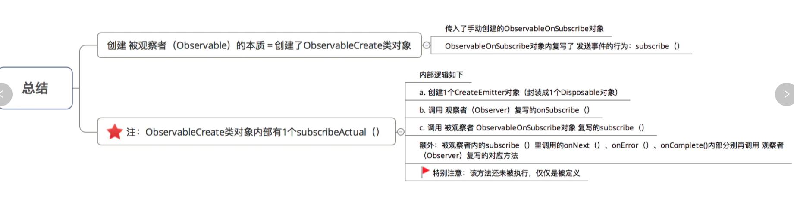
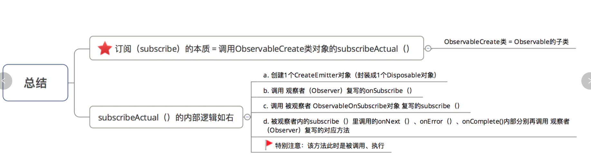
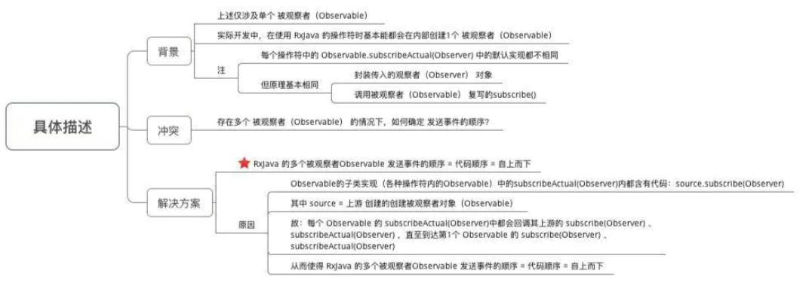

#### 1.RxJava使用

`RxJava`的订阅流程 使用方式 = 基于事件流的链式调用，具体步骤如下：

 步骤1：创建被观察者`(Observable)`& 定义需发送的事件
 步骤2：创建观察者`(Observer)` & 定义响应事件的行为
 步骤3：通过订阅`（subscribe）`连接观察者和被观察者

```java
Observable.create(new ObservableOnSubscribe<Integer>() {
    // 1. 创建被观察者(Observable) & 定义需发送的事件
    @Override
    public void subscribe(ObservableEmitter<Integer> emitter) throws Exception {
        emitter.onNext(1);
        emitter.onNext(2);
        emitter.onNext(3);
        emitter.onComplete();
    }
}).subscribe(new Observer<Integer>() {


    @Override
    public void onSubscribe(Disposable d) {
        Log.d("TAG", "开始采用subscribe连接");
    }

    @Override
    public void onNext(Integer integer) {
        Log.d("TAG", "对Next事件"+ integer +"作出响应"  );
    }

    @Override
    public void onError(Throwable e) {
        Log.d("TAG", "对Error事件作出响应");
    }

    @Override
    public void onComplete() {
        Log.d("TAG", "对Complete事件作出响应");
    }
});
```

###源码分析

#### 1.被观察者创建`create`:

```java
Observable.create(new ObservableOnSubscribe<Integer>() {
    // 1. 创建被观察者(Observable) & 定义需发送的事件
    @Override
    public void subscribe(ObservableEmitter<Integer> emitter) throws Exception {
        emitter.onNext(1);
        emitter.onNext(2);
        emitter.onNext(3);
        emitter.onComplete();
    }
})
```

```java
@CheckReturnValue
@SchedulerSupport(SchedulerSupport.NONE)
public static <T> Observable<T> create(ObservableOnSubscribe<T> source) {
    ObjectHelper.requireNonNull(source, "source is null");
  	// sourece就是我们传入的ObservableOnSubscribe
    return RxJavaPlugins.onAssembly(new ObservableCreate<T>(source));
}
```

```java
public final class ObservableCreate<T> extends Observable<T> {
    final ObservableOnSubscribe<T> source;
		// 传入 source对象 ObservableOnSubscribe
    public ObservableCreate(ObservableOnSubscribe<T> source) {
        this.source = source;
    }
		
  	// 重点关注: 复写了subscribeActual
  	// 订阅时候,通过接口回调,调用被观察者Observable与观察者Observer的方法
    @Override
    protected void subscribeActual(Observer<? super T> observer) {
      	// 1. 创建一个CreateEmitter对象,封装成一个Disposable对象
      	// 作用:反射事件  --- 传入观察者
        CreateEmitter<T> parent = new CreateEmitter<T>(observer);
      	// 调用观察者(Observer)的onSubscribe
      	// 对象需要自己实现
        observer.onSubscribe(parent);

        try {
          	// 调用source对象的subscribe
          	// source对象 就是被观察者传入的ObservableOnSubscribe
          	// 调用subscribe的实现
            source.subscribe(parent);
        } catch (Throwable ex) {
            Exceptions.throwIfFatal(ex);
            parent.onError(ex);
        }
    }
		
  	// observer实现subscribe中方法最终的调用者
    static final class CreateEmitter<T>
    extends AtomicReference<Disposable>
    implements ObservableEmitter<T>, Disposable {


        private static final long serialVersionUID = -3434801548987643227L;

        final Observer<? super T> observer;

        CreateEmitter(Observer<? super T> observer) {
            this.observer = observer;
        }
				
      	// 回调onNext
        @Override
        public void onNext(T t) {
            if (t == null) {
                onError(new NullPointerException("onNext called with null. Null values are generally not allowed in 2.x operators and sources."));
                return;
            }
            if (!isDisposed()) {
                observer.onNext(t);
            }
        }
				
      	// 回调onError
        @Override
        public void onError(Throwable t) {
            if (!tryOnError(t)) {
                RxJavaPlugins.onError(t);
            }
        }

        @Override
        public boolean tryOnError(Throwable t) {
            if (t == null) {
                t = new NullPointerException("onError called with null. Null values are generally not allowed in 2.x operators and sources.");
            }
            if (!isDisposed()) {
                try {
                    observer.onError(t);
                } finally {
                    dispose();
                }
                return true;
            }
            return false;
        }
				
      	// 回调onComplete
        @Override
        public void onComplete() {
            if (!isDisposed()) {
                try {
                    observer.onComplete();
                } finally {
                    dispose();
                }
            }
        }
```

当前步骤的流程图



#### 2. 创建观察者&定义响应事件的行为

```java
subscribe(new Observer<Integer>() {


    @Override
    public void onSubscribe(Disposable d) {
        Log.d("TAG", "开始采用subscribe连接");
    }

    @Override
    public void onNext(Integer integer) {
        Log.d("TAG", "对Next事件"+ integer +"作出响应"  );
    }

    @Override
    public void onError(Throwable e) {
        Log.d("TAG", "对Error事件作出响应");
    }

    @Override
    public void onComplete() {
        Log.d("TAG", "对Complete事件作出响应");
    }
});
```

```java
public interface Observer<T> {

    /**
     * Provides the Observer with the means of cancelling (disposing) the
     * connection (channel) with the Observable in both
     * synchronous (from within {@link #onNext(Object)}) and asynchronous manner.
     * @param d the Disposable instance whose {@link Disposable#dispose()} can
     * be called anytime to cancel the connection
     * @since 2.0
     */
    void onSubscribe(@NonNull Disposable d);

    /**
     * Provides the Observer with a new item to observe.
     * <p>
     * The {@link Observable} may call this method 0 or more times.
     * <p>
     * The {@code Observable} will not call this method again after it calls either {@link #onComplete} or
     * {@link #onError}.
     *
     * @param t
     *          the item emitted by the Observable
     */
    void onNext(@NonNull T t);

    /**
     * Notifies the Observer that the {@link Observable} has experienced an error condition.
     * <p>
     * If the {@link Observable} calls this method, it will not thereafter call {@link #onNext} or
     * {@link #onComplete}.
     *
     * @param e
     *          the exception encountered by the Observable
     */
    void onError(@NonNull Throwable e);

    /**
     * Notifies the Observer that the {@link Observable} has finished sending push-based notifications.
     * <p>
     * The {@link Observable} will not call this method if it calls {@link #onError}.
     */
    void onComplete();

}
```

就是这四个接口方法,我们自己去实现

```java
@Override
public void onSubscribe(Disposable d) {
    Log.d("TAG", "开始采用subscribe连接");
}

@Override
public void onNext(Integer integer) {
    Log.d("TAG", "对Next事件"+ integer +"作出响应"  );
}

@Override
public void onError(Throwable e) {
    Log.d("TAG", "对Error事件作出响应");
}

@Override
public void onComplete() {
    Log.d("TAG", "对Complete事件作出响应");
}
```

#### 3. 通过订阅连接观察者和被观察者

```java
subscribe(new Observer<Integer>() {


    @Override
    public void onSubscribe(Disposable d) {
        Log.d("TAG", "开始采用subscribe连接");
    }

    @Override
    public void onNext(Integer integer) {
        Log.d("TAG", "对Next事件"+ integer +"作出响应"  );
    }

    @Override
    public void onError(Throwable e) {
        Log.d("TAG", "对Error事件作出响应");
    }

    @Override
    public void onComplete() {
        Log.d("TAG", "对Complete事件作出响应");
    }
});
```

```java
@SchedulerSupport(SchedulerSupport.NONE)
@Override
public final void subscribe(Observer<? super T> observer) {
    ObjectHelper.requireNonNull(observer, "observer is null");
    try {
        observer = RxJavaPlugins.onSubscribe(this, observer);

        ObjectHelper.requireNonNull(observer, "Plugin returned null Observer");

        subscribeActual(observer);
    } catch (NullPointerException e) { // NOPMD
        throw e;
    } catch (Throwable e) {
        Exceptions.throwIfFatal(e);
        // can't call onError because no way to know if a Disposable has been set or not
        // can't call onSubscribe because the call might have set a Subscription already
        RxJavaPlugins.onError(e);

        NullPointerException npe = new NullPointerException("Actually not, but can't throw other exceptions due to RS");
        npe.initCause(e);
        throw npe;
    }
}
```

```java
protected abstract void subscribeActual(Observer<? super T> observer);
```

最后回到被观察者的`subscribeActual`

```java
@Override
protected void subscribeActual(Observer<? super T> observer) {
    CreateEmitter<T> parent = new CreateEmitter<T>(observer);
    observer.onSubscribe(parent);

    try {
        source.subscribe(parent);
    } catch (Throwable ex) {
        Exceptions.throwIfFatal(ex);
        parent.onError(ex);
    }
}
```

这样就完成了订阅



