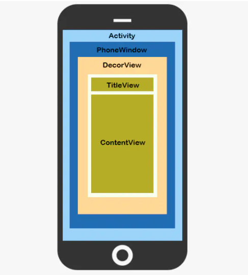
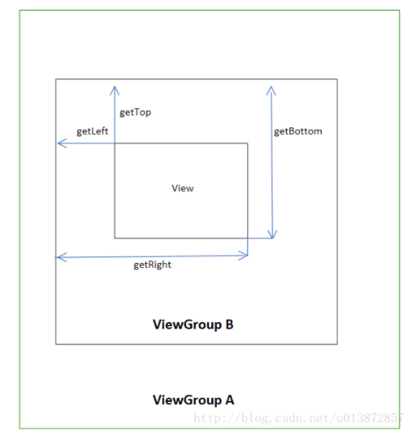

#### 1. 概述

首先来看一张图:



承接AMS启动源码,接着往下看

#### 2.ActivityThread.handleResumeActivity<UI入口>

`System_server`通过binder进程间通信会调用`app进程`,通过H类接收msg然后调用`ActivityThread`的`handleLauncherActivity`

但是Activity的UI绘制是从onResume开始的.所以UI的绘制入口是`ActivityThread.handleResumeActivity`

```java
@Override
public void handleResumeActivity(IBinder token, boolean finalStateRequest, boolean isForward,
        String reason) {
    ......
    // 执行Activity OnResume()
    final ActivityClientRecord r = performResumeActivity(token, finalStateRequest, reason);
   	......
    final Activity a = r.activity;

    ......
    boolean willBeVisible = !a.mStartedActivity;
    if (!willBeVisible) {
        try {
            willBeVisible = ActivityManager.getService().willActivityBeVisible(
                    a.getActivityToken());
        } catch (RemoteException e) {
            throw e.rethrowFromSystemServer();
        }
    }
    if (r.window == null && !a.mFinished && willBeVisible) {
        r.window = r.activity.getWindow(); // PhoneWindow
        View decor = r.window.getDecorView(); // DecorView
        decor.setVisibility(View.INVISIBLE);
        ViewManager wm = a.getWindowManager(); // 获取WindowManager
        WindowManager.LayoutParams l = r.window.getAttributes();
        a.mDecor = decor;
        l.type = WindowManager.LayoutParams.TYPE_BASE_APPLICATION;
        l.softInputMode |= forwardBit;
        if (r.mPreserveWindow) {
            a.mWindowAdded = true;
            r.mPreserveWindow = false;
            // Normally the ViewRoot sets up callbacks with the Activity
            // in addView->ViewRootImpl#setView. If we are instead reusing
            // the decor view we have to notify the view root that the
            // callbacks may have changed.
            ViewRootImpl impl = decor.getViewRootImpl();  // 获取ViewRootImpl
            if (impl != null) {
                impl.notifyChildRebuilt();
            }
        }
        if (a.mVisibleFromClient) {
            if (!a.mWindowAdded) {
                a.mWindowAdded = true;
                wm.addView(decor, l);
            } else {
                // The activity will get a callback for this {@link LayoutParams} change
                // earlier. However, at that time the decor will not be set (this is set
                // in this method), so no action will be taken. This call ensures the
                // callback occurs with the decor set.
                a.onWindowAttributesChanged(l);
            }
        }

        // If the window has already been added, but during resume
        // we started another activity, then don't yet make the
        // window visible.
    } else if (!willBeVisible) {
        if (localLOGV) Slog.v(TAG, "Launch " + r + " mStartedActivity set");
        r.hideForNow = true;
    }

    // Get rid of anything left hanging around.
    cleanUpPendingRemoveWindows(r, false /* force */);

    // The window is now visible if it has been added, we are not
    // simply finishing, and we are not starting another activity.
    if (!r.activity.mFinished && willBeVisible && r.activity.mDecor != null && !r.hideForNow) {
        if (r.newConfig != null) {
            performConfigurationChangedForActivity(r, r.newConfig);
            if (DEBUG_CONFIGURATION) {
                Slog.v(TAG, "Resuming activity " + r.activityInfo.name + " with newConfig "
                        + r.activity.mCurrentConfig);
            }
            r.newConfig = null;
        }
        if (localLOGV) Slog.v(TAG, "Resuming " + r + " with isForward=" + isForward);
        WindowManager.LayoutParams l = r.window.getAttributes();
        if ((l.softInputMode
                & WindowManager.LayoutParams.SOFT_INPUT_IS_FORWARD_NAVIGATION)
                != forwardBit) {
            l.softInputMode = (l.softInputMode
                    & (~WindowManager.LayoutParams.SOFT_INPUT_IS_FORWARD_NAVIGATION))
                    | forwardBit;
            if (r.activity.mVisibleFromClient) {
                ViewManager wm = a.getWindowManager();
                View decor = r.window.getDecorView();
                wm.updateViewLayout(decor, l);
            }
        }

        r.activity.mVisibleFromServer = true;
        mNumVisibleActivities++;
        if (r.activity.mVisibleFromClient) {
            r.activity.makeVisible();
        }
    }

    r.nextIdle = mNewActivities;
    mNewActivities = r;
    if (localLOGV) Slog.v(TAG, "Scheduling idle handler for " + r);
    Looper.myQueue().addIdleHandler(new Idler());
}
```

` r.window = r.activity.getWindow();`获取Activity视图窗口

`View decor = r.window.getDecorView()`获取Activity的根视图,就是rootView

`ViewRootImpl impl = decor.getViewRootImpl()`**ViewRootImpl:这是绘制的主要类,每个DecorView只能绑定一个ViewRootImpl**

`wm.addView(decor, l)`将DecorView添加到`window`中

那么是什么时候开始绘制的呢,其实就是`addView时候`

#### 3.addView—开始绘制视图

`wm.addView(decor, l)`

#### 4. WindowManagerImpl

在源码中有很多Impl,就是一个具体的实现类

同样,`wm.addView(decor, l)`的具体实现类也是`windowManagerImpl`

```java
@Override
public void addView(@NonNull View view, @NonNull ViewGroup.LayoutParams params) {
    applyDefaultToken(params);
    mGlobal.addView(view, params, mContext.getDisplay(), mParentWindow);
}
```

这个 `mGlobal`就是`private final WindowManagerGlobal mGlobal = WindowManagerGlobal.getInstance();`

那么,我们接着往下看:


#### 5.WindowManagerGlobal

```java
public void addView(View view, ViewGroup.LayoutParams params,
        Display display, Window parentWindow) {

   	......

        root = new ViewRootImpl(view.getContext(), display);

        view.setLayoutParams(wparams);

        mViews.add(view);
        mRoots.add(root);
        mParams.add(wparams);

        // do this last because it fires off messages to start doing things
        try {
            root.setView(view, wparams, panelParentView);
        } catch (RuntimeException e) {
            // BadTokenException or InvalidDisplayException, clean up.
            if (index >= 0) {
                removeViewLocked(index, true);
            }
            throw e;
        }
    }
}
```

接着看 `root.setView(view, wparams, panelParentView);`

#### 6. ViewRootImpl  `requestLayout->scheduleTraversals->doTraversal`


```java
public void setView(View view, WindowManager.LayoutParams attrs, View panelParentView) {
    			......

            // Schedule the first layout -before- adding to the window
            // manager, to make sure we do the relayout before receiving
            // any other events from the system.
            requestLayout();
            ......
}
```

`requestLayout`在添加窗口管理器之前安排第一个布局,以确保在从系统接收任何其他事件之前执行重新布局

ViewRootImpl的`requestLayout`方法完成初步布局

```java
@Override
public void requestLayout() {
    if (!mHandlingLayoutInLayoutRequest) {
        checkThread();
        mLayoutRequested = true;
        scheduleTraversals();
    }
}
```

执行`scheduleTraversals`向主线程发送消息请求遍历

```java
void scheduleTraversals() {
    if (!mTraversalScheduled) {
        mTraversalScheduled = true;
      	// 开启同步屏障
        mTraversalBarrier = mHandler.getLooper().getQueue().postSyncBarrier();
        mChoreographer.postCallback(
                Choreographer.CALLBACK_TRAVERSAL, mTraversalRunnable, null);
        if (!mUnbufferedInputDispatch) {
            scheduleConsumeBatchedInput();
        }
        notifyRendererOfFramePending();
        pokeDrawLockIfNeeded();
    }
}
```

核心代码

```java
mChoreographer.postCallback(
        Choreographer.CALLBACK_TRAVERSAL, mTraversalRunnable, null);
```

执行`mTraversalRunnable`的run方法

```java
final class TraversalRunnable implements Runnable {
    @Override
    public void run() {
        doTraversal();
    }
}
```

执行ViewRootImpl的`doTraversal`

```java
void doTraversal() {
    if (mTraversalScheduled) {
        mTraversalScheduled = false;
        mHandler.getLooper().getQueue().removeSyncBarrier(mTraversalBarrier);

        if (mProfile) {
            Debug.startMethodTracing("ViewAncestor");
        }

        performTraversals();

        if (mProfile) {
            Debug.stopMethodTracing();
            mProfile = false;
        }
    }
}
```

#### 7. ViewRootImpl — performTraversals

首先来看张流程图,ViewRootImpl开始真正的绘制


执行`performTraversals`进行UI绘制

```java
private void performTraversals() {
  			// 后面可能出现host实例,这个实例其实就是此ViewRootImpl中的View实例
				final View host = mView;
            //...（省略）
				int childWidthMeasureSpec = getRootMeasureSpec(mWidth, lp.width);//获取root布局的width
        int childHeightMeasureSpec = getRootMeasureSpec(mHeight, lp.height);// 获取root-height
        performMeasure(childWidthMeasureSpec, childHeightMeasureSpec);
  			
  			......
        // linearLayout设置weight  需要二次测量
  			if (lp.horizontalWeight > 0.0f) {
            width += (int) ((mWidth - width) * lp.horizontalWeight);
            childWidthMeasureSpec = MeasureSpec.makeMeasureSpec(width,MeasureSpec.EXACTLY);
            measureAgain = true;
        }
				if (lp.verticalWeight > 0.0f) {
             height += (int) ((mHeight - height) * lp.verticalWeight);
             childHeightMeasureSpec = MeasureSpec.makeMeasureSpec(height,
                                MeasureSpec.EXACTLY);
             measureAgain = true;
        }
  			if (measureAgain) {
             if (DEBUG_LAYOUT) Log.v(mTag,
                                "And hey let's measure once more: width=" + width
                                + " height=" + height);
          	 // 二次测量
             performMeasure(childWidthMeasureSpec, childHeightMeasureSpec);
        }

       	......
				// 布局正确位置
        performLayout(lp, mWidth, mHeight);

        //绘制正确位置
        performDraw();


}
```

依次执行`performMeasure`,`performLayout`,`performDraw`

layout是绘制`rect`的上下左右  



#### 8 . ViewRootImpl — Measure测量

```java
// measure
private void performMeasure(int childWidthMeasureSpec, int childHeightMeasureSpec) {
    if (mView == null) {
        return;
    }
    Trace.traceBegin(Trace.TRACE_TAG_VIEW, "measure");
    try {
        mView.measure(childWidthMeasureSpec, childHeightMeasureSpec);
    } finally {
        Trace.traceEnd(Trace.TRACE_TAG_VIEW);
    }
}
```

继续看`mView.measure`.这里的View就是之前的host,也就是`decorView`

```java
public final void measure(int widthMeasureSpec, int heightMeasureSpec) {
    		......
        int cacheIndex = forceLayout ? -1 : mMeasureCache.indexOfKey(key);
        if (cacheIndex < 0 || sIgnoreMeasureCache) {
            // measure ourselves, this should set the measured dimension flag back
            onMeasure(widthMeasureSpec, heightMeasureSpec); // onMeasure
            mPrivateFlags3 &= ~PFLAG3_MEASURE_NEEDED_BEFORE_LAYOUT;
        } else {
            long value = mMeasureCache.valueAt(cacheIndex);
            // Casting a long to int drops the high 32 bits, no mask needed
            setMeasuredDimensionRaw((int) (value >> 32), (int) value);
            mPrivateFlags3 |= PFLAG3_MEASURE_NEEDED_BEFORE_LAYOUT;
        }

       ......
}
```

接着调用onMeasure,因为当前view是`decorView`,所以调用decorView的`onMeasure`

我们主要看decorView的继承类`FramLayout.onMeasure`

```java
@Override
protected void onMeasure(int widthMeasureSpec, int heightMeasureSpec) {
    int count = getChildCount();

    final boolean measureMatchParentChildren =
            MeasureSpec.getMode(widthMeasureSpec) != MeasureSpec.EXACTLY ||
            MeasureSpec.getMode(heightMeasureSpec) != MeasureSpec.EXACTLY;
    mMatchParentChildren.clear();

    int maxHeight = 0;
    int maxWidth = 0;
    int childState = 0;

    for (int i = 0; i < count; i++) {
        final View child = getChildAt(i);
        if (mMeasureAllChildren || child.getVisibility() != GONE) {
            measureChildWithMargins(child, widthMeasureSpec, 0, heightMeasureSpec, 0);
            final LayoutParams lp = (LayoutParams) child.getLayoutParams();
            maxWidth = Math.max(maxWidth,
                    child.getMeasuredWidth() + lp.leftMargin + lp.rightMargin);
            maxHeight = Math.max(maxHeight,
                    child.getMeasuredHeight() + lp.topMargin + lp.bottomMargin);
            childState = combineMeasuredStates(childState, child.getMeasuredState());
            if (measureMatchParentChildren) {
                if (lp.width == LayoutParams.MATCH_PARENT ||
                        lp.height == LayoutParams.MATCH_PARENT) {
                    mMatchParentChildren.add(child);
                }
            }
        }
    }

    // Account for padding too
    maxWidth += getPaddingLeftWithForeground() + getPaddingRightWithForeground();
    maxHeight += getPaddingTopWithForeground() + getPaddingBottomWithForeground();

    // Check against our minimum height and width
    maxHeight = Math.max(maxHeight, getSuggestedMinimumHeight());
    maxWidth = Math.max(maxWidth, getSuggestedMinimumWidth());

    // Check against our foreground's minimum height and width
    final Drawable drawable = getForeground();
    if (drawable != null) {
        maxHeight = Math.max(maxHeight, drawable.getMinimumHeight());
        maxWidth = Math.max(maxWidth, drawable.getMinimumWidth());
    }

    setMeasuredDimension(resolveSizeAndState(maxWidth, widthMeasureSpec, childState),
            resolveSizeAndState(maxHeight, heightMeasureSpec,
                    childState << MEASURED_HEIGHT_STATE_SHIFT));

    count = mMatchParentChildren.size();
    if (count > 1) {
        for (int i = 0; i < count; i++) {
            ...... //测量的初始化操作

            child.measure(childWidthMeasureSpec, childHeightMeasureSpec);
        }
    }
}
```

就是说从`onMeasure`开始测量子孩子

当然,如果当前view不是viewGroup,直接测量自身即可

```java
protected void onMeasure(int widthMeasureSpec, int heightMeasureSpec) {
    setMeasuredDimension(getDefaultSize(getSuggestedMinimumWidth(), widthMeasureSpec),
            getDefaultSize(getSuggestedMinimumHeight(), heightMeasureSpec));
}
```

#### 9. ViewRootImpl — Layout布局

```java
private void performLayout(WindowManager.LayoutParams lp, int desiredWindowWidth,
        int desiredWindowHeight) {
    mLayoutRequested = false;
    mScrollMayChange = true;
    mInLayout = true;

    final View host = mView;
    if (host == null) {
        return;
    }
    if (DEBUG_ORIENTATION || DEBUG_LAYOUT) {
        Log.v(mTag, "Laying out " + host + " to (" +
                host.getMeasuredWidth() + ", " + host.getMeasuredHeight() + ")");
    }

    Trace.traceBegin(Trace.TRACE_TAG_VIEW, "layout");
    try {
        ......
                host.layout(0, 0, host.getMeasuredWidth(), host.getMeasuredHeight());

        .......
}
```

核心代码` host.layout(0, 0, host.getMeasuredWidth(), host.getMeasuredHeight());`

这里`host`是`decorView`

继续看其父类`layout`

```java
@Override
protected void onLayout(boolean changed, int left, int top, int right, int bottom) {
    layoutChildren(left, top, right, bottom, false /* no force left gravity */);
}
```

继续看源码,同样是布局child:

```java
void layoutChildren(int left, int top, int right, int bottom, boolean forceLeftGravity) {
    final int count = getChildCount();

    final int parentLeft = getPaddingLeftWithForeground();
    final int parentRight = right - left - getPaddingRightWithForeground();

    final int parentTop = getPaddingTopWithForeground();
    final int parentBottom = bottom - top - getPaddingBottomWithForeground();

    for (int i = 0; i < count; i++) {
        final View child = getChildAt(i);
        if (child.getVisibility() != GONE) {
            final LayoutParams lp = (LayoutParams) child.getLayoutParams();

            final int width = child.getMeasuredWidth();
            final int height = child.getMeasuredHeight();

            int childLeft;
            int childTop;

            int gravity = lp.gravity;
            if (gravity == -1) {
                gravity = DEFAULT_CHILD_GRAVITY;
            }

            final int layoutDirection = getLayoutDirection();
            final int absoluteGravity = Gravity.getAbsoluteGravity(gravity, layoutDirection);
            final int verticalGravity = gravity & Gravity.VERTICAL_GRAVITY_MASK;

            switch (absoluteGravity & Gravity.HORIZONTAL_GRAVITY_MASK) {
                case Gravity.CENTER_HORIZONTAL:
                    childLeft = parentLeft + (parentRight - parentLeft - width) / 2 +
                    lp.leftMargin - lp.rightMargin;
                    break;
                case Gravity.RIGHT:
                    if (!forceLeftGravity) {
                        childLeft = parentRight - width - lp.rightMargin;
                        break;
                    }
                case Gravity.LEFT:
                default:
                    childLeft = parentLeft + lp.leftMargin;
            }

            switch (verticalGravity) {
                case Gravity.TOP:
                    childTop = parentTop + lp.topMargin;
                    break;
                case Gravity.CENTER_VERTICAL:
                    childTop = parentTop + (parentBottom - parentTop - height) / 2 +
                    lp.topMargin - lp.bottomMargin;
                    break;
                case Gravity.BOTTOM:
                    childTop = parentBottom - height - lp.bottomMargin;
                    break;
                default:
                    childTop = parentTop + lp.topMargin;
            }

            child.layout(childLeft, childTop, childLeft + width, childTop + height);
        }
    }
}
```

这里根据`LayoutParams`的属性进行`上下左右`进行布局

如果是View,不需要layout,因为没有子孩子,所以view中layout是空方法

```java
protected void onLayout(boolean changed, int left, int top, int right, int bottom) {
}
```

####  10.ViewRootImpl — Draw绘制

```java
private void performDraw() {

    		......
        boolean canUseAsync = draw(fullRedrawNeeded);
        ......
}
```

继续看`draw`,这里直接看View源码

```java
public void draw(Canvas canvas) {
    final int privateFlags = mPrivateFlags;
    final boolean dirtyOpaque = (privateFlags & PFLAG_DIRTY_MASK) == PFLAG_DIRTY_OPAQUE &&
            (mAttachInfo == null || !mAttachInfo.mIgnoreDirtyState);
    mPrivateFlags = (privateFlags & ~PFLAG_DIRTY_MASK) | PFLAG_DRAWN;

    /*
     * Draw traversal performs several drawing steps which must be executed
     * in the appropriate order:
     *
     *      1. Draw the background
     *      2. If necessary, save the canvas' layers to prepare for fading
     *      3. Draw view's content
     *      4. Draw children
     *      5. If necessary, draw the fading edges and restore layers
     *      6. Draw decorations (scrollbars for instance)
     */

    // Step 1, draw the background, if needed
    int saveCount;

    if (!dirtyOpaque) {
        drawBackground(canvas);
    }

    // skip step 2 & 5 if possible (common case)
    final int viewFlags = mViewFlags;
    boolean horizontalEdges = (viewFlags & FADING_EDGE_HORIZONTAL) != 0;
    boolean verticalEdges = (viewFlags & FADING_EDGE_VERTICAL) != 0;
    if (!verticalEdges && !horizontalEdges) {
        // Step 3, draw the content
        if (!dirtyOpaque) onDraw(canvas);

        // Step 4, draw the children
        dispatchDraw(canvas);

        drawAutofilledHighlight(canvas);

        // Overlay is part of the content and draws beneath Foreground
        if (mOverlay != null && !mOverlay.isEmpty()) {
            mOverlay.getOverlayView().dispatchDraw(canvas);
        }

        // Step 6, draw decorations (foreground, scrollbars)
        onDrawForeground(canvas);

        // Step 7, draw the default focus highlight
        drawDefaultFocusHighlight(canvas);

        if (debugDraw()) {
            debugDrawFocus(canvas);
        }

        // we're done...
        return;
    }

    /*
     * Here we do the full fledged routine...
     * (this is an uncommon case where speed matters less,
     * this is why we repeat some of the tests that have been
     * done above)
     */

    boolean drawTop = false;
    boolean drawBottom = false;
    boolean drawLeft = false;
    boolean drawRight = false;

    float topFadeStrength = 0.0f;
    float bottomFadeStrength = 0.0f;
    float leftFadeStrength = 0.0f;
    float rightFadeStrength = 0.0f;

    // Step 2, save the canvas' layers
    int paddingLeft = mPaddingLeft;

    final boolean offsetRequired = isPaddingOffsetRequired();
    if (offsetRequired) {
        paddingLeft += getLeftPaddingOffset();
    }

    int left = mScrollX + paddingLeft;
    int right = left + mRight - mLeft - mPaddingRight - paddingLeft;
    int top = mScrollY + getFadeTop(offsetRequired);
    int bottom = top + getFadeHeight(offsetRequired);

    if (offsetRequired) {
        right += getRightPaddingOffset();
        bottom += getBottomPaddingOffset();
    }

    final ScrollabilityCache scrollabilityCache = mScrollCache;
    final float fadeHeight = scrollabilityCache.fadingEdgeLength;
    int length = (int) fadeHeight;

    // clip the fade length if top and bottom fades overlap
    // overlapping fades produce odd-looking artifacts
    if (verticalEdges && (top + length > bottom - length)) {
        length = (bottom - top) / 2;
    }

    // also clip horizontal fades if necessary
    if (horizontalEdges && (left + length > right - length)) {
        length = (right - left) / 2;
    }

    if (verticalEdges) {
        topFadeStrength = Math.max(0.0f, Math.min(1.0f, getTopFadingEdgeStrength()));
        drawTop = topFadeStrength * fadeHeight > 1.0f;
        bottomFadeStrength = Math.max(0.0f, Math.min(1.0f, getBottomFadingEdgeStrength()));
        drawBottom = bottomFadeStrength * fadeHeight > 1.0f;
    }

    if (horizontalEdges) {
        leftFadeStrength = Math.max(0.0f, Math.min(1.0f, getLeftFadingEdgeStrength()));
        drawLeft = leftFadeStrength * fadeHeight > 1.0f;
        rightFadeStrength = Math.max(0.0f, Math.min(1.0f, getRightFadingEdgeStrength()));
        drawRight = rightFadeStrength * fadeHeight > 1.0f;
    }

    saveCount = canvas.getSaveCount();

    int solidColor = getSolidColor();
    if (solidColor == 0) {
        if (drawTop) {
            canvas.saveUnclippedLayer(left, top, right, top + length);
        }

        if (drawBottom) {
            canvas.saveUnclippedLayer(left, bottom - length, right, bottom);
        }

        if (drawLeft) {
            canvas.saveUnclippedLayer(left, top, left + length, bottom);
        }

        if (drawRight) {
            canvas.saveUnclippedLayer(right - length, top, right, bottom);
        }
    } else {
        scrollabilityCache.setFadeColor(solidColor);
    }

    // Step 3, draw the content
    if (!dirtyOpaque) onDraw(canvas);

    // Step 4, draw the children
    dispatchDraw(canvas);

    // Step 5, draw the fade effect and restore layers
    final Paint p = scrollabilityCache.paint;
    final Matrix matrix = scrollabilityCache.matrix;
    final Shader fade = scrollabilityCache.shader;

    if (drawTop) {
        matrix.setScale(1, fadeHeight * topFadeStrength);
        matrix.postTranslate(left, top);
        fade.setLocalMatrix(matrix);
        p.setShader(fade);
        canvas.drawRect(left, top, right, top + length, p);
    }

    if (drawBottom) {
        matrix.setScale(1, fadeHeight * bottomFadeStrength);
        matrix.postRotate(180);
        matrix.postTranslate(left, bottom);
        fade.setLocalMatrix(matrix);
        p.setShader(fade);
        canvas.drawRect(left, bottom - length, right, bottom, p);
    }

    if (drawLeft) {
        matrix.setScale(1, fadeHeight * leftFadeStrength);
        matrix.postRotate(-90);
        matrix.postTranslate(left, top);
        fade.setLocalMatrix(matrix);
        p.setShader(fade);
        canvas.drawRect(left, top, left + length, bottom, p);
    }

    if (drawRight) {
        matrix.setScale(1, fadeHeight * rightFadeStrength);
        matrix.postRotate(90);
        matrix.postTranslate(right, top);
        fade.setLocalMatrix(matrix);
        p.setShader(fade);
        canvas.drawRect(right - length, top, right, bottom, p);
    }

    canvas.restoreToCount(saveCount);

    drawAutofilledHighlight(canvas);

    // Overlay is part of the content and draws beneath Foreground
    if (mOverlay != null && !mOverlay.isEmpty()) {
        mOverlay.getOverlayView().dispatchDraw(canvas);
    }

    // Step 6, draw decorations (foreground, scrollbars)
    onDrawForeground(canvas);

    if (debugDraw()) {
        debugDrawFocus(canvas);
    }
}
```

上面代码长,但是源码标记已经很清楚了;

  1. Draw the background  `drawBackground(canvas);`

  2. Draw view's content `onDraw(canvas);`

  3. Draw children `dispatchDraw(canvas);`

  4. Draw decorations `onDrawForeground(canvas);`

  5. Draw highlight  `drawDefaultFocusHighlight(canvas);`

     

当执行到handleResumeActivity时，Activity的onResume方法被调用，然后WindowManager会将DecorView设置给ViewRootImpl,这样，DecorView就被加载到Window中了，此时界面还没有显示出来，还需要经过View的measure，layout和draw方法，才能完成View的工作流程。我们需要知道View的绘制是由ViewRoot来负责的，每一个DecorView都有一个与之关联的ViewRoot,这种关联关系是由WindowManager维护的，将DecorView和ViewRoot关联之后，ViewRootImpl的requestLayout会被调用以完成初步布局，通过scheduleTraversals方法向主线程发送消息请求遍历，最终调用ViewRootImpl的performTraversals方法，这个方法会执行View的measure、layout和draw流程。

#### 11.更新视图 invalidate和requestLayout

- 当View的内容发生变化时，应当调用View.invalidate()去更新视图。
- 当View的尺寸发生变化时，应当调用View.requestLayout()去更新视图。
- 当View的内容和尺寸都发生变化时，（按照绘制流程顺序）应当先调用View.requestLayout()再调用View.invalidate()去更新视图。
  

