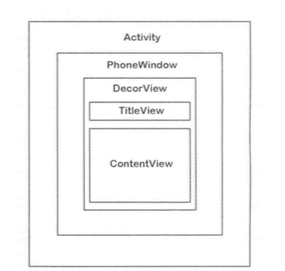
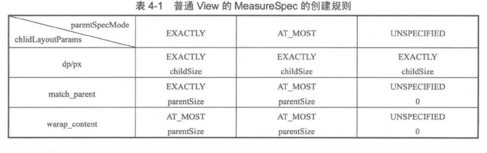
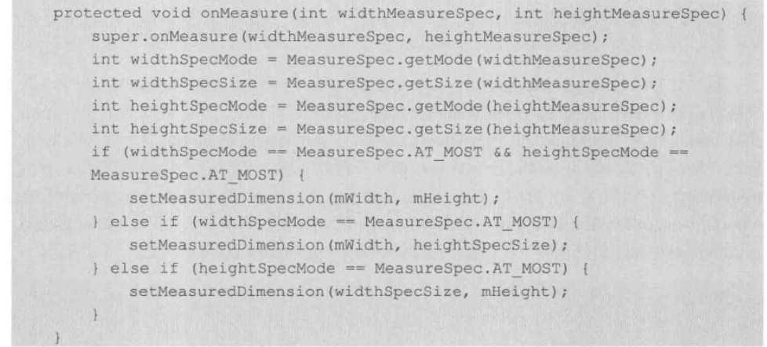

#### 1.Activity View 的绘制流程



- PhoneWindow是Android系统中最基本的窗口系统,每个Activity会创建一个.PhoneWindow是Activty和View系统交互的接口
- DecorView本质上是一个 FrameLayout,是Activity中所有View的祖先

#### 2.整体绘制流程

- 1.启动应用时候,Android会根据Activity的布局来对它进行绘制
- 2.绘制会从根视图的ViewRoot的performTraversals()方法开始,从上到下遍历整个视图树
- 3.每个view负责绘制自己,而ViewGroup还需要根据自己的子View进行绘制操作
- 4.绘制视图可以分为3个阶段: 测量(Measure) —> 布局(Layout) —> Draw(绘制)


#### 3.MeasureSpec

从名字来看就是测量规格

- MeasureSpec:很大程度上决定了一个View的尺寸,之所以这样说是因为还要受到父容器的影响

MeasureSpec表示一个 32位的整型值,**它的   高两位表示测量模式SpecMode,  低30位表示某种测量模式下的规格大小SpecSize  **,MeasureSpec是View类的一个静态内部类,用来说明应该如何测量这个 View,其核心代码如下:

```java
public static class MeasureSpec {
    private static final int MODE_SHIFT = 30;
    private static final int MODE_MASK  = 0x3 << MODE_SHIFT;

   	// 不指定测量模式
    public static final int UNSPECIFIED = 0 << MODE_SHIFT;
		// 精确测量模式
    public static final int EXACTLY     = 1 << MODE_SHIFT;
  	// 最大测量模式
    public static final int AT_MOST     = 2 << MODE_SHIFT;

   	// 根据指定的大小和模式创建一个 MeasureSpec
    public static int makeMeasureSpec(@IntRange(from = 0, to = (1 << MeasureSpec.MODE_SHIFT) - 1) int size,@MeasureSpecMode int mode) {
        if (sUseBrokenMakeMeasureSpec) {
            return size + mode;
        } else {
            return (size & ~MODE_MASK) | (mode & MODE_MASK);
        }
    }
    public static int makeSafeMeasureSpec(int size, int mode) {
        if (sUseZeroUnspecifiedMeasureSpec && mode == UNSPECIFIED) {
            return 0;
        }
        return makeMeasureSpec(size, mode);
    }

   
    @MeasureSpecMode
    public static int getMode(int measureSpec) {
        //noinspection ResourceType
        return (measureSpec & MODE_MASK);
    }

    public static int getSize(int measureSpec) {
        return (measureSpec & ~MODE_MASK);
    }
		
  	// 微调某个MeasureSpec的大小
    static int adjust(int measureSpec, int delta) {
        final int mode = getMode(measureSpec);
        int size = getSize(measureSpec);
        if (mode == UNSPECIFIED) {
            // No need to adjust size for UNSPECIFIED mode.
            return makeMeasureSpec(size, UNSPECIFIED);
        }
        size += delta;
        if (size < 0) {
            Log.e(VIEW_LOG_TAG, "MeasureSpec.adjust: new size would be negative! (" + size +
                    ") spec: " + toString(measureSpec) + " delta: " + delta);
            size = 0;
        }
        return makeMeasureSpec(size, mode);
    }

    public static String toString(int measureSpec) {
        int mode = getMode(measureSpec);
        int size = getSize(measureSpec);

        StringBuilder sb = new StringBuilder("MeasureSpec: ");

        if (mode == UNSPECIFIED)
            sb.append("UNSPECIFIED ");
        else if (mode == EXACTLY)
            sb.append("EXACTLY ");
        else if (mode == AT_MOST)
            sb.append("AT_MOST ");
        else
            sb.append(mode).append(" ");

        sb.append(size);
        return sb.toString();
    }
}
```

MeasureSpec通过将SpecMode和SpecSize打包成一个int值来避免过多的分配内存,为了方便操作提供了`getMode`和`getSize`

- UNSPECIFIED — `不对view有任何限制.要多大给多大,表示一种测量状态`
  - 不指定测量模式,父视图没有限制子视图的大小,子视图可以是想要的任何尺寸,通常用于系统内部,应用开发中很少使用到
- EXACTLY:  — `layoutParams:match_parent & 具体数值` 
  - 精确模式,当该视图的layout_width或者layout_height指定为具体数值或者match_parent时生效,表示父视图已经决定了子视图的精确大小,这种模式下View的测量值就是SpecSize的值
- AT_MOST: — `layoutParams:wrap_content`
  - 最大值模式,当该视图layout_width或者layout_height指定为wrap_content时生效,此时子视图的尺寸可以是不超过父视图允许的最大尺寸的任何尺寸

对于DecorView而言,它的MeasureSpec由窗口尺寸和其自身的LayoutParams共同决定;对于普通的View,它的MeasureSpec由父视图的MeasureSpec和其滋生的LayoutParams共同决定;

#### 4.MeasureSpec 和LayoutParams的对应关系

- 系统内部通过MeasureSpec来进行View的测量,但是正常情况下我们使用View指定的MeasureSpec
- 在View测量的时候,系统会将`LayoutParams`在`父容器约束下`转换为对应**MeasureSpec**,然后根据MeasureSpec来确定View测量后的宽&高

- 对于顶级的`DecorView`
  - `MeasureSpec`由窗口尺寸和自身的`LayoutParams`共同决定
- 对于普通的View
  - `MeasureSpec`由父容器的`MeasureSpec`和自身的`LayoutParams`共同决定

来看实例

##### 4.1 顶级的DecorView

来看ViewRootImpl中`performTraversals`有这样一段代码

```java
Rect frame = mWinFrame;
if (mWidth != frame.width() || mHeight != frame.height()) {
                mWidth = frame.width();
                mHeight = frame.height();
}


int childWidthMeasureSpec = getRootMeasureSpec(mWidth, lp.width);
int childHeightMeasureSpec = getRootMeasureSpec(mHeight, lp.height);

 // Ask host how big it wants to be
performMeasure(childWidthMeasureSpec, childHeightMeasureSpec
```

这里我们看到`DecorView`的`MeasureSpec`是通过`getRootMeasureSpec`获取的

```java
private static int getRootMeasureSpec(int windowSize, int rootDimension) {
    int measureSpec;
    switch (rootDimension) {

    case ViewGroup.LayoutParams.MATCH_PARENT:
        // Window can't resize. Force root view to be windowSize.
        measureSpec = MeasureSpec.makeMeasureSpec(windowSize, MeasureSpec.EXACTLY);
        break;
    case ViewGroup.LayoutParams.WRAP_CONTENT:
        // Window can resize. Set max size for root view.
        measureSpec = MeasureSpec.makeMeasureSpec(windowSize, MeasureSpec.AT_MOST);
        break;
    default:
        // Window wants to be an exact size. Force root view to be that size.
        measureSpec = MeasureSpec.makeMeasureSpec(rootDimension, MeasureSpec.EXACTLY);
        break;
    }
    return measureSpec;
}
```

到此为止就很明确了

- MATCH_PARENT:精确模式,大小就是窗口大小
- WRAP_CONTENT:大小不确定,但是不能操作窗口大小
- 固定大小(对应上面的`default`):精确模式,大小为`LayoutParams`指定的大小


##### 4.1普通View

ViewGroup中`measureChildWithMargins`

```java
protected void measureChildWithMargins(View child,
        int parentWidthMeasureSpec, int widthUsed,
        int parentHeightMeasureSpec, int heightUsed) {
    final MarginLayoutParams lp = (MarginLayoutParams) child.getLayoutParams();
		
  	
    final int childWidthMeasureSpec = getChildMeasureSpec(parentWidthMeasureSpec,
            mPaddingLeft + mPaddingRight + lp.leftMargin + lp.rightMargin
                    + widthUsed, lp.width);
    final int childHeightMeasureSpec = getChildMeasureSpec(parentHeightMeasureSpec,
            mPaddingTop + mPaddingBottom + lp.topMargin + lp.bottomMargin
                    + heightUsed, lp.height);

    child.measure(childWidthMeasureSpec, childHeightMeasureSpec);
}
```

这个方法我们以`LinearLayout`为例,他的调用流程`onMeasure->measureVertical->measureChildBeforeLayout->measureChildWithMargins`

很显然,child的测量与`父类Spec-parentWidthMeasureSpec `有关,还和`View 的padding和margin有关`

```java
public static int getChildMeasureSpec(int spec, int padding, int childDimension) {
    int specMode = MeasureSpec.getMode(spec);
    int specSize = MeasureSpec.getSize(spec);

    int size = Math.max(0, specSize - padding);

    int resultSize = 0;
    int resultMode = 0;

    switch (specMode) {
    // Parent has imposed an exact size on us
    case MeasureSpec.EXACTLY:
        if (childDimension >= 0) {
            resultSize = childDimension;
            resultMode = MeasureSpec.EXACTLY;
        } else if (childDimension == LayoutParams.MATCH_PARENT) {
            // Child wants to be our size. So be it.
            resultSize = size;
            resultMode = MeasureSpec.EXACTLY;
        } else if (childDimension == LayoutParams.WRAP_CONTENT) {
            // Child wants to determine its own size. It can't be
            // bigger than us.
            resultSize = size;
            resultMode = MeasureSpec.AT_MOST;
        }
        break;

    // Parent has imposed a maximum size on us
    case MeasureSpec.AT_MOST:
        if (childDimension >= 0) {
            // Child wants a specific size... so be it
            resultSize = childDimension;
            resultMode = MeasureSpec.EXACTLY;
        } else if (childDimension == LayoutParams.MATCH_PARENT) {
            // Child wants to be our size, but our size is not fixed.
            // Constrain child to not be bigger than us.
            resultSize = size;
            resultMode = MeasureSpec.AT_MOST;
        } else if (childDimension == LayoutParams.WRAP_CONTENT) {
            // Child wants to determine its own size. It can't be
            // bigger than us.
            resultSize = size;
            resultMode = MeasureSpec.AT_MOST;
        }
        break;

    // Parent asked to see how big we want to be
    case MeasureSpec.UNSPECIFIED:
        if (childDimension >= 0) {
            // Child wants a specific size... let him have it
            resultSize = childDimension;
            resultMode = MeasureSpec.EXACTLY;
        } else if (childDimension == LayoutParams.MATCH_PARENT) {
            // Child wants to be our size... find out how big it should
            // be
            resultSize = View.sUseZeroUnspecifiedMeasureSpec ? 0 : size;
            resultMode = MeasureSpec.UNSPECIFIED;
        } else if (childDimension == LayoutParams.WRAP_CONTENT) {
            // Child wants to determine its own size.... find out how
            // big it should be
            resultSize = View.sUseZeroUnspecifiedMeasureSpec ? 0 : size;
            resultMode = MeasureSpec.UNSPECIFIED;
        }
        break;
    }
    //noinspection ResourceType
    return MeasureSpec.makeMeasureSpec(resultSize, resultMode);
}
```



- View 固定dp/px:

  - 不管父容器是什么,View都是精确模式,且遵循`LayoutParams`的`width和height`

- View宽高是march_parent

  - 父布局是精确模式或者最大模式,View的大小不超过父布局的剩余空间

- View是wrap_content

  - View最大化且不超过父布局大小

- 上图中有两个不好理解 

  - 父-AT_MOST(warp_content)  子-march_parent
  - 父-EXACTLY(march_parent)  子-wrap_conent

  和我们实际中不一样,因为我们在设置button时候他已经有了初始width和height,如果使用`<View>`你就知道了

  

#### 4. Measure

##### 4.1 View

```java
protected void onMeasure(int widthMeasureSpec, int heightMeasureSpec) {
    setMeasuredDimension(getDefaultSize(getSuggestedMinimumWidth(), widthMeasureSpec),
            getDefaultSize(getSuggestedMinimumHeight(), heightMeasureSpec));
}


public static int getDefaultSize(int size, int measureSpec) {
        int result = size;
        int specMode = MeasureSpec.getMode(measureSpec);
        int specSize = MeasureSpec.getSize(measureSpec);

        switch (specMode) {
        case MeasureSpec.UNSPECIFIED:
            result = size;
            break;
        case MeasureSpec.AT_MOST:
        case MeasureSpec.EXACTLY:
            result = specSize;
            break;
        }
        return result;
}
```

父mode  

- AT_MOST & EXACTLY :   均使用view 测量后的大小
- UNSPECIFIED: 设定为`size`也就是`getSuggestedMinimumWidth`

继续看其源码,width和kheight看其一即可

```java
protected int getSuggestedMinimumHeight() {
    return (mBackground == null) ? mMinHeight : max(mMinHeight, mBackground.getMinimumHeight());

}

public int getMinimumHeight() {
        final int intrinsicHeight = getIntrinsicHeight();
        return intrinsicHeight > 0 ? intrinsicHeight : 0;
    }
```

- View没有设置background,那么UNSPECIFIED下size就等于xml中设定的`android:minWidth`,如果没有设定就是0
- View设置background,那么UNSPECIFIED下size就等于bg原始宽高,如果没有设定就是0,然后通过max比较输出最大值


##### 4.2 自定义View建议重写onMearsure

比如:自定义空间不重写`onMearsure`,直接使用系统计算的`specSize`,那么会有一个隐患

当父布局是`warp_content`自定义空间是View的实现,如果设置`wrap_content`时候会全屏

所以需要



##### 4.3 ViewGroup — measure

ViewGroup的`measure`除了完成自己的`measure`之外,还会遍历去调用所有子元素的`measure`,然后子层再去递归

- ViewGroup是一个抽象方法,他没有重写onMeasure方法,但是会有一个measureChildren

```java
protected void measureChildren(int widthMeasureSpec, int heightMeasureSpec) {
    final int size = mChildrenCount;
    final View[] children = mChildren;
    for (int i = 0; i < size; ++i) {
        final View child = children[i];
        if ((child.mViewFlags & VISIBILITY_MASK) != GONE) {
            measureChild(child, widthMeasureSpec, heightMeasureSpec);
        }
    }
}


protected void measureChild(View child, int parentWidthMeasureSpec,
            int parentHeightMeasureSpec) {
        final LayoutParams lp = child.getLayoutParams();

        final int childWidthMeasureSpec = getChildMeasureSpec(parentWidthMeasureSpec,
                mPaddingLeft + mPaddingRight, lp.width);
        final int childHeightMeasureSpec = getChildMeasureSpec(parentHeightMeasureSpec,
                mPaddingTop + mPaddingBottom, lp.height);

        child.measure(childWidthMeasureSpec, childHeightMeasureSpec);
    }
```

上面方法的核心逻辑:

**遍历ViewGroup中每一个子孩子,然后每个child再去执行`measure`**

但是遗憾的是  ViewGroup 大多是其他具体实现类取实现,如`LinearLayout`,所以真正的measure不走这里,是走具体实现类的`onMeasure`

##### 4.4 LinearLayout-onMeasure

以LinearLayout 来继续看源码:

```java
@Override
protected void onMeasure(int widthMeasureSpec, int heightMeasureSpec) {
    if (mOrientation == VERTICAL) {
        measureVertical(widthMeasureSpec, heightMeasureSpec);
    } else {
        measureHorizontal(widthMeasureSpec, heightMeasureSpec);
    }
}
```

可以看到基于`LinearLayout`的横向纵向特性进行设置,我们来看竖向`measureVertical`:

```java
void measureVertical(int widthMeasureSpec, int heightMeasureSpec) {
    ......

    // See how tall everyone is. Also remember max width.
    for (int i = 0; i < count; ++i) {
   
      	 final View child = getVirtualChildAt(i);
            if (child == null) {
                mTotalLength += measureNullChild(i);
                continue;
            }

            if (child.getVisibility() == View.GONE) {
               i += getChildrenSkipCount(child, i);
               continue;
            }
        ........
          	// target1
            measureChildBeforeLayout(child, i, widthMeasureSpec, 0,
                    heightMeasureSpec, usedHeight);

            final int childHeight = child.getMeasuredHeight();
            if (useExcessSpace) {
                // Restore the original height and record how much space
                // we've allocated to excess-only children so that we can
                // match the behavior of EXACTLY measurement.
                lp.height = 0;
                consumedExcessSpace += childHeight;
            }
						// target2
            final int totalLength = mTotalLength;
            mTotalLength = Math.max(totalLength, totalLength + childHeight + lp.topMargin +
                   lp.bottomMargin + getNextLocationOffset(child));

            if (useLargestChild) {
                largestChildHeight = Math.max(childHeight, largestChildHeight);
            }
        }

        ......
}
```

首先看`target1`,遍历每个`child`,然后调用他们的`measureChildBeforeLayout`,然后调用`measureChildWithMargins`,然后调用`child`的`measure`

我们还需要看下`target2`,因为是竖直方向,所以需要考虑child的累加,用`mTotalLength`来存储`LinearLayout`的竖直高度,每次测量一个元素,`mTotalLength`都会增加,增加部分包括竖直方向上的`margin`以及`padding`等;

子元素测量完之后,`LinearLayout`会测量自己的大小;


```java
				// Add in our padding
        mTotalLength += mPaddingTop + mPaddingBottom;

        int heightSize = mTotalLength;

        // Check against our minimum height
        heightSize = Math.max(heightSize, getSuggestedMinimumHeight());
        int heightSizeAndState = resolveSizeAndState(heightSize, heightMeasureSpec, 0);
        maxWidth += mPaddingLeft + mPaddingRight;

        // Check against our minimum width
        maxWidth = Math.max(maxWidth, getSuggestedMinimumWidth());

        setMeasuredDimension(resolveSizeAndState(maxWidth, widthMeasureSpec, childState),
                heightSizeAndState);
```

针对竖直排列的`linearLayout`

- 水平方向遵循View的测量过程
- 竖直方向: 如果布局是`martch_parent`或者具体数值,那么测量过程和View一致使用`SpecSize`;如果布局中高度使用`wrap_content`,那么他的高度是所有子元素所占高度总和,且要考虑竖直方向的`margin`和`padding`

继续看`resolveSizeAndState`

```java
public static int resolveSizeAndState(int size, int measureSpec, int childMeasuredState) {
    final int specMode = MeasureSpec.getMode(measureSpec);
    final int specSize = MeasureSpec.getSize(measureSpec);
    final int result;
    switch (specMode) {
        case MeasureSpec.AT_MOST:
            if (specSize < size) {
                result = specSize | MEASURED_STATE_TOO_SMALL;
            } else {
                result = size;
            }
            break;
        case MeasureSpec.EXACTLY:
            result = specSize;
            break;
        case MeasureSpec.UNSPECIFIED:
        default:
            result = size;
    }
    return result | (childMeasuredState & MEASURED_STATE_MASK);
}
```

View的`measure`过程是三大流程中最复杂的一个,`measure`完成之后,可以通过`getMeasured-Width/Height`获取View的宽和高;由于有时候多次`measure`并不能获取真实高度,所以建议在`onLayout`中获取

##### 4.5 Activity/View # 获取View宽高

**1. onWindowFocusChanged**

由于Activity的生命周期与View的绘制周期并不同步,所以我们要获取 View的宽高信息,应该调用`onWindowFocusChanged`

onWindowFocusChanged:代表View已经绘制完毕

```java
@Override
public void onWindowFocusChanged(boolean hasFocus) {
    super.onWindowFocusChanged(hasFocus);
    if (hasFocus){
        int measuredWidth = mViewPager.getMeasuredWidth();
        int measuredHeight = mViewPager.getMeasuredHeight();
    }
}
```

**2.view.post**

view.post会将消息推到队尾,等looper调用

```java
@Override
protected void onStart() {
    super.onStart();
    mViewPager.post(new Runnable() {
        @Override
        public void run() {
            int measuredWidth = mViewPager.getMeasuredWidth();
            int measuredHeight = mViewPager.getMeasuredHeight();
        }
    });

}
```

**3.ViewTreeObserver**

使用ViewTreeObserver的众多会调可以完成这个功能,比如使用`OnGlobalLayoutListener`这个接口,当View树的状态发生改变或者View树内部的View可见性发生改变时,`onGlobalLayout`方法将被回调,因此这是获取View宽/高一个很好的时机,需要注意的是,伴随着View树的状态改变等,`onGlobalLayout`会被调用多次:

```
    @Override
    protected void onStart() {
        super.onStart();

        ViewTreeObserver observer = mViewPager.getViewTreeObserver();
        observer.addOnGlobalLayoutListener(new ViewTreeObserver.OnGlobalLayoutListener() {
            @Override
            public void onGlobalLayout() {
                int measuredWidth = mViewPager.getMeasuredWidth();
                int measuredHeight = mViewPager.getMeasuredHeight();
            }
        });


    }
```


#### 5. Layout

`layout`是ViewGroup来确定`child`位置,当ViewGroup的位置被确定后,他在`onLayout`中会遍历所有的子元素并调用其Layout方法,在Layout,在Layout中`onLayout`又被调用;

还是以`LinearLayout`为例:

```java
// #### class: ViewGroup
@Override
public final void layout(int l, int t, int r, int b) {
    if (!mSuppressLayout && (mTransition == null || !mTransition.isChangingLayout())) {
        if (mTransition != null) {
            mTransition.layoutChange(this);
        }
        super.layout(l, t, r, b);
    } else {
        // record the fact that we noop'd it; request layout when transition finishes
        mLayoutCalledWhileSuppressed = true;
    }
}

// #### super  父类View 
 public void layout(int l, int t, int r, int b) {
        if ((mPrivateFlags3 & PFLAG3_MEASURE_NEEDED_BEFORE_LAYOUT) != 0) {
            onMeasure(mOldWidthMeasureSpec, mOldHeightMeasureSpec);
            mPrivateFlags3 &= ~PFLAG3_MEASURE_NEEDED_BEFORE_LAYOUT;
        }

        int oldL = mLeft;
        int oldT = mTop;
        int oldB = mBottom;
        int oldR = mRight;

        boolean changed = isLayoutModeOptical(mParent) ?
                setOpticalFrame(l, t, r, b) : setFrame(l, t, r, b);

        if (changed || (mPrivateFlags & PFLAG_LAYOUT_REQUIRED) == PFLAG_LAYOUT_REQUIRED) {
            onLayout(changed, l, t, r, b);

            if (shouldDrawRoundScrollbar()) {
                if(mRoundScrollbarRenderer == null) {
                    mRoundScrollbarRenderer = new RoundScrollbarRenderer(this);
                }
            } else {
                mRoundScrollbarRenderer = null;
            }

            mPrivateFlags &= ~PFLAG_LAYOUT_REQUIRED;

            ListenerInfo li = mListenerInfo;
            if (li != null && li.mOnLayoutChangeListeners != null) {
                ArrayList<OnLayoutChangeListener> listenersCopy =                      (ArrayList<OnLayoutChangeListener>)li.mOnLayoutChangeListeners.clone();
                int numListeners = listenersCopy.size();
                for (int i = 0; i < numListeners; ++i) {
                    listenersCopy.get(i).onLayoutChange(this, l, t, r, b, oldL, oldT, oldR, oldB);
                }
            }
        }

        final boolean wasLayoutValid = isLayoutValid();

        mPrivateFlags &= ~PFLAG_FORCE_LAYOUT;
        mPrivateFlags3 |= PFLAG3_IS_LAID_OUT;

        if (!wasLayoutValid && isFocused()) {
            mPrivateFlags &= ~PFLAG_WANTS_FOCUS;
            if (canTakeFocus()) {
                // We have a robust focus, so parents should no longer be wanting focus.
                clearParentsWantFocus();
            } else if (getViewRootImpl() == null || !getViewRootImpl().isInLayout()) {
                // This is a weird case. Most-likely the user, rather than ViewRootImpl, called
                // layout. In this case, there's no guarantee that parent layouts will be evaluated
                // and thus the safest action is to clear focus here.
                clearFocusInternal(null, /* propagate */ true, /* refocus */ false);
                clearParentsWantFocus();
            } else if (!hasParentWantsFocus()) {
                // original requestFocus was likely on this view directly, so just clear focus
                clearFocusInternal(null, /* propagate */ true, /* refocus */ false);
            }
            // otherwise, we let parents handle re-assigning focus during their layout passes.
        } else if ((mPrivateFlags & PFLAG_WANTS_FOCUS) != 0) {
            mPrivateFlags &= ~PFLAG_WANTS_FOCUS;
            View focused = findFocus();
            if (focused != null) {
                // Try to restore focus as close as possible to our starting focus.
                if (!restoreDefaultFocus() && !hasParentWantsFocus()) {
                    // Give up and clear focus once we've reached the top-most parent which wants
                    // focus.
                    focused.clearFocusInternal(null, /* propagate */ true, /* refocus */ false);
                }
            }
        }

        if ((mPrivateFlags3 & PFLAG3_NOTIFY_AUTOFILL_ENTER_ON_LAYOUT) != 0) {
            mPrivateFlags3 &= ~PFLAG3_NOTIFY_AUTOFILL_ENTER_ON_LAYOUT;
            notifyEnterOrExitForAutoFillIfNeeded(true);
        }
    }
```

- 首先确认目标布局的  `mLeft,mTop,mRight,mBottom`,通过`setFrame`
- 然后基于父布局的左上右下,进行`layout`子元素就是调用实现类的`onLayout`

`linearLayout-onLayout`:

```java
@Override
protected void onLayout(boolean changed, int l, int t, int r, int b) {
    if (mOrientation == VERTICAL) {
        layoutVertical(l, t, r, b);
    } else {
        layoutHorizontal(l, t, r, b);
    }
}

//layoutVertical(l, t, r, b);
void layoutVertical(int left, int top, int right, int bottom) {
        final int paddingLeft = mPaddingLeft;

        int childTop;
        int childLeft;

        // Where right end of child should go
        final int width = right - left;
        int childRight = width - mPaddingRight;

        // Space available for child
        int childSpace = width - paddingLeft - mPaddingRight;

        final int count = getVirtualChildCount();

        final int majorGravity = mGravity & Gravity.VERTICAL_GRAVITY_MASK;
        final int minorGravity = mGravity & Gravity.RELATIVE_HORIZONTAL_GRAVITY_MASK;
				
  			//  处理 Gravity  target1
        switch (majorGravity) {
           case Gravity.BOTTOM:
               // mTotalLength contains the padding already
               childTop = mPaddingTop + bottom - top - mTotalLength;
               break;

               // mTotalLength contains the padding already
           case Gravity.CENTER_VERTICAL:
               childTop = mPaddingTop + (bottom - top - mTotalLength) / 2;
               break;

           case Gravity.TOP:
           default:
               childTop = mPaddingTop;
               break;
        }
				// 遍历child  target2
        for (int i = 0; i < count; i++) {
            final View child = getVirtualChildAt(i);
            if (child == null) {
                childTop += measureNullChild(i);
            } else if (child.getVisibility() != GONE) {
                final int childWidth = child.getMeasuredWidth();
                final int childHeight = child.getMeasuredHeight();

                final LinearLayout.LayoutParams lp =
                        (LinearLayout.LayoutParams) child.getLayoutParams();

                int gravity = lp.gravity;
                if (gravity < 0) {
                    gravity = minorGravity;
                }
                final int layoutDirection = getLayoutDirection();
                final int absoluteGravity = Gravity.getAbsoluteGravity(gravity, layoutDirection);
                switch (absoluteGravity & Gravity.HORIZONTAL_GRAVITY_MASK) {
                    case Gravity.CENTER_HORIZONTAL:
                        childLeft = paddingLeft + ((childSpace - childWidth) / 2)
                                + lp.leftMargin - lp.rightMargin;
                        break;

                    case Gravity.RIGHT:
                        childLeft = childRight - childWidth - lp.rightMargin;
                        break;

                    case Gravity.LEFT:
                    default:
                        childLeft = paddingLeft + lp.leftMargin;
                        break;
                }

                if (hasDividerBeforeChildAt(i)) {
                    childTop += mDividerHeight;
                }

                childTop += lp.topMargin;
              	// target3
                setChildFrame(child, childLeft, childTop + getLocationOffset(child),
                        childWidth, childHeight);
                childTop += childHeight + lp.bottomMargin + getNextLocationOffset(child);

                i += getChildrenSkipCount(child, i);
            }
        }
    }

```

- `target1`:根据xml设定的`Gravity`来进行布局
- `target2`:遍历chilid,横向布局与view一致,纵向`childTop`一直累加,符合`linearLayout`纵向顺序排列的目标
- `target3`:`setChildFrame`就是通过child调用其子view继续`layout`,这里会提前确定child的W/H,还有childLeft, childTop

```java
final int childWidth = child.getMeasuredWidth();
final int childHeight = child.getMeasuredHeight();
```

之后执行:`setChildFrame`

```java
private void setChildFrame(View child, int left, int top, int width, int height) {
    child.layout(left, top, left + width, top + height);
}
...//之后代码与上面一直 --->View.Layout ---> 具体实现类的onLayout
```

这里有一个小插曲:

`getMeauredW/H`和`getW/H`有什么区别

`getMeauredW/H`在measure形成

`getW/H`在layout过程形成

#### 6.Draw

```java
public void draw(Canvas canvas) {
    // 绘制背景
    if (!dirtyOpaque) {
        drawBackground(canvas);
    }

    // skip step 2 & 5 if possible (common case)
    final int viewFlags = mViewFlags;
    boolean horizontalEdges = (viewFlags & FADING_EDGE_HORIZONTAL) != 0;
    boolean verticalEdges = (viewFlags & FADING_EDGE_VERTICAL) != 0;
    if (!verticalEdges && !horizontalEdges) {
        // Step 3, draw the content
      	// 绘制自己
        if (!dirtyOpaque) onDraw(canvas);

        // Step 4, draw the children
      	// 绘制child
        dispatchDraw(canvas);

        drawAutofilledHighlight(canvas);

        // Overlay is part of the content and draws beneath Foreground
        if (mOverlay != null && !mOverlay.isEmpty()) {
            mOverlay.getOverlayView().dispatchDraw(canvas);
        }

        // Step 6, draw decorations (foreground, scrollbars)
        onDrawForeground(canvas);

        // Step 7, draw the default focus highlight
        drawDefaultFocusHighlight(canvas);

        if (debugDraw()) {
            debugDrawFocus(canvas);
        }

        // we're done...
        return;
    }

    /*
     * Here we do the full fledged routine...
     * (this is an uncommon case where speed matters less,
     * this is why we repeat some of the tests that have been
     * done above)
     */

    boolean drawTop = false;
    boolean drawBottom = false;
    boolean drawLeft = false;
    boolean drawRight = false;

    float topFadeStrength = 0.0f;
    float bottomFadeStrength = 0.0f;
    float leftFadeStrength = 0.0f;
    float rightFadeStrength = 0.0f;

    // Step 2, save the canvas' layers
    int paddingLeft = mPaddingLeft;

    final boolean offsetRequired = isPaddingOffsetRequired();
    if (offsetRequired) {
        paddingLeft += getLeftPaddingOffset();
    }

    int left = mScrollX + paddingLeft;
    int right = left + mRight - mLeft - mPaddingRight - paddingLeft;
    int top = mScrollY + getFadeTop(offsetRequired);
    int bottom = top + getFadeHeight(offsetRequired);

    if (offsetRequired) {
        right += getRightPaddingOffset();
        bottom += getBottomPaddingOffset();
    }

    final ScrollabilityCache scrollabilityCache = mScrollCache;
    final float fadeHeight = scrollabilityCache.fadingEdgeLength;
    int length = (int) fadeHeight;

    // clip the fade length if top and bottom fades overlap
    // overlapping fades produce odd-looking artifacts
    if (verticalEdges && (top + length > bottom - length)) {
        length = (bottom - top) / 2;
    }

    // also clip horizontal fades if necessary
    if (horizontalEdges && (left + length > right - length)) {
        length = (right - left) / 2;
    }

    if (verticalEdges) {
        topFadeStrength = Math.max(0.0f, Math.min(1.0f, getTopFadingEdgeStrength()));
        drawTop = topFadeStrength * fadeHeight > 1.0f;
        bottomFadeStrength = Math.max(0.0f, Math.min(1.0f, getBottomFadingEdgeStrength()));
        drawBottom = bottomFadeStrength * fadeHeight > 1.0f;
    }

    if (horizontalEdges) {
        leftFadeStrength = Math.max(0.0f, Math.min(1.0f, getLeftFadingEdgeStrength()));
        drawLeft = leftFadeStrength * fadeHeight > 1.0f;
        rightFadeStrength = Math.max(0.0f, Math.min(1.0f, getRightFadingEdgeStrength()));
        drawRight = rightFadeStrength * fadeHeight > 1.0f;
    }

    saveCount = canvas.getSaveCount();

    int solidColor = getSolidColor();
    if (solidColor == 0) {
        if (drawTop) {
            canvas.saveUnclippedLayer(left, top, right, top + length);
        }

        if (drawBottom) {
            canvas.saveUnclippedLayer(left, bottom - length, right, bottom);
        }

        if (drawLeft) {
            canvas.saveUnclippedLayer(left, top, left + length, bottom);
        }

        if (drawRight) {
            canvas.saveUnclippedLayer(right - length, top, right, bottom);
        }
    } else {
        scrollabilityCache.setFadeColor(solidColor);
    }

    // Step 3, draw the content
    if (!dirtyOpaque) onDraw(canvas);

    // Step 4, draw the children
    dispatchDraw(canvas);

    // Step 5, draw the fade effect and restore layers
    final Paint p = scrollabilityCache.paint;
    final Matrix matrix = scrollabilityCache.matrix;
    final Shader fade = scrollabilityCache.shader;

    if (drawTop) {
        matrix.setScale(1, fadeHeight * topFadeStrength);
        matrix.postTranslate(left, top);
        fade.setLocalMatrix(matrix);
        p.setShader(fade);
        canvas.drawRect(left, top, right, top + length, p);
    }

    if (drawBottom) {
        matrix.setScale(1, fadeHeight * bottomFadeStrength);
        matrix.postRotate(180);
        matrix.postTranslate(left, bottom);
        fade.setLocalMatrix(matrix);
        p.setShader(fade);
        canvas.drawRect(left, bottom - length, right, bottom, p);
    }

    if (drawLeft) {
        matrix.setScale(1, fadeHeight * leftFadeStrength);
        matrix.postRotate(-90);
        matrix.postTranslate(left, top);
        fade.setLocalMatrix(matrix);
        p.setShader(fade);
        canvas.drawRect(left, top, left + length, bottom, p);
    }

    if (drawRight) {
        matrix.setScale(1, fadeHeight * rightFadeStrength);
        matrix.postRotate(90);
        matrix.postTranslate(right, top);
        fade.setLocalMatrix(matrix);
        p.setShader(fade);
        canvas.drawRect(right - length, top, right, bottom, p);
    }

    canvas.restoreToCount(saveCount);

    drawAutofilledHighlight(canvas);

    // Overlay is part of the content and draws beneath Foreground
    if (mOverlay != null && !mOverlay.isEmpty()) {
        mOverlay.getOverlayView().dispatchDraw(canvas);
    }

    // Step 6, draw decorations (foreground, scrollbars)
    onDrawForeground(canvas);

    if (debugDraw()) {
        debugDrawFocus(canvas);
    }
}
```

就是一步步绘制  `绘制background` `绘制自己content` `绘制child` `绘制其他`

```
performDraw->draw->mAttachInfo.mThreadedRenderer.draw()/drawSoftware()
```