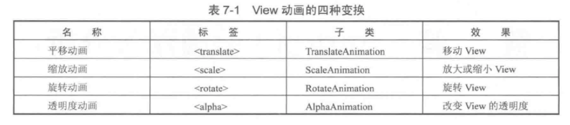
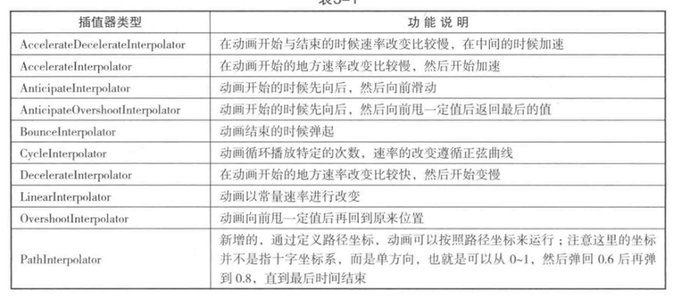
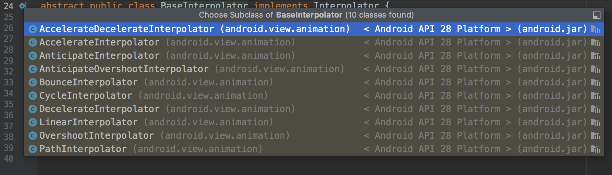
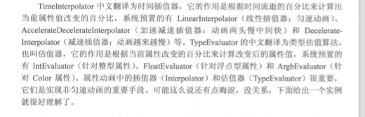
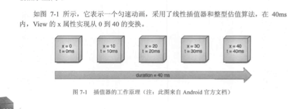

#### 1. 帧动画

##### 1.1 xml实现

##### 1.2 代码实现

两种方式没什么可说的

- 1.drawable下新建  animation-list

```xml
<?xml version="1.0" encoding="utf-8"?>
<animation-list xmlns:android="http://schemas.android.com/apk/res/android">

    <item android:drawable="@mipmap/anim_0" android:duration="120"/>

    <item android:drawable="@mipmap/anim_1" android:duration="120"/>

    <item android:drawable="@mipmap/anim_2" android:duration="120"/>

    <item android:drawable="@mipmap/anim_3" android:duration="120"/>

</animation-list>
```

- 2.**代码实现**:代码中给相应空间`setbg`,**xml实现**:layout中属性设置bg

  接下来一致

```java
TextView tx = findViewById(R.id.tx);
// 获取AnimationDrawable实例
AnimationDrawable background = (AnimationDrawable) tx.getBackground();
// 开始动画
background.start();
// 动画停止
background.stop();
```

#### 2.补间动画

开发者无需定义每一帧,只需要定义动画的`start`和`end`,然后指定动画变换的方式和时间即可,然后交由android计算,通过两个关键帧之间插入渐变值来平滑过度

包括四种变换`Alpha`,`Scale`,`Translate`,`Rotate`,可以相互组合来使用




##### 2.1 插值器 Interpolator



##### 2.2 代码实现

```xml
<?xml version="1.0" encoding="utf-8"?>
<set xmlns:android="http://schemas.android.com/apk/res/android">

    <alpha
        android:duration = "1000"
        android:fromAlpha="0"
        android:toAlpha="1"
        />

    <scale
        android:duration = "1000"
        android:fromXScale="0"
        android:toXScale="1"
        android:fromYScale="0"
        android:toYScale="1"
        android:pivotX="50%"
        android:pivotY="50%"/>


    <translate
        android:duration = "1000"
        android:fromXDelta="0"
        android:toXDelta="100"
        android:fromYDelta="0"
        android:toYDelta="100"/>

    <rotate
        android:fromDegrees="0"
        android:toDegrees="180"
        android:pivotX="0"
        android:pivotY="0"
        android:duration = "1000"/>

</set>
```

```java
    background.start();
    Button bt = findViewById(R.id.bt);
    Animation animation = AnimationUtils.loadAnimation(this, R.anim.anim_1);
    bt.startAnimation(animation);
```

##### 2.3 自定义View动画

需要继承`Animation`,然后重写其 `initialize`和`applyTransformation`,在`initialize`中进行初始化,在`applyTransformation`中进行相应的矩阵变换,很多时候需要使用`camera`来简化矩阵变换的过程

```java
class Rota3dAnimation extends Animation {
    private final float mFromDegress;
    private final float mToDegress;
    private final float mCenterX;
    private final float mCenterY;
    private final float mDepthz;
    private final boolean mReverse;
    private Camera mCamera;

    public Rota3dAnimation(float mFromDegress, float mToDegress, float mCenterX, float mCenterY, float mDepthz, boolean mReverse) {
        this.mFromDegress = mFromDegress;
        this.mToDegress = mToDegress;
        this.mCenterX = mCenterX;
        this.mCenterY = mCenterY;
        this.mDepthz = mDepthz;
        this.mReverse = mReverse;
    }


    @Override
    public void initialize(int width, int height, int parentWidth, int parentHeight) {
        super.initialize(width, height, parentWidth, parentHeight);
        mCamera = new Camera();
    }

    @Override
    protected void applyTransformation(float interpolatedTime, Transformation t) {
        super.applyTransformation(interpolatedTime, t);
        final float fromDegress  = mFromDegress;
        float degress = fromDegress + (mToDegress-mFromDegress)*interpolatedTime;

        final float centerX = mCenterX;
        final float centerY = mCenterY;
        final Camera camera = mCamera;

        final Matrix matix = t.getMatrix();

        camera.save();
        if(mReverse){
            camera.translate(0.0f,0.0f,mDepthz*interpolatedTime);
        }else{
            camera.translate(0.0f,0.0f,mDepthz*(1-interpolatedTime));
        }
        camera.rotateY(degress);
        camera.getMatrix(matix);
        camera.restore();

        matix.preTranslate(-centerX,-centerY);
        matix.postTranslate(centerX,centerY);
    }
}
```

#### 3. View动画的特殊使用场景

View动画的四种形式,除了这四种形式,View动画还可以在一些特殊情况下使用,比如在ViewGroup中可以控制子元素的出场效果,在Activity中实现不同的Activity之间的切换效果

##### 3.1LayoutAnimation

`LayoutAnimation`作用于ViewGroup,为ViewGroup指定一个动画,常见是listView的Item入场动画

```java
<layoutAnimation xmlns:android="http://schemas.android.com/apk/res/android"
    android:delay="0.5"
    android:animation="@anim/anim_1"
    android:animationOrder="normal">

</layoutAnimation>
```

` android:delay="0.5"`

表示元素开始动画的时间延迟,比如子元素入场动画的时间周期是300ms,那么0.5表示每个子元素需要延迟150ms才能播放入场动画,多个元素依次延迟150ms入场,依次类推;

`android:animationOrder="normal"`

表示子元素入场顺序,`normal`是正序,`reverse`是倒序,`random`是随机入场

`android:animation`

为子元素指定入场动画

之后在listView所在布局直接引用即可

```java
<?xml version="1.0" encoding="utf-8"?>
<android.support.constraint.ConstraintLayout xmlns:android="http://schemas.android.com/apk/res/android"
    xmlns:app="http://schemas.android.com/apk/res-auto"
    xmlns:tools="http://schemas.android.com/tools"
    android:layout_width="match_parent"
    android:layout_height="match_parent"
    tools:context=".MainActivity">

    <ListView
        android:id="@+id/list"
        android:layout_width="match_parent"
        android:layout_height="match_parent"
        android:layoutAnimation="@anim/layout_ainm"
        android:background="@color/colorAccent"/>

</android.support.constraint.ConstraintLayout>
```

也可以代码指定

```java
@Override
protected void onCreate(Bundle savedInstanceState) {
    super.onCreate(savedInstanceState);
    setContentView(R.layout.activity_main_1);

    ListView listView = findViewById(R.id.list);
    MyAdapter adapter = new MyAdapter();
    ArrayList<Integer> arrayList = new ArrayList<>();
    for (int i : arr) {
        arrayList.add(i);
    }
    adapter.setData(this,arrayList);

    Animation animation = AnimationUtils.loadAnimation(this, R.anim.anim_1);
    LayoutAnimationController controller = new LayoutAnimationController(animation);
    controller.setDelay(0.5f);
    controller.setOrder(LayoutAnimationController.ORDER_NORMAL);
    listView.setLayoutAnimation(controller);
    listView.setAdapter(adapter);
}
```

注意代码制定anim的资源id必须是item的动画

#### 4.属性动画

属性动画是Api11之后加入的新特性,和View动画不同,它对作用对象进行了扩展

- 属性动画可以对任何对象做动画,不一定是view,有时候甚至可以没有对象
- 属性动画对动画效果进行了加强,不像View动画那样只是简单的`平移 旋转 缩放 显隐`,属性动画中有`ValueAnimator`,`ObjectAnimator`,`AnimatorSet`等概念,通过他们可以实现绚丽的动画

##### 4.1 使用属性动画

属性动画可以对任意属性进行动画,不仅仅是View,动画默认时间间隔是300ms,默认帧率是10ms/帧;

**效果:在一个时间间隔内完成对象从一个属性值到另一个属性值的改变**

几个比较常用动画类:  `ValueAnimator` `ObjectAnimator` `AnimatorSet`

`ObjectAnimator`继承自`ValueAnimator`;`AnimatorSet`是动画集合,直接继承自`AnimatorSet`

- 改变一个对象的`translationY`属性,让其沿着Y轴移动他的高度


- 改变一个对象的背景颜色属性,典型的情形是改变View的颜色,下面的动画可以让背景色从3s内实现从**0xFFFF8080**到**0xFF8080FF**,动画无限循环,且会有反转效果

```java
public class SxActivity extends AppCompatActivity {
    private int[] arr = {0,1,2,3,4,5,6,7,8,9};
    @Override
    protected void onCreate(Bundle savedInstanceState) {
        super.onCreate(savedInstanceState);
        setContentView(R.layout.activity_main_2);

        TextView view = findViewById(R.id.tx);
        ValueAnimator animator = ObjectAnimator.ofInt(view, "backgroundColor", 0xFFFF8080, 0xFF8080FF);
        //设置动画时间
        animator.setDuration(3000);
        // 设置估值器,使动画过度平滑
        animator.setEvaluator(new ArgbEvaluator());
        // 设置无限播放
        animator.setRepeatCount(ValueAnimator.INFINITE);
        // 设置反转
        animator.setRepeatMode(ValueAnimator.REVERSE);
        animator.start();
    }
}
```

- 动画集合,5s内进行旋转,平移,缩放和透明

```java
AnimatorSet set = new AnimatorSet();
set.playTogether(
        ObjectAnimator.ofFloat(view,"rotationX",0,360),
        ObjectAnimator.ofFloat(view,"rotationY",0,180),
        ObjectAnimator.ofFloat(view,"rotation",0,-90),
        ObjectAnimator.ofFloat(view,"translationX",0,90),
        ObjectAnimator.ofFloat(view,"translationY",0,90),
        ObjectAnimator.ofFloat(view,"scaleX",1,1.5f),
        ObjectAnimator.ofFloat(view,"scaleY",1,0.5f),
        ObjectAnimator.ofFloat(view,"alpha",1,0.25f,1)
);
set.setDuration(5*1000).start();
```

当然也可以在xml中定义

- <set> — AnimatorSet
- <animator> — ValueAnimator
- <objectAnimator> — ObjectAnimator

##### 4.2 插值器和估值器

`TimeInterpolator`中文翻译为时间插值器,它的作用是根据时间的流逝的百分比来计算出当前属性值改变的百分比



这是系统提供的所有插值器





> 场景:动画start`0ms`,end是`40ms`

我们简单看下插值器的源码:

```java
@HasNativeInterpolator
public class LinearInterpolator extends BaseInterpolator implements NativeInterpolatorFactory {

    public LinearInterpolator() {
    }

    public LinearInterpolator(Context context, AttributeSet attrs) {
    }

    public float getInterpolation(float input) {
        return input;
    }

    /** @hide */
    @Override
    public long createNativeInterpolator() {
        return NativeInterpolatorFactoryHelper.createLinearInterpolator();
    }
}
```

这是插值器,由于上述是线性插值器,所以`I/0`是一致的

由于动画默认是10ms/帧,所以将该动画分为5帧`0->10->20->30->40`,当20ms时候变化了0.5,因为使用线性插值器是匀速的,所以上述的`input`为0.5


但是属性改变0.5,属性将会如何变化,这时候需要用到估值器

```java
public class IntEvaluator implements TypeEvaluator<Integer> {


    public Integer evaluate(float fraction, Integer startValue, Integer endValue) {
        int startInt = startValue;
        return (int)(startInt + fraction * (endValue - startInt));
    }
}
```

`startint`为0,`endValue`为40,此时插值器计算的变化是`0.5`,则此时属性`x=20,t=20ms`

自定义:

- 属性动画要求对象的该属性有`set&get`方法
- 自定义插值器和估值器  插值器须实现`Interpolator`或者`TimeInterpolator`  估值器需要实现`TypeEvaluator<Integer>`,如果非`int` `float` `color`需要自定义估值算法

##### 4.3属性动画监听器

```java
animator.addListener(new Animator.AnimatorListener() {
    @Override
    public void onAnimationStart(Animator animation) {}
    @Override
    public void onAnimationEnd(Animator animation) {}
    @Override
    public void onAnimationCancel(Animator animation) {}
    @Override
    public void onAnimationRepeat(Animator animation) {}
});


animator.addUpdateListener(new ValueAnimator.AnimatorUpdateListener() {
    @Override
    public void onAnimationUpdate(ValueAnimator animation) {}
});
```

- AnimatorListener可以监听动画的 `开始`  `结束`  `取消` `重复播放`
- AnimatorUpdateListener会监听整个动画过程,动画没播放一帧,就会被调用一次

##### 4.3对任意属性做动画

**Buttom width放大**

```java
protected void onCreate(Bundle savedInstanceState) {
    super.onCreate(savedInstanceState);
    setContentView(R.layout.activity_main_2);

    textView = findViewById(R.id.tx);

    textView.setOnClickListener(new View.OnClickListener() {
        @Override
        public void onClick(View v) {
            performAnim();
        }
    });


}

private void performAnim() {
    ObjectAnimator.ofInt(textView,"width",500).setDuration(5000).start();
}
```

**上面的方法是没有任何效果的**

首先来看属性动画的原理:属性动画要求作用对象提供set和get方法,属性动画根据外界传递的该属性的初始值和最终值,以动画的效果多次去调用set方法,每次传递给set方法的值不一样,确切的说是随着时间的推移,所传递的值越来越接近最终值

所以属性动画生效的必要条件

- 1.提供set方法,如果动画时候没有传递初始值;提供get方法,因为系统要去取属性的初始值
- 2.set属性值时候,要通过某个function反馈出来,如UI的变化

基于这两点我们来看上诉textView没有生效的原因,直接看源码:

```java
// class #### TextView
@android.view.RemotableViewMethod
public void setWidth(int pixels) {
    mMaxWidth = mMinWidth = pixels;
    mMaxWidthMode = mMinWidthMode = PIXELS;

    requestLayout();
    invalidate();
}

// class #### 父类 View
@ViewDebug.ExportedProperty(category = "layout")
public final int getWidth() {
        return mRight - mLeft;
}
```

从上诉源码

- getWidth使用父类方法,确实有get他的`width`
- setWidth并不是改变他的width,而是设置他的 `mMaxWidth`

所以属性`setWidth`是不能改变其大小的,所以仅仅满足属性动画的第一个条件

针对上述问题,官方给出方案:

1. 给你的对象增加set和get方法
2. 用一个类来包装间接的提供set和get方法
3. 采用ValueAnimator,监听动画过程,自己实现属性的改变

- `给你的对象增加set和get方法`,这个大多时候是没有权限的

- `用一个类来包装间接的提供set和get方法`,这个比较方便,是一个装饰者模式

  

```java
 @Override
    protected void onCreate(Bundle savedInstanceState) {
        super.onCreate(savedInstanceState);
        setContentView(R.layout.activity_main_2);

        textView = findViewById(R.id.tx);


        textView.setOnClickListener(new android.view.View.OnClickListener() {
            @Override
            public void onClick(android.view.View v) {
                performAnim();
            }
        });


    }

    private void performAnim() {
        ViewWrapper viewWrapper = new ViewWrapper(textView);
        ObjectAnimator.ofInt(viewWrapper,"width",500).setDuration(5000).start();
    }

		// 设置 textView的包装类 装饰者
    private class ViewWrapper{
        private View mTarget;

        public ViewWrapper(View mTarget) {
            this.mTarget = mTarget;
        }

        public int getWidth(){
            return mTarget.getLayoutParams().width;
        }

        public void setWidth(int width){
            mTarget.getLayoutParams().width = width;
            mTarget.requestLayout();
        }
    }
}
```

`采用ValueAnimator,监听动画过程,自己实现属性的改变`

```java
@Override
protected void onCreate(Bundle savedInstanceState) {
    super.onCreate(savedInstanceState);
    setContentView(R.layout.activity_main_2);

    textView = findViewById(R.id.tx);


    textView.setOnClickListener(new android.view.View.OnClickListener() {
        @Override
        public void onClick(android.view.View v) {
            performAnim();
        }
    });


}

private void performAnim() {
    //ViewWrapper viewWrapper = new ViewWrapper(textView);
    //ObjectAnimator.ofInt(viewWrapper,"width",500).setDuration(5000).start();
    ValueAnimator animator = ValueAnimator.ofInt(1, 100);
    final IntEvaluator intEvaluator = new IntEvaluator();
  	// 监听动画帧变化全过程
    animator.addUpdateListener(new ValueAnimator.AnimatorUpdateListener() {
        @Override
        public void onAnimationUpdate(ValueAnimator animation) {
            int val = (int) animation.getAnimatedValue();
            float fa = animation.getAnimatedFraction();
            textView.getLayoutParams().width = intEvaluator.evaluate(fa,150,500);
            textView.requestLayout();

        }
    });
    animator.setDuration(5000).start();
}
```

