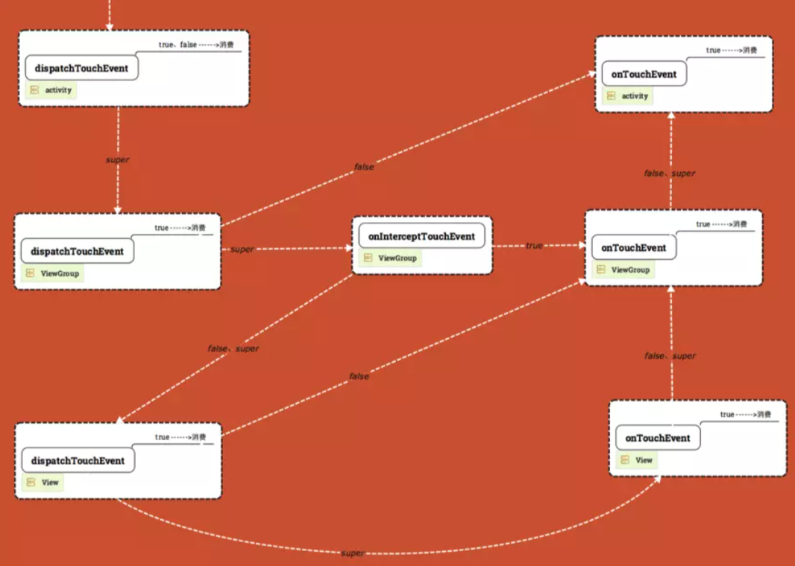

#### 1.触摸事件的类型

- ACTION_DOWN:用户手指的按下操作,一个按下操作标志着一次触摸事件的开始
- ACTION_MOVE:用户手指按压屏幕后,在松开之前,如果移动的距离超过一定的阈值,那么会被判定为ACTION_MOVE操作,一般情况下,手指的轻微移动都会触发一系列的移动事件
- ACTION_UP:用户手指离开屏幕的操作,一般情况下,手指的轻微移动都会触发一系列触摸时间的结束

在一次屏幕触摸操作中,ACTION_DOWN和ACTION_UP这两个事件是必需的,而ACTION_MOVE视情况而定,如果用户仅仅是点击了一下屏幕,那么可能只会监测到按下和抬起的动作

#### 2.事件传递的三个阶段

- 分发: Dispatch: dispatchTouchEvent
- 拦截: Intercept: onInterceptTouchEvent
- 消费: Consume: onTouchEvent 
  - 如果当前视图不消费该事件则会向上传递

在android系统中,拥有事件传递处理能力的类有以下三种:

- Activity: 拥有dispatchTouchEvent 和 onTouchEvent
- ViewGroup: 拥有dispatchTouchEvent, onInterceptTouchEvent 和onTouchEvent
- View:拥有dispatchTouchEvent 和 onTouchEvent

#### 3.View事件传递机制实例

##### 3.1 事件分发的流程


 



```java
2020-06-12 21:07:02.888 29330-29330/com.example.view_touch I/hrxMainActivty: dispatchTouchEvent - MotionEvent.ACTION_DOWN   // Activity 分发
2020-06-12 21:07:02.889 29330-29330/com.example.view_touch I/hrxviewgroup: dispatchTouchEvent // Activity-super调用View Group 分发
2020-06-12 21:07:02.889 29330-29330/com.example.view_touch I/hrxviewgroup: onInterceptTouchEvent  // View Group--super 走拦截
2020-06-12 21:07:02.889 29330-29330/com.example.view_touch I/hrxmytx: dispatchTouchEvent
// 未拦截 text进行分发
2020-06-12 21:07:02.889 29330-29330/com.example.view_touch I/hrxMainActivty: onTouch

2020-06-12 21:07:02.889 29330-29330/com.example.view_touch I/hrxmytx: onTouchEvent
// text 分发的super  调用 text的onTouchEvent
2020-06-12 21:07:02.890 29330-29330/com.example.view_touch I/hrxviewgroup: onTouchEvent

// 调用Activity的onTouch  之后就是Activity  的 dispatchTouchEvent-onTouchEvent(MOVE - UP)
2020-06-12 21:07:02.893 29330-29330/com.example.view_touch I/hrxMainActivty: onTouchEvent - MotionEvent.ACTION_DOWN
2020-06-12 21:07:02.913 29330-29330/com.example.view_touch I/hrxMainActivty: dispatchTouchEvent - MotionEvent.ACTION_MOVE
2020-06-12 21:07:02.913 29330-29330/com.example.view_touch I/hrxMainActivty: onTouchEvent - MotionEvent.ACTION_MOVE
2020-06-12 21:07:02.913 29330-29330/com.example.view_touch I/hrxMainActivty: dispatchTouchEvent result - false
2020-06-12 21:07:02.913 29330-29330/com.example.view_touch I/hrxMainActivty: onTouchEvent - MotionEvent.ACTION_MOVE
2020-06-12 21:07:02.962 29330-29330/com.example.view_touch I/hrxMainActivty: dispatchTouchEvent - MotionEvent.ACTION_MOVE
2020-06-12 21:07:02.962 29330-29330/com.example.view_touch I/hrxMainActivty: onTouchEvent - MotionEvent.ACTION_MOVE
2020-06-12 21:07:02.962 29330-29330/com.example.view_touch I/hrxMainActivty: dispatchTouchEvent result - false
2020-06-12 21:07:02.962 29330-29330/com.example.view_touch I/hrxMainActivty: onTouchEvent - MotionEvent.ACTION_MOVE
2020-06-12 21:07:02.978 29330-29330/com.example.view_touch I/hrxMainActivty: dispatchTouchEvent - MotionEvent.ACTION_MOVE
2020-06-12 21:07:02.979 29330-29330/com.example.view_touch I/hrxMainActivty: onTouchEvent - MotionEvent.ACTION_MOVE
2020-06-12 21:07:02.979 29330-29330/com.example.view_touch I/hrxMainActivty: dispatchTouchEvent result - false
2020-06-12 21:07:02.979 29330-29330/com.example.view_touch I/hrxMainActivty: onTouchEvent - MotionEvent.ACTION_MOVE
2020-06-12 21:07:02.980 29330-29330/com.example.view_touch I/hrxMainActivty: dispatchTouchEvent - MotionEvent.ACTION_UP
2020-06-12 21:07:02.980 29330-29330/com.example.view_touch I/hrxMainActivty: onTouchEvent - MotionEvent.ACTION_UP
2020-06-12 21:07:02.981 29330-29330/com.example.view_touch I/hrxMainActivty: dispatchTouchEvent result - false
2020-06-12 21:07:02.981 29330-29330/com.example.view_touch I/hrxMainActivty: onTouchEvent - MotionEvent.ACTION_UP
```

#####3.2 事件不中断,整个事件流向是一个类U型图


有几个辅助的总结可以辅助对分发流程的记忆

场景自上而下  **Activity —> ViewGroup —> View**

- 全部调用super  自上而下  Activity:dispatchTouchEvent——>ViewGroup:dispatchTouchEvent->onInterceptEvent ——> View:dispatchTouchEvent->onTouchEvent —— >ViewGroup:onTouchEvent

  ——>Activity:onTouchEvent

- dispatchTouchEvent:  

  - Activity:true&false 均消费   
  - ViewGroup:true消费,false直接回溯父类的onTouchEvent,super走当前的onInterceptTouchEvent
  - View:true消费,false直接回溯父类的onTouchEvent,super走当前的onTouchEvent

- onInterceptTouchEvent:super&false走子层的dispatchTouchEvent,true走本层的onTouchEvent


##### 3.3 dispatchTouchEvent和onTouchEvent一旦返回true,事件终止


##### 3.4 dispatchTouchEvent和onTouchEvent一旦返回false,事件回传父类


- dispatchTouchEvent返回false(上层Activity除外),回溯到上层的onTouchEvent
- onTouchEvent返回false,回溯到上层进行消费

##### 3.5 所有方法返回super,完全按照U型图进行传递

##### 3.6 onInterceptTouchEvent

拦截仅仅是ViewGroup有的方法


ViewGroup分发调用super之后需要care是否拦截,如果return false&super 则事件传递到下层的dispatchTouchEvent,return true则将事件传递给onTouchEvent


