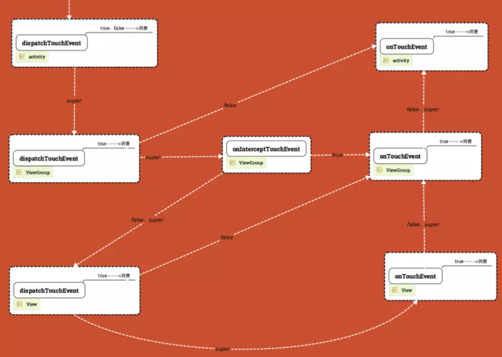
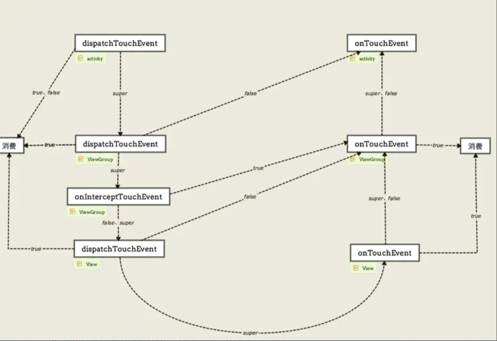

#### 1. 事件分发概述



下面我们来看源码

#### 2.Activity — dispatchTouchEvent



```java
public boolean dispatchTouchEvent(MotionEvent ev) {
    if (ev.getAction() == MotionEvent.ACTION_DOWN) {
      	// 实现屏保功能
      	// 该方法是空方法
      	// 当Activity在栈顶时,触屏点击按home,back,menu键等都会触发此方法
        onUserInteraction();
    }
  	// 会调Window的superDispatchTouchEvent
    if (getWindow().superDispatchTouchEvent(ev)) {
        return true;
    }
  	// 如果子层不消费  上层进行消费
    return onTouchEvent(ev);
}
```

可以看到

- dispatchTouchEvent的决策是自上而下的dispatchTouchEvent嵌套共同决定的
- Activty - dispatchTouchEvent返回true & false,则当前dispatchTouchEvent消费
- 如果return super,且下层的dispatchTouchEvent return false  则回溯到本层消费


#### 3 核心代码:getWindow().superDispatchTouchEvent(ev)

> 这里是ViewGroup的分发逻辑

这里的window是phoneWindow就是Activity的窗口

```java
@Override
public boolean superDispatchTouchEvent(MotionEvent event) {
    //mDecor是DecorView,是一个FramLayout
    return mDecor.superDispatchTouchEvent(event);
}

public boolean superDispatchTouchEvent(MotionEvent event) {
    return super.dispatchTouchEvent(event);
}


```

之后的代码比较长

```java

@Override
public boolean dispatchTouchEvent(MotionEvent ev) {
    ......
        // Handle an initial down.
        if (actionMasked == MotionEvent.ACTION_DOWN) {
          	// down事件之前要清空之前的状态  状态复位
            cancelAndClearTouchTargets(ev);
            resetTouchState();
        }

        // Check for interception.
  			// 进行拦截
        final boolean intercepted;
        if (actionMasked == MotionEvent.ACTION_DOWN
                || mFirstTouchTarget != null) {
            final boolean disallowIntercept = (mGroupFlags & FLAG_DISALLOW_INTERCEPT) != 0;
            if (!disallowIntercept) {
                intercepted = onInterceptTouchEvent(ev);
                ev.setAction(action); // restore action in case it was changed
            } else {
                intercepted = false;
            }
        } else {
            // There are no touch targets and this action is not an initial down
            // so this view group continues to intercept touches.
            intercepted = true;
        }

        ....
        // Check for cancelation.
        final boolean canceled = resetCancelNextUpFlag(this)
                || actionMasked == MotionEvent.ACTION_CANCEL;

        .......

        // 根据分发和拦截继续向下分发
        if (mFirstTouchTarget == null) {
            // No touch targets so treat this as an ordinary view.
            handled = dispatchTransformedTouchEvent(ev, canceled, null,
                    TouchTarget.ALL_POINTER_IDS);
        } else {
            // Dispatch to touch targets, excluding the new touch target if we already
            // dispatched to it.  Cancel touch targets if necessary.
            TouchTarget predecessor = null;
            TouchTarget target = mFirstTouchTarget;
            while (target != null) {
                final TouchTarget next = target.next;
                if (alreadyDispatchedToNewTouchTarget && target == newTouchTarget) {
                    handled = true;
                } else {
                    final boolean cancelChild = resetCancelNextUpFlag(target.child)
                            || intercepted;
                    if (dispatchTransformedTouchEvent(ev, cancelChild,
                            target.child, target.pointerIdBits)) {
                        handled = true;
                    }
                    if (cancelChild) {
                        if (predecessor == null) {
                            mFirstTouchTarget = next;
                        } else {
                            predecessor.next = next;
                        }
                        target.recycle();
                        target = next;
                        continue;
                    }
                }
                predecessor = target;
                target = next;
            }
        }

        // Update list of touch targets for pointer up or cancel, if needed.
        if (canceled
                || actionMasked == MotionEvent.ACTION_UP
                || actionMasked == MotionEvent.ACTION_HOVER_MOVE) {
            resetTouchState();
        } else if (split && actionMasked == MotionEvent.ACTION_POINTER_UP) {
            final int actionIndex = ev.getActionIndex();
            final int idBitsToRemove = 1 << ev.getPointerId(actionIndex);
            removePointersFromTouchTargets(idBitsToRemove);
        }
    }

    if (!handled && mInputEventConsistencyVerifier != null) {
        mInputEventConsistencyVerifier.onUnhandledEvent(ev, 1);
    }
    return handled;
}

// 子View  或者 下层ViewGroup的分发
private boolean dispatchTransformedTouchEvent(MotionEvent event, boolean cancel,
            View child, int desiredPointerIdBits) {
        final boolean handled;

  
        final int oldAction = event.getAction();
        if (cancel || oldAction == MotionEvent.ACTION_CANCEL) {
            event.setAction(MotionEvent.ACTION_CANCEL);
            if (child == null) {
              	// 在子viewGroup分发
                handled = super.dispatchTouchEvent(event);
            } else {
                // 子View分发
                handled = child.dispatchTouchEvent(event);
            }
            event.setAction(oldAction);
            return handled;
        }

        // Calculate the number of pointers to deliver.
        final int oldPointerIdBits = event.getPointerIdBits();
        final int newPointerIdBits = oldPointerIdBits & desiredPointerIdBits;


        if (newPointerIdBits == 0) {
            return false;
        }

        
        final MotionEvent transformedEvent;
        if (newPointerIdBits == oldPointerIdBits) {
            if (child == null || child.hasIdentityMatrix()) {
                if (child == null) {
                    handled = super.dispatchTouchEvent(event);
                } else {
                    final float offsetX = mScrollX - child.mLeft;
                    final float offsetY = mScrollY - child.mTop;
                    event.offsetLocation(offsetX, offsetY);

                    handled = child.dispatchTouchEvent(event);

                    event.offsetLocation(-offsetX, -offsetY);
                }
                return handled;
            }
            transformedEvent = MotionEvent.obtain(event);
        } else {
            transformedEvent = event.split(newPointerIdBits);
        }

        // Perform any necessary transformations and dispatch.
        if (child == null) {
            handled = super.dispatchTouchEvent(transformedEvent);
        } else {
            final float offsetX = mScrollX - child.mLeft;
            final float offsetY = mScrollY - child.mTop;
            transformedEvent.offsetLocation(offsetX, offsetY);
            if (! child.hasIdentityMatrix()) {
                transformedEvent.transform(child.getInverseMatrix());
            }

            handled = child.dispatchTouchEvent(transformedEvent);
        }

        // Done.
        transformedEvent.recycle();
        return handled;
    }
```

这样来看 dispatch是嵌套关系 

ViewGroup调用dispatchTouchEvent会走上面的代码段:

- 首先在**ACTION_DOWN**代表新的事件分发流程开始,所以要清空之前的状态和事件:

  ```java
  	// down事件之前要清空之前的状态  状态复位
  	cancelAndClearTouchTargets(ev);
  	resetTouchState();
  ```

- 然后是进行拦截的逻辑

  ```java
  final boolean intercepted;
          if (actionMasked == MotionEvent.ACTION_DOWN
                  || mFirstTouchTarget != null) {
              final boolean disallowIntercept = (mGroupFlags & FLAG_DISALLOW_INTERCEPT) != 0;
              if (!disallowIntercept) {
                  intercepted = onInterceptTouchEvent(ev);
                  ev.setAction(action); // restore action in case it was changed
              } else {
                  intercepted = false;
              }
          } else {
          		// target1
              intercepted = true;
          }
  ```

  这是拦截的策略

  - target1:没有触摸目标,并且此动作不是最初的(非**ACTION_DOWN**),则之后视图组持续拦截

- 其次,父 View 会为子View 创建一个 TouchTarget 实例加入链表中，链表的第一项为 mFirstTouchTarget。后续的 move 和 up 事件会直接交给该 View的dispatchTouchEvent。

#### 4 VireGroup拦截逻辑之后进行分发逻辑

```java
if (!canceled && !intercepted) {
                View childWithAccessibilityFocus = ev.isTargetAccessibilityFocus()
                        ? findChildWithAccessibilityFocus() : null;

                if (actionMasked == MotionEvent.ACTION_DOWN
                        || (split && actionMasked == MotionEvent.ACTION_POINTER_DOWN)
                        || actionMasked == MotionEvent.ACTION_HOVER_MOVE) {
                    final int actionIndex = ev.getActionIndex(); // always 0 for down
                    final int idBitsToAssign = split ? 1 << ev.getPointerId(actionIndex)
                            : TouchTarget.ALL_POINTER_IDS;

                   
                    removePointersFromTouchTargets(idBitsToAssign);

                    final int childrenCount = mChildrenCount;
                    if (newTouchTarget == null && childrenCount != 0) {
                        final float x = ev.getX(actionIndex);
                        final float y = ev.getY(actionIndex);
                
                        final ArrayList<View> preorderedList = buildTouchDispatchChildList();
                        final boolean customOrder = preorderedList == null
                                && isChildrenDrawingOrderEnabled();
                        final View[] children = mChildren;
                        for (int i = childrenCount - 1; i >= 0; i--) {
                            final int childIndex = getAndVerifyPreorderedIndex(
                                    childrenCount, i, customOrder);
                            final View child = getAndVerifyPreorderedView(
                                    preorderedList, children, childIndex);

                            if (childWithAccessibilityFocus != null) {
                                if (childWithAccessibilityFocus != child) {
                                    continue;
                                }
                                childWithAccessibilityFocus = null;
                                i = childrenCount - 1;
                            }

                            if (!canViewReceivePointerEvents(child)
                                    || !isTransformedTouchPointInView(x, y, child, null)) {
                                ev.setTargetAccessibilityFocus(false);
                                continue;
                            }

                            newTouchTarget = getTouchTarget(child);
                            if (newTouchTarget != null) {
           
                                newTouchTarget.pointerIdBits |= idBitsToAssign;
                                break;
                            }

                            resetCancelNextUpFlag(child);
                            if (dispatchTransformedTouchEvent(ev, false, child, idBitsToAssign)) {
                      
                                mLastTouchDownTime = ev.getDownTime();
                                if (preorderedList != null) {
                                 
                                    for (int j = 0; j < childrenCount; j++) {
                                        if (children[childIndex] == mChildren[j]) {
                                            mLastTouchDownIndex = j;
                                            break;
                                        }
                                    }
                                } else {
                                    mLastTouchDownIndex = childIndex;
                                }
                                mLastTouchDownX = ev.getX();
                                mLastTouchDownY = ev.getY();
                                newTouchTarget = addTouchTarget(child, idBitsToAssign);
                                alreadyDispatchedToNewTouchTarget = true;
                                break;
                            }

                            ev.setTargetAccessibilityFocus(false);
                        }
                        if (preorderedList != null) preorderedList.clear();
                    }

                    if (newTouchTarget == null && mFirstTouchTarget != null) {
                 
                        newTouchTarget = mFirstTouchTarget;
                        while (newTouchTarget.next != null) {
                            newTouchTarget = newTouchTarget.next;
                        }
                        newTouchTarget.pointerIdBits |= idBitsToAssign;
                    }
                }
            }
```

- 如果没有拦截,则要进行下一层的分发,需要根据子view的坐标来确定子view的位置来进行下一步的分发,并把child加入touchTarget这个链表

  

```java
 						// Dispatch to touch targets.
            if (mFirstTouchTarget == null) {
                // No touch targets so treat this as an ordinary view.
                handled = dispatchTransformedTouchEvent(ev, canceled, null,
                        TouchTarget.ALL_POINTER_IDS);
            } else {
                // Dispatch to touch targets, excluding the new touch target if we already
                // dispatched to it.  Cancel touch targets if necessary.
                TouchTarget predecessor = null;
                TouchTarget target = mFirstTouchTarget;
                while (target != null) {
                    final TouchTarget next = target.next;
                    if (alreadyDispatchedToNewTouchTarget && target == newTouchTarget) {
                        handled = true;
                    } else {
                        final boolean cancelChild = resetCancelNextUpFlag(target.child)
                                || intercepted;
                        if (dispatchTransformedTouchEvent(ev, cancelChild,
                                target.child, target.pointerIdBits)) {
                            handled = true;
                        }
                        if (cancelChild) {
                            if (predecessor == null) {
                                mFirstTouchTarget = next;
                            } else {
                                predecessor.next = next;
                            }
                            target.recycle();
                            target = next;
                            continue;
                        }
                    }
                    predecessor = target;
                    target = next;
                }
            }
```

我们整理一下代码 ,缩减成一个比较明了的代码逻辑

```java
public boolean dispatchTouchEvent(MotionEvent e) {
    boolean handled = false;
    if (onInterceptTouchEvent(e)) {
        //如果拦截  则在ViewGroup中消费时间
        handled = onTouchEvent(e);
    } else {
        for (View view: childs) {
            //Event在子View的处理结果
            handled = view.dispatchTouchEvent(e);
            if (handled) {
                break;
            }
        }
        //子View没有消费event 返回false ViewGroup自行处理  
        //当然  如果ViewGroup仍然返回false则继续向上传递
        if (!handled) {
            handled = onTouchEvent(e);
        }
    }   
    return consumed;
}
```

ViewGroup拦截 则ViewGroup进行onTouch事件


##### 2.2 子View的dispatch

```java
public boolean dispatchTouchEvent(MotionEvent event) {
    // If the event should be handled by accessibility focus first.
    if (event.isTargetAccessibilityFocus()) {
        // We don't have focus or no virtual descendant has it, do not handle the event.
        if (!isAccessibilityFocusedViewOrHost()) {
            return false;
        }
        // We have focus and got the event, then use normal event dispatch.
        event.setTargetAccessibilityFocus(false);
    }

    boolean result = false;

    if (mInputEventConsistencyVerifier != null) {
        mInputEventConsistencyVerifier.onTouchEvent(event, 0);
    }

    final int actionMasked = event.getActionMasked();
    if (actionMasked == MotionEvent.ACTION_DOWN) {
        // Defensive cleanup for new gesture
        stopNestedScroll();
    }

    if (onFilterTouchEventForSecurity(event)) {
        if ((mViewFlags & ENABLED_MASK) == ENABLED && handleScrollBarDragging(event)) {
            result = true;
        }
        //noinspection SimplifiableIfStatement
        ListenerInfo li = mListenerInfo;
        if (li != null && li.mOnTouchListener != null
                && (mViewFlags & ENABLED_MASK) == ENABLED
                && li.mOnTouchListener.onTouch(this, event)) {
            result = true;
        }
				
      
        if (!result && onTouchEvent(event)) {
            result = true;
        }
    }

    if (!result && mInputEventConsistencyVerifier != null) {
        mInputEventConsistencyVerifier.onUnhandledEvent(event, 0);
    }

    // Clean up after nested scrolls if this is the end of a gesture;
    // also cancel it if we tried an ACTION_DOWN but we didn't want the rest
    // of the gesture.
    if (actionMasked == MotionEvent.ACTION_UP ||
            actionMasked == MotionEvent.ACTION_CANCEL ||
            (actionMasked == MotionEvent.ACTION_DOWN && !result)) {
        stopNestedScroll();
    }

    return result;
}
```

这里需要注意一下在View的dispatchTouchEvent中, View 为 ENABLE 的状态并且有 mTouchListener，会先调用 onTouch。在 onTouch 返回 false 时才会继续调用 onTouchEvent,然后在onTouchEvent中调用performClick,返回true则事件消费,返回false则向上传递;
