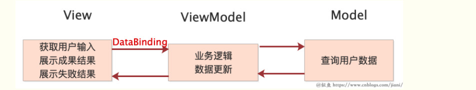
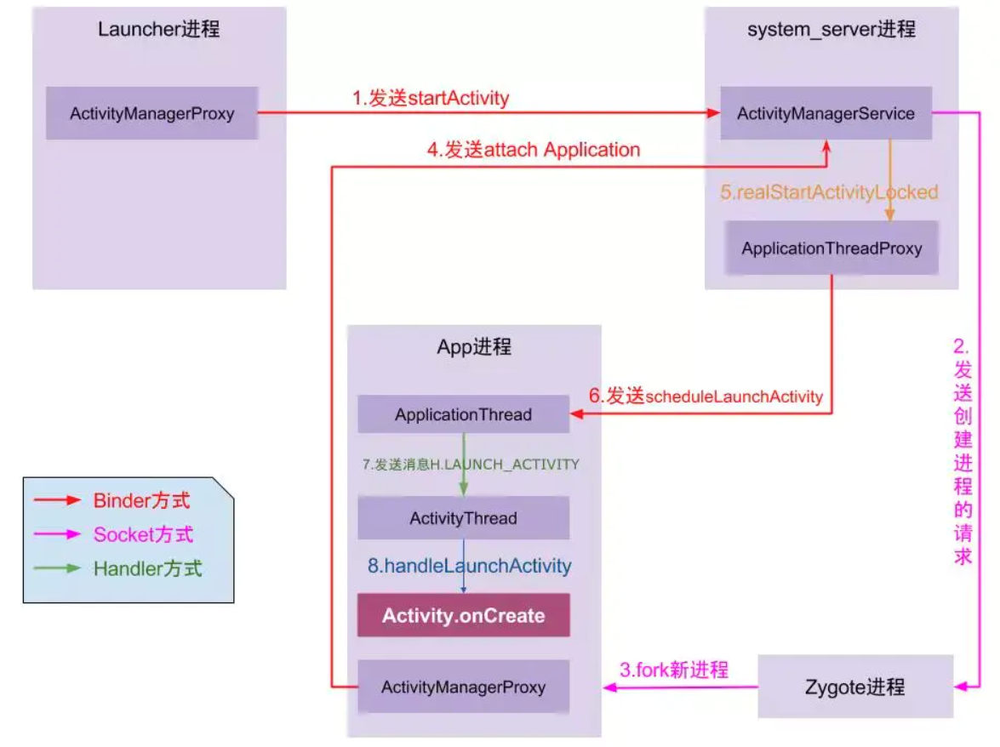
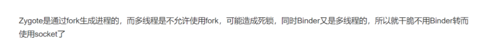
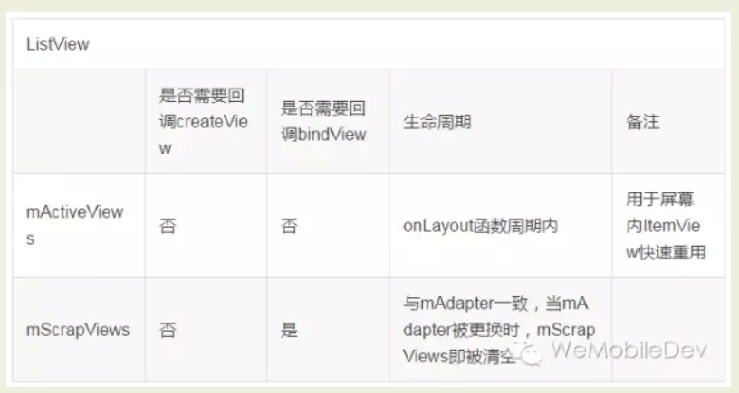
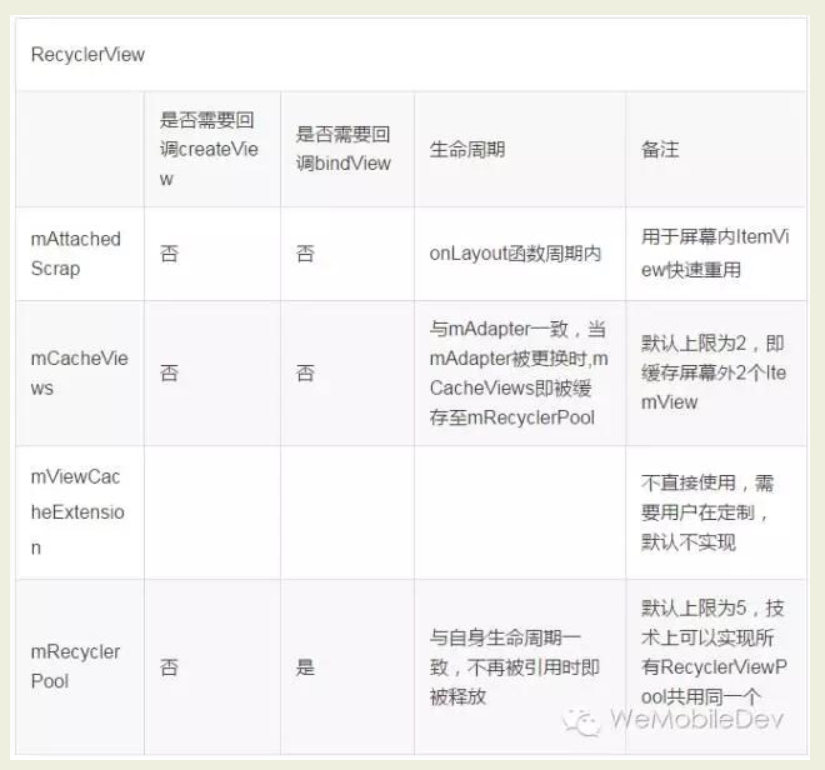
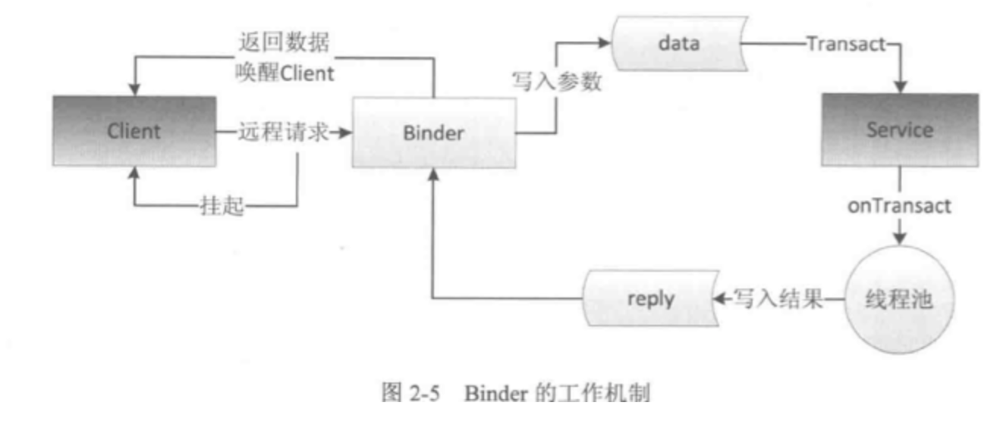
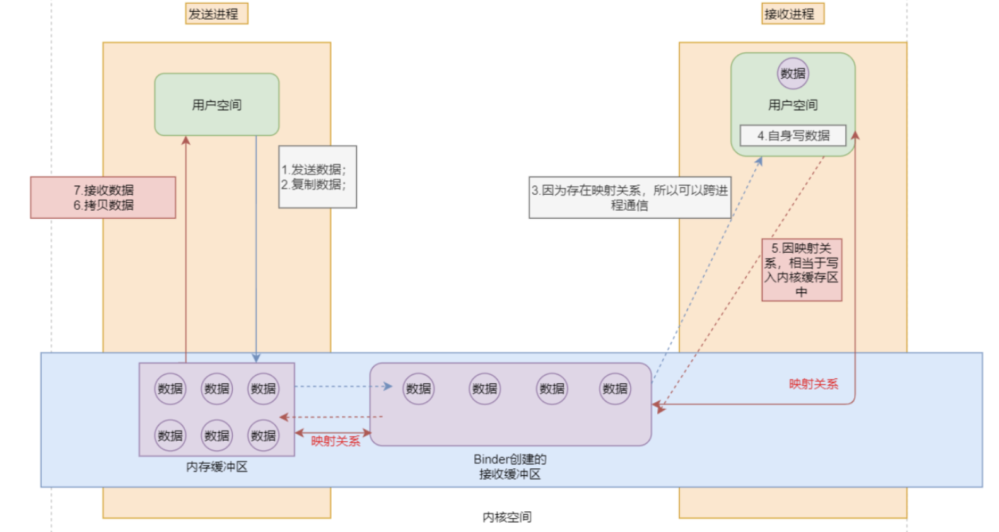

####1.MVVM  & jetpack — ok

####2.绘制  ---ok

####3.分发 --- ok

优先级  onTouch  — onTouchEvent — Click

####4.android类加载 — ok

- dexclassloader加载外部apk(.dex):将外部的.dex,.jar加载到dexpathlist中(.dex,.jar文件分割)
- pathclassloader加载内部apk(.dex)
- 加载类时候可以将插件和内部的dexElements进行合并,然后可以进行类加载
- AMShook:  IActivityManager监听startActivity替换Activity(插件Activity已换为占位的Activity)
- launcherhook:在ActivityThread中在intent里面替换intent为目标Activity(偷梁换柱)

#### 5.android启动流程— ok

#### 6.android热修复

####7.idealHandler — ok

#### 8.WebView优化

- 开独立进程
- 使用动态代码在viewgroup中添加webview— 周期控制
- 为了防止内存泄露,使用context为application context
- 被动杀死时候在onSaveInstanceState中调用webview的saveState

####9.AMS — ok&.android启动流程— ok

启动ap:

**launcher**本身是一个Activity,就是说桌面本身是一个Activity,每个icon是一个button (binder调用)

—>SystemService—>通过socket请求zygote—>zygote通过socket fork 一个app进程—>请求systemservice开启线程—>通过binder调用app进程(ActivityThread)

#### 10.ListView和RecylerView  — ok

ListView：
- 继承重写BaseAdapter类；

- 自定义ViewHolder与convertView的优化（判断是否为null）；
- 有添加头和尾部的API
- 没有动画效果
- 不能实现局部刷新

RecyclerView：
- 继承重写RecyclerView.Adapter与RecyclerView.ViewHolder

- 设置LayoutManager，以及layout的布局效果
- 没有API需要自己实现
- 有动画效果,notifyItemChanged(), notifyDataInserted(), notifyItemMoved()
- 可以实现局部刷新

listView 2级缓存

RecyclerView 4级缓存

####11.AIDL — ok

- 编写aidl文件,server和client必须在同目录,然后build会生成对应java文件
- binder初始化bindservice返回,通过asInterface返回aidl实例进行调用
  - 如果进程就走Stub的onTransact进行同进程调用
  - 不同进程返回  Stub.Proxy
- 不同进程调用  入参会写入_data,出参是reply,调用远程rpc(mmap),然后调用客户端的onTransact,然后返回__reply,客户端就拿到其结果

- data和reply的写入依赖与javabean的序列化实现Parcelable

#### 12.多线程操作hashmap会成环

当容量超过 当前容量*负载因子  > max  进行扩容 transfer rehash — 重新hash  e.hash&length-1

若当前线程此时获得ertry节点，但是被线程中断无法继续执行，此时线程二进入transfer函数，并把函数顺利执行，此时新表中的某个位置有了节点，之后线程一获得执行权继续执行，因为并发transfer，所以两者都是扩容的同一个链表，当线程一执行到e.next = new table[i] 的时候，由于线程二之前数据迁移的原因导致此时new table[i] 上就有ertry存在，所以线程一执行的时候，会将next节点，设置为自己，导致自己互相使用next引用对方，因此产生链表，导致死循环。

#### 13.java注解

注解分类：

- @RetentionPolicy：表示注解保留到哪个阶段。

- @Target：表示该注解可以用于什么地方。

- @Documented：表示将注解包含在 Javadoc 中。

- @Inherite：表示允许子类继承父类中的注解。

  

**@RetentionPolicy中的参数说明：**

SOURCE：注解将被编译器丢弃。

CLASS：注解在class文件中可用，但会被VM丢弃。
RUNTIME：VM将在运行期间保留注解，因此可以通过反射机制读取注解的信息。
**@RetentionPolicy中的ElementType参数值说明**：

TYPE：类、接口（包括注解类型）或enum声明
FIELD：域声明（包括enum实例）
METHOD：方法声明
PARAMETER：参数声明
CONSTRUCTOR：构造函数声明
LOCAL_VARIABLE：局部变量声明
ANNOTATION_TYPE：注解类型声明
PACKAGE：包声明
TYPE_PARAMETER：类型参数（在1.8中添加)
TYPE_USE：类型使用（在1.8中添加)
注解具有的一般功能：

根据代码里面标识的相应注解生成Javadoc。
根据代码里面标识的相应注解在运行时执行相应的行为。
根据代码里面标识的相应注解在编译时进行代码扫描检测。
根据代码里面标识的相应注解在编译时生成Java类，文本文件等。

