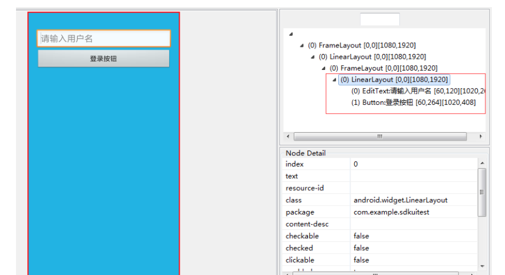

#### 1. ANR

不同的组件发生 ANR 的时间不一样，Activity 是 5 秒，BroadCastReceiver 是 10
秒，Service 是 20 秒(均为前台)。

**如果开发机器上出现问题，我们可以通过查看/data/anr/traces.txt 即可，最新的
ANR 信息在最开始部分。**

- 主线程被 IO 操作(从 4.0 之后网络 IO 不允许在主线程中)阻塞。
- 主线程中存在耗时的计算
-  主线程中错误的操作，比如 Thread.wait 或者 Thread.sleep 等 Android 系 统会监控程序的响应状况，一旦出现下面两种情况，则弹出 ANR 对话框 
  - 应用在 5 秒内未响应用户的输入事件(如按键或者触摸) 
  -    BroadcastReceiver 未在 10 秒内完成相关的处理 
  -    Service 在特定的时间内无法处理完成 20 秒 

修正

1、使用 AsyncTask 处理耗时 IO 操作。 

2、使用 Thread 或者 HandlerThread 时，调用 Process.setThreadPriority(Process.THREAD_PRIORITY_BACKGROUND)设置优先 级，否则仍然会降低程序响应，因为默认 Thread 的优先级和主线程相同。 

3、使用 Handler 处理工作线程结果，而不是使用 Thread.wait()或者 Thread.sleep() 来阻塞主线程。 

4、Activity 的 onCreate 和 onResume 回调中尽量避免耗时的代码。 

BroadcastReceiver 中 onReceive 代码也要尽量减少耗时，建议使用 IntentService 处理。 

解决方案

1. 将所有耗时操作，比如访问网络，Socket 通信，查询大 量 SQL 语句，复杂逻 辑计算等都放在子线程中去，然 后通过 handler.sendMessage、runonUIThread、 

   AsyncTask、RxJava 等方式更新 UI。无论如何都要确保用户界面的流畅 度。如 果耗时操作需要让用户等待，那么可以在界面上显示度条。 


#### 2. Activity和fragment生命周期


#### 3. AsyncTask


AsyncTask初始化(woker&FutureTask) —> execute() —> AsyncTask:onPreExecute()—>线程池执行  FutureTask.run—>worker.call:doInBackground —> call返回result—>调用FutureTask.done—>handle切换:根据case调用onProgressUpdate(需要主动调用)或者onPostExecute


关于线程池: 

AsyncTask 对应的线程池 ThreadPoolExecutor 都是进程范围内共享的，且都是 static 的，所以是 Asynctask 控制着进程范围内所有的子类实例。由于这个限制 的存在，当使用默认线程池时，如果线程数超过线程池的最大容量，线程池就会 爆掉(3.0 后默认串行执行，不会出现个问题)。针对这种情况，可以尝试自定义 线程池，配合 Asynctask 使用。 

关于默认线程池: 

AsyncTask 里面线程池是一个核心线程数为 CPU + 1，最大线程数为 CPU * 2 + 1， 工作队列长度为 128 的线程池，线程等待队列的最大等待数为 28，但是可以自 定义线程池。线程池是由 AsyncTask 来处理的，线程池允许 tasks 并行运行，需 要注意的是并发情况下数据的一致性问题，新数据可能会被老数据覆盖掉。所以 希望 tasks 能够串行运行的话，使用 SERIAL_EXECUTOR。 

2.内存泄漏 

如果 AsyncTask 被声明为 Activity 的非静态内部类，那么 AsyncTask 会保留一个 对 Activity 的引用。如果 Activity 已经被销毁，AsyncTask 的后台线程还在执行， 它将继续在内存里保留这个引用，导致 Activity 无法被回收，引起内存泄漏。 


3.结果丢失 

屏幕旋转或 Activity 在后台被系统杀掉等情况会导致 Activity 的重新创建，之前 运行的 AsyncTask 会持有一个之前 Activity 的引用，这个引用已经无效，这时调 用 onPostExecute()再去更新界面将不再生效。 


4.并行还是串行 

在 Android1.6 之前的版本，AsyncTask 是串行的，在 1.6 之后的版本，采用线程 池处理并行任务，但是从 Android 3.0 开始，为了避免 AsyncTask 所带来的并发 错误，又采用一个线程来串行执行任务。可以使用 executeOnExecutor()方法来 并行地执行任务。


-   AsyncTask 中 有 两 个 线 程 池 ( SerialExecutor 和 THREAD_POOL_EXECUTOR)和一个 Handler(InternalHandler)，其中 线程池 SerialExecutor 用于任务的排队，而线程池 

  THREAD_POOL_EXECUTOR 用于真正地执行任务，InternalHandler 用于 将执行环境从线程池切换到主线程。 

  **排队是串行,执行是并行**

-    sHandler 是一个静态的 Handler 对象，为了能够将执行环境切换到主线 程，这就要求 sHandler 这个对象必须在主线程创建。由于静态成员会在 加载类的时候进行初始化，因此这就变相要求 AsyncTask 的类必须在主线 程中加载，否则同一个进程中的 AsyncTask 都将无法正常工作 


#### 4.android中进程的优先级

- 前台进程:
   即与用户正在交互的 Activity 或者 Activity 用到的 Service 等，如果系统内存不足 时前台进程是最晚被杀死的 

- 可见进程: 

  可以是处于暂停状态(onPause)的 Activity 或者绑定在其上的 Service，即被用户 可见，但由于失了焦点而不能与用户交互 

- 服务进程:
   其中运行着使用 startService 方法启动的 Service，虽然不被用户可见，但是却是 用户关心的，例如用户正在非音乐界面听的音乐或者正在非下载页面下载的文件 等;当系统要空间运行，前两者进程才会被终止 

- 后台进程:
   其中运行着执行 onStop 方法而停止的程序，但是却不是用户当前关心的，例如 后台挂着的 QQ，这时的进程系统一旦没了有内存就首先被杀死 

- 空进程: 不包含任何应用程序的进程，这样的进程系统是一般不会让他存在的 


 #### 5. Parcelable和Serializable的区别

1）在使用内存的时候，Parcelable比Serializable性能高，所以推荐使用Parcelable。

2）Serializable在序列化的时候会产生大量的临时变量，从而引起频繁的GC。

3）Parcelable不能使用在要将数据存储在磁盘上的情况，因为Parcelable不能很好的保证数据的持续性在外界有变化的情况下。尽管Serializable效率低点，但此时还是建议使用Serializable 。

4）android上应该尽量采用Parcelable，效率至上，效率远高于Serializable。


Parcelable（Android专用）：Parcelable方式的实现原理是将一个完整的对象进行分解，用起来比较麻烦，但我们有工具，还是很简单的具体如下

方法：1.继承 Parcelable

​          2、复写两个方法，分别是describeContents和writeToParcel

​          3、实例化静态内部对象CREATOR，实现接口Parcelable.Creator 。


**可以肯定的是，两者都是支持序列化和反序列化的操作。**

两者最大的区别在于 存储媒介的不同，Serializable 使用 I/O 读写存储在硬盘 上，而 Parcelable 是直接 在内存中读写。很明显，内存的读写速度通常大于 IO 读写，所以在 Android 中传递数据优先选择 Parcelable。 

Serializable 会使用反射，序列化和反序列化过程需要大量 I/O 操作， Parcelable 自已实现封送和解封(marshalled &unmarshalled)操作不需要用反 射，数据也存放在 Native 内存中，效率要快很多。 


####  6. 动画

**它们的区别:** 

属性动画才是真正的实现了 view 的移动，补间动画对 view 的移动更像是在不 同地方绘制了一个影子，实际对象还是处于原来的地方。当动画的 repeatCount 设置为无限循环时，如果在 Activity 退出时没有及时将动画停止，属性动画会导 致 Activity 无法释放而导致内存泄漏，而补间动画却没问题。 xml 文件实现的 补间动画，复用率极高。在 Activity 切换，窗口弹出时等情景中有着很好的效果。 使用帧动画时需要注意，不要使用过多特别大的图，容导致内存不足。 

**为什么属性动画移动后仍可点击?**

播放补间动画的时候，我们所看到的变化，都只是临时的。而属性动画呢，它所 

改变的东西，却会更新到这个 View 所对应的矩阵中，所以当 ViewGroup 分派事 

件的时候，会正确的将当前触摸坐标，转换成矩阵变化后的坐标，这就是为什么 播放补间动画不会改变触摸区域的原因了 


**插值器:计算变化的分数,根据时间流逝来计算属性变化的百分比**

**估值器:在插值器基础上计算属性的变化  start + 百分比(end-start)**

#### 7. context相关


- Context是一个抽象类，其通用实现在ContextImpl类中。

- Context：是一个访问application环境全局信息的接口，通过它可以访问application的资源和相关的类，其主要功能如下：
  - 启动Activity
  - 启动和停止Service
  - 发送广播消息(Intent)
  - 注册广播消息(Intent)接收者
  - 可以访问APK中各种资源(如Resources和AssetManager等)
  - 可以访问Package的相关信息
  - APK的各种权限管理
- 1、Activity 和 Service 以及 Application 的 Context 是不一样的,Activity 继
  承自 ContextThemeWraper.其他的继承自 ContextWrapper。
- 2、每一个 Activity 和 Service 以及 Application 的 Context 是一个新的
  ContextImpl 对象。
- 3、**getApplication()用来获取 Application 实例的，但是这个方法只有在
  Activity 和 Service 中才能调用的到。那也许在绝大多数情况下我们都是在
  Activity 或者 Servic 中使用 Application 的**，但是如果在一些其它的场景，
  **比如 BroadcastReceiver 中也想获得 Application 的实例，这时就可以借助
  getApplicationContext()方法，getApplicationContext()比 getApplication()
  方法的作用域会更广一些，任何一个 Context 的实例，只要调用getApplicationContext()方法都可以拿到我们的 Application 对象。**
- 4、创建对话框时不可以用 Application 的 context，只能用 Activity 的
  context。
- 5、Context 的数量等于 Activity 的个数 + Service 的个数 +1，这个 1 为
  Application。

#### 8. JVM,ART和Dalvik的区别

JVM和DVM的区别


JVM:.java -> javac -> .class -> jar -> .jar
架构: 堆和栈的架构.
DVM:.java -> javac -> .class -> dx.bat -> .dex
架构: 寄存器(cpu 上的一块高速缓存)

#####Art虚拟机

即Android Runtime，Android 4.4发布了一个ART运行时，准备用来替换掉之前一直使用的Dalvik虚拟机。
 ART 的机制与 Dalvik 不同。在Dalvik下，应用每次运行的时候，字节码都需要通过即时编译器（just in time ，JIT）转换为机器码，这会拖慢应用的运行效率，而在ART 环境中，应用在第一次安装的时候，字节码就会预先编译成机器码，使其成为真正的本地应用。这个过程叫做预编译（AOT,Ahead-Of-Time）。这样的话，应用的启动(首次)和执行都会变得更加快速。

**Dalvik与Art的区别：**

1. Dalvik每次都要编译再运行，Art只会首次启动编译
2. Art占用空间比Dalvik大（原生代码占用的存储空间更大），就是用“空间换时间”
3. Art减少编译，减少了CPU使用频率，使用明显改善电池续航
4. Art应用启动更快、运行更快、体验更流畅、触感反馈更及时


#### 9. Handler.post和view.post区别

```java
相同

在与UI线程的通信上，Handler与View，其实最终都做了同样的事情。就是将消息传递在UI线程

的消息队列里，执行一些处理操作。

 

不同的是

View.post方法想在非UI线程有效工作。如该方法的注释所说，必须保证该View已经被添加至窗口。
```

#### 10.Merge,ViewStub

Merge是配合include使用的,**必须设置在根布局**


- 

  (1)LinearLayout是include的嵌套布局,这样如果include布局比较简单时候,这个include的嵌套壳是没有必要的

  我们在include的布局中加入merge

  ```
   1 <?xml version="1.0" encoding="utf-8"?>
   2 <merge xmlns:android="http://schemas.android.com/apk/res/android">
   3     
   4      <Button 
   5         android:layout_width="match_parent"  
   6         android:layout_height="wrap_content"  
   7         android:layout_marginLeft="20dp"  
   8         android:layout_marginRight="20dp"  
   9         android:text="登录按钮" />  
  10     
  11 </merge>
  ```

  

  

  merge使用前提:**include的跟布局和侵入include的根布局属性一致**

  **1,根布局是FrameLayout且不需要设置background或padding等属性,可以用merge代替,因为Activity的ContentView父元素就是FrameLayout,所以可以用merge消除只剩一个.**

  **2,因为merge标签并不是View,所以在通过LayoutInflate.inflate()方法渲染的时候,第二个参数必须指定一个父容器,且第三个参数必须为true,也就是必须为merge下的视图指定一个父亲节点.由于merge不是View所以对merge标签设置的所有属性都是无效的.**

- ViewStub

  按需加载，减少内存使用量、加快渲染速度、不支持 merge 标签;使用inflate或者setVisible来按需加载

#### 11.handler

创建handler时候传入looper或者在主线程使用主线程looper,子线程需要自己实例化looper,然后自己调用looper.loop


- msg设置当前实例化handler对象为targte
- handler实例化会获取looper,并获取messgeQueue
- looper中维护了messgeQueue
- handler-sendMessge时候msg会入队列(就是入链表,入链表策略是时间(delay))
- ThreadLocal与线程绑定,一对一;内部维护了ThreadLocalMap,ThreadLocalMap中维护了一个Entry[]数组,取数据就是根据ThreadLocal获取hash值
- Lopper.loop在当前线程(handler实例化线程)执行,然后执行msg.targte.dispatch


Handler 引起的内存泄露原因以及最佳解决方案 

Handler 允许我们发送延时消息，如果在延时期间用户关闭了 Activity，那么该 Activity 会泄露。 这个泄露是因为 Message 会持有 Handler，而又因为 Java 的特性，内部类会持有外部类，使得 Activity 会被 Handler 持有，这样最终就 导致 Activity 泄露。 

**解决:将 Handler 定义成静态的内部类，在内部持有 Activity 的弱引用，并在 Acitivity 的 onDestroy()中调用 handler.removeCallbacksAndMessages(null)及时 移除所有消息**

主线程的死循环一直运行是不是特别消耗 CPU 资源呢? 并不是，这里就涉及到 Linux pipe/epoll 机制，简单说就是在主线程的 MessageQueue 没有消息时，便阻塞在 loop 的 queue.next()中的 nativePollOnce方法里，此时主线程会释放 CPU 资源进入休眠状态，直到下个消息到达或者有 事务发生，通过往 pipe 管道写端写入数据来唤醒主线程工作。这里采用的 epoll 机制，是一种 IO 多路复用机制，可以同时监控多个 述符，当某个 述符就绪(读 或写就绪)，则立刻通知相应程序进行读或写操作，本质是同步 I/O，即读写是阻 塞的。所以说，主线程大多数时候都是处于休眠状态，并不会消耗大量 CPU 资 源。 

 **handler postDelay 这个延迟是怎么实现的?**
 handler.postDelay 并不是先等待一定的时间再放入到 MessageQueue 中，而是 直接进入 MessageQueue，以 MessageQueue 的时间顺序排列和唤醒的方式结 合实现的。 


#### 12. 内存泄露的工具

内存泄露`资源未关闭,内部类引用,Adapter复用,Bitmap没有释放,Activity-context注册反注册,集合中元素`,


**1、使用 AndroidProfiler 的 MEMORY 工具:** 

运行程序，对每一个页面进行内存分析检查。首先，反复打开关闭页面 5 次，然 后收到 GC(点击 Profile MEMORY 左上角的垃圾桶图标)，如果此时 total 内存 还没有恢复到之前的数值，则可能发生了内存泄露。此时，再点击 Profile MEMORY 左上角的垃圾桶图标旁的 heap dump 按钮查看当前的内存堆栈情况， 选择按包名查找，找到当前测试的 Activity，如果引用了多个实例，则表明发生 了内存泄露。 


**2.  使用MAT**

1、在使用 MAT 之前，先使用 as 的 Profile 中的 Memory 去获取要分析的堆内存快照文件.hprof，如果要测试某个页面是否产生内存泄漏，可以先 dump 出没进入该页面的内存快照文件.hprof，然后，通常执行 5 次进入/退出该页面，然后再dump 出此刻的内存快照文件.hprof，最后，将两者比较，如果内存相除明显，则可能发生内存泄露。(注意:MAT 需要标准的.hprof 文件，因此在 as 的 Profiler中 GC 后 dump 出的内存快照文件.hprof 必须手动使用 android sdk platform-tools 下的 hprof-conv 程序进行转换才能被 MAT 打开)

2、然后，使用 MAT 打开前面保存的 2 份.hprof 文件，打开 Overview 界面，在Overview 界面下面有 4 中 action，其中最常用的就是 Histogram 和 Dominator Tree。

- Dominator Tree:支配树，按对象大小降序列出对象和其所引用的对象，注重引 用关系分析。选择 Group by package，找到当前要检测的类(或者使用顶部的 Regex 直接搜索)，查看它的 Object 数目是否正确，如果多了，则判断发生了 内存泄露。然后，右击该类，选择 Merge Shortest Paths to GC Root 中的 exclude all phantom/weak/soft etc.references 选项来查看该类的 GC 强引用链。最后， 通过引用链即可看到最终强引用该类的对象。 

- Histogram:直方图注重量的分析。使用方式与 Dominator Tree 类似。 

3、对比 hprof 文件，检测出复杂情况下的内存泄露: 

通用对比方式:在 Navigation History 下面选择想要对比的 dominator_tree/histogram，右击选择 Add to Compare Basket，然后在 Compare Basket 一栏中点击红色感叹号(Compare the results)生成对比表格(Compared Tables)，在顶部 Regex 输入要检测的类，查看引用关系或对象数量去进行分析 即可。 

针对于 Historam 的快速对比方式:直接选择 Histogram 上方的 Compare to another Heap Dump 选择要比较的 hprof 文件的 Historam 即可。 


#### 13、多进程场景遇见过么? 

1、在新的进程中，启动前台 Service，播放音乐。

 2、一个成熟的应用一定是多模块化的。首先多进程开发能为应用解决了 OOM 问题，因为 Android 对内存的 限制是针对于进程的，所以，当我们需要加载大图之类的操作，可以在新的进程 中去执行，避免主进程 OOM。而且假如图片浏览进程打开了一个过大的图片， java heap 申请内存失败，该进程崩溃并不影响我主进程的使用。 

 

#### 14. Canvas.save()跟 Canvas.restore()的调用时机

save:用来保存 Canvas 的状态。save 之后，可以调用 Canvas 的平移、放缩、 旋转、错切、裁剪等操作。 

restore:用来恢复 Canvas 之前保存的状态。防止 save 后对 Canvas 执行的操作 对后续的绘制有影响。 

save 和 restore 要配对使用(restore 可以比 save 少，但不能多)，如果 restore 

调用次数比 save 多，会引发 Error。save 和 restore 操作执行的时机不同，就能 造成绘制的图形不同。


####15、bitmap recycler 相关 

在 Android 中，Bitmap 的存储分为两部分，一部分是 Bitmap 的数据，一部分是 Bitmap 的引用。 在 Android2.3 时代，Bitmap 的引用是放在堆中的，而 Bitmap 的数据部分是放在栈中的，需要用户调用 recycle 方法手动进行内存回收，而在 Android2.3 之后，整个 Bitmap，包括数据和引用，都放在了堆中，这样，整个 Bitmap 的回收就全部交给 GC 了，这个 recycle 方法就再也不需要使用了。 

bitmap recycler 引发的问题:当图像的旋转角度小余两个像素点之间的夹角时， 

**图像即使旋转也无法显示，因此，系统完全可以认为图像没有发生变化。这时系 统就直接引用同一个对象来进行操作，避免内存浪费。**  


#### 16.为什么 bindService 可以跟 Activity 生命周期联动?

1、bindService 方法执行时，LoadedApk 会记录 ServiceConnection 信息。 

2、Activity 执行 finish 方法时，会通过 LoadedApk 检查 Activity 是否存在未 注销/解绑的 BroadcastReceiver 和 ServiceConnection，如果有，那么会通知 AMS 注销/解绑对应的 BroadcastReceiver 和 Service，并打印异常信息，告诉 用户应该主动执行注销/解绑的操作。 

#### 17.MVC,MVP,MVVM

三者如何选择

-    如果项目简单，没什么复杂性，未来改动也不大的话，那就不要用设计模 式或者架构方法，只需要将每个模块封装好，方便调用即可，不要为了使 用设计模式或架构方法而使用。 
-    对于偏向展示型的 app，绝大多数业务逻辑都在后端，app 主要功能就是 展示数据，交互等，建议使用 mvvm。 
-    对于工具类或者需要写很多业务逻辑 app，使用 mvp 或者 mvvm 都可。 

#### 18.Sp中commit和apply的区别

apply 没有返回值而 commit 返回 boolean 表明修改是否 交成功。 apply 是将修改数据原子 交到内存, 而后异步真正 交到硬件磁盘, 而 commit 是同步的 交到硬件磁盘，因此，在多个并发的 交 commit 的 时候，他们会等待正在处理的 commit 保存到磁盘后在操作，从而降低了 效率。而 apply 只是原子的 交到内容，后面有调用 apply 的函数的将会 直接覆盖前面的内存数据，这样从一定程度上 高了很多效率。 apply 方法不会 示任何失败的 示。 由于在一个进程中， sharedPreference 是单实例，一般不会出现并发冲突，如果对 交的结果 不关心的话，建议使用 apply，当然需要确保 交成功且有后续操作的话， 还是需要用 commit 的。 


#### 19.HttpClient 和 HttpConnection 的区别

在 Android 2.2 版本之前，HttpClient 拥有较少的 bug，因此使用它是最好的选 择。 而在 Android 2.3 版本及以后，HttpURLConnection 则是最佳的选择。它 的 API 简单，体积较小，因而非常适用于 Android 项目。压缩和缓存机制可以有 效地减少网络访问的流量，在 升速度和省电方面也起到了较大的作用。对于新 的应用程序应该更加偏向于使用 HttpURLConnection，因为在以后的工作当中 Android 官方也会将更多的时间放在优化 HttpURLConnection 上面。 


#### 20.Service保活

-  提供进程优先级，降低进程被杀死的概率

  - 监控手机锁屏解锁时间,在屏幕锁屏时候启动Activity解锁时将 Activity 销毁掉。 

  - :启动前台 service。

  - : 提升 service 优先级: 

  ​	在 AndroidManifest.xml 文件中对于 intent-filter 可以通过 android:priority = 

  "1000"这个属性设置最高优先级，1000 是最高值，如果数字越小则优先级越低， 同时适用于广播 

- B. 在进程被杀死后，进行拉活 

  - :注册高频率广播接收器，唤起进程。如网络变化，解锁屏幕，开机等
  - 方法二:双进程相互唤起。
  - 方法三:依靠系统唤起。

  - 方法四:onDestroy方法里重启service:service+broadcast 方式，就是当service 走 ondestory 的时候，发送一个自定义的广播，当收到广播的时候，重新启动 service; 

- 依靠第三方 

  根据终端不同，在小米手机(包括 MIUI)接入小米推送、华为手机接入华为推 送;其他手机可以考虑接入腾讯信鸽或极光推送与小米推送做 A/B Test。 


#### 21 LinearLayout、FrameLayout、RelativeLayout 性能对比，为什么? 

RelativeLayout 会让子 View 调用 2 次 onMeasure，LinearLayout 在有 weight 时，也会调用子 View 2 次 onMeasure RelativeLayout 的子 View 如果高度和 RelativeLayout 不同，则会引发效率问题， 当子 View 很复杂时，这个问题会更加严重。如果可以，尽量使用 padding 代替 margin。 

在不影响层级深度的情况下,使用 LinearLayout 和 FrameLayout 而不是 RelativeLayout。


#### 2.2 binder

 从 Java 层来看就像访问本地接口一样，客户端基于 BinderProxy 服务端基于IBinder 对象，从 native 层来看来看客户端基于 BpBinder 到 ICPThreadState到 binder 驱动，服务端由 binder 驱动唤醒 IPCThreadSate 到 BbBinder 。跨进程通信的原理最终是要基于内核的，所以最会会涉及到 binder_open 、binder_mmap 和 binder_ioctl 这三种系统调用。


**跨进程传递大内存数据如何做?**

binder 肯定是不行的，因为映射的最大内存只有 1M-8K，可以采用 binder + 匿 

名共享内存的形式，像跨进程传递大的 bitmap 需要打开系统底层的 ashmem 机制。 


#### 2.3 android启动流程


-    1、启动电源以及系统启动:当电源按下时引导芯片从预定义的地方(固 化在 ROM)开始执行，加载引导程序 BootLoader 到 RAM，然后执行。 

-    2、引导程序 BootLoader:BootLoader 是在 Android 系统开始运行前的 一个小程序，主要用于把系统 OS 拉起来并运行。 

-    3、Linux 内核启动:当内核启动时，设置缓存、被保护存储器、计划列 表、加载驱动。当其完成系统设置时，会先在系统文件中寻找 init.rc 文件， 并启动 init 进程。 

-    4、init 进程启动:初始化和启动属性服务，并且启动 Zygote 进程。 

-    5、Zygote 进程启动:创建 JVM 并为其注册 JNI 方法，创建服务器端 

  Socket，启动 SystemServer 进程。 

  

-    6、SystemServer 进程启动:启动 Binder 线程池和 SystemServiceManager，并且启动各种系统服务。 
-    7、Launcher 启动:被 SystemServer 进程启动的 AMS 会启动 Launcher， Launcher 启动后会将已安装应用的快捷图标显示到系统桌面上。 

**系统是怎么帮我们启动找到桌面应用的?**

通过意图，PMS 会解析所有 apk 的 AndroidManifest.xml ，如果解析过会存 到 package.xml 中不会反复解析，PMS 有了它就能找到了 


