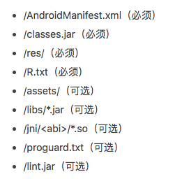
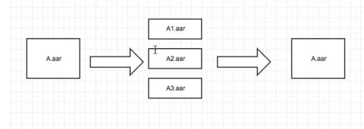

#### 1. 为什么合并aar

moudle互相依赖的时候,比如对外提供sdk的时候需要对外提供aar

这时候多个moudle无法打成一个 .aar

需要使用  `fat-aar`

首先来看aar的结构:



备注：R.txt文件是aapt --output -text -symbols输出，aapt相关细节这里不再叙述


#### 2. 方案思路

合并aar:



如上图所示，我们把依赖的外部aar和内部module（可以看成aar）输出的N个aar文件进行合并，这样原来A模块的调用者接入方式保持不变，而且在依赖A时不必再重新下载A内部依赖的其他aar，可以提供给外部项目使用而避免访问滴滴maven库的场景


#### 3. fat-aar合并过程

参考上面aar包结构形式，fat-aar合并主要过程为：

- 合并Manifest
- 合并jar
- 合并res资源
-  **合并R文件**（最关键的一步）
- 合并assets
- 合并libs
- 合并jni
- 合并Proguard


#### 4. fat-aar使用

fat-aar接入非常简单，可直接参考 [fat-aar](https://github.com/adwiv/android-fat-aar)

##### Step 1

下载fat-aar文件到本地项目module下，然后在build.gradle中依赖fat-aar.gradle

```csharp
apply from: 'fat-aar.gradle'
```

或者直接远程依赖

```csharp
apply from: 'https://raw.githubusercontent.com/adwiv/android-fat-aar/master/fat-aar.gradle'
```

##### Step 2

将需要下载的内部aar或本地lib的compile替换成embedded，embedded是fat-arr内部定义的一个属性

```php
dependencies {
  compile fileTree(dir: 'libs', include: ['*.jar'])
  
  embedded project(':librarytwo')
  embedded project(':libraryone')
  embedded 'com.example.internal:lib-three:1.2.3'
  
  compile 'com.example:some-other-lib:1.0.3'
  compile 'com.android.support:appcompat-v7:22.2.0'
}
```

##### Step 3

将embedded依赖的project在对外发布aar时从pop.xml文件中去掉，避免外部依赖时再次下载，参考fat-aar下面的 [publish.gradle](https://github.com/adwiv/android-fat-aar/blob/master/publish.gradle)，当然也可以自己实现


#### 4. fat-aar合并原理

fat-aar的思路是合并aar,根据aar的文件结构,可以划分为多个子任务

- 首先根据定义的embedded属性找出需要合并的aar,并将aar解压到相应目录(注意gradle版本)

```java
def dependencies = new ArrayList(configurations.embedded.resolvedConfiguration.firstLevelModuleDependencies)
dependencies.reverseEach {

    def aarPath;
    if (gradleApiVersion >= 2.3f)
        aarPath = "${root_dir}/${it.moduleName}/build/intermediates/bundles/default"
    else
        aarPath = "${exploded_aar_dir}/${it.moduleGroup}/${it.moduleName}/${it.moduleVersion}"
    // 标记emebed标记找到需要合并的aar
    it.moduleArtifacts.each {
        artifact ->

            println "ARTIFACT 3 : "
            println artifact
            if (artifact.type == 'aar') {
                if (!embeddedAarFiles.contains(artifact)) {
                    embeddedAarFiles.add(artifact)
                }
                if (!embeddedAarDirs.contains(aarPath)) {
                    if( artifact.file.isFile() ){
                        println artifact.file
                        println aarPath

                        copy {
                            from zipTree( artifact.file )
                            into aarPath
                        }
                    }
                    embeddedAarDirs.add(aarPath)
                }
            } else if (artifact.type == 'jar') {
                def artifactPath = artifact.file
                if (!embeddedJars.contains(artifactPath))
                    embeddedJars.add(artifactPath)
            } else {
                throw new Exception("Unhandled Artifact of type ${artifact.type}")
            }
    }
}
```

如果存在embedded属性的依赖，则定义各个子task执行的顺序（注意gradle版本影响，建议gradle tools版本设置为2.2.3）

```groovy
if (dependencies.size() > 0) {
    // Merge Assets  合并Assets
    generateReleaseAssets.dependsOn embedAssets
    embedAssets.dependsOn prepareReleaseDependencies

    // Embed Resources by overwriting the inputResourceSets
    packageReleaseResources.dependsOn embedLibraryResources
    embedLibraryResources.dependsOn prepareReleaseDependencies

    // Embed JNI Libraries  合并.so
    bundleRelease.dependsOn embedJniLibs

    if (gradleApiVersion >= 2.3f) {
        embedJniLibs.dependsOn transformNativeLibsWithSyncJniLibsForRelease
        ext.bundle_release_dir = "$build_dir/intermediates/bundles/default"
    } else {
        embedJniLibs.dependsOn transformNative_libsWithSyncJniLibsForRelease
        ext.bundle_release_dir = "$build_dir/intermediates/bundles/release";
    }

    // Merge Embedded Manifests 合并Manifest
    bundleRelease.dependsOn embedManifests
    embedManifests.dependsOn processReleaseManifest

    // Merge proguard files 合并proguard
    embedLibraryResources.dependsOn embedProguard
    embedProguard.dependsOn prepareReleaseDependencies

    // Generate R.java files  合并R文件
    compileReleaseJavaWithJavac.dependsOn generateRJava
    generateRJava.dependsOn processReleaseResources

    // Bundle the java classes  合并javajar
    bundleRelease.dependsOn embedJavaJars
    embedJavaJars.dependsOn compileReleaseJavaWithJavac

    // If proguard is enabled, run the tasks that bundleRelease should depend on before proguard
    if (tasks.findByPath('proguardRelease') != null) {
        proguardRelease.dependsOn embedJavaJars
    } else if (tasks.findByPath('transformClassesAndResourcesWithProguardForRelease') != null) {
        transformClassesAndResourcesWithProguardForRelease.dependsOn embedJavaJars
    }
}
```

- embedAssets

  合并Assets文件,其实就是简单的将emebedded依赖的assets路径直接添加到当前project的assets目录下

  ```groovy
  task embedAssets << {
      println "Running FAT-AAR Task :embedAssets"
      embeddedAarDirs.each { aarPath ->
      // Merge Assets
          android.sourceSets.main.assets.srcDirs += file("$aarPath/assets")
      }
  }
  ```

- embedLibraryResources

  合并res文件,通过getMergedInputResourceSets获取所有的aar的res资源路径,然后添加到当前project的res资源路径:

  ```java
  task embedLibraryResources << {
      println "Running FAT-AAR Task :embedLibraryResources"
  
      def oldInputResourceSet = packageReleaseResources.inputResourceSets
      packageReleaseResources.conventionMapping.map("inputResourceSets") {
          getMergedInputResourceSets(oldInputResourceSet)
      }
  }
  ```

- embedManifests

  合并清单文件,就是通过XmlDocument操作Manifest结点将所有aar的Manifest进行合并

- embedProguard

  合并proguard,读取embedded依赖的aar中的proguard混淆代码,直接追加在project的proguard后面

  ```java
  task embedProguard << {
      println "Running FAT-AAR Task :embedProguard"
  
      def proguardRelease = file("$bundle_release_dir/proguard.txt")
      embeddedAarDirs.each { aarPath ->
          try {
              def proguardLibFile = file("$aarPath/proguard.txt")
              if (proguardLibFile.exists())
                  proguardRelease.append("\n" + proguardLibFile.text)
          } catch (Exception e) {
              e.printStackTrace();
              throw e;
          }
      }
  }
  ```

- embedJniLibs

  合并jni的so文件,将emebedded的aar中jni目录中所有文件拷贝到当前的project的jni目录下

  ```java
  task embedJniLibs << {
      println "Running FAT-AAR Task :embedJniLibs"
  
      embeddedAarDirs.each { aarPath ->
          println "======= Copying JNI from $aarPath/jni"
          // Copy JNI Folders
          copy {
              from fileTree(dir: "$aarPath/jni")
              into file("$bundle_release_dir/jni")
          }
      }
  }
  ```

  

  

- generateRJava

  根据aar的R.txt文件生成对应的R文件,首先通过Manifest文件获取对应的包名,然后通过遍历embeddedAarDirs查找每个aar中是否存在,根据R.txt生成相应的R文件,所有的id都指向project的id

  ```java
  task generateRJava << {
      println "Running FAT-AAR Task :generateRJava"
  
      // Now generate the R.java file for each embedded dependency
      def mainManifestFile = android.sourceSets.main.manifest.srcFile;
      def libPackageName = "";
  
      if(mainManifestFile.exists()) {
          libPackageName = new XmlParser().parse(mainManifestFile).@package
      }
  		// 遍历所有aar的R.txt
      embeddedAarDirs.each { aarPath ->
  
          def manifestFile = file("$aarPath/AndroidManifest.xml");
          if(!manifestFile.exists()) {
              manifestFile = file("./src/main/AndroidManifest.xml");
          }
  
          if(manifestFile.exists()) {
              def aarManifest = new XmlParser().parse(manifestFile);
              def aarPackageName = aarManifest.@package
  
              String packagePath = aarPackageName.replace('.', '/')
  
              // Generate the R.java file and map to current project's R.java
              // This will recreate the class file
              def rTxt = file("$aarPath/R.txt")
              def rMap = new ConfigObject()
  
              if (rTxt.exists()) {
                  rTxt.eachLine {
                      line ->
                          //noinspection GroovyUnusedAssignment
                          def (type, subclass, name, value) = line.tokenize(' ')
                          rMap[subclass].putAt(name, type)
                  }
              }
  
              def sb = "package $aarPackageName;" << '\n' << '\n'
              sb << 'public final class R {' << '\n'
  
              rMap.each {
                  subclass, values ->
                      sb << "  public static final class $subclass {" << '\n'
                      values.each {
                          name, type ->
                              sb << "    public static $type $name = ${libPackageName}.R.${subclass}.${name};" << '\n'
                      }
                      sb << "    }" << '\n'
              }
  
              sb << '}' << '\n'
  
              mkdir("$generated_rsrc_dir/$packagePath")
              file("$generated_rsrc_dir/$packagePath/R.java").write(sb.toString())
  
              embeddedRClasses += "$packagePath/R.class"
              embeddedRClasses += "$packagePath/R\$*.class"
          }
      }
  }
  ```

- collectRClass

  将generateRClass生成的文件拷贝到'$build_dir/fat-aar/release/'目录下

  ```java
  task collectRClass << {
      println "COLLECTRCLASS"
      delete base_r2x_dir
      mkdir base_r2x_dir
  
      copy {
          from classs_release_dir
          include embeddedRClasses
          into base_r2x_dir
      }
  }
  ```

- embedJavaJars

  将`build_dir/fat-aar/release/`路径中R文件打包进同一个jar包，放在'$bundle_release_dir/libs/'目录下，在collecRClass后执行

  ```go
  task embedRClass(type: org.gradle.jvm.tasks.Jar, dependsOn: collectRClass) {
      println "EMBED R CLASS"
  
      destinationDir file("$bundle_release_dir/libs/")
      println destinationDir
      from base_r2x_dir
      println base_r2x_dir
  }
  ```

  

### 使用fat-aar遇到的一些问题

1. generateRJava生成的R文件中id找不到

   修改generateRJava，在project生成R文件之后执行，可根据project的R文件来过滤aar中R.txt中的id（aar和project依赖的v7、v4版本不同），如果R.txt中的id在project的R.class文件中找不到，则过滤掉

   ```ruby
   def rClassFile = file("$generated_rsrc_dir/com/didi/unified/pay/R.java")
   def rClassMap = new ConfigObject()
   
   def subClassName = null
   
   if (rClassFile.exists()) {
       rClassFile.eachLine {
           line ->
               line = line.trim()
               if(line.contains("public static final class ")) {
                   def subline = line.substring(("public static final class").length())
                   subClassName = subline.substring(0, subline.indexOf("{")).trim()
               } else if (line.contains("public static final int[] ")) {
                   def subline = line.substring(("public static final int[]").length())
                   def name = subline.substring(0, subline.indexOf("=")).trim()
                   rClassMap[subClassName].putAt(name, 1)
               } else if (line.contains("public static int ")) {
                   def subline = line.substring(("public static int").length())
                   def name = subline.substring(0, subline.indexOf("=")).trim()
                   rClassMap[subClassName].putAt(name, 1)
               }
       }
   }
   
   ...
   
   if (rTxt.exists()) {
       rTxt.eachLine {
       line ->
           //noinspection GroovyUnusedAssignment
            def (type, subclass, name, value) = line.tokenize(' ')
            if (rClassMap[subclass].containsKey(name)) {
                rMap[subclass].putAt(name, type)
            }
       }
   }
   ```

2. 自定义style，找不到相对应的id

   修改generateRJava，自定义Style在R.txt中存在形式为style，但是在class文件引用中为styleable，可以直接将style改为styleable

   ```csharp
   if (rTxt.exists()) {
       rTxt.eachLine {
       line ->
           //noinspection GroovyUnusedAssignment
            def (type, subclass, name, value) = line.tokenize(' ')
            try {
                if (subclass.equals("style")) {
                   subclass = "styleable"
                }
                if (rClassMap[subclass].containsKey(name)) {
                   rMap[subclass].putAt(name, type)
                }
            } catch (Exception e) {
                e.printStackTrace()
            }
      }
   }
   ```

3. 发布aar打包时需要去掉pop.xml中embedded依赖的aar

#### 5.fat-aar使用注意事项


1. project目录下gradle tools版本配置为3.1.0时编译出错，建议使用2.2.3

2. gradle目录下[gradle-wrapper.properties](http://gradle-wrapper.properties)中建议配置distributionUrl=<https://services.gradle.org/distributions/gradle-3.3-all.zip> [参考issue](https://github.com/adwiv/android-fat-aar/issues/84)

3. fat-aar合并aar时注意不要把一些公共库合并进去（比如v7、v4），如果模块中有重复的依赖，fat-aar会报错提示你某些类或资源文件冲突，解决方案有：

   - 打包aar时配置相关依赖transitive false

   ```csharp
   compile ('com.example.internal:lib: x.x.x') {  
       // Notice the parentheses around project
       transitive false
   }
   ```

   - 外部项目中忽略掉远程的依赖

   ```csharp
   configurations {
       all*.exclude group: 'com.example.internal', module: 'lib'
   }
   ```

4. fat-aar最好只用来合并aar使用，embedded属性不等同于compile，开发和调试模块时最好使用compile，打包时使用embedded（建议开发和发布两个分支，需要打包时发布分支合并开发分支代码）

