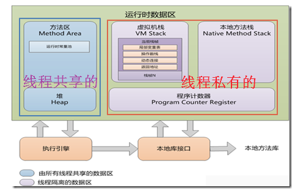
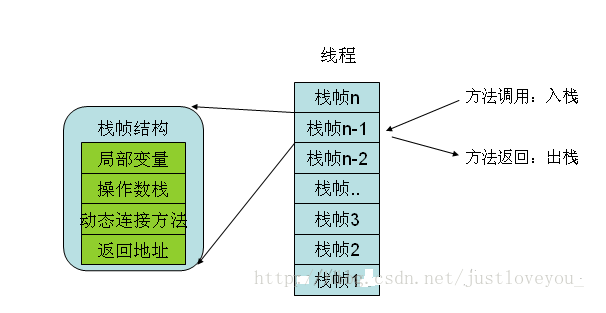
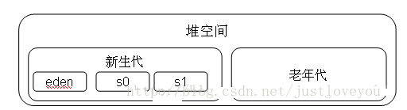

#### 概述

Java虚拟机在执行Java程序的过程中会把它所管理的内存划分为若干个不同的数据区域，这些数据区域可以分为两个部分：一部分是线程共享的，一部分则是线程私有的。其中，线程共享的数据区包括方法区和堆，线程私有的数据区包括虚拟机栈、本地方法栈和程序计数器。如下图所示：

#### 线程私有(**虚拟机栈,本地方法栈,程序计数器**)

- 1.程序计数器:

  - 当线程数超过CPU数量或者CPU内核数,此时严格意义上并非并发,多个线程会根据**CPU时间片轮询抢夺CPU时间资源**,也就是说在一个时间节点CPU仅仅会执行一条线程中的指令
  - **为了线程切换后可以恢复到正确的执行位置,每条线程都需要一个独立的程序计数器去记录正在执行的字节码指令地址,程序计数器是线程私有的一块较小的内存空间,其可以看做是当前线程所执行的字节码的行号指示器**
  - 如果线程正在执行的是一个 Java 方法，计数器记录的是正在执行的字节码指令的地址；如果正在执行的是 Native 方法，则计数器的值为空。
  - 程序计数器是唯一一个没有规定任何 OOM的区域

- 2.虚拟机栈

  - **虚拟机栈描述的是java方法执行的内存模型,是线程私有的**
  - 每个方法在执行的时候都会创建一个栈帧个,用于存储**局部变量表,操作数栈,动态链接,方法出口等信息**,每个方法从调用直至完成的过程,对应一个栈帧在虚拟机栈中入栈到出栈的过程
    - 局部变量表存放:`基本数据的变量(整体放入)`和`引用对象的句柄`,它们可以是方法参数
  - 虚拟机栈有两种异常情况:**StackOverflowError 和 OutOfMemoryError**
    - StackOverflowError: 我们知道一个线程拥有自己的一个栈,这个栈的大小决定了方法调用的可达深度(递归多少层次,或者嵌套多少层其他方法,-Xss参数可以设置虚拟机栈的大小),若线程请求的栈深度大于虚拟机允许的深度,则会抛出**StackOverflowError**
    - OutOfMemoryError:栈的大小是可以固定的,也是可以扩展的,若虚拟机栈可以动态扩展(大多数虚拟机都可以),但是扩展时无法申请到足够内存(比如没有足够的内存为一个新线程分配栈空间时候),则抛出OOM

  

- 3.本地方法栈:

  - **本地方法栈与Java虚拟机栈非常相似，也是线程私有的，区别是虚拟机栈为虚拟机执行 Java 方法服务，而本地方法栈为虚拟机执行 Native 方法服务。**与虚拟机栈一样，本地方法栈区域也会抛出 StackOverflowError 和 OutOfMemoryError 异常。

#### 共享区(堆和方法区)

- 4.堆

**Java 堆的唯一目的就是存放对象实例，几乎所有的对象实例（和数组）都在这里分配内存。**Java堆是线程共享的，类的对象从中分配空间，这些对象通过new、newarray、 anewarray 和 multianewarray 等指令建立，它们不需要程序代码来显式的释放。

由于Java堆唯一目的就是用来存放对象实例，因此其也是垃圾收集器管理的主要区域，故也称为称为 GC堆。从内存回收的角度看，由于现在的垃圾收集器基本都采用分代收集算法，所以为了方便垃圾回收Java堆还可以分为 新生代 和 老年代 。新生代用于存放刚创建的对象以及年轻的对象，如果对象一直没有被回收，生存得足够长，对象就会被移入老年代。新生代又可进一步细分为 eden、survivorSpace0 和 survivorSpace1。刚创建的对象都放入 eden，s0 和 s1 都至少经过一次GC并幸存。如果幸存对象经过一定时间仍存在，则进入老年代。

注意，Java堆可以处于物理上不连续的内存空间中，只要逻辑上是连续的即可。而且，Java堆在实现时，既可以是固定大小的，也可以是可拓展的，并且主流虚拟机都是按可扩展来实现的（通过-Xmx(最大堆容量) 和 -Xms(最小堆容量)控制）。如果在堆中没有内存完成实例分配，并且堆也无法再拓展时，将会抛出 OutOfMemoryError 异常。

- 5.方法区
  - 方法区和java堆一样,也是线程共享的并且不需要连续的内存,其用于存储已经被虚拟机加载的 **类信息,常量,静态变量,计时编译器编译后的代码等数据**
    - 方法区通常和永久代(Perm)关联在一起,但是永久代和方法区不是一个概念,只是有的虚拟机用永久代来实现方法区,这样就可以用永久代GC管理方法区,省去专门内存管理的工作.根据Java虚拟机规范的规定,当方法区无法满足内存分配的需求时,将抛出OOM
  - 运行时常量池**运行时常量池是方法区的一部分,用于存放编译期生成的各种 字面量 和 符号引用**
    - 字面量:比较接近java语言层次的常量概念:如文本 字符串,被声明为final的常量值等
    - 符号引用,包括以下三类常量:**类和接口的全限定名,字段名称 和描述符和方法名称和描述符**
    - 运行时常量池 是方法区的一部分,当常量池无法再申请到 内存的时候会抛出OOM
  - **运行时常量池相对于Class文件常量池的一个重要特征是具备动态性。**Java语言并不要求常量一定只有编译期才能产生，运行期间也可能将新的常量放入池中，比如字符串的手动入池方法intern()。

- TLAB (Thread Local Allocation Buffer，线程私有分配缓冲区)

  - Sun Hotspot JVM 为了提升对象内存分配的效率，对于所创建的线程都会分配一块独立的空间 TLAB，其大小由JVM根据运行的情况计算而得。在TLAB上分配对象时不需要加锁(相对于CAS配上失败重试方式 )，因此JVM在给线程的对象分配内存时会尽量的在TLAB上分配，在这种情况下JVM中分配对象内存的性能和C基本是一样高效的，但如果对象过大的话则仍然是直接使用堆空间分配。

    　　在下文中我们提到，虚拟机为新生对象分配内存时，需要考虑修改指针 (该指针用于划分内存使用空间和空闲空间) 时的线程安全问题，因为存在可能出现正在给对象A分配内存，指针还未修改，对象B又同时使用原来的指针分配内存的情况。TLAB 的存在就是为了解决这个问题：每个线程在Java堆中预先分配一小块内存 TLAB，哪个线程需要分配内存就在自己的TLAB上进行分配，若TLAB用完并分配新的TLAB时，再加同步锁定，这样就大大提升了对象内存分配的效率。
  

