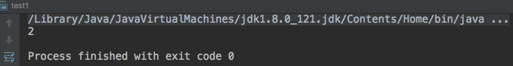
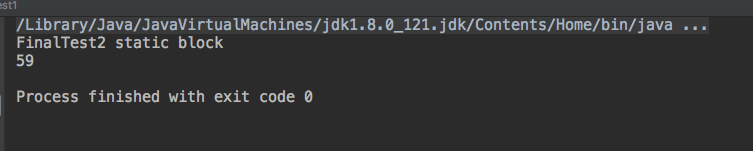

#### 1. 前言

在`java类加载机制(一)`一文中，我们了解了类的加载和连接过程，这篇文章重点讲述类的初始化过程，这样，我们就将类的加载机制弄明白了。

#### 2. 初始化时机

我们 知道

**Java虚拟机有预加载功能。类加载器并不需要等到某个类被"首次主动使用"时再加载它,JVM规范规定JVM可以预测加载某一个类，如果这个类出错，但是应用程序没有调用这个类， JVM也不会报错；如果调用这个类的话，JVM才会报错，（LinkAgeError错误)。其实就是一句话，Java虚拟机有预加载功能。**

主动初始化的6中方式:

- 1.创建对象的实例:我们new对象的时候,会引发类的初始化,前提是这个类还没有被初始化
- 2.调用类的静态属性或者为静态属性赋值
- 3.调用类的静态方法
- 4.通过class文件反射创建对象
- 5.初始化一个类的子类:使用子类的时候先初始化父类
- 6.java虚拟机启动时候被标记为启动类的类:就是我们main方法所在的类

只有上面6种情况才是**主动使用**,也只有上面六种情况的发生才会引发类的初始化


同时我们需要注意以下几个tips:

- 1.在同一个类加载起下面只能初始化类一次,如果已经初始化了就没有必要再次初始化
  - 为什么只初始化一次呢?因为我们上面讲到过类加载的最终结果就是在堆中存有唯一一个Class对象,我们可以通过Class对象找到类的相关信息.唯一一个Class对象说明了类只需要初始化一次即可,如果再次初始化就会出现多个Class对象,这样和唯一相违背了
- 2.在编译时候能够确定下来的静态变量(编译常量),不会对类进行初始化
- 3.在编译时无法确定下来的静态变量(运行时常量),会对类进行初始化
- 4.如果这个类没有被加载和连接的话,那就需要进行加载和连接
- 5.如果这个类有父类并且这个父类没有被初始化,则先初始化父类
- 6.如果类中存在初始化语句,那么依次执行初始化语句

接下来我们看几个例子:

```java
public class test1 {
    private static final int MODE_SHIFT = 30;

    public static void main(String[] args){
        System.out.println(FinalTest.x);
    }

    static class FinalTest{
        public static final int x =6/3;
        static {
            System.out.println("FinalTest static block");
        }
    }
}
```

运行结果:



对标`Tip-2`,因为`public static final int x =6/3;`是编译时候可以确定的静态变量所以不会初始化类,所以同步代码块不会走

```java
public static void main(String[] args){
    System.out.println(FinalTest2.x);
}

static class FinalTest{
    public static final int x =6/3;
    static {
        System.out.println("FinalTest static block");
    }
}

static class FinalTest2 {

    public static final int x = new Random().nextInt(100);

    static {
        System.out.println("FinalTest2 static block");
    }
}
```

运行结果:



对标`tip-3`,`public static final int x = new Random().nextInt(100);`编译器无法确定这个静态常量,所以需要对类进行初始化,所以先走其静态代码块输出`FinalTest2 static block`,然后输出`FinalTest2.x`


#### 3. 类的初始化步骤

到此我们应该对 **加载— 连接— 初始化有了一个全局的概念了,那么接下来我们看看巨日的初始化执行步骤**

##### 3.1 没有父类的情况

```java
1)类的静态属性
2)类的静态代码块
3)类的非静态属性
4)类的非静态代码块
5)构造方法
```

##### 3.2 有父类的情况

```
1)父类的静态属性
2)父类的静态代码块
3)子类的静态属性
4)子类的静态代码块
5)父类的非静态属性
6)父类的非静态代码块
7)父类构造方法
8)子类非静态属性
9)子类非静态代码块
10)子类构造方法
```

在这要说明一下,静态代码块和静态属性是等价的,他们是按照代码顺序执行

#### 4.结束JVM进程的几种方式

```java
(1) 执行System.exit()
(2) 程序正常结束
(3) 程序抛出异常,一直向上抛出没处理
(4) 操作系统异常,导致JVM退出

```

JVM有上面4中结束的方式:

- `System.exit()`

  ```java
  /**
   * Terminates the currently running Java Virtual Machine. The
   * argument serves as a status code; by convention, a nonzero status
   * code indicates abnormal termination.
   */
  public static void exit(int status) {
      Runtime.getRuntime().exit(status);
  }
  ```

**中断当前运行的java虚拟机**

- 正常执行main() — android场景

我们在运行main方法的时候，运行状态按钮由绿色变红色再变绿色的过程就是程序启动-运行-结束的过程

下面看 android源码:android程序能够 一直运行是因为main方法一直被执行着

```java
public static void main(String[] args) {
    Trace.traceBegin(Trace.TRACE_TAG_ACTIVITY_MANAGER, "ActivityThreadMain");

    // CloseGuard defaults to true and can be quite spammy.  We
    // disable it here, but selectively enable it later (via
    // StrictMode) on debug builds, but using DropBox, not logs.
    CloseGuard.setEnabled(false);

    Environment.initForCurrentUser();

    // Set the reporter for event logging in libcore
    EventLogger.setReporter(new EventLoggingReporter());

    // Make sure TrustedCertificateStore looks in the right place for CA certificates
    final File configDir = Environment.getUserConfigDirectory(UserHandle.myUserId());
    TrustedCertificateStore.setDefaultUserDirectory(configDir);

    Process.setArgV0("<pre-initialized>");

    Looper.prepareMainLooper();

    // Find the value for {@link #PROC_START_SEQ_IDENT} if provided on the command line.
    // It will be in the format "seq=114"
    long startSeq = 0;
    if (args != null) {
        for (int i = args.length - 1; i >= 0; --i) {
            if (args[i] != null && args[i].startsWith(PROC_START_SEQ_IDENT)) {
                startSeq = Long.parseLong(
                        args[i].substring(PROC_START_SEQ_IDENT.length()));
            }
        }
    }
    ActivityThread thread = new ActivityThread();
    thread.attach(false, startSeq);

    if (sMainThreadHandler == null) {
        sMainThreadHandler = thread.getHandler();
    }

    if (false) {
        Looper.myLooper().setMessageLogging(new
                LogPrinter(Log.DEBUG, "ActivityThread"));
    }

    // End of event ActivityThreadMain.
    Trace.traceEnd(Trace.TRACE_TAG_ACTIVITY_MANAGER);
    Looper.loop();

    throw new RuntimeException("Main thread loop unexpectedly exited");
}
```

` Looper.loop();`保证android程序一直在运行,可以保证android程序不被kill掉

- 第三种方式不用过多解释，一直没有处理被抛出的异常，这样导致了程序崩溃。

- 第四种方式是系统异常导致了jvm退出。其实jvm就是一个软件，如果我们的操作系统都出现了错误，那么运行在他上面的软件（jvm）必然会被kill。


