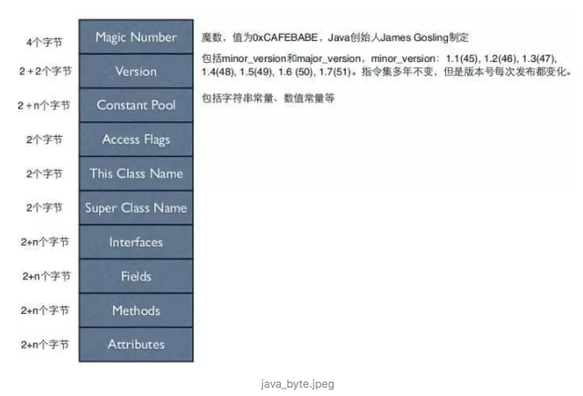
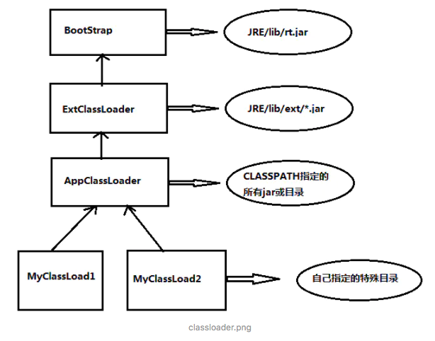
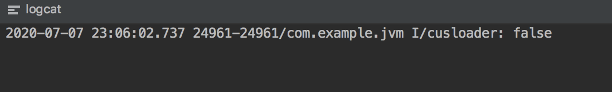
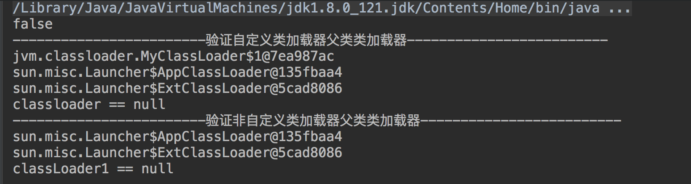

#### 1. java字节码 

在java中,必须将java文件通过javac编译成字节码文件,也就是`.class`文件,然后加载到内存,只有加载到内存才能够被其他class文件引用



#### 2. 类的加载机制包括3个步骤

- 加载
- 连接(验证 -准备-解析)
- 初始化

JVM就是按照上面的顺序一步一步的将字节码文件加载到内存中并生成相应的对象的。首先将字节码加载到内存中，然后对字节码进行连接，连接阶段包括了验证准备解析这3个步骤，连接完毕之后再进行初始化工作。下面我们一一了解

#### 3.类加载

类的加载是指 将类的.class文件中的二进制数据读入内存中,将其放在运行时数据区域的方法区内,然后在堆中创建`java.lang.Class`对象,用来封装类在方法区的数据结构.只有java虚拟机才回创建class对象,并且是一一对应的关系,这样才能通过反射找到相应的信息


Class类我们不会认为的去new,这个类是由java虚拟机创建的.通过他可以找到类的信息:

```java
/*
 * Private constructor. Only the Java Virtual Machine creates Class objects.
 * This constructor is not used and prevents the default constructor being
 * generated.
 */
private Class() {}
```

这个构造是私有的,我们不能实例化他,只有虚拟机才能创建这个类的对象

##### 3.1 类加载的时机

java虚拟机有预加载的功能.类加载器并不需要等到某个类被首次"首次主动使用"时再加载他,JVM规范规定JVM可以预加载某一个类,如果这个类报错,但是应用程序没有调用这个类,JVM也不会报错;如果调用这个类的话JVM才慧报错,(LinkAgeError),其实就是说**JVM有预加载能力**

#### 4. 类加载器

三种类加载器:



```java
    1)根类加载器,使用c++编写(BootStrap),负责加载rt.jar
    2)扩展类加载器,java实现(ExtClassLoader)
    3)应用加载器,java实现(AppClassLoader) classpath
```

根类加载器,是用C++实现的,我们没有办法在java层看到;我们来看`ExtClassLoader`

```java
static class ExtClassLoader extends URLClassLoader
```

同时我们看看AppClassLoader:

```java
static class AppClssLoader extends URLClassLoader {
```

他们同时继承自一个类URLClassLoader

关于这种层次关系,看起来像继承,其实不是的.我们看到 上面的代码就知道ExtClassLoader和AppClassLoader同时继承自同一个类.同时我们来看下ClassLoader的loadClass方法也可以知道:

```java
protected Class<?> loadClass(String name, boolean resolve)
    throws ClassNotFoundException
{
    synchronized (getClassLoadingLock(name)) {
        // 第一步: check这个类是否已经加载过
        Class<?> c = findLoadedClass(name);
        if (c == null) {
            long t0 = System.nanoTime();
            //  第二步:  父类加载class
            try {
                if (parent != null) {
                    c = parent.loadClass(name, false);
                } else {
                    c = findBootstrapClassOrNull(name);
                }
            } catch (ClassNotFoundException e) {
                // ClassNotFoundException thrown if class not found
                // from the non-null parent class loader
            }
						
						// 第二步: 父类没有找到交由子类查找
            if (c == null) {
                long t1 = System.nanoTime();
                c = findClass(name);

                sun.misc.PerfCounter.getParentDelegationTime().addTime(t1 - t0);
                sun.misc.PerfCounter.getFindClassTime().addElapsedTimeFrom(t1);
                sun.misc.PerfCounter.getFindClasses().increment();
            }
        }
        if (resolve) {
            resolveClass(c);
        }
        return c;
    }
}
```

首先会检测class是否加载过,如果加载 过就直接拿出并return;如果没有直接交由父类去`loadClass`,如果父类能够找到就直接return;如果父类找不到就交由子类去`findClass`

#### 5. 双亲委派机制

关于类加载器,我们不得不说一下双亲委派机制.

比如A类的加载器是`AppClassLoader`(其实我们自己写的加载器是`AppClassLoader`),`AppClassLoader`不会自己取加载类,而会委派`ExtClassLoader`进行加载,那么到了`ExtClassLoader`类加载器的时候,他也不会自己去加载,而是委托`BootStrap`类加载起进行加载,就这样一层一层往上委托,如果`BootStrapClassLoader`无法进行加载的话,再一层层往下走


#### 6.为何使用双亲委派机制

首先我们要明白一点:

判断两个类相同的前提是这两个类都是同一个加载器进行加载的，如果使用不同的类加载器进行加载同一个类，也会有不同的结果。

如果没有双亲委派机制，会出现什么样的结果呢？比如我们在rt.jar中随便找一个类，如java.util.HashMap,那么我们同样也可以写一个一样的类，也叫java.util.HashMap存放在我们自己的路径下(ClassPath).那样这两个相同的类采用的是不同的类加载器，系统中就会出现两个不同的HashMap类，这样引用程序就会出现一片混乱。

```java
public class MyClassLoader {
    public static void main(String args[]) throws ClassNotFoundException,         IllegalAccessException, InstantiationException {
    ClassLoader loader = new ClassLoader() {
        @Override
        public Class<?> loadClass(String name) throws ClassNotFoundException {

            String fileName = name.substring(name.lastIndexOf(".")+1)+".class";
            InputStream inputStream = getClass().getResourceAsStream(fileName);
            if (inputStream==null)
                return super.loadClass(name);
            try {
                byte[] bytes = new byte[inputStream.available()];
                inputStream.read(bytes);
                return defineClass(name,bytes,0,bytes.length);

            } catch (IOException e) {
                e.printStackTrace();
                throw new ClassNotFoundException(name);
            }
        }

      };
        Object object = null;
        try {
            object = loader.loadClass("com.example.jvm.Test").newInstance();
        } catch (IllegalAccessException e) {
            e.printStackTrace();
        } catch (InstantiationException e) {
            e.printStackTrace();
        } catch (ClassNotFoundException e) {
            e.printStackTrace();
        }
        Log.i(TAG,(object instanceof com.example.jvm.Test) + "");

  }
}
```

运行结果:



自己实现了一个ClassLoder,让其去加载`MyClassLoader`然后判断加载出来的类`object`是否与`MyClassLoader`实例一致,答案是否定的,因为原始的`MyClassLoader`是`AppClassLoader`加载,而`object`是自己实现的ClassLoader加载的

我们来一次打印其加载器以及父类

```java
ClassLoader classLoader = object.getClass().getClassLoader();
    while (classLoader!=null){
        System.out.println(classLoader);
        classLoader = classLoader.getParent();
    }
    if (classLoader==null){
        System.out.println("classLoader == null");
    }
输出内容 ：
jvm.classloader.MyClassLoader$1@60172ec6
sun.misc.Launcher$AppClassLoader@338bd37a
sun.misc.Launcher$ExtClassLoader@20e90906
classLoader == null
```

```java
 Object object2 = new MyClassLoader();
   ClassLoader classLoader2 = object2.getClass().getClassLoader();

    while (classLoader2!=null){
        System.out.println(classLoader2);
        classLoader2 = classLoader2.getParent();
    }
    if (classLoader2==null){
        System.out.println("classLoader2 == null");
    }
输出内容：
sun.misc.Launcher$AppClassLoader@20e90906
sun.misc.Launcher$ExtClassLoader@234f79cb
classLoader == null
```

上述一个是自定义的类加载器,一个是走的系统类加载器,下面看运行结果:




第一个是我们自己加载器加载的类,第二个是直接new出来的一个对象,是由App类加载器进行加载的,我们把他们的父类加载器打印出来了,可以看出他们的类加载器是不一样的.很奇怪为何会执行`classLoader == null`

我们看 `classLoader2.getParent()`

```java
/**
 * Returns the parent class loader for delegation. Some implementations may
 * use <tt>null</tt> to represent the bootstrap class loader. This method
 * will return <tt>null</tt> in such implementations if this class loader's
 * parent is the bootstrap class loader.
 *
 */
@CallerSensitive
public final ClassLoader getParent() {
    if (parent == null)
        return null;
    SecurityManager sm = System.getSecurityManager();
    if (sm != null) {
        // Check access to the parent class loader
        // If the caller's class loader is same as this class loader,
        // permission check is performed.
        checkClassLoaderPermission(parent, Reflection.getCallerClass());
    }
    return parent;
}
```

主要看注释:

**当使用bootStrap classLoader加载类的时候会返回null**

#### 7. 类的连接

讲完加载之后,我们需要了解一下类的连接.类的连接有三步,分别是**验证,准备,解析**

##### 7.1 验证阶段:

- 将已经读入到内存类的二进制数据合并到虚拟机运行时环境中去
- 类文件结构检查:格式符合jvm规范-语义检查;符合java语言规范,final没有子类,final类型方法没有被覆盖
- 字节码验证:确保字节码可以安全地被java虚拟机执行
- 二进制兼容性检查:确保互相引用的类的一致性.
  - 如A类的a方法会调用b类的b方法.那么虚拟机在验证A类的时候会检测B类的b方法时候存在并检查版本兼容性.因为有可能A类是由jdk1.7编译的,而B类是由1.8编译的.那根据向下兼容的性质,A类引用B类可能会出错,注意是可能

##### 7.2 准备阶段

java虚拟机为类的静态变量分配内存并赋予默认的初始值,比如int分配4个字节并赋值为0,long分配8个字节并赋值为0

##### 7.3 解析阶段

解析阶段主要是将符号引用转化为直接引用的过程.比如A类的a方法引用B类中的吧方法,那么他会找到B类的b方法的内存地址,将符号引用替换为直接引用(内存地址)


到目前为止,我们知道了类的加载,类加载起器,双亲委派机制,类的连接等操作