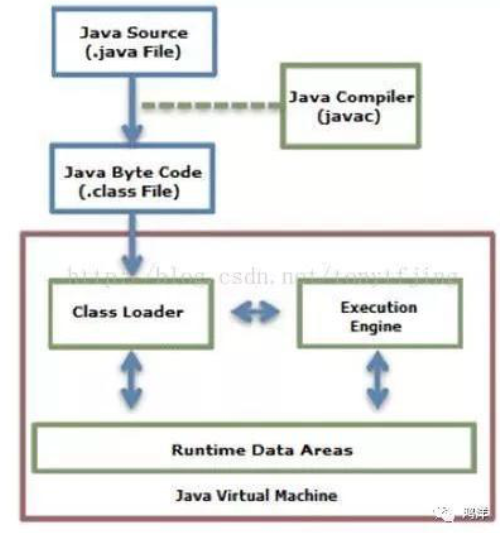

####1.JVM基本构成

从上图可以看出,JVM主要包括四个部分:

1. 类加载器(ClassLoader):在JVM启动时或者在类运行将需要的class加载到JVM中(下图表示了从java源文件到JVM的整个过程,可以配合理解):

2. 执行引擎: 负责执行class文件中包含的字节码指令;

3. 内存区(也叫运行时数据区):是在JVM运行的时候操作所分配的内存区,运行时内存区主要可以划分为5个区域:

   如图:

   

   - 方法区(MethodArea):用于存储类结构信息的地方,包括**常量池,静态变量,构造函数等.**虽然JVM规范把方法区描述为堆的一个辑部分,但他却有一个别名non-heap(非堆),所以大家不要搞混淆了.方法区还包括一个运行时常量池.

   - java堆(Heap):存储java实例或者对象的地方.这块是GC的主要区域.从存储的内容我们可以很容易知道,方法和堆是被所有java线程共享的

   - java栈(Stack):java栈总是和线程关联在一起,每当创建一个线程时候,JVM就会为这个线程创建一个对应的java栈在这个java栈中,其中又会包含多个栈帧,每运行一个方法就会创建一个栈帧,用于存储局部变量表,操作栈,方法返回等,每一个方法从调用直到执行完成的过程,就对应一栈帧在java栈中入栈到出栈的过程.所以java栈是线程有的
   - 程序计数器(PC Register):用于保存当前线程执行的内存地址.由于JVM程序是多线程执行的(线程轮流切换),所以为了保证线程切换回来后(线程轮流切换),所以为了保证切换回来后,还能恢复到原先状态,就需要一个独立的计数器,记录之前中断的地方,可见程序计数器也是线程私有的
   - 本地方法栈(Native MethodStack):和java栈的作用差不多,只不过是为JVM使用到native方法服务的.

4. 本地方法接口:主要是调用C或者C++实现的本地方法及回调结果

#####1.1 开线程影响哪块内存

每当有线程被创建的时候,JVM就需要为为其在内存中分配虚拟机栈和本地方法栈来记录调用方法的内容,分配程序计数器记录指令执行的位置,这样的内存消耗就是创建线程的内存代价

#### 2. JVM 内存模型的理解

java内存模型即**java Memory Model**,简称JMM.JMM定义java虚拟机(JVM)在计算机内存(RAM)中的工作方式.JVM是整个计算机的虚拟模型,所以JMM是隶属于JVM的

 java线程之间的通信总是隐式进行的,并且是采用的是共享内存模型.这里提到的共享内存模型指的就是java的内存模型(简称JMM),JMM决定一个线程对共享变量的写入何时对另一个线程可见.

从抽象关系角度看,JMM定义了线程和主存之间的抽象关系:线程之间的共享变量存储在主内存(main memory)中,每个线程都有一个私有的本地内存(local memory),本地内存中存储了该线程以读/写共享变量的副本.本地内存是JMM的一个抽象概念,并不是真是存在.它涵盖了缓存,写缓存区,寄存器以及其他的硬件和编译优化

总之JMM就是一组规则.这组规则意在解决在并发编程可能出现的线程安全问题,并提供了内置的解决方案(hanppen-before原则)及其外部可使用的同步手段(synchronized/volatile等),确保了程序执行在多线程环境中的应有的原子性,可视性及其有序性

####  3. 描述一下GC原理和回收策略

提到垃圾回收,我们可以先思考一下,如果我们去做垃圾回收需要解决哪些问题?

一般来说,我们需要解决三个问题

1. 回收哪些内存?

2. 什么时候回收?
3. 如何回收?

这些问题分别对应着引用管理和回收策略等方案

##### 3.1 引用

提到引用我们知道java中有4种引用类型

- 强引用:代码中普遍存在,只要强引用还存在,垃圾收集器就不会回收掉被引用的对象
- 软引用:SoftReference,用来描述还有用但是非必须的对象,当内存不足的时候会回收这类对象
- 弱引用:WeakReference,用来描述非必须对象,弱引用的对象只能到下一次发生GC时,当GC 发生时候,无论内存是否足够,都会回收改对象
- 虚引用:PhantomReference,一个对象是否有虚引用的存在,完全不会对其生存产生影响,也无法通过虚引用取得一个对象的引用,它存在的唯一目的是在这个对象被回收时候可以收到一个通知

不同的引用类型,在做GC时候会区别对待,我们平时生成的java对象,默认都是强引用,也就是说只要强引用还在,GC就不会回收,那么如何判断强引用存在呢?

##### 3.2 强引用是否存在判断 — 可达性分析算法

一个简单的思路就是:引用计数法,有对这个对象的引用就+1,不再引用就-1,但是这种方式看起来简单美好,但是他却不能解决循环引用计数的问题.

因此**可达性分析算法**等上历史的舞台,用他来判断对象的引用是否存在

**可达性分析算法**通过一系列称为**GCRoots**的对象作为起始点,从这些节点从上向下搜索,所走过的路径称为引用链,当一个对象没有任何引用链与**GCRoots**连接时就说明此对象不可用,也就是对象不存在

**GCRoots**对象通常包括:

- 虚拟机栈中引用的对象(栈帧中的本地变量表)
- 方法区的静态属性引用的对象
- 方法区中常量引用的对象
- Native方法中引用的对象

**可达性分析算法流程:**

- 第一次标记:对象在经过可达性分析后发现没有与GC Roots有引用链(**此对象不可达**),则进行第一次标记并进行一次筛选,筛选条件是:该对象是否有必要执行finalize()方法.
  - 没有覆盖finalize()方法或者finalize()方法已经被执行过都会被认为没有必要执行.
  - 如果有必要执行,则改对象会被放在一个**F-Queue**队列,并稍候在由虚拟机建立的低优先级Finalizer线程中触发改对象的finalize()方法,但不保证一定等待他执行结束,因为如果这个对象的finalize()方法发生了死循环或者执行时间较长的情况,会阻塞**F-Queue**队列中的其他对象,影响GC
- 第二次标记:GC对**F-Queue**队列中的对象进行第二次标记,如果在第二次标记时候对象又成功被引用,则会移除即将回收的集合,否则会被回收

总之,JVM在做垃圾回收的时候,会检查堆中所有对象是否会被这些根集对象引用,不能够被引用的对象会被垃圾回收

##### 3.3 垃圾回收算法

一般回收算法有如下几种:

- 1.标记-清除(Mark-sweep)

  标记-清除算法采用从根集合进行扫描,对存活的对象进行标记,标记完毕后,再扫描空间中未被标记的对象,进行回收.标记-清楚算法不需要进行对象的移动,并且仅对不存活的对象进行处理,**在存活对象比较多的情况下极为高效,但是由于标记-清除算法直接回收不存活对象,因此会造成内存碎片**

- 2.标记整理(Mark-Compact)

标记-整理算法采用标记-清除算法一样的方式进行对象的标记,但在清除时不同,在回收不存活的对象占用的空间后,会将所有的存货对象往左端空闲空间移动,并更新对应的指针,标记-整理算法是在标记-清除算法的基础上,又进行了对象的移动,因此成本更高,但是却解决了内存随便的问题.该垃圾回收算法适用于对象存活率高的场景(老年代)

- 3.复制(Copying):

复制算法将可用内存按容量划分为大小相等的两块,每次只使用其中的一块.当这一块内存用完了,就将还存活的对象复制到另外一块上面,然后再把已经使用过的内存空间一次清理掉.这种算法适用于对象存活率低的场景,比如新生代.这样使得每次都是对整个半区进行内存回收,内存分配时也就不用考虑内存碎片等复杂情况

- 4.分代收集算法

不同的对象生命周期(存活情况)是不一样的,而不同生命周期的对象位于堆中不同的区域,因此对堆内存不同区域采用不同的策略进行回收可以提高JVM的执行效率.当代商用虚拟机使用的都是分代收集算法:**新生代对象存活率低,就采用复制算法;老年带存货率高,就用标记清除算法或者标记整理算法.**Java堆内存一般可以分为**新生代,旧生代和永久代**三个模块:

##### 3.4 新生代,旧生代,永久代

- 新生代

  1. 所有新生成的对象首先是放在新生代的.新生代的目标就是尽可能快速的收集调那些生命周期短的对象
  2. 新生代生存按照**8:1:1的比例**分为一个eden区和两个survivor(survivor0,survivor1)区.大部分对象在Eden区中生成.回收时先将eden区存活的对象复制到一个survivor0,然后清空eden区,当这个survivor0区也存放满时,则将eden区和survivor0区存活对象复制到另一个survivor1区,然后清空eden和survivor0区,此时survivor0是空的,然后将survivor0区和survivor1区互换,即保持survivor1区为空,如此往复
  3. 当survivor1区不足以存放eden和survivor0区的存活对象时,就将存活对象直接存放到老年代.若是老年代也满了就会触发一次FullGC,也就是新生代,老年代都进行回收
  4. 新生代发生的GC叫做Minor GC,Minor GC发生频率比较高(不一定非要等待Eden区满了才会触发)

- 老年代

  1. 在新生代中经历了N次垃圾回收后仍然存活的对象,就会被放到老年代中.因此可以认为老年代中存放的都是一些生命周期较长的对象.
  2. 内存比新生代也大很多(大概比例是1:2),当老年代内存满时触发Major GC,即Full GC.Full GC 发生概率比较低,老年代对象存活时间比较长

- 永久代:

  永久代主要存放静态文件,如java类,方法等,永久代对垃圾回收没有显著的影响,但是有些应用可能动态或者调用一些class,例如使用反射,动态代理,CGLib等bytecode框架时候,在这种时候需要设置一个比较大的永久代空间来存放这些运行过程中新增的类

##### 3.5 垃圾收集器

垃圾收集算法是内存回收的方法论,那么垃圾收集器就是内存回收的具体实现:

- Serial 收集器(复制算法): 新生代单线程收集器,标记和清理都是单线程,优点是简单高效
- Serial Old收集器(标记-整理算法):老年带单线程收集器,Serial收集器的老年代版本
- ParNew收集器(复制算法):新生代并行收集器,实际上Serial收集器的多线程版本,在多核CPU环境下有着比Serial更好的表现
- CMS(Concurrent Mark Sweep)收集器(标记清除算法):老年代并行收集器,以获得最短回收停顿时间为目标的收集器,具有高并发,低停顿的特点,追求最短GC回收停顿时间
- Parallel Old收集器(标记-整理算法):老年代并行收集器,吞吐量优先,Parallel Scavenge收集器的老年代版本
- Parallel Scavenge收集器(复制算法):新生代并行收集器,最求吞吐量,高效利用CPU.吞吐量=用户线程时间/(用户线程时间+GC线程时间),高吞吐量可以高效率的利用CPU时间,尽快完成程序的运算任务,适合后台应用等对交互响应要求不高的场景
- G1(Garbafe First)收集器(标记-整理算法):java堆冰箱收集器,G1收集器是JDK1.7提供的一个新收集器,G1收集器基于"标记-整理"算法实现,也就是说不会产生内存碎片,此外,G1收集器不同于之前的收集器的一个重要特点:G1回收的范围是整个java堆(包括新生代,老生代),而前六种收集器回收的范围是新生代或者老生代

##### 3.5 内存分配和回收策略

java自动内存管理:给对象分配内存以及回收分配给对象的内存

1. 对象优先在Eden分配,当Eden区没有足够的空间进行分配时,虚拟机将发起一次MinorGC
2. 大对象直接进入老生代.如很长的数组以及字符串.
3. 长期存活的对象将进入老生代.当对象在新生代中经历一定次数(默认为15)的Minor GC后,就被晋升到老生代
4. 动态对象年龄判定.为了更好的适应不同程序的内存状况,虚拟机并不是永远地要求对象的年龄必须达到MaxTenuringThreshold才能晋升老年代,如果在Survivor空间中相同年龄的所有对象大小的总和大于Survivor空间的一半,年龄大于或等于该年龄的对象就可以直接进入老年代,无序等到MaxTenuringThreshold中要求的年龄

- **对象初次创建会放在新生代区域,主要放在 Eden中,Eden满之后,会进行GC(Minor GC),然后将Eden中存活对象放入survivor0区,然后清空Eden**
- **上述重复,如果survivor0区也满了就将Eden和survivor0中存活对象复制到survivor1,然后清空Eden和survivor0**
- **若survivor1也满了(不足以存放Eden和survivor0)就将其存活对象全部移动到老年代**
- **老年代满了之后可以进行 Full GC**

#### 4. 类加载器,双亲机制,Android类加载器

##### 4.1类加载器

大家都知道,一个java程序都是由若干个`.class`文件组织而成的一个完整的java应用程序,当程序在运行的时候,即 会调用该程序的一个入口函数来调用系统的相关功能,而这些功能都被封装在不同的class文件当中,所以经常要从这个class文件中要调用另一个class文件中的方法,如果另外一个文件不存在的话,则会引发系统异常.

而程序在启动的时候并不会一次性加载程序所要用到的class文件,而是根据程序的需要,通过java的类加载机制(ClassLoader)来动态加载某个class文件到内存中,从而**只有class文件被加载到内存之后,才能被其他class文件所引用.**

**所以ClassLoader就是用来动态加载class文件到内存中的**

##### 4.2 双亲机制:

类的加载就是虚拟机通过一个类的**全限定名来获取描述此类的二进制字节流**,而完成这个加载动作的局势类加载器.

类和类加载器息息相关,判定两个类是否相等,只有在这两个类被同一个类加载器加载的情况下才有意义,否则即便是两个类来自同一个Class文件,被不同的类加载器加载,他们 也是不相等的

注意:**这里的相等性包含Class对象的equals()方法,isAssignableFrom()方法,isInstance()方法的返回结果以及Instance关键字对对象所属关系的判定结果等**

类加载器可以分为三类:

- 启动类加载器(**Bootstrap ClassLoader**): 负责加载<JAVA_HOME>\lib目录下或者被-Xbootclasspath参数所致定的路径下,并且是被虚拟机 所识别的库到内存中
- 扩展类加载器(**Extension ClassLoader**):负责加载<JAVA_HOME>\lib\ext目录下或者被java.ext.dirs系统变量所致定的路径的所有类库到内存中
- 应用类加载起(Application ClassLoader): 负责加载用户类路径上的制定类库,如果应用程序没有实现自己的类加载器,一般就是这个类加载器取加载应用程序中的类库

##### 4.3 双亲机制原理介绍

- 1. ClassLoader是使用双亲委托模型来搜索类的,每个ClassLoader实例都有一个父类加载器的引用(不是继承关系,是一个包含关系),虚拟机内置的类加载器**Bootstrap ClassLoader**本身没有父类加载器,但是可以用作其他ClassLoader实例的父类的加载器
-  2.当一个ClassLoader实例需要加载某个类的时候,他会在视图搜索某个类之前,先把这个任务委托给他的父类加载器,这个过程是由上至下依次检查的:
  - 首先由最顶层的类加载器**Bootstrap ClassLoader**试图加载,如果没有加载到就把任务交给**Extension ClassLoader**试图加载,如果也没有加载到,则转交给**Application ClassLoader**进行加载,如果他也没有加载得到的话,则返回给委托的发起者,由他到执行的文件系统或者网络等待URL中加载该类
- 如果他们都没有加载到这个类时,则抛出 **ClassNotFoundException**异常.否则将这个找到的类生成一个类的定义,将它加载到内存中,最后返回这个类在内存中的Class实例对象

##### 4.4 类的加载机制

类的加载指的是将类的`.class`文件中的二进制数据读入到内存中,将其放在运行时数据区的方法区,然后在堆区创建 一个`java.lang.Class`对象,用来封装在方法区内的数据结构.类的加载最终是在堆区的Class对象,Class对象封装了类在方法区内的数据结构,并且向java程序员提供了访问方法区内数据结构的接口

##### 4.5 类加载的三种方式

- 1.命令行启动应用的时候是由JVM初始化加载
- 2.通过 Class.forName()方法动态加载
- 3.通过 ClassLoader.loadClass()方法动态加载

这么多类加载器,如何如加载:

使用双亲委派模型:  如果一个类加载器收到一个加载类的请求,那么他不会自己去加载类,他会先去请求父类加载器,每个层次的类加载器都是如此.层层传递,直到传递到最高层的类加载器取处理,如果 父类加载器无法加载这个类,则将任务交于当前父类的子类取加载

##### 4.6 为什么使用双亲委托这种模式

- 因为这样可以避免重复加载,当父亲已经加载了该类的时候,就没有必要让 子类ClassLoader再加载一次

- 考虑到安全因素,我们试想一下,如果不实用这种委托方式,那么我们可以随时使用自定义的String来动态替代java核心api定义的类型,这样 就存在非常大的安全隐患,而双亲委托机制,可以避免这种情况,因为String已经在启动的时候就被引导类加载器(**Bootstrap ClassLoader**)加载,所以自定义ClassLoader永远 也无法加载一个自己写的String,除非你改变JDK中ClassLoader搜索类的默认算法

##### 4.7 但是JVM在搜索类的时候,又是如何判定两个class是相同的呢?

JVM在判定两个class是否相同时,不仅仅要判断两个类名是否相同,而且要判断是否由同一个类加载器实例进行的加载

只有两者同时满足的情况下,JVM才认为这两个class是相同的.就算两个class是同一份字节码,如果被两个不同的ClassLoader加载,这两个类也是不同的

比如网络上的一个java类`org.classloader.simple.NetClassLoaderSimple`,javac编译之后生成的字节码文件是`NetClassLoaderSimple.class`,ClassLoaderA和ClassLoaderB这两个类加载并读取了`NetClassLoaderSimple.class`文件并分别定义处了`java.lang.Class`实例来表示这个类,对于JVM来说,他们是两个不同的实例对象,但是他们确实是一份字节码文件,如果试图将这个Class实例生成具体的对象进行转换的时候,就会抛出`java.lang.ClassCastException`,提示这是两个不同的类型

##### 4.8 Android类加载器

对于Android而言,最终的apk文件包含的是dex类型的文件,dex文件是将class文件重新打包,打包的规则又不是简单的压缩,儿时完全对class文件内部的各种函数表 进行优化,产生一个新的文件,即dex文件.因此某种特殊的Class文件就需要特殊的类加载器**DexClassLoader**

可以动态加载Jar通过UrlClassLoader

- ClassLoader隔离问题:JVM识别一个类是由  **ClassLoaderid + PackageName + ClassName**
- 加载不同的Jar包中的公共类
  - 让父类ClassLoader加载公共的Jar包,子ClassLoader加载包含公共Jar的Jar包,此时子ClassLoader在加载Jar包的时候会先取父ClassLoader中找
  - 重写加载包含公共Jar的Jar包的ClassLoader,在loadClass中找到已经加载过的公共的Jar的ClassLoader,把父ClassLoader替换掉
  - 在生成包含公共Jar的Jar包时候,把公共的Jar包去掉

#### 5 java中的类加载

- 1.加载
- 2.连接(验证-准备-解析)
- 3.初始化

首先将字节码文件加载到内存中,然后对字节码进行连接,连接阶段包括了验证准备和解析3个步骤,连接完毕之后再进行初始化工作

##### 5.1 加载:

类的加载指的是将类的.class文件中的二进制数据读入内存中,将其放在运行时数据区域的方法去内,然后在堆中创建java.lang.Class对象,用来封装类在方法区的数据结构.只有java虚拟机才会创建class对象,并且是一一对应关系.这样才能通过反射找到相应的类信息.

**加载是指将类class文件(二进制)读入jvm方法区,并创建一个`java.lang.class`对象(在方法区中),表示这个类的运行元数据(相当于java层的class对象)**

1. **方法区类的class文件详解**

   classLoader是如何加载class文件和存储文件信息的:

   当classLoader启动的时候,classLoader的生存地点是在jvm中的堆.然后他会取主机硬盘上将A.class装载到jvm的方法区,方法区这个字节码文件会被虚拟机拿来new A字节码的对象,然后**A字节码这个内存文件有两个引用,一个指向A的class对象,一个指向自己的classLoader.那么方法区中的字节码内存快,除了记录一个class自己的class对象引用和一个加载自己的ClassLoader引用以外,还记录了其他信息,如下图:**

   

2. 执行`new A()`的时候,JVM做了什么工作

   首先如果这个类没有被加载过,JVM就会进行类的加载,并在JVM内部创建一个**instanceKlass**对象表示这个类的运行时元数据(相当于java层的Class对象).初始化对象的时候(执行invokespecial A::),JVM就会徐黄健一个**instanceOopDesc**对象表示这个对象的实例,然后进行**Mark Word**填充,将元数据指正指向**Klass**对象,并填充实例变量

   元数据 — **instanceKlass**对象会存在元空间(方法区)

   对象实例 — **instanceOopDesc**会存在java堆.java虚拟机栈中会存有这个对象实例的引用

3. 堆中实例化对象的结构

   在hotSpot虚拟机中,对象在内存中存储的布局可以分为3块区域: 对象头,实例数据和对其填充,下图是普通对象实例和数组对象实例的数据结构:

   

   - 对象头包括两部分:
     - markdown:用于存储对象自身的运行时数据,如哈希码(HashCode),GC分代年龄,锁状态标注,线程持有的锁,偏向锁ID,偏向时间戳等,这部分数据的长度在32位和64位虚拟机中分别为32bit和64bit,官网称他为"MarkWord"
   - klass
     - 对象头的另外一部分是klass类型指针,即对象指向他的类远数据的指针,虚拟机通过这个指针来确定这个对象是哪个类的实例
   - 数组长度:如果对象是一个数组,那在对象头中还必须有一块数据用于记录数组长度
   - 对象实际数据(实例数据):
     - 实例数据部分是对象真正存储的有效信息,也是程序代码中锁定义的各种类型的字段内存.无论从父类继承下来的还是子类中定义的,都需要记录下来
   - 对齐填充
     - 第三部分对齐填充并不是必然存在的,也没有特别的含义,他仅仅起着占位符的作用,。由于HotSpot VM的自动内存管理系统要求对象起始地址必须是8字节的整数倍，换句话说，就是对象的大小必须是8字节的整数倍。而对象头部分正好是8字节的倍数（1倍或者2倍），因此，当对象实例数据部分没有对齐时，就需要通过对齐填充来补全。

   

   

   

   

   

   

##### 5.2 连接:

​     **1）验证：验证阶段用于检验被加载的类是否有正确的内部结构，并和其他类协调一致。**

​     2）准备：类准备阶段负责为类的静态变量分配内存，并设置默认初始值。

　 3）解析：将类的二进制数据中的符号引用替换成直接引用。

##### 5.3 初始化:

如果类中有语句：private static int a = 10，它的执行过程是这样的，首先字节码文件被加载到内存后，先进行链接的验证这一步骤，验证通过后准备阶段，给a分配内存，因为变量a是static的，所以此时a等于int类型的默认初始值0，即a=0,然后到解析（后面在说），到初始化这一步骤时，才把a的真正的值10赋给a,此时a=10。

#####5.3加载时机:

Java虚拟机有预加载功能。类加载器并不需要等到某个类被"首次主动使用"时再加载它,JVM规范规定JVM可以预测加载某一个类，如果这个类出错，但是应用程序没有调用这个类， JVM也不会报错；如果调用这个类的话，JVM才会报错，（LinkAgeError错误)。其实就是一句话，Java虚拟机有预加载功能。

双亲委派:

自定义ClassLoader -> AppClassLoader -> ExtClassLoader -> BootStrpClassLoader

如果没有自定义ClassLoader:AppClassLoader -> ExtClassLoader -> BootStrpClassLoader

##### 5.4 类加载器

   类加载器负责加载所有的类，其为所有被载入内存中的类生成一个java.lang.Class实例对象。一旦一个类被加载如JVM中，同一个类就不会被再次载入了。正如一个对象有一个唯一的标识一样，一个载入JVM的类也有一个唯一的标识。在Java中，一个类用其全限定类名（包括包名和类名）作为标识；但在JVM中，一个类用其全限定类名和其类加载器作为其唯一标识。例如，如果在pg的包中有一个名为Person的类，被类加载器ClassLoader的实例kl负责加载，则该Person类对应的Class对象在JVM中表示为(Person.pg.kl)。这意味着两个类加载器加载的同名类：（Person.pg.kl）和（Person.pg.kl2）是不同的、它们所加载的类也是完全不同、互不兼容的。

