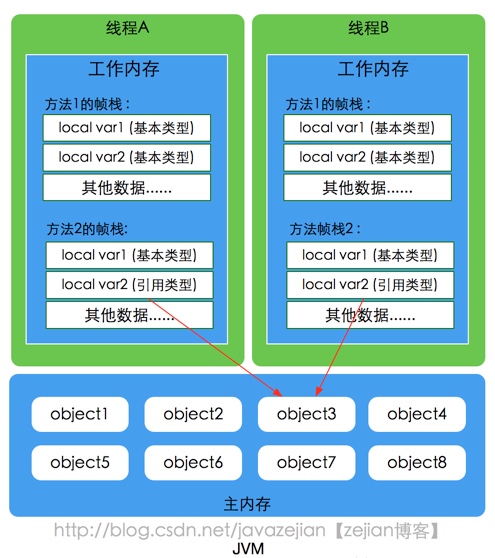
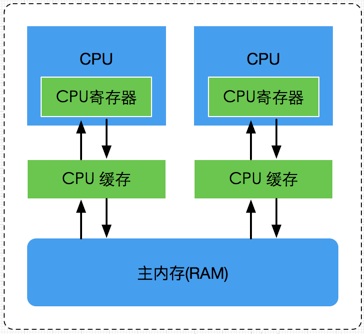
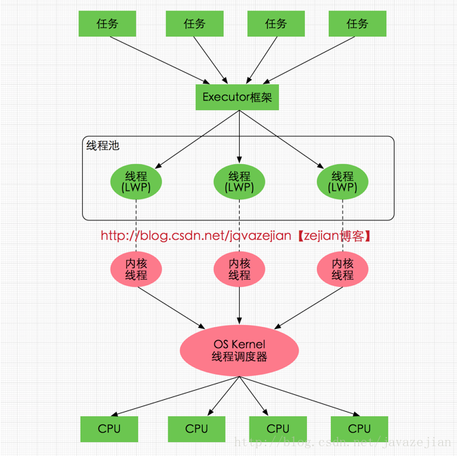
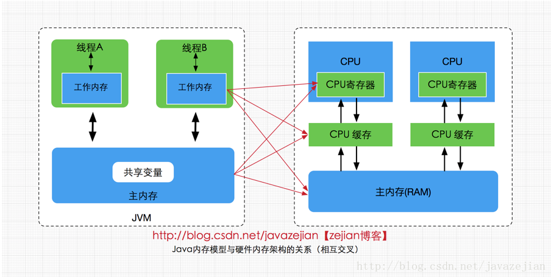

### 理解java内存区域与java内存模型

#### 1. Java内存区域

java虚拟机在运行程序时会把自动管理的内存划分为以上几个区域,每个区域都有的用途以及创建的实际,其中蓝色部分代表的是所有线程共享的区域,而绿色部分代表的是每个线程的私有数据区域

- 方法区(Method Area)

  方法区属于线程共享区域,又称为Non-Heap(非堆),主要用于存储已经被虚拟机加载的**类信息,常量,静态变量,即时编译器编译后的代码等数据**,根据java虚拟机规范规定,当方法区无法满足内存分配的需求时候,将抛出OutOfMemoryError异常.

  值得注意的是在方法区中存在一个运行时常量池(Runtime Constant Pool)的区域,它主要是用于存放**编译器生成的各种字面量和符号引用**,这些内容将在类加载后存放到运行是常量池中,以便后续使用

- JVM堆(Java Heap)

  java堆也是属于线程共享的内存区域,他在虚拟机启动时候创建,是java虚拟机锁管理的内存中最大的一块,主要用于存放对象的实例,几乎所有的对象实例都在这里分配内存,注意**java堆是垃圾手机器管理的主要区域**,因此很多时候也被称做GC堆,如果在堆中没有内存完成实例分配,并且堆也无法再扩展时,将会抛OutOfMemoryError异常

- 程序计数器(Program Counter Register):

  属于线程私有的数据区域,是一小块内存空间,主要代表当前线程所致行的字节码行号指示器.字节码解释器工作时,通过改变这个计数器的值来选取下一条需要执行的**字节码指令,分支,循环,跳转,异常处理,线程恢复等基础功能**都需要依赖这个计数器来完成

- 虚拟机栈(Java Wirtual Machine Stacks):

  属于线程私有的区域,与线程同时创建,总数与线程关联,代表java方法执行的内存模型.每个方法执行时候都会创建一个**栈帧来存储方法的变量表,操作数栈,动态链接方法,返回值,返回地址等**信息.每个方法从调用直到结束就对于一个栈帧在虚拟机入栈和出栈过程

  

  **注意:** 

  - 局部变量对象,也就是方法中的变量对象存储在栈中
  - 成员变量对象(共享的全局变量)存储在对中

- 本地方法栈(Native Method Stacks):

  本地方法属于线程私有的数据区域,这部分主要与虚拟机用到的Native方法相关,一般情况下,我们无序关心次区域

这里主要简单说明这部分内容,主要是为 区别java内存模型与java内存区域划分,毕竟这两种划分是属于不同层次的概念

#### 2. java内存模型概述

java内存模型(即Java Memory Model,简称JMM)本身是一种抽象的概念,并不是真是存在,他描述的是一组规则或者规范,通过这组规范定义了程序中各个字段(包括实例字段,静态字段和构成数组的元素)的访问方式.

由于JVM运行程序的实体是线程,而每个线程创建时候JVM都会为其创建一个**工作内存(有些地方称为栈空间),**用于存储线程私有的数据

而java内存模型中规定所有变量都存储在主内存中,主内存是共享内存区域,所有线程都可以访问,但是线程对变量的操作(读取赋值等)必须在工作线程中进行:

- 首先要将变量从主内存中拷贝到自己的工作内存空间,然后对变量进行操作,操作完成之后再将变量写回主内存,不能直接进行操作主内存中的变量,工作内存中存储着主内存中变量的副本拷贝
- 工作内存是每个线程的私有数据区域,因此不同的线程间无法访问对方的工作内存,线程中的通信必须依靠主存

需要注意的是,JMM与Java内存区域的划分是不同的概念层次;

更加恰当的说JMM是一组规则,通过这组规则控制程序中各个变量在共享数据区域和私有数据区域的访问方式,JMM围绕原子性,有序性,可见性展开的(稍候会分析).

JMM和java内存区域唯一相似点,都存在共享区域和私有区域:

- JMM中主内存属于共享区域,从某个程度上讲应该包括了堆和方法区
- 工作内存是先线程的私有数据区域,从某个程度上讲则应该包括程序计数器,虚拟机栈和本地方法栈

**主内存**

**主要存储的是Java实例对象，**所有线程创建的实例对象都存放在主内存中，不管该**实例对象是成员变量还是方法中的本地变量(也称局部变量)**，当然也包括了共享的类信息、常量、静态变量。由于是共享数据区域，多条线程对同一个变量进行访问可能会发现线程安全问题。

**工作内存**

主要存储当前方法的所有本地变量信息(**工作内存中存储着主内存中的变量副本拷贝**)，每个线程只能访问自己的工作内存，即线程中的本地变量对其它线程是不可见的，就算是两个线程执行的是同一段代码，它们也会各自在自己的工作内存中创建属于当前线程的本地变量，当然也包括了字节码行号指示器、相关Native方法的信息。注意由于工作内存是每个线程的私有数据，线程间无法相互访问工作内存，因此存储在工作内存的数据不存在线程安全问题。

**具体存储**

根据虚拟机规范,对于一个实例对象中的成员方法而言,如果方法中包含本地变量是基本数据类(boolean,byte,short,char,int,long,float,double),将直接存储在工作内存的帧栈结构中,但是倘若本地是引用类型,那么该变量的引用会存储在栈内存的帧栈中,而对象实例将存储在主内存(共享内存区域,堆)中.

但是对于实例变量的成员变量,不管他是基本数据类型或者是引用数据类型还是包装数据类型(Integer,Double),都会存储到堆区

至于static变量以及le类本身相关信息将会存储在主内存中

需要注意的是，在主内存中的实例对象可以被多线程共享，倘若两个线程同时调用了同一个对象的同一个方法，那么两条线程会将要操作的数据拷贝一份到自己的工作内存中，执行完成操作后才刷新到主内存，简单示意图如下所示：

### 硬件内存架构和java内存架构模型

#### 3. 硬件内存架构

正如上图所示，经过简化CPU与内存操作的简易图，实际上没有这么简单，这里为了理解方便，我们省去了南北桥并将三级缓存统一为CPU缓存(有些CPU只有二级缓存，有些CPU有三级缓存)。就目前计算机而言，**一般拥有多个CPU并且每个CPU可能存在多个核心，多核是指在一枚处理器(CPU)中集成两个或多个完整的计算引擎(内核),这样就可以支持多任务并行执行**，从多线程的调度来说，每个线程都会映射到各个CPU核心中并行运行。

在CPU内部有一组CPU寄存器，寄存器是cpu直接访问和处理的数据，**是一个临时放数据的空间**。一般CPU都会从内存取数据到寄存器，然后进行处理，但由于内存的处理速度远远低于CPU，导致CPU在处理指令时往往花费很多时间在等待内存做准备工作，于是在寄存器和主内存间添加了CPU缓存

CPU缓存比较小，但访问速度比主内存快得多，如果CPU总是操作主内存中的同一址地的数据，很容易影响CPU执行速度，此时CPU缓存就可以把从内存提取的数据暂时保存起来，如果寄存器要取内存中同一位置的数据，直接从缓存中提取，无需直接从主内存取。

需要注意的是，寄存器并不每次数据都可以从缓存中取得数据，万一不是同一个内存地址中的数据，那寄存器还必须直接绕过缓存从内存中取数据。所以并不每次都得到缓存中取数据，这种现象有个专业的名称叫做缓存的命中率，从缓存中取就命中，不从缓存中取从内存中取，就没命中，可见缓存命中率的高低也会影响CPU执行性能，这就是CPU、缓存以及主内存间的简要交互过程，

总而言之**当一个CPU需要访问主存时，会先读取一部分主存数据到CPU缓存(当然如果CPU缓存中存在需要的数据就会直接从缓存获取)，进而在读取CPU缓存到寄存器，当CPU需要写数据到主存时，同样会先刷新寄存器中的数据到CPU缓存，然后再把数据刷新到主内存中。**

#### 4. java线程和硬件处理器

了解完硬件的内存架构后,接着了解JVM中线程的实现原理,理解线程的实现原理,有助于我们了解java内存模型与硬件内存的关系

---

在windows和liunx系统中,java线程的实现是基于一对一的线程模型,所谓一对一的线程模型实际上就是通过语言级别层面的程序去直接系统内核的线程模型,也就是**系统的内核线程**

**内核线程**:是由操作系统内核支持的线程,这种线程由操作系统内核来完成线程的切换,内核通过操作调度器进而对线程进行调度,并将线程的任务映射到各个处理器上,每个内核线程可以认为是内核的一个分身,这也就是操作系统可以同时处理多任务的原因

由于我们编写的多线程程序属于语言层面的,程序一般不会直接取调用内核线程,确认代之的是一种轻量级的线程(Light Weight Process),也是通常意义上的线程,由于每个轻量级进程都会映射到一个内核线程,因此我们可以通过轻量级进程调用内核线程,进而由操作系统内核将任务映射到每个处理器.这种轻量级线程与内核线程间1对1的线程模型.如下图

#### 5. Java内存模型与硬件内存架构的关系

对于硬件内存来说只有**寄存器,缓存内存,主内存概念**,并没有主内存和工作内存之分;

也就是说Java内存模型对内存的划分对硬件内存并没有任何影响，因为JMM只是一种抽象的概念，是一组规则，并不实际存在，不管是工作内存的数据还是主内存的数据，对于计算机硬件来说都会存储在计算机主内存中，当然也有可能存储到CPU缓存或者寄存器中

因此总体上来说，Java内存模型和计算机硬件内存架构是一个相互交叉的关系，是一种抽象概念划分与真实物理硬件的交叉。(注意对于Java内存区域划分也是同样的道理)

就是说JMM中的主存不是主内存(RAM),如果JMM中主存有目标数据则从主存中获取,如果找不到则去主内存

#### 6.理解JMM中的happens-before 原则

倘若在程序开发中，仅靠sychronized和volatile关键字来保证原子性、可见性以及有序性，那么编写并发程序可能会显得十分麻烦，幸运的是，在Java内存模型中，还提供了happens-before 原则来辅助保证程序执行的原子性、可见性以及有序性的问题，它是判断数据是否存在竞争、线程是否安全的依据，happens-before 原则内容如下

---

1. 程序顺序原则，即在一个线程内必须保证语义串行性，也就是说按照代码顺序执行。

2. 锁规则 解锁(unlock)操作必然发生在后续的同一个锁的加锁(lock)之前，也就是说，如果对于一个锁解锁后，再加锁，那么加锁的动作必须在解锁动作之后(同一个锁)。

3. volatile规则 volatile变量的写，先发生于读，这保证了volatile变量的可见性，简单的理解就是，volatile变量在每次被线程访问时，都强迫从主内存中读该变量的值，而当该变量发生变化时，又会强迫将最新的值刷新到主内存，任何时刻，不同的线程总是能够看到该变量的最新值。

4. 线程启动规则 线程的start()方法先于它的每一个动作，即如果线程A在执行线程B的start方法之前修改了共享变量的值，那么当线程B执行start方法时，线程A对共享变量的修改对线程B可见

5. 传递性 A先于B ，B先于C 那么A必然先于C

6. 线程终止规则 线程的所有操作先于线程的终结，Thread.join()方法的作用是等待当前执行的线程终止。假设在线程B终止之前，修改了共享变量，线程A从线程B的join方法成功返回后，线程B对共享变量的修改将对线程A可见。

7. 线程中断规则 对线程 interrupt()方法的调用先行发生于被中断线程的代码检测到中断事件的发生，可以通过Thread.interrupted()方法检测线程是否中断。

8. 对象终结规则 对象的构造函数执行，结束先于finalize()方法

#### 相关链接:

<https://blog.csdn.net/javazejian/article/details/72772461>

<https://blog.csdn.net/suifeng3051/article/details/52611310>

----

#### 内存屏障（Memory Barrier ）
上面讲到了，通过内存屏障可以禁止特定类型处理器的重排序，从而让程序按我们预想的流程去执行。内存屏障，又称内存栅栏，是一个CPU指令，基本上它是一条这样的指令：

1. 保证特定操作的执行顺序。

2. 影响某些数据（或则是某条指令的执行结果）的内存可见性。

   

编译器和CPU能够重排序指令，保证最终相同的结果，尝试优化性能。插入一条Memory Barrier会告诉编译器和CPU：不管什么指令都不能和这条Memory Barrier指令重排序。

Memory Barrier所做的另外一件事是强制刷出各种CPU cache，如一个Write-Barrier（写入屏障）将刷出所有在Barrier之前写入 cache 的数据，因此，任何CPU上的线程都能读取到这些数据的最新版本。

这和java有什么关系？上面java内存模型中讲到的volatile是基于Memory Barrier实现的。

如果一个变量是volatile修饰的，JMM会在写入这个字段之后插进一个Write-Barrier指令，并在读这个字段之前插入一个Read-Barrier指令。这意味着，如果写入一个volatile变量，就可以保证：

1. 一个线程写入变量a后，任何线程访问该变量都会拿到最新值。
2. 在写入变量a之前的写入操作，其更新的数据对于其他线程也是可见的。因为Memory Barrier会刷出cache中的所有先前的写入。

#### happens-before

从jdk5开始,java使用新的JSR-133内存模型,基于happens-before的概念来阐述操作之间的内存可见性

在JMM中,如果一个操作的执行结果需要对另一个操作可见,那么这两个操作之间必须要存在 happens-before关系,这个的两个操作既可以在同一个线程,也可以在不同的两个线程中:

与程序员密切相关的happens-before规则如下:

1.程序顺序规则: 一个线程中的每个操作,**happens-before**于改线程中任意后序操作

2.监视器锁规则:对一个锁的解锁操作,**happens-before**于随后对这个锁的加锁操作

3.volatile域规则,对一个volatile域的写操作,**happens-before**于任意线程后续对这个volatile的读

4.传递性规则:如果A **happens-before **B,B **happens-before** C,则有 A **happens-before** C

注意：两个操作之间具有happens-before关系，并不意味前一个操作必须要在后一个操作之前执行！仅仅要求前一个操作的执行结果，对于后一个操作是可见的，且前一个操作按顺序排在后一个操作之前。

