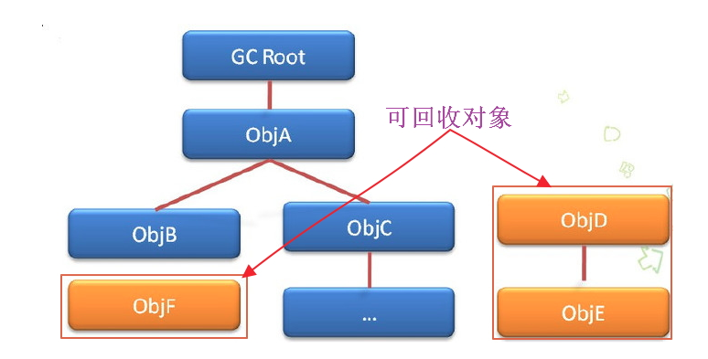
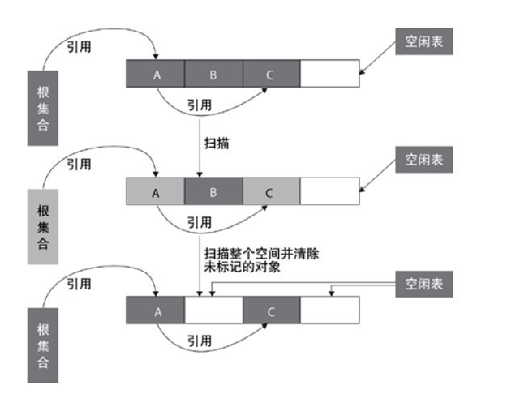
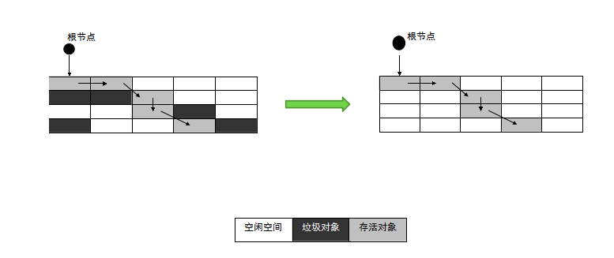
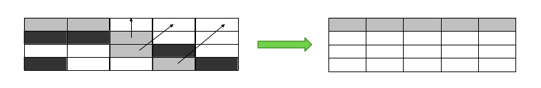
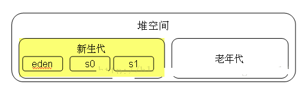
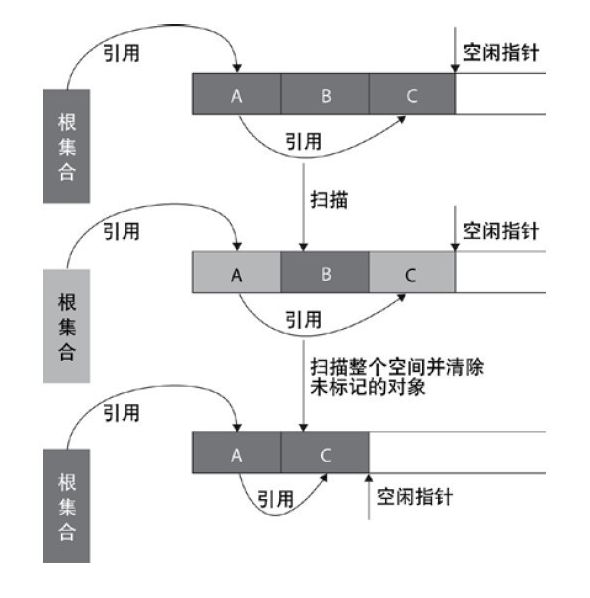
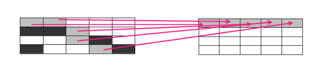
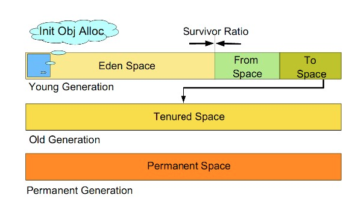
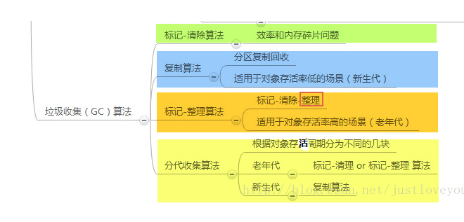
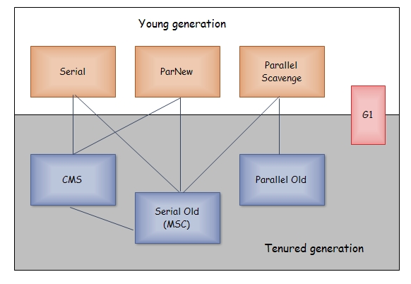

#### 1.垃圾回收的意义

从JVM内存分区来切入:

- java堆是进行垃圾回收的主要区域,故将其称为**GC堆**
- 方法区也有一个不太严谨的表述,就是永久代
- 总得来说,堆(包括java堆和方法区)是垃圾回收的主要对象,特别是java堆

首先我们来围绕三个核心问题来阐述java垃圾回收:

- **哪些内存需要回收?**(对象是否可以回收的两种经典算法:引用计数法和可达性分析算法)
- **什么时候回收?**(堆的新生代,老年代,永久代的回收机制, Minor GC 和 Full GC)
- **如何回收?**(三种经典的垃圾回收算法: **标记清除算法,赋值算法,标记整理算法以及分代收集算法和七种垃圾收集器**)


在探讨垃圾回收机制之前,我们首先应该记住一个单词:**stop-the-World**;stop-the-World意味着**JVM由于要执行GC而停止了应用程序的执行,并且这种情形会在任何一种GC算法中发生**,当stop-the-World发生时候,除了GC所需的线程以外,所有线程都处于等待状态直到GC任务完成.事实上,GC优化很多时候就是指减少Stop-the-World发生的时间,从而使系统具有**高吞吐,低停顿**的特点

Ps: **内存泄露**是指该内存空间使用完毕之后未回收，在不涉及复杂数据结构的一般情况下，Java 的内存泄露表现为一个内存对象的生命周期超出了程序需要它的时间长度。


#### 2. 如何确定一个对象是否可以被回收

##### 2.1 引用计数法

**引用技术算法是通过判断对象的引用数量来决定对象是否可以被回收**

引用计数算法是垃圾收集器中的早期策略。在这种方法中，堆中的每个对象实例都有一个引用计数。当一个对象被创建时，且将该对象实例分配给一个引用变量，该对象实例的引用计数设置为 1。当任何其它变量被赋值为这个对象的引用时，对象实例的引用计数加 1（a = b，则b引用的对象实例的计数器加 1），但当一个对象实例的某个引用超过了生命周期或者被设置为一个新值时，对象实例的引用计数减 1。特别地，当一个对象实例被垃圾收集时，它引用的任何对象实例的引用计数器均减 1。任何引用计数为0的对象实例可以被当作垃圾收集。


引用计数收集可以很快的执行,并且交织在程序的运行中,对程序需要不被长时间打断的实时环境比较有利,但是其很难解决对象之间互相循环引用的问题.如下面的程序和示意图所示,对象objA和objB的引用计数永远不可能为0,那么这两个对象就永远不会被回收


```java
　　public class ReferenceCountingGC {
　　
        public Object instance = null;

        public static void testGC(){

            ReferenceCountingGC objA = new ReferenceCountingGC ();
            ReferenceCountingGC objB = new ReferenceCountingGC ();

            // 对象之间相互循环引用，对象objA和objB之间的引用计数永远不可能为 0
            objB.instance = objA;
            objA.instance = objB;

            objA = null;
            objB = null;

            System.gc();
    }
}
```

上诉代码最后两句将`objA`和`objB`赋值为null,也就是说`objA`和`objB`指向的对象已经不能灾备访问,但是由于他们互相引用对方,导致他们的引用计数器不为0,那么垃圾收集器就永远不回收他们


##### 2.2 可达性分析算法:判断对象的引用链是否可达

**可达性分析算法是通过判断对象的引用链是否可达来决定对象是否可以被回收。**

可达性分析算法是从离散数学中的图论引入的,程序把所有的引用关系看作是一张图,通过一系列"GC Roots"的对象作为起始点,从这些节点开始向下搜索,搜索所走过的路径称为"引用链";当一个对象到GC Roots没有任何引用链(用图论的话来说就是从GCRoots到这个对象不可达)时,则证明这个对象是不可用的;在java中,可以作为GC Roots的对象包括以下几种:

- 虚拟机栈(栈中的局部变量表)中的引用对象
- 方法区中类静态属性引用的对象
- 方法区中常量引用的对象
- 本地方法中Native方法引用的对象



#### 3. 垃圾收集算法

##### 3.1 标记清除算法

**标记-清除算法分为标记和清除两个阶段。该算法首先从根集合进行扫描，对存活的对象对象标记，标记完毕后，再扫描整个空间中未被标记的对象并进行回收**，如下图所示。



**标记-清除算法缺点:**

- 效率问题: 标记和清除两个过程的效率都不高
- 空间问题: 标记-清除算法不需要进行对象的移动,并且仅对不存活的对象进行处理,因此标记清除之后会产生大量的不连续的内存碎片,空间碎片太多可能会导致以后在程序运行过程中需要分配较大对象的时候,无法找到足够的连续内存而不得不触发另一次的垃圾收集动作



##### 3.2 复制算法(新生代垃圾回收使用)

**复制算法将可用内存按容量划分为大小相等的两块，每次只使用其中的一块。当这一块的内存用完了，就将还存活着的对象复制到另外一块上面，然后再把已使用过的内存空间一次清理掉。**

这种算法适用于对象存活率低的场景,比如新生代(大部分是已经不存活的对象).

这样是的每次都对整个半区进行内存回收,内存分配时也就不用考虑内存碎片等复杂情况,只要推动栈顶指针,按顺序分配内存即可,实现简单,运行高效;该算法示意图如下:



事实上现在商用的虚拟机都采用这种算法来回收新生代.

因为研究发现，新生代中的对象每次回收都基本上只有10%左右的对象存活，所以需要复制的对象很少，效率还不错。

**实践中会将新生代内存分为一块较大的Eden空间和两块较小的Survivor空间 (如下图所示)，每次使用Eden和其中一块Survivor。当回收时，将Eden和Survivor中还存活着的对象一次地复制到另外一块Survivor空间上，最后清理掉Eden和刚才用过的Survivor空间。HotSpot虚拟机默认Eden和Survivor的大小比例是 8:1，也就是每次新生代中可用内存空间为整个新生代容量的90% ( 80%+10% )，只有10% 的内存会被“浪费”。**



##### 3.3 标记整理算法(老年代垃圾回收使用)

**复制算法在对象存活率较高的场景下会进行较多的复制工作,效率会变低.更加关键的是如果不想浪费50%的空间,就需要额外的空间进行分配担保,以应对高存活率的对象(极端下所有对象存活),基于此老年代垃圾回收一般不使用复制算法**

**标记整理算法的标记过程类似标记清除算法，但后续步骤不是直接对可回收对象进行清理，而是让所有存活的对象都向一端移动，然后直接清理掉端边界以外的内存，类似于磁盘整理的过程，该垃圾回收算法适用于对象存活率高的场景（老年代）**，其作用原理如下图所示。



标记整理算法与标记清除算法最显著的区别是：标记清除算法不进行对象的移动，并且仅对不存活的对象进行处理；而标记整理算法会将所有的存活对象移动到一端，并对不存活对象进行处理，因此其不会产生内存碎片。标记整理算法的作用示意图如下：



##### 3.4 分代收集算法

对于一个大型的系统,当常见的对象和方法变量比较多的时候,对内存的对象也会比较所,如果足以分析对象是否该回收,那么势必造成效率低下.

分代算法就是基于这样一个事实:

**不同的对象的生命周期(存活情况)是不一样的,而不同生命周期的对象位于堆中不透光的区域,因此对堆内存不同区域采用不同的策略进行回收可以提高JVM的执行效率**

当代商用虚拟机使用的都是分代手机算法:新生代对象存活率低,就采用复制算法;老年代存活率高,就用标记清除算法或者标记整理算法.java堆内存一般可以分为新生代,老年代和永久代三个模块:



1). 新生代（Young Generation）

　　新生代的目标就是尽可能快速的收集掉那些生命周期短的对象，一般情况下，所有新生成的对象首先都是放在新生代的。新生代内存按照 8:1:1 的比例分为一个eden区和两个survivor(survivor0，survivor1)区，大部分对象在Eden区中生成。在进行垃圾回收时，先将eden区存活对象复制到survivor0区，然后清空eden区，当这个survivor0区也满了时，则将eden区和survivor0区存活对象复制到survivor1区，然后清空eden和这个survivor0区，此时survivor0区是空的，然后交换survivor0区和survivor1区的角色（即下次垃圾回收时会扫描Eden区和survivor1区），即保持survivor0区为空，如此往复。特别地，当survivor1区也不足以存放eden区和survivor0区的存活对象时，就将存活对象直接存放到老年代。如果老年代也满了，就会触发一次FullGC，也就是新生代、老年代都进行回收。注意，新生代发生的GC也叫做MinorGC，MinorGC发生频率比较高，不一定等 Eden区满了才触发。

2). 老年代（Old Generation）

　　老年代存放的都是一些生命周期较长的对象，就像上面所叙述的那样，在新生代中经历了N次垃圾回收后仍然存活的对象就会被放到老年代中。此外，老年代的内存也比新生代大很多(大概比例是1:2)，当老年代满时会触发Major GC(Full GC)，老年代对象存活时间比较长，因此FullGC发生的频率比较低。


3). 永久代（Permanent Generation）

　　永久代主要用于存放静态文件，如Java类、方法等。永久代对垃圾回收没有显著影响，但是有些应用可能动态生成或者调用一些class，例如使用反射、动态代理、CGLib等bytecode框架时，在这种时候需要设置一个比较大的永久代空间来存放这些运行过程中新增的类。

##### 3.5 小结:



由于对象进行了分代处理,因此垃圾回收区域,时间也不一样.垃圾回收有两种类型: Minor GC 和 Full GC

- Minor GC: 对新生代进行回收,不会影响老年代.因为新生代的java对象大多死亡频繁,所以Minor GC 比较频繁,一般这里使用速度快,效率高的算法,使垃圾回收能尽可能快的完成
- Full GC: 也叫Major GC,对整个堆进行回收,包括新生代和老年代.由于Full GC 需要对整个堆进行回收,所以比Minor GC要慢,因此尽可能减少 Full GC 的次数,导致Full GC的原因包括: 老年代被写满,永久代被写满和System.gc()被显式调用

#### 4. 垃圾收集器

　如果说垃圾收集算法是内存回收的方法论，那么垃圾收集器就是内存回收的具体实现。下图展示了7种作用于不同分代的收集器，其中用于**回收新生代的收集器包括Serial、PraNew、Parallel Scavenge**，**回收老年代的收集器包括Serial Old、Parallel Old、CMS**，还有用于**回收整个Java堆的G1收集器**。不同收集器之间的连线表示它们可以搭配使用。


新生代  顺序: `单线程 ---> 并行  ---> 高吞吐`

- Serial收集器**（复制算法)**: **新生代单线程收集器，**标记和清理都是单线程，优点是简单高效；
- ParNew收集器 **(复制算法)**: **新生代收并行集器**，实际上是Serial收集器的多线程版本，在多核CPU环境下有着比Serial更好的表现
- Parallel Scavenge收集器 **(复制算法)**: **新生代并行收集器**，**追求高吞吐量**，高效利用 CPU。吞吐量 = 用户线程时间/(用户线程时间+GC线程时间)，高吞吐量可以高效率的利用CPU时间，尽快完成程序的运算任务，适合后台应用等对交互相应要求不高的场景

老年代

- Serial Old收集器 **(标记-整理算法)**: **老年代单线程收集器**，Serial收集器的老年代版本；
- Parallel Old收集器 **(标记-整理算法)**： **老年代并行收集器**，**吞吐量优先**，Parallel Scavenge收集器的老年代版本；
- CMS(Concurrent Mark Sweep)收集器**（标记-清除算法）**： **老年代并行收集器**，**以获取最短回收停顿时间为目标的收集器，具有高并发、低停顿的特点**，追求最短GC回收停顿时间。

堆整体回收

- G1(Garbage First)收集器 (标记-整理算法)： Java堆并行收集器，G1收集器是JDK1.7提供的一个新收集器，G1收集器基于“标记-整理”算法实现，也就是说不会产生内存碎片。此外，G1收集器不同于之前的收集器的一个重要特点是：G1回收的范围是整个Java堆(包括新生代，老年代)，而前六种收集器回收的范围仅限于新生代或老年代。
  

#### 5. 内存分配和回收策略

　Java技术体系中所提倡的自动内存管理最终可以归结为自动化地解决了两个问题：给对象分配内存 以及 回收分配给对象的内存。一般而言，对象主要分配在新生代的Eden区上，如果启动了本地线程分配缓存(TLAB)，将按线程优先在TLAB上分配。少数情况下也可能直接分配在老年代中。总的来说，内存分配规则并不是一层不变的，其细节取决于当前使用的是哪一种垃圾收集器组合，还有虚拟机中与内存相关的参数的设置。

-  1) 对象优先在Eden分配，当Eden区没有足够空间进行分配时，虚拟机将发起一次MinorGC。现在的商业虚拟机一般都采用复制算法来回收新生代，将内存分为一块较大的Eden空间和两块较小的Survivor空间，每次使用Eden和其中一块Survivor。 当进行垃圾回收时，将Eden和Survivor中还存活的对象一次性地复制到另外一块Survivor空间上，最后处理掉Eden和刚才的Survivor空间。（HotSpot虚拟机默认Eden和Survivor的大小比例是8:1）当Survivor空间不够用时，需要依赖老年代进行分配担保。

- 2) 大对象直接进入老年代。所谓的大对象是指，需要大量连续内存空间的Java对象，最典型的大对象就是那种很长的字符串以及数组。

- 3) 长期存活的对象将进入老年代。当对象在新生代中经历过一定次数（默认为15）的Minor GC后，就会被晋升到老年代中。

- 4) 动态对象年龄判定。为了更好地适应不同程序的内存状况，虚拟机并不是永远地要求对象年龄必须达到了MaxTenuringThreshold才能晋升老年代，如果在Survivor空间中相同年龄所有对象大小的总和大于Survivor空间的一半，年龄大于或等于该年龄的对象就可以直接进入老年代，无须等到MaxTenuringThreshold中要求的年龄。'

**需要注意的是,java的垃圾回收机制是java虚拟机提供的能力,用于空闲时间以不定时的方式回收无任何引用的对象占据的内存空间.也就是锁,垃圾收集器回收的是无任务引用对象占据的内存空间而不是对象本身**


#### 6. java 中的内存泄露问题

虽然java拥有垃圾回收机制,但是同样会出现内存泄露问题,比如下面提到的几种情况:

- 诸如HashMap, Vector等集合类的静态使用最容器出现内存泄露,因为这些静态变量的生命周期和应用程序一致,所持有的对象的object也不能被释放,因为他们也将一直被Vector等应用着

```java
private static Vector v = new Vector(); 

public void test(Vector v){

    for (int i = 1; i<100; i++) { 
        Object o = new Object(); 
        v.add(o); 
        o = null; 
    }
}
```

在这个例子中,虚拟机栈保存着Vector对象的引用v和object对象的引用o.在for 循环中,我们不断生成新的对象,然后将其添加到Vector对象中,之后将o引用置空.问题是虽然我们将o引用置空,当发生垃圾回收的时候,我们创建的object对象也不能够被回收.因为垃圾回收在跟踪代码栈中的引用时会发现v引用,而继续往下跟踪就会发现v引用指向的内存空间中又存在指向Object对象的引用.也就是说,尽管o引用已经被置空,但是object对象仍然存在其他的引用,是可以被访问到的,所以GC无法将其释放掉.如果在此循环之后,Object对象对程序已经没有任何作用,那么我们就认为此java程序发生了内存泄露


- 各种资源连接包括数据库连接,网络连接,IO链接等没有显式调用close关闭,不被GC回收导致内存泄露
- 监听器的使用,在释放对象的同时没有相应删除监听器的时候也可能导致内存泄露


#### 7 知识点补充

##### 7.1 引用

引用概述:

**无论是根据引用计数算法判断对象的引用数量,还是通过可达性分析算法判断对象的引用链是否可达,判定对象都与引用有关**

- JDK1.2之前,java中引用的定义很纯粹也很传统:如果`reference`类型的数据中存储的数值代表的是另外一块内存的其实地址,就称这块内存代表一个引用.这种定义很纯粹,但是太过狭隘,**这种定义只有被引用和没有被引用两种状态,对应一些可有可无的对象无能为力**

为此JDK1.2之后推出了**强引用,软引用,弱引用,虚引用四种**

- 强引用就是指在程序代码之中普遍存在的，类似“Object obj = new Object()”这类引用。 只要强引用还存在，垃圾收集器就永远不会回收掉被引用的对象。

- 软引用用来描述一些还有用，但并非必需的对象。对于软引用关联着的对象，在系统将要发生内存溢出异常之前，将会把这些对象列进回收范围之中并进行第二次回收。如果这次回收还是没有足够的内存，才会抛出内存溢出异常。在JDK 1.2之后，提供了SoftReference类来实现软引用。
- 弱引用也是用来描述非必需对象的，但是它的强度比软引用更弱一些，被弱引用关联的对象只能生存到下一次垃圾收集发生之前。当垃圾收集器工作时，无论当前内存是否足够，都会回收掉只被弱引用关联的对象。在JDK 1.2之后，提供了WeakReference类来实现弱引用。

- 虚引用是最弱的一种引用关系。一个对象是否有虚引用的存在，完全不会对其生存时间构成影响，也无法通过虚引用来取得一个对象实例。为一个对象设置虚引用关联的唯一目的就是希望能在这个对象被收集器回收时收到一个系统通知。在JDK 1.2之后，提供了PhantomReference类来实现虚引用。

##### 7.2 方法区的回收

方法区的内存回收目标主要是针对**常量池的回收**和**对类型的卸载**.回收废弃常量与回收java堆中对象非常类似,以常量池中字面量的回收为例,加入一个字符串"abc"已经进入了常量池,但是当前系统没有任何一个String对象叫做"abc"的,换句话说是没有任何String对象引用常量池中的"abc"常量,也没有其他地方引用这个字面量,如果在这个时候发生内存回收,而且必要的话,这个"abc"常量就会被系统"清"出常量池,常量池中其他类(接口),方法,字段的符号引用也与此类似


判定一个常量是否是"废弃常量"比较简单,而要判定一个类是否是"无用的类"的条件则相对苛刻许多.类需要同时满足下面3个条件才能算是"无用类":

- 该类的所有实例都已经被回收,也就是java堆中不存在该类的任何实例
- 加载该类的ClassLoader已经被回收
- 该类对应的`java.lang.Class`对象没有在任何地方被引用,无法在任何地方通过反射访问该方法

虚拟机可以对满足上诉3个调教的无用类进行回收(卸载),这里说的仅仅是"可以",而不是和对象一样,不使用了就会必然回收.特别的,在大量使用反射,动态代理,CGLib等bytecode框架的场景,以及动态声场JSP和OSGi这类频繁自定义ClassLoader的场景都需要虚拟机具备类卸载的功能,以保证;永久代不会溢出


- '
  


