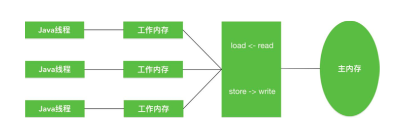
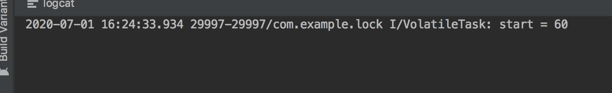

#### 1. synchronnized的原理

#####1.1synchronnized原理

synchronnized修饰代码块是由一对  monitorenter/monitorexit指令实现的,**Monitor**对象是同步的基本实现,而synchronized同步方法使用了`ACC_SYNCHRONIZED`访问标志来辨别一个方法是否声明为同步方法,从而执行相应的同步调用

在java6之前,**Monitor**实现完全是依靠操作系统内部的互斥锁,因为需要进行用户态到内核态的切换,所以同步操作是一个无差别的**重量级操作**

现代的(Oracle)JDK中,JVM进行了大刀阔斧的改进,提供了三种不同的**Monitor**实现,也就是常说的三种不同的锁:偏斜锁,轻量级锁和重量级锁,大大改进其性能


- 锁竞争

所谓锁的升级,降级,就是JVM优化synchronized运行的机制,当JVM检测到不同的竞争状况时候,会自动切换到适合的锁实现,这种切换就是锁的升级,降级

- 没有锁竞争

没有锁的竞争出现时,默认使用偏斜锁.JVM会使用CAS操作,对象头上的Mark Word部分设置线程ID(也就是**ObjectMonitor**中的`_owner`),表示这个对象偏向于当前线程,所以并不设计真正的互斥锁.**这样做的假设是基于在很多场景中,大部分对象生命周期中最多背对一个线程锁定,使用偏斜锁锁可以降低无竞争开销**

如果有另外的线程试图锁定某个已经被偏斜过的对象,JVM就需要撤销(revoke)偏斜锁,并切换到轻量级锁的实现.轻量级锁依赖CAS操作Mark Word来试图获取锁,如果重试成功,就使用普通的轻量级锁;否则,进一步升级为重量级锁(可能会先进行自旋锁升级,如果失败再尝试重量级锁升级)


我们注意到有的观点认为java不会进行锁降级.实际锁降级确实是会发生的,当JVM进入安全点(SafePoint)的时候,会检查是否有闲置的Monitor,然后试图降级


#### 2. synchronized优化后的锁机制:

- 自旋锁
  - 线程自旋说白了就是死循环,比如:可以执行几次for循环,可以执行几条空的汇编指令,目的就是占着CPU不放,等待获取锁的机会.如果旋的时间过长会影响整体性能,时间过短又达不到延迟阻塞的目的
- 偏向锁: **单线程重入同一个锁**
  - 偏向锁就是一旦线程第一次获得了见识对象,之后监视对象"偏向"这个线程,之后多次调用则可以避免CAS这个操作,说白了就是置一个变量,如果发现为true则无需再走各种加锁/解锁的流程
- 轻量级锁 **非同一时刻竞争锁**
  - 轻量级锁是由偏向锁升级来的,偏向锁运行在一个线程进入同步块的情况下,当第二个线程加入锁竞争的时候,偏向锁就会升级为轻量级锁
- 重量级锁 ** 同一时间竞争同一个锁**
  - 重量级锁在JVM中又叫**对象监视器**,他很像C中的Mutex,除了具备Mutex(0|1)互斥的功能,他还负责实现了Semaphore(信号量)的功能,也就是说他至少包含一个竞争锁的队列和一个信号阻塞队列(wait队列),前者负责做互斥,后者用于线程同步

#### 3. synchornized关键字涉及的类锁,方法锁,重入锁的理解

- synchorinzed修饰静态方法获取的是类锁(类的字节码文件对象)

- s- ynchorinzed修饰普通的方法或者代码块获取的是对象锁,这种机制确保了同一时刻对于每一个实例,其所有声明为synchronized成员函数至多只有一个出于可执行状态,从而有效避免了类成员变量的访问冲突

对象锁和类锁是不冲突的

- 重入锁:就是当前线程可以重复获取当前线程持有的同一个锁


```java
public class Widget {

    public synchronized void doWork(){

    }


}

public class LoggingWidget extends Widget{


    public synchronized void doWork(){
        System.out.println(toString() + ": calling doSomething");
        super.doWork();
    }
}
```

#### 4. wait,sleep的区别和notify的运行过程

##### 4.1 wait和sleep的区别

最大的不同是在等待时wait会释放锁,而sleep一直持有锁,wait通常备用与线程间的交互,sleep通常被用于暂停执行

- 首先`sleep`是thread里面的方法,`wait`是Object类中的方法,尽管两个方法都会影响线程的执行行为,但是本质上是有区别的

- `Thread.sleep`仍然会持有锁,`Object.wait`不会持有锁(与锁相关的方法都定义在Object类中,因此调用`Thread.sleep`是不会影响锁的相关行为)

- `Thread.sleep`和`Object.wait`都是暂停当前线程,对于CPU资源来说,不管是那种方式的暂停线程,都表示他暂时不在需要CPU的时间片;OS会将执行时间片分配给其他线程.区别是,调用wait之后需要别的线程执行 notify/notifyAll才能重新获得CPU执行时间

- 线程状态参考`Thread.State的`定义,新创建的但是没有执行(还没有调用start())的线程出于就绪状态,或者是`Thread.State.NEW`状态

  ```java
  public enum State {
      //尚未启动线程的状态
      NEW,
  
      // 运行状态
      RUNNABLE,
  
      // 阻塞状态
      BLOCKED,
  
      // 就绪状态  调用wait/join然后notify唤醒
      WAITING,
  
      // 定时等待 sleep  wait(long) join(long)
      TIMED_WAITING,
  
      // 线程停止
      TERMINATED;
  }
  ```

  

- `Thread.State.BLOCKED`(阻塞)表示线程正在获取锁时,因为锁不能获取到而被迫暂停执行下面的指令,一直等到这个锁被别的线程释放.BLOCKED状态下的线程,OS调度机制需要决定下一个能够获取锁的线程是哪个,这种情况下,就是产生锁的争用,无论如何都是很耗时的操作

##### 4.2 notify运行过程

当线程A(消费者)调用wait方法后,线程A让出锁,自己进入等待状态,同时加入**锁对象的等待队列**.线程B(生产者)获取锁之后,调用notify方法通知**锁对象的等待队列**,是的线程A从**等待队列进入阻塞队列**,线程A进入阻塞队列之后,直到线程B释放锁后,**线程A竞争得到锁继续从wait()方法后执行**

注意获取obj的**monitor**必须是**synchronized**关键字,所以 `wait`和`notify/notifyAll`如果要生效,必须两部分代码除以**synchronized**修饰的同一个lock对象


#### 5. Synchronized关键字和Lock的区别?以及为什么Lock性能好一些?

Synchronized

- 存在层次:jvm层面上
- 锁的释放:
  - 1.已经获取锁的线程执行完同步代码,释放锁
  - 2.线程执行发生异常,JVM会让线程释放锁
- 锁的获取:线程A获取锁,线程B等待,如果A线程阻塞,B线程会一直等待
- 锁状态:不可判断
- 性能: 少量同步

Lock

- 存在层次:是一个类
- 锁的释放: 在finally中必须释放锁,不然容易造成线程死锁
- 锁的获取: 分情况而定,Lock有多个锁的获取方式,可以尝试获取锁,线程可以不用一直等待
- 锁状态:可以判断
- 性能:大量同步

LOCK(ReentrantLock)的底层实现主要是  volatile+CAS(乐观锁)

Synchronized是一种**悲观锁**,比较耗性能,但是在JDK1.6以后对Synchronized的锁机制进行了优化,加入了偏向锁,轻量级锁,自旋锁,重量级锁,在并发量不大的情况下,性能可能优于Lock机制,所以请求量不大的情况下建议使用Synchronized

#### 6.volatile原理

前面涉及到线程,我们围绕可见性,原子性,时序性的问题;通常情况下我们可以通过**synchronized**关键字来解决这个问题,不过如果对**synchronized**原理有了解的话,应该知道**synchronized**是一个较重量级的解决方案;因为**synchronized**的重量级锁是在用户态和核心态之间切换,比较耗时


为了避免**synchronized**的耗时,java中提供了**volatile**;

**volatile**是另一种解决可见性有序性问题的方案,对于原子性,需要强调一点,也是大家容易误解的一点:

对**volatile**变量的单词读.写操作可以保证原子性,如long,double类型变量,但是不能保证i++这种操作的原子性,因为本质上i++是读和写两次操作

**volatile**也是互斥锁的一种实现,不过他非常轻量级


#### 7. volatitle的意义

- 防止CPU指令重排序

**volatile**有两条关键的语义

1. 保证被**volatile**修饰的变量对所有线程都是可见的
2. 禁止进行指令重排序

要理解**volatitle**,我们得先从java的线程模型说起,如下图所示



- java内存模型规定了所有字段(这些字段包括实例字段,静态字段,不包括局部变量,方法参数等,因为这些是线程私有的,并不存在竞争)都存在内存中;

- 每个线程会有自己的工作内存,工作内存中保存了线程所使用到的变量在主内存的拷贝副本,线程对变量的操作只能在工作内存中进行,而不能直接读写内存,当然不同内存之间也无法访问对方的工作内存,也就是说主内存是线程传值的媒介

我们来理解第一句话

##### 7.1**保证被volatile修饰的变量对所有线程都是可见的**

那么如果保证可见性呢?

被**volatile**修饰的变量在工作内存修改后,会强制写回主存,其他线程在使用的时候也会强制从主存刷新,这样就保证了一致性


关于**保证被volatile修饰的变量对所有线程都是可见的**,有种常见的错误理解:

- 由于**volatile**修饰的变量在各个线程里都是一致的,所以基于**volatile**变量的运算在多线程并发的情况下是安全的

这句话的前半部分是对的,后半部分却错了,因此他忘记考虑变量的操作是否具有原子性这一问题

来看下代码

```java
private static final String TAG = "VolatileTask";

private volatile int start = 0;

public void keyWord(){
    Runnable runnable = new Runnable() {
        @Override
        public void run() {
            for (int i = 0; i < 10; i++) {
                start++;
            }

        }
    };

    for (int i = 0; i < 10; i++) {
        Thread thread = new Thread(runnable);
        thread.start();
    }
    Log.i(TAG,"start = " + start);
}
```

我们假设若果线程安全的话,最后结果应该是100,但是我们开下运行的结果:



那么为什么会是这样,我们仔细分析一下`start++`,简单来看这个语句包括两步:

- 取出start的值,因为有volatile的修饰,这时候是正确的

- 自增,但是自增的时候,别的线程可能把`start`加大了,这种情况下就有可能把较小的`start`写入主存中,所以**volatile**只能保证可见性,在不符合一下场景的下我们依然需要通过加锁来保证原子性:

  - 运算结果并不依赖变量当前的值,或者只有一个单一线程修改变量的值(要么结果不依赖当前值,要么操作是原子性的,要么只有一个线程修改变量的值)
  - 变量不需要与其他状态变量共同参与不变约束,比方说我们会在线程里看加个boolean变量,来判断程序是否停止,这种情况就非常适合使用volatile

  

##### 7.2 禁止指令重排序

什么是指令重排序:

**指令重排序**是指指令乱序执行,即在条件允许的情况下直接运行当前有能力立即执行的后续指令,避开为获取一条指令锁需要的数据而造成的等待,通过连续执行的技术提高执行效率

指令重排序会在 被**volatile**修饰的变量赋值操作前,添加一个内存屏障,指令重排序时不能把后面的指令重排序移动到内存屏障之前的位置


#### 8 synchornized和volatile的区别

**volatile:**

1. 保证了不同线程对这个变量进行操作时的可见性,即一个线程修改了某个变量的值,这新值对其他线程来是可见的
2. 禁止指令重排序

**volatile**作用:

**volatile**本质是告诉JVM当前变量在寄存器(工作内存)中值是不确定的,需要从主存中读取;

**synchronized**则是锁定当前变量,只有当前线程可以访问该便利忙,其他线程被阻塞


区别:

1. **volatile**仅仅使用在变量级别,**synchronized**则可以使用在变量,方法,和类级别(如`static`)
2. **volatile**仅能实现变量的可见性,不能保证原子性;**synchronized**则可以保证变量的修改的可见性和原子性
3. **volatile**不会造成线程阻塞;**synchronized**可能会造成线程阻塞
4. **volatile**标记的变量不会被编译优化;**synchronized**标记的变量会被编译优化(`偏向锁&轻量锁&自旋锁&锁消除`)

#### 9 .ReentrantLock的内部实现

**ReentrantLock**实现的前提是**AbstractQueuedSynchronizer**,简称AQS,是`java.util.concurrent`的核心,CountDownLatch,FuntureTask,Semaphore,ReentrantLock等都有一个内部类是这个抽象类的子类.

由于ADS是基于FIFO队列实现,因此必然选在一个个节点,Node有两种模式:共享模式和独占模式;

**ReentrantLock**是基于AQS的,AQS是java并发包里面众多同步组件的构建基础,他通过一个int类型的状态变量state和一个FIFO队列来完成共享资源的获取,线程排队等等;AQS是一个底层框架采用模板方法模式,它定义了通用的较为复杂的逻辑骨架,比如线程的排队,阻塞,唤醒等,将这些复杂但是实质通用的部分抽取出来,这些都是需要构建同步组件的使用者无需关心的,使用者仅仅需要写一些简单的指定的方法即可(其实就是对于共享变量state的一些简单的获取释放的操作),AQS的子类一般只需要重写**tryAcquire(int arg)**和**tryRelease(int arg)**两个方法即可


##### 9.1 ReentrantLock实现逻辑

其内部定义了3个重要的静态内部类,**Sync**,**NonfairSync**,**FairSync**.

- Sync作为ReentrantLock中公用的同步组件,继承了AQS(要利用AQS复杂的顶层逻辑:线程排队,阻塞,唤醒等等)
- NonfairSync,FairSync都继承自Sync,调用Sync的公用逻辑,然后再在各自内部完成自己特定的逻辑(公平或者非公平)

接着说下两者lock()的实现原理

**NonfairSync(非公平可重入锁)**

1. 先获取State值,若为0,意味着此时没有线程获取到资源,CAS将其设置为1,设置成功则代表获取到互斥锁
2. 若state>0,说明其他线程已经抢占到资源,此时再去判断是否就是自己抢占的,是的话,state累加,返回true,重入成功,state的值即是线程重入的次数

3. 其他情况则获取锁失败

**NonfairSync(公平可重入锁)**

公平锁的大致逻辑与非公平锁是一致的,不同的地方在于有了**!hasQueuePredecessors()**这个判断逻辑,即便state是0,也不能贸然直接取获取,要先去看有没有还在排队的线程,若没有,才能尝试取获取,做后面的处理,反之,返回false,获取失败


**ReentrantLock-tryRelease()**

若state为0,表示当前线程已经完全释放干净,返回true,上层的AQS会意识到资源已经空出;若不为0,则表示线程还占有资源,只不过将此次重入的资源释放了而已,返回false

**ReentrantLock**是一种可重入的,可实现公平性的互斥锁,他的设计基于AQS框架,可重入和公平性的实现逻辑不难理解,每次重入一次,state就加1,当然在释放的时候,也得一层层释放;至于公平性,在尝试获取锁的时候多了一个判断:是否有比自己申请早的线程在同步对类中等待,若有去等待;若没有,才允许去抢占


#### 10.ReentrantLock,Synchronized和vilatile比较


