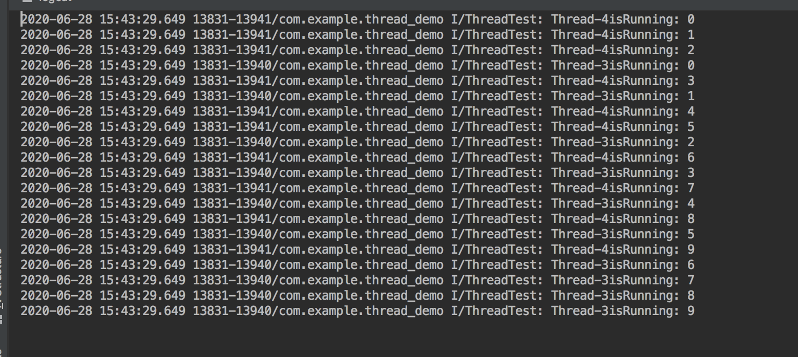
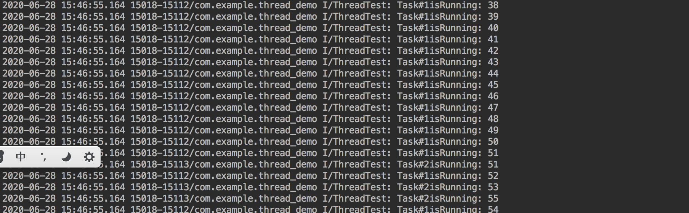
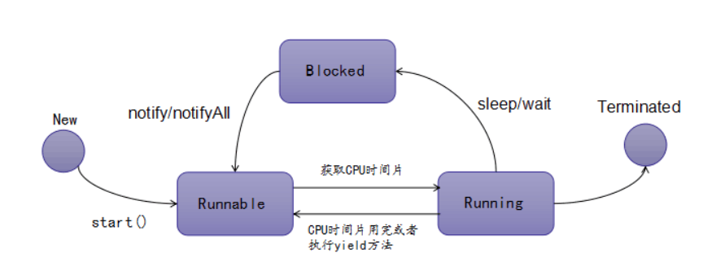
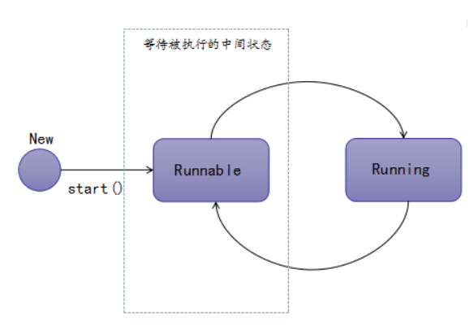
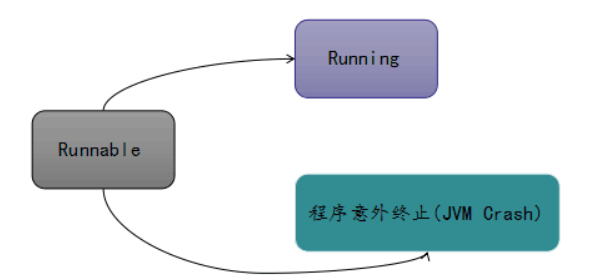
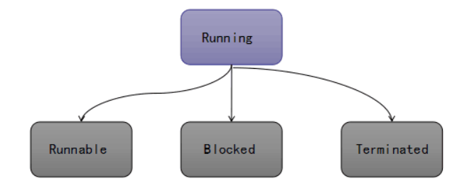

#### 1.创建线程的方式

- 继承Thread类
- 实现Runnable接口
- 使用Callable和Future

####2.继承Thread类创建线程

```java
// step1  实现Thread的run方法
// step2  实例化Thread对象
// step3  .start thread
private void doWork1() {
    new ThreadTest().start();
    new ThreadTest().start();


}

class ThreadTest extends Thread{
    private int i = 0;
    
    @Override
    public void run() {
        super.run();
        for (;i<10;i++){
            Log.i(TAG,Thread.currentThread().getName() + "isRunning: " + i);
        }
    }
}
```



可以看到代码资源不共享

#### 3. 实现Runnable接口创建线程

```java
// step1: 实现RunnableTest接口,重写其run方法
// step2: 实例化RunnableTest实现类,将其作为Thread的入参传入
// step3: 调用thread对象的start方法
private void doWork2() {
    RunnableTest runnableTest = new RunnableTest();
    new Thread(runnableTest,"Task#1").start();
    new Thread(runnableTest,"Task#2").start();


}

class RunnableTest implements Runnable{
    private int i = 0;

    @Override
    public void run() {
        //super.run();
        for (;i<100;i++){
            Log.i(TAG,Thread.currentThread().getName() + "isRunning: " + i);
        }
    }
}
```



代码资源是共享的,但是由于没有锁的加入,会有线程不安全出现


#### 4.使用Callable和Future创建线程

和Runnable接口不一样,Callable接口提供了一个call方法作为线程的执行体,call()方法比run()方法功能要强大:call方法可以有返回值,可以声明异常

```java
// step1: 创建Callable的实现类,并实现其call方法
// step2: 创建Callable实现类的实例,使用FutureTask包装Callable的实现类
// step3: FutureTask作为Thread入参
// step4: .start()启动线程
private void doWork3() {
    CallableTest callableTest = new CallableTest();
    FutureTask futureTask = new FutureTask<>(callableTest);
    new Thread(futureTask).start();
}

class CallableTest implements Callable{

    @Override
    public Object call() throws Exception {
        int sum = 0;
        for (int i = 0; i < 101; i++) {
            sum += 1;
        }

        Log.i(TAG,Thread.currentThread().getName() + "isRunning: " + sum);

        return null;
    }
}
```

工作流程,其实和AsyncTask源码一致

首先Callable实现call接口,然后FetureTask封装Callable,FetureTask`FutureTask<V> implements RunnableFuture<V> `,`RunnableFuture<V> extends Runnable, Future<V> `,FetureTask传入Thread,然后Thread调用start时候会调用`FetureTask`的`run`方法,然后在`FetureTask`的`run`方法调用`Callable`的`call`并返回`result`,当然这会返回`callable`的`result`


#### 5.线程的三种方式的对比

##### 5.1实现Runable/Callable接口相比继承Thread类的优势

1. 适合多个线程进程进行资源共享
2. 可以避免java中单继承的限制
3. 增加程序的健壮性,代码和数据独立
4. 线程池只能放入Runable或Callable接口实现类,不能直接放入继承Thread类

##### 5.2 Callable和Runnable的区别

1. Callable重写的是call()方法,Runnable重写的方法是run()方法
2. call()方法执行后可以有返回值,run()方法没有返回值
3. call()方法可以抛出异常,run()方法不可以
4. 运行Callable任务可以拿到一个Futrue对象,表示异步计算的结果.通过Futrue对象可以了解任务执行情况,可取消任务的执行,还可以获取执行结果

#### 6.线程的生命周期



- 新建:就是new一个线程,也就是线程实例化

- 就绪: 就是调用线程的start()方法后,这时候线程处于等待CPU分配资源的阶段,谁先抢占CPU资源,谁就开始执行
- 运行:当就绪的线程被调用并获得CPU资源时候,便进入运行状态,run方法定义了线程的操作和功能
- 阻塞:在运行状态的时候,可能因为某些元婴导致运行状态的线程变成了阻塞状态,比如sleep(),wait()之后线程就处于阻塞状态,这个时候需要其他机制将出于阻塞状态的线程唤醒,比如notify或者notifyAll()方法,唤醒的线程不会立刻执行run方法,他们要再次等待CPU分配资源进入运行状态
- 销毁:如果线程正常执行完毕后或线程被提前强制性的终止或出现异常导致结束,那么线程就会被销毁,释放资源

##### 6.1 就绪状态



那么出于Runnable状态的线程能发生哪些状态的改变?



Runbable状态的线程无法直接进入Blocked状态(阻塞)或者Terminated(终止),只有处于Running状态的线程,换句话说,只有CPU调度执行权的线程才有资格进入 **Blocked状态(阻塞)或者Terminated(终止)**,Runnable状态要么转换为Running,要么意外终止


##### 6.2 运行状态



- 转换为**Terminated状态**:调用stop方法
- 转换为**Blocked状态:**
  - 调用sleep,wait方法被加入waitSet中
  - 比如进行I/O阻塞操作,如查询数据库进入阻塞状态
  - 比如获取某个锁的释放被加入该锁的阻塞队列中
- 进入**Runnable**状态:
  - 该线程的时间片用完,CPU再次调度
  - 线程主动调用yield方法,让出CPU资源,进入Runnable状态


##### 6.3 阻塞状态

Blocked状态的转化:

- 转换为**Terminated**状态,比如调用了stop()方法.或者JVM意外停止
- 转换为**Runnable**:
  - 阻塞时间结束,比如读取到了数据库的数据后
  - 完成了指定时间的休眠,进入Runnable状态
  - 正在wait的线程,被其他线程调用notify/notifyAll方法唤醒
  - 线程获取到了想要的锁资源,进入Runnable状态
  - 线程在阻塞状态被打断,如其他线程调用了interrupt方法,进入Runnable状态

##### 6.4 终止状态

一旦进程进屋Terminated状态,就意味着这个过程生命周期的终结

- 线程正常运行结束,生命周期结束
- 线程运行过程中出现意外错误
- JVM异常结束,所有线程生命周期均被结束


