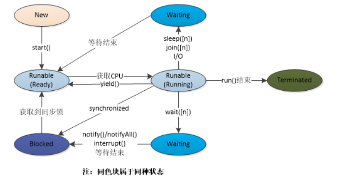

#### 1.java线程调度的背景 — 调度优先级

在各种各样的线程中,java虚拟机必须实现一个优先权的,基于优先级的调度程序.这就意味着java程序中每一个线程被分配到一定的优先权,使用定义好的范围内的一个正整数表示.优先级可以被开发者改变,即使线程已经运行一定时间,java虚拟机也不会改变其优先级


优先级的值很重要,因为java虚拟机和下层的操作系统之间的约定是操作系统必须选择最高优先权的java线程运行,所以我们说java实现了一个基于优先权的调度程序.该调度程序使用一种有优先权的方式实现 ,者意味着当有一个更高优先权的线程到来时候,无论低优先级的线程是否在运行,都会中断他.这个约定对于操作系统来说并不总是这样,这意味着操作系统有肯能会选择运行一个更低优先级的线程


#### 2. 理解线程的优先权

接下来,理解线程优先级是多线程学习最重要的一步,首先是了解yield()函数的工作过程

- 1.记住当前线程的优先级没有指定时候,所有线程都是普通优先级 (5  范围1~10)
- 2.优先级可以用1-10执行,MAX是10,MIN是1,普通是5
- 3.记住优先级最高的线程在执行时被给予有限,但是不能保证线程在启动时候就进入运行状态
- 4.与在线程池中等待运行机会的线程相比,当前正在运行的线程可能拥有更高的 优先级
- 5.由调度程序决定哪一个线程被执行
- 6.`t.setPriority()`用来设置线程的优先级
- 7.在线程开始之前,线程的优先级应该被设定
- 8.可以使用常量,如`MIN_PRIORITY`,`NORM_PRIORITY`,`MAX_PRIORITY`

现在,当我们对线程调度和线程优先级有一定的理解后,让我们直接进入主题


#### 3. yield()

理论上,yield意味着放手,投降,放弃;

一个低调用yield()方法的线程告诉虚拟机它可以让其他线程占用自己的位置.这表明线程没有在做一些紧急的事情.注意,这仅仅是一个暗示,并不能保证不会产生任何影响

- yield()是一个静态的原生的(native)方法 
- yield告诉当前正在执行的线程把运行机会交给线程池中拥有相同优先级的线程 
- yield不能保证使得当前正在运行的线程迅速转换到可运行状态
- 他仅仅能使一个线程从运行状态转到可运行状态,而不是等待或者阻塞状态


####  4. 线程状态:(前面没必要看.摘自某些傻逼博客,有的根本不清楚)





- **new**:实例化thread
- Runnable**:就绪状态,此时线程等待CPU的执行权
- **Runnable  —> Running**:就绪状态获取CPU使用权
- **Running**:执行态
  - **Running  —> Runable**: 调用yield方法回到就绪状态,yield之后代码块还会继续执行,不会释放锁,执行完同步代码块释放锁,然后重新竞争锁
  - **Running  —> Waiting**:  调用wait/join & 调用sleep(long)/join(long)
  - **Waiting —> BLOCKED**: 调用notify/notifyAll么 ,对应是wait
  - **Waiting  —> Runnable**:sleep 或者join(n)等等待结束之后进入Runnable

属于obj的方法会释放锁: wait

属于Thread的方法不会释放锁: sleep,join,yield

#### 5. yield()

向调度器表示当前线程放弃当前对处理器的使用.调度器可能忽略这个提示

通俗的话就是当前线程从`运行状态`进入到`就绪状态`,CPU重新进行调度,但是不保证调用`yield`后就其他线程一定可以抢到执行时间,还有就是`yield`不会释放所,执行完同步代码块,锁会释放

```java
public class Demo6 implements Runnable {
    @Override
    public void run() {
        for (int i = 0; i < 10; i++) {
            Thread.yield();
            System.out.println(Thread.currentThread().getName() + "continue");
        }
    }

    public static void main(String[] args) throws Exception {
        Demo6 demo6 = new Demo6();
        Thread t1 = new Thread(demo6);
        //设置t1的优先级和main方法相同
        t1.setPriority(5);
        t1.start();
        for (int i = 0; i < 10; i++) {
            Thread.yield();
            System.out.println(Thread.currentThread().getName() + "continue");
        }
    }
}
```

运行结果:

```java
maincontinue
Thread-0continue
Thread-0continue
maincontinue
Thread-0continue
maincontinue
maincontinue
maincontinue
maincontinue
maincontinue
maincontinue
maincontinue
maincontinue
Thread-0continue
Thread-0continue
Thread-0continue
Thread-0continue
Thread-0continue
Thread-0continue
Thread-0continue
```

运行没有规律,说明在`yield`后调度器不一定会将时间片分配给其他线程,否则结果应该是一条t1一条main

```java
public class Demo5 implements Runnable {
    private static final Object obj = new Object();
    @Override
    public void run() {
        synchronized (obj) {
            try {
                System.out.println(Thread.currentThread().getName() + "-start");
                System.out.println(Thread.currentThread().getName() + "-end");
            } catch (Exception e) {
                e.printStackTrace();
            }
        }
    }

    public static void main(String[] args) throws Exception {
        Demo5 demo5 = new Demo5();
        Thread t1 = new Thread(demo5);
        synchronized (obj) {
            System.out.println(Thread.currentThread().getName() + "-start");
            t1.start();
            Thread.yield();
            System.out.println(Thread.currentThread().getName() + "-end");
        }
    }
}

```

当执行`yield`时候没有立即释放锁,而是同步代码块执行完之后,释放锁 


