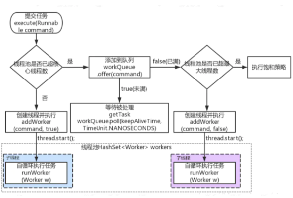
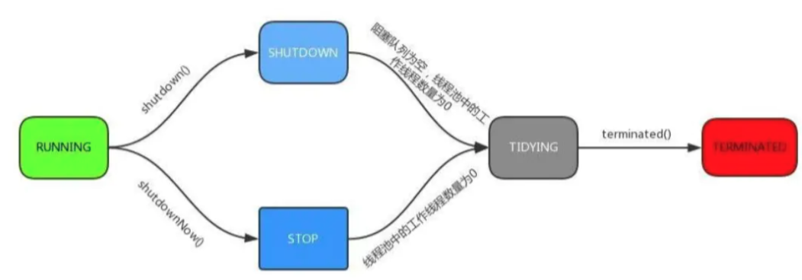

#### 1. 线程池的构造

```java
public ThreadPoolExecutor(int corePoolSize,
                          int maximumPoolSize,
                          long keepAliveTime,
                          TimeUnit unit,
                          BlockingQueue<Runnable> workQueue,
                          ThreadFactory threadFactory) {
    this(corePoolSize, maximumPoolSize, keepAliveTime, unit, workQueue,
         threadFactory, defaultHandler);
}

 public ThreadPoolExecutor(int corePoolSize,
                              int maximumPoolSize,
                              long keepAliveTime,
                              TimeUnit unit,
                              BlockingQueue<Runnable> workQueue,
                              ThreadFactory threadFactory,
                              RejectedExecutionHandler handler) {
        if (corePoolSize < 0 ||
            maximumPoolSize <= 0 ||
            maximumPoolSize < corePoolSize ||
            keepAliveTime < 0)
            throw new IllegalArgumentException();
        if (workQueue == null || threadFactory == null || handler == null)
            throw new NullPointerException();
        this.corePoolSize = corePoolSize;
        this.maximumPoolSize = maximumPoolSize;
        this.workQueue = workQueue;
        this.keepAliveTime = unit.toNanos(keepAliveTime);
        this.threadFactory = threadFactory;
        this.handler = handler;
    }


```

重点看下几个参数:

- `corePoolSize`: 

  - 核心线程数,核心线程先不创建, 在接到任务之后创建核心线程,并且会一直存在于线程池中(即使这个线程什么都不干),有任务要执行的时候,如果核心线程没有被占用,会优先用核心线程执行任务.数量一般情况下为CPU核数的二倍即可

- `maximumPoolSize`

  - 线程总数 = 核心线程数 +  非核心线程数

  - 非核心线程线程:简单理解,即核心线程占用,还有任务要做,就创建非核心线程

    

- `keepAliveTime`

  - 非核心线程闲置时间,(也就是闲置多久之后会被回收)
  - `allowsCoreThreadTimeOut(boolean)`设置为true,同样作用于核心线程

- `TimeUnit`

  - `keepAliveTime`单位 ,纳秒 ~ day

- `BlockingQueue<Runnable>  workQueue`

  - 线程池中的任务队列,默认情况下,任务进来之后先分配给核心线程执行,核心线程被占用,并不会立即开启非核心线程执行任务,而是将任务插入这个任务队列等待执行,核心线程会从任务队列取任务来执行,任务队列可以设置最大值,一旦插入的任务足够多,达到最大值,才会创建非核心线程执行任务

  注意BlockingQueue一般有四种:

  - SynchronousQueue

    - 接到任务之后会直接提交给线程处理,而不保留他,如果所有线程都在工作,那就新建一个线程来处理这个任务,这样就会导致maximumPoolSize太大不能新建线程的error,一般maximumPoolSize设置无限大

  - LinkedBlockingQueue

    - 核心线程数小于核心线程数上限,则新建核心线程处理任务;当核心线程满时会加入队列,而队列无限大,所以会导致maximumPoolSize设置失效

  - ArrayBlockingQueue

    - 限定队列的长度,核心线程未满时,就创建核心线程执行任务;核心线程满时就加入队列等待;当队列满时则创建非核心线程进行执行任务;当达到maximumPoolSize抛出异常

  - DelayQueue

    - 队列内元素必须实现Delayed接口，这就意味着你传进去的任务必须先实现Delayed接口。这个队列接收到任务时，首先先入队，只有达到了指定的延时时间，才会执行任务。

    

    

- `ThreadFactory threadFactory`

  可以用线程工厂给每个创建的线程设置名字,一般情况下无序设置这个参数

- `RejectedExecutionHandler handler`

  - 这是当任务队列和线程池都满了时所采取的应对策略，默认是AbordPolicy， 表示无法处理新任务，并抛出 RejectedExecutionException 异常。此外还有3种策略，它们分别如下。

    

    1. CallerRunsPolicy：用调用者所在的线程来处理任务。此策略提供简单的反馈控制机制，能够减缓新任务的提交速度。
    2. DiscardPolicy：不能执行的任务，并将该任务删除。
    3. DiscardOldestPolicy：丢弃队列最近的任务，并执行当前的任务。

#### 2. execute()



```java
public void execute(Runnable command) {
    if (command == null)
        throw new NullPointerException();
    
    int c = ctl.get();
  	// 1. 当前线程池中线程比核心线程少,新建一个核心线程执行任务
    if (workerCountOf(c) < corePoolSize) {
        if (addWorker(command, true))
            return;
        c = ctl.get();
    }
  	// 2. 核心池已满,但是队列未满,添加到队列中
    if (isRunning(c) && workQueue.offer(command)) {
        int recheck = ctl.get();
      	// 任务添加成功之后,再次检测是否需要新的线程程,因为存在的线程可能被销毁了
        if (! isRunning(recheck) && remove(command))
          	// 如果线程池处于非运行状态,并且把当前的任务从任务队列中益处成功,则拒绝该任务
            reject(command);
      	// 如果之前线程已经被销毁完,新建一个线程
        else if (workerCountOf(recheck) == 0)
            addWorker(null, false);
    }
  	// 3. 核心池已满,队列已满,试着创建一个新线程
    else if (!addWorker(command, false))
      	// 如果创建心线程失败了,说明线程池被关闭或者线程池完全满了,拒绝任务i
        reject(command);
}
```

**ctl的作用**

在线程池中ctl贯穿整个线程池的生命周期

```java
private final AtomicInteger ctl = new AtomicInteger(ctlOf(RUNNING, 0));
```

他是一个原子类,主要作用是用来保存线程数量和线程池的状态

一个int数值32bit位,高3位保存运行状态,低29位来保存线程数量

```java
private static int ctlOf(int rs, int wc) { return rs | wc; }
```

其中 RUNNING =-1 << COUNT_BITS ； -1 左移 29 位. -1 的二进制是
 32 个 1（1111 1111 1111 1111 1111 1111 1111 1111）

*-1 的二进制计算方法 原码是 1000…001 . 高位 1 表示符号位。 然后对原码取反，高位不变得到 1111…110 然后对反码进行+1 ，也就是补码操作， 最后得到 1111…1111*

那么-1 <<左移 29 位， 也就是 【111】 表示； rs | wc 。二进制的 111 | 000 。得到的结果仍然是 111
 那么同理可得其他的状态的 bit 位表示

```java
//32-3
private static final int COUNT_BITS = Integer.SIZE - 3; 
//将 1 的二进制向右位移 29 位,再减 1 表示最大线程容量
private static final int CAPACITY = (1 << COUNT_BITS) - 1; 
//运行状态保存在 int 值的高 3 位 (所有数值左移 29 位)
private static final int RUNNING = -1 << COUNT_BITS;// 接收新任务,并执行队列中的任务
private static final int SHUTDOWN = 0 << COUNT_BITS;// 不接收新任务,但是执行队列中的任务
private static final int STOP = 1 << COUNT_BITS;// 不接收新任务,不执行队列中的任务,中断正在执行中的任务
private static final int TIDYING = 2 << COUNT_BITS; //所有的任务都已结束,线程数量为 0,处于该状态的线程池即将调用 terminated()方法
private static final int TERMINATED = 3 << COUNT_BITS;// terminated()方法执行完成
```

状态转换:



#### 3. addWorker

首先看第一步,如果工作线程数小于核心线程的话,会调用addWorker,就是创建一个核心线程

- 采用CAS操作来将线程数+1
- 新建一个线程并启用

```java
private static final int RUNNING    = -1 << COUNT_BITS;
private static final int SHUTDOWN   =  0 << COUNT_BITS;
private static final int STOP       =  1 << COUNT_BITS;
private static final int TIDYING    =  2 << COUNT_BITS;
private static final int TERMINATED =  3 << COUNT_BITS;

private boolean addWorker(Runnable firstTask, boolean core) {
    retry: // goto语句 避免死循环
    for (;;) {
        int c = ctl.get();
        int rs = runStateOf(c);

      	// rs >= SHUTDOWN  就是说rs现在是SHUTDOWN STOP TIDYING TERMINATED  且  rs不等于SHUTDOWN
      	// firstTask!=null且workQueue为空
      	// 此时返回false
      	// 1.线程池在 SHUTDOWN STOP TIDYING TERMINATED 这四个状态下是不能添加task的
      	// 2. rs是SHUTDOWN,最新task为null且workQueue不为空,此时是可以添加新线程的
      	// 也就是说SHUTDOWN只是状态位置标记,还是会执行完队列中的task,才会终止线程池
        if (rs >= SHUTDOWN &&
            ! (rs == SHUTDOWN &&
               firstTask == null &&
               ! workQueue.isEmpty()))
            return false;

        for (;;) { //.. 自旋
          	// 获得Worker的核心线程数
            int wc = workerCountOf(c);
          	// 这里传入的是core = true
          	// 就是说当前线程数大于默认线程数或者核心线程数则返回false,表示不能再添加worker
          	// 对应的就是核心线程数满时,开始加入队列
            if (wc >= CAPACITY ||
                wc >= (core ? corePoolSize : maximumPoolSize))
                return false;
          	// 尝试通过cas来原子性增加工作线程数,如果cas失败则直接重试
            if (compareAndIncrementWorkerCount(c))
                break retry;
          	// 再次获取ctl的值
            c = ctl.get();  // Re-read ctl
          	// 这里如果不等,说明线程状态发生变化,继续重试
            if (runStateOf(c) != rs)
                continue retry;
        }
    }
  	
  	// 上面代码主要是对worker数量做原子+1的操作,下面是构建worker 

    boolean workerStarted = false;  // 工作线程是否启动
    boolean workerAdded = false; // 工作线程是否已经添加成功标志
    Worker w = null;
    try {
      	// 构建一个worker  其实就是传入一个runnable并实例化一个线程
        w = new Worker(firstTask);
      	// 从worker中获取线程
        final Thread t = w.thread;
        if (t != null) {
            final ReentrantLock mainLock = this.mainLock;
          	// 启动锁
            mainLock.lock();
            try {
                // 获取线程池的状态
                int rs = runStateOf(ctl.get());
								// rs < SHUTDOWN  就是RUNNING  或者  rs处于SHUTDOWN状态firstTask为空
                if (rs < SHUTDOWN ||
                    (rs == SHUTDOWN && firstTask == null)) {
                  	// task封装到worker 还没有start 线程已经启动直接抛出异常
                    if (t.isAlive()) // precheck that t is startable
                        throw new IllegalThreadStateException();
                  	// workers就是` private final HashSet<Worker> workers = new HashSet<>();`
                  	// 是一个 hashSet  保存了许多worker
                    workers.add(w);
                  	// 跟新线程池中的最大线程
                    int s = workers.size();
                    if (s > largestPoolSize)
                        largestPoolSize = s;
                    workerAdded = true;// 表示工作线程创建成功
                }
            } finally {
                mainLock.unlock();  // 释放锁
            }
            if (workerAdded) { // 如果worker添加成功
                t.start(); // 启动线程
                workerStarted = true;
            }
        }
    } finally {
        if (! workerStarted)
            addWorkerFailed(w);  // 如果添加失败就递减线程数(刚刚在workers.add有更新largestPoolSize)
    }
    return workerStarted; // 返回结果
}
```

我们可以看到,在一堆判断逻辑之后,其实就是将我们实现的runnable接口通过worker封装,然后启动线程;

接着我们看下 Worker

#### 4.Worker

```java
private final class Worker
    extends AbstractQueuedSynchronizer
    implements Runnable
{
    private static final long serialVersionUID = 6138294804551838833L;

    // 这是真正执行task的线程,他是ThreadFactury 创建的
    final Thread thread;
    // 目标task
    Runnable firstTask;
    // 完成任务数,用于线程池统计
    volatile long completedTasks;

   
    Worker(Runnable firstTask) {
    		// 设置初始状态为-1,也就是RUNNING,防止在调用runWorker也就是真正执行task前终端
        setState(-1); 
        this.firstTask = firstTask;
        // worker作为构造入参传入
        this.thread = getThreadFactory().newThread(this);
    }

    /** Delegates main run loop to outer runWorker. */
    public void run() {
        runWorker(this);
    }
```

1. 每个worker都是一条线程,里面维护了task和thread
2. worker作为thread构造的入参被传入,注意Worker实现了runnable接口
3. start线程时候会调用Worker的run方法,进而调用runWorker

Worker继承了AbstractQueuedSynchronizer,使用AQS来实现独占锁的功能,为什么不使用ReentrantLock来实现呢?

我们看到`tryAcquire`方法,他是允许重入的,而ReentrantLock是允许重入的


lock方法一旦获取了独占锁,表示当前线程正在执行任务中;那么会有一下几个作用:

- 如果正在执行任务,则不应该被中断
- 如果该线程现在不是独占锁状态,也就是空闲状态,说明它没有处理任务,这时可以对该线程进行中断
- 线程池在执行shoudown方法或者tryTerminate方法时候调用了interruptldleWorkers方法来中断空闲线程,interruptldleWorkers方法会使用tryLock方法来判断线程池中的线程是否是空闲状态
- 之所以设置为不可重入,是因为我们不希望任务在调用像setCorePoolSize这样的线程池控制方法时重新获取锁,这样会中断正在运行的线程

#### 5. addWorkerFailed

在addWorker时候,添加失败会走addWorkerFailed,这里是失败的处理逻辑

```java
private void addWorkerFailed(Worker w) {
    final ReentrantLock mainLock = this.mainLock;
    mainLock.lock();
    try {
        if (w != null)
          	// 1.如果worker已经构造好了,则从workers中remove掉
            workers.remove(w);
      	// 2. 原子性递减核心线程数()
        decrementWorkerCount();
      	// 3. 尝试结束线程池
        tryTerminate();
    } finally {
        mainLock.unlock();
    }
}
```

#### 6. runWorker

前面我们已经了解到 ThreadPoolExecutor的核心方法是`addWorker`,主要作用是增加工作线程,并启动线程,我们知道Worker继承自Runnable,且重写run方法,启动线程会回调到他的run方法,最终执行Task其实是`runWorker`

1. 如果task不为空,则开始执行task
2. 如果task为空,则通过task去获取任务,并赋值给task,如果取到的Runnable不为空,则执行该任务
3. 执行完毕后通过while循环继续getTask取任务
4. 如果getTask取到的任务依然是空,那么整个runWorker方法执行完毕

```java
final void runWorker(Worker w) {
    Thread wt = Thread.currentThread();
    Runnable task = w.firstTask;
    w.firstTask = null;
  	// unlock表示当前线程,因为new Worker默认是state = -1,此处调用
  	// Worker类的tryRelease方法,将state置为0
  	// 而interruptIfStarted()中只有用state>=0才允许调用中断
    w.unlock(); // allow interrupts
    boolean completedAbruptly = true;
    try {
      	// 注意这个while 这里实现了[线程复用]
      	// 如果task为空则通过getTask来获取任务
      	// 当coreSize不满时getTask一定为空,此时不需要复用
        while (task != null || (task = getTask()) != null) {
            w.lock(); // 上锁,不是为了防止并发执行任务,在shutdown()时不终止正在运行的worker
            // 线程池为 stop 状态时不接受新任务, 不执行已经加入任务队列的任务,还会中断正在执行的任务
          	// 所以对于stop是要中断线程的
          	// (Thread.interrupted() && runStateAtLeast(ctl.get(), STOP))) 确保线程终端标志位为						 //true,且是STOP状态以上,接着!wt.isInterrupted()再一次检查保证线程需要设置中断标志
            if ((runStateAtLeast(ctl.get(), STOP) ||
                 (Thread.interrupted() &&
                  runStateAtLeast(ctl.get(), STOP))) &&
                !wt.isInterrupted())
                wt.interrupt();
            try {
              	// 这里默认是没有实现,在一些场景我们可以自己重写  --- 执行task之前
                beforeExecute(wt, task);
                Throwable thrown = null;
                try {
                  	// 执行task中的run方法
                    task.run();
                } catch (RuntimeException x) {
                    thrown = x; throw x;
                } catch (Error x) {
                    thrown = x; throw x;
                } catch (Throwable x) {
                    thrown = x; throw new Error(x);
                } finally {
                  	// 执行task之后.也是默认没有实现
                    afterExecute(task, thrown);
                }
            } finally {
              	// 置空任务(这样下次循环开始时候,task依然为null,需要再通过getTask	去获取) + 记录该									// Worker 完成的任务量 +  解锁
                task = null;
                w.completedTasks++;
                w.unlock();
            }
        }
        completedAbruptly = false;
    } finally {
        processWorkerExit(w, completedAbruptly);
    }
}
```

#### 7.getTask

worker线程会从阻塞队列中获取需要执行的任务,这个方法不是简单的take数据


你也许好奇是怎样判断线程有多久没有活动了，是不是以为线程池会启动一个监控线程，专门监控哪个线程正在偷懒？想太多，其实只是在线程从工作队列 poll 任务时，加上了超时限制，如果线程在 keepAliveTime 的时间内 poll 不到任务，那我就认为这条线程没事做，可以干掉了，看看这个代码片段你就清楚了

```java
private Runnable getTask() {
    boolean timedOut = false; // Did the last poll() time out?

    for (;;) { // 死循环
        int c = ctl.get();
        int rs = runStateOf(c);

        // 对线程池状态判断 两种情况下workerCount-1并且返回null
      	// 1.线程池状态为shutdown,且workQueue为空(反映了shutdown状态下的线程池还要执行workQueue中的剩`			 //   余线程)
      	// 2.线程池状态为stop(shutdownNow之后变成stop)(此时不用考虑 workQueue中的剩余线程)
      	
        if (rs >= SHUTDOWN && (rs >= STOP || workQueue.isEmpty())) {
            decrementWorkerCount();
            return null;
        }

        int wc = workerCountOf(c);

        // Are workers subject to culling?
      	//  timed变量用于判断是否需要进行超时控制
      	// allowCoreThreadTimeOut默认是false,暂时 不作用于核心线程
      	// wc > maximumPoolSize表示超过核心线程数,对于非核心线程进行超时控制
        boolean timed = allowCoreThreadTimeOut || wc > corePoolSize;
				// 1. wc > maximumPoolSize只可能是线程池运行时候调用setMaximumPoolSize()负责超过最大线程  
      	//   addWork不可能成功
      	// 2.(timed && timedOut)如果为true,表示当前操作需要进行超时控制,并且上次从阻塞队列中获取任务发				//   生了超时,其实体现了空闲时间的存活时间
        if ((wc > maximumPoolSize || (timed && timedOut))
            && (wc > 1 || workQueue.isEmpty())) {
            if (compareAndDecrementWorkerCount(c))
                return null;
            continue;
        }

        try {
          	// 根据timed来判断,如果为true,则通过阻塞队列的poll进行超时控制,如果在keepAliveTime时间内没							// 有workQueue出队列,则返回null
          	// 否则通过take方法阻塞式获取队列
            Runnable r = timed ?
                workQueue.poll(keepAliveTime, TimeUnit.NANOSECONDS) :
                workQueue.take();
            if (r != null) // 如果拿到的任务不为空,就返回runnable
                return r;
            timedOut = true; // 如果 r = null,就说明超时了.设置timedOut= true,在下次循环进行回收
        } catch (InterruptedException retry) {
            timedOut = false; // 如果获取任务时当前线程发生了终端,则设置timeout为false并返回循环模式
        }
    }
}
```

这里重要的是第二个if判断,目的是控制线程池的有效数量,由上文可以知道,在执行exeute时候,当线程超过corePoolSize且小于maximumPoolSize,并且workQueue已经满时候,可以增加非核心线程,但是这时如果超时没有获取到task,也就是timedOut = true时候,说明workQueue已经空格了,这是应该把多于corePoolSize数量的非核心线程销毁,保持线程数在corePoolSize即可

这里的回收实在runWorker方法执行完之后,也就是Worker的run方法执行完由JVM回收


getTask返回null时候,在runWorker中跳出while循环然后执行processWorkerExit方法 


#### 8. processWorkerExit

```java
private void processWorkerExit(Worker w, boolean completedAbruptly) {
    if (completedAbruptly) // If abrupt, then workerCount wasn't adjusted
        decrementWorkerCount();

    final ReentrantLock mainLock = this.mainLock;
    mainLock.lock();
    try {
        completedTaskCount += w.completedTasks;
        workers.remove(w);
    } finally {
        mainLock.unlock();
    }

    tryTerminate();

    int c = ctl.get();
    if (runStateLessThan(c, STOP)) {
        if (!completedAbruptly) {
            int min = allowCoreThreadTimeOut ? 0 : corePoolSize;
            if (min == 0 && ! workQueue.isEmpty())
                min = 1;
            if (workerCountOf(c) >= min)
                return; // replacement not needed
        }
        addWorker(null, false);
    }
}
```

其实就是销毁线程池

#### 9.execute后序逻辑  corePoolSize第一次满之后

此时有两步:

- 当前线程数 = corePoolSize,task会一次加入workQueue进行等待
- 当前线程数 = corePoolSize且workQueue满时,会开辟非核心线程
- 达到线程池最大容量,线程池拒绝访问


```java
public void execute(Runnable command) {
    ......
  	// 2. 核心池已满,但是队列未满,添加到队列中
    if (isRunning(c) && workQueue.offer(command)) {
        int recheck = ctl.get();
      	// 任务添加成功之后,再次检测是否需要新的线程程,因为存在的线程可能被销毁了
        if (! isRunning(recheck) && remove(command))
          	// 如果线程池处于非运行状态,并且把当前的任务从任务队列中益处成功,则拒绝该任务
            reject(command);
      	// 如果之前线程已经被销毁完,新建一个线程
        else if (workerCountOf(recheck) == 0)
            addWorker(null, false);
    }
  	// 3. 核心池已满,队列已满,试着创建一个新线程
    else if (!addWorker(command, false))
      	// 如果创建心线程失败了,说明线程池被关闭或者线程池完全满了,拒绝任务i
        reject(command);
}
```

####  10.拒绝策略

1、AbortPolicy：直接抛出异常，默认策略；
 2、CallerRunsPolicy：用调用者所在的线程来执行任务；
 3、DiscardOldestPolicy：丢弃阻塞队列中靠最前的任务，并执行当前任务；
 4、DiscardPolicy：直接丢弃任务；
 当然也可以根据应用场景实现 RejectedExecutionHandler 接口，自定义饱和策略，如记录日志或持久化存储不能处理的任务

#### 11.线程池的注意事项

分析完线程池以后，我们再来了解一下线程池的注意事项

阿里开发手册不建议使用线程池,手册上是说**线程池的构建不允许使用 Executors 去创建，而是通过 ThreadPoolExecutor 的方式。**
 分析完原理以后，大家自己一定要有一个答案。我来简单分析下，用 Executors 使得用户不需要关心线程池的参数配置，意味着大家对于线程池的运行规则也会慢慢的忽略。这会导致一个问题，比如我们用 newFixdThreadPool 或者 singleThreadPool.允许的队列长度为Integer.MAX_VALUE，如果使用不当会导致大量请求堆积到队列中导致 OOM 的风险而 newCachedThreadPool，允许创建线程数量为 Integer.MAX_VALUE，也可能会导致大量线程的创建出现 CPU 使用过高或者 OOM 的问题。而如果我们通过 ThreadPoolExecutor 来构造线程池的话，我们势必要了解线程池构造中每个参数的具体含义，使得开发者在配置参数的时候能够更加谨慎。

#### 12.如何合理配置线程池的大小

如何合理配置线程池大小，线程池大小不是靠猜，也不是说越多越好。
 在遇到这类问题时，先冷静下来分析

1. 需要分析线程池执行的任务的特性： CPU 密集型还是 IO 密集型
2. 每个任务执行的平均时长大概是多少，这个任务的执行时长可能还跟任务处理逻辑是否涉及到网络传输以及底层系统资源依赖有关系

如果是 CPU 密集型，主要是执行计算任务，响应时间很快，cpu 一直在运行，这种任务 cpu的利用率很高，那么线程数的配置应该根据 CPU 核心数来决定，CPU 核心数=最大同时执行线程数，加入 CPU 核心数为 4，那么服务器最多能同时执行 4 个线程。过多的线程会导致上下文切换反而使得效率降低。那线程池的最大线程数可以配置为 cpu 核心数+1 如果是 IO 密集型，主要是进行 IO 操作，执行 IO 操作的时间较长，这是 cpu 出于空闲状态，导致 cpu 的利用率不高，这种情况下可以增加线程池的大小。这种情况下可以结合线程的等待时长来做判断，等待时间越高，那么线程数也相对越多。一般可以配置 cpu 核心数的 2 倍。

一个公式：线程池设定最佳线程数目 = （（线程池设定的线程等待时间+线程 CPU 时间）/
 线程 CPU 时间 ）* CPU 数目

这个公式的线程 cpu 时间是预估的程序单个线程在 cpu 上运行的时间（通常使用 loadrunner测试大量运行次数求出平均值）

#### 13.线程池中的线程初始化

默认情况下，创建线程池之后，线程池中是没有线程的，需要提交任务之后才会创建线程。
 在实 际中如果需要 线程池创建之 后立即创建线 程，可以通过 以下两个方法 办到：
 prestartCoreThread()：初始化一个核心线程； prestartAllCoreThreads()：初始化所有核心线程

```java
ThreadPoolExecutor tpe=(ThreadPoolExecutor)service;
tpe.prestartAllCoreThreads();

```

#### 14.线程池的关闭

ThreadPoolExecutor 提 供 了 两 个 方 法 ， 用 于 线 程 池 的 关 闭 ， 分 别 是 shutdown() 和shutdownNow()，其中：shutdown()：不会立即终止线程池，而是要等所有任务缓存队列中的任务都执行完后才终止，但再也不会接受新的任务 shutdownNow()：立即终止线程池，并尝试打断正在执行的任务，并且清空任务缓存队列，返回尚未执行的任务

#### 15.线程池容量的动态调整

ThreadPoolExecutor 提 供 了 动 态 调 整 线 程 池 容 量 大 小 的 方 法 ： setCorePoolSize() 和
 setMaximumPoolSize()，setCorePoolSize：设置核心池大小 setMaximumPoolSize：设置线程池最大能创建的线程数目大小
 任务缓存队列及排队策略
 在前面我们提到了任务缓存队列，即 workQueue，它用来存放等待执行的任务。
 workQueue 的类型为 BlockingQueue，通常可以取下面三种类型：

1. ArrayBlockingQueue：基于数组的先进先出队列，此队列创建时必须指定大小；
2. LinkedBlockingQueue：基于链表的先进先出队列，如果创建时没有指定此队列大小，则默认为 Integer.MAX_VALUE；
3. SynchronousQueue：这个队列比较特殊，它不会保存提交的任务，而是将直接新建一个线程来执行新来的任务。

#### 16.线程池的监控

如果在项目中大规模的使用了线程池，那么必须要有一套监控体系，来指导当前线程池的状态，当出现问题的时候可以快速定位到问题。而线程池提供了相应的扩展方法，我们通过重写线程池的 beforeExecute、afterExecute 和 shutdown 等方式就可以实现对线程的监控，简单给大家演示一个案例

```java
public class Demo1 extends ThreadPoolExecutor {
    // 保存任务开始执行的时间,当任务结束时,用任务结束时间减去开始时间计算任务执行时间
    private ConcurrentHashMap<String, Date> startTimes;

    public Demo1(int corePoolSize, int maximumPoolSize, long
            keepAliveTime, TimeUnit unit, BlockingQueue<Runnable> workQueue) {
        super(corePoolSize, maximumPoolSize, keepAliveTime, unit,
                workQueue);
        this.startTimes = new ConcurrentHashMap<>();
    }

    @Override
    public void shutdown() {
        System.out.println("已经执行的任务数：
                "+this.getCompletedTaskCount()+", " +
                "当前活动线程数:" + this.getActiveCount() + ",当前排队线程数:"+this.getQueue().size());
        System.out.println();
        super.shutdown();
    }

    //任务开始之前记录任务开始时间
    @Override
    protected void beforeExecute(Thread t, Runnable r) {
        startTimes.put(String.valueOf(r.hashCode()), new Date());
        super.beforeExecute(t, r);
    }

    @Override
    protected void afterExecute(Runnable r, Throwable t) {
        Date startDate = startTimes.remove(String.valueOf(r.hashCode()));
        Date finishDate = new Date();
        long diff = finishDate.getTime() - startDate.getTime();
        // 统计任务耗时、初始线程数、核心线程数、正在执行的任务数量、
        // 已完成任务数量、任务总数、队列里缓存的任务数量、
        // 池中存在的最大线程数、最大允许的线程数、线程空闲时间、线程池是否关闭、线程池是否终止
        System.out.print("任务耗时:" + diff + "\n");
        System.out.print("初始线程数:" + this.getPoolSize() + "\n");
        System.out.print("核心线程数:" + this.getCorePoolSize() + "\n");
        System.out.print("正在执行的任务数量:" + this.getActiveCount() + "\n");
        System.out.print("已经执行的任务数:"+this.getCompletedTaskCount()+"\n ");
        System.out.print("任务总数:" + this.getTaskCount() + "\n");
        System.out.print("最大允许的线程数:" + this.getMaximumPoolSize() + "\n");
        System.out.print("线程空闲时间:"+this.getKeepAliveTime(TimeUnit.MILLISECONDS)+"\n ");
        System.out.println();
        super.afterExecute(r, t);
    }

    public static ExecutorService newCachedThreadPool() {
        return new Demo1(0, Integer.MAX_VALUE, 60L, TimeUnit.SECONDS, new
                SynchronousQueue());
    }
```

测试

```java
public class Test implements Runnable{
    private static ExecutorService es =Demo1.newCachedThreadPool();
    @Override
    public void run() {
        try {
            Thread.sleep(1000);
        } catch (InterruptedException e) {
            e.printStackTrace();
        }
    }
    public static void main(String[] args) throws Exception {
        for (int i = 0; i < 100; i++) {
            es.execute(new Test());
        }
        es.shutdown();
    }
}
```


