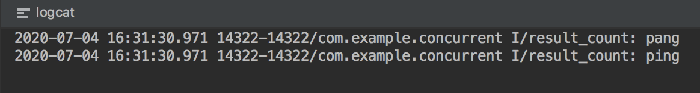
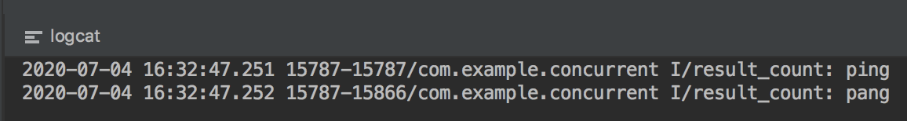

#### 1.多线程的使用场景

使用多线程一定效率高么? 有时候使用多线程并不是为了提高效率,而是使得CPU能同时处理多个时间

- 为了不阻塞主线程,启动其他线程来做事情,比如APP中耗时操作都不在UI线程中执行
- 多线程可以复用线程,且可以在一定程度上并行处理任务
- 某些不消耗CPU的耗时任务,比如I/O操作,这个时候可以开启其他线程去利用空闲CPU

#### 2. CopyOnWriteArrayList

**Copy-On-Write**

在计算机中当你想要对一块内存进行修改的时候,我们不在原有内存中进行写操作,而是将内存拷贝一份,在新的内存中进行写操作,写完之后呢,就将指向原来内存指针指向新的内存,原来的内存就可以被回收掉

简单理解就好:

写数据时候,copy主存然后在新的内存写入,然后改变引用


#### 3. ConcurrentHashMap

##### 3.1 java 7 

ConcurrentHashMap作为一种线程安全且高效的哈希表解决方法,尤其其中的"分段锁"方案,相比HashTable的表锁在性能上提升非常大;

HashTable容器在竞争激烈的并发环境下表现出效率低下的原因是因为所有访问HashTable的线程都必须竞争同一把锁;

那么ConcurrentHashMap"分段锁":在容器中有多把锁,每一把锁用于锁容器中一部分数据,那么当多线程访问容器里不同的数据段的数据时候,线程间就不会存在锁竞争,从而可以有效的提高并发访问效率,这就是ConcurrentHashMap所使用的锁的分段技术:

- 首先将数据分成一段一段的存储,然后给每一段数据配一把锁,当一个线程占用锁访问其中一个数据段的时候,其他段的数据也能被其他线程访问

- ConcurrentHashMap是一个Segment数组,Segment通过继承ReentrantLock来进行加锁,所以每次需要加锁的操作锁住的是一个Segment,这样只要保证每个Segment是线程安全的,也就实现了全局的线程安全
- concurrencyLevel: 并行级别,并发数,Segment数;默认是16,也就是说ConcurrentHashMap有16个Segment,所以理论上来说,这个时候,最多可以支持16个线程并发写,只要他们操作在不同的Segment上,这个值可以在初始化时候设置为其他值,但是一旦初始化以后,他是不可以扩容的,其中每个Segment很像一个HashMap,不过他要保证线程安全,所以处理起来比较麻烦
- 初始化槽:ensureSegment
  - ConcurrentHashMap初始化的时候会初始化第一个槽segment[0],对应其他槽来说,在插入第一个值的时候进行初始化.对于并发操作使用CAS进行控制

##### 3.2  java 8

抛弃了原有的Segment分段锁,而采用 CAS+synchronized来保证安全性.结构上和java8的hashmap(数组+链表+红黑树)基本上一样,不过他要保证线程安全性,所以在源码上要复杂一些.1.8在1.7的数据结构上做了很大改动,采用红黑树之后可以保证查询效率,甚至取消了ReentrantLock改为了synchronized,这样可以看出新版JDK对synchronized优化是很到位的


#### 4. 线程死锁的4个条件

- 互斥条件:一个资源每次只能被一个线程使用
- 请求与保持条件:一个线程因请求资源而阻塞时候,对已经获得的资源保持不放
- 不剥夺条件:线程已经获得资源,在未使用完之前,不能强行剥夺
- 循环等待条件:若干线程之间形成一种头尾相接的循环等待资源关系


#### 5 .CAS

##### 5.1 Unsafe

Unsafe是CAS的核心类.因为java无法直接访问底层操作系统,而是通过本地的(native)方法来访问.不过尽管如此,JVM开了一个后门,JDK中有一个类Unsafe,它提供了硬件级别的原子操作

#####5.2 CAS 概述:

CAS看起来很美,但是这种操作显然无法涵盖并发下的所有场景,并且CAS从语义上来说也不是完美的,存在这样一个逻辑漏洞:**如果一个变量V初次读取的时候是A值,并且在准备赋值的时候检查到他仍然是A值,那我们就能说明他的值没有被其他线程修改过了吗?如果在这段时间他的值曾今变成了B,然后又改回了A,那么CAS操作就会误认为它从来没有修改过**这个漏洞被称为CAS操作的**ABA**问题

`java.util.concurrent`包为了解决这个问题,提供了一个带有标记的原子引用类**AtomicStampedReference**,它可以通过控制变量值的版本来保证CAS的正确性;不过目前来说这个类比较鸡肋,大部分情况下ABA问题并不会影响程序并发的正确性,如果需要解决ABA问题,使用传统的互斥同步可能会比原子性更加高效


#### 6 线程的生命周期

- **NEW**:创建状态,线程创建之后,但是还未启动
- **RUNNABLE**:运行状态,处于运行状态的线程,但有可能处于等待状态,例如等待 CPU,IO等
- **WAITING**:等待状态,一般是调用了wait(),join(),LockSupport.spark()等方法
- **TIMED_WAITING**:超时等待状态,也就是带时间的等待状态.一般是调用了 wait(time), join(time),LockSupport.sparkNanos(),LockSupport.sparkUnit()等方法
- **BLOCKED**:阻塞状态,等待锁的释放,例如调用synchronized增加了锁
- **TERMINATED**:终止状态,一般是线程完成任务后退出或者异常终止

线程进入**RUNNABLE**运行态一般分为5中情况

- 线程调用sleep(time)后结束了休眠时间
- 线程调用的阻塞IO已经返回,阻塞方法执行完毕
- 线程成功获取了资源锁
- 线程正在等待某个通知,成功的获取了其他线程的通知(wait-notify)
- 线程出于挂起状态,然后调用resume()恢复方法,解除了挂起

线程进入**BLOCKED**阻塞态也分五种状态

- 线程调用sleep()方法主动放弃占有的资源
- 线程调用了阻塞式IO的方法,在该方法返回前处于阻塞状态
- 线程试图获取一个资源锁,但是该资源正被其他线程持有
- 线程正在等待某个通知
- 线程调度调用suspend()方法将线程挂起


#### 7 .乐观锁 和 悲观锁:

##### 7.1 悲观锁:

总是假设最坏的情况,每次去拿数据的时候都认为别人会修改,所以每次在拿数据的时候会上锁,这样别人想拿这个数据就会阻塞知道他拿到锁(共享资源每次只给一个线程使用,其他线程阻塞,用完后再把资源转让给其他线程).java中sychronized和ReentrantLock等独占锁就是悲观锁思想的实现


##### 7.2 乐观锁:

总是假设最好的情况,每次去拿数据的时候都认为别人不会修改,所以不会上锁,但是在更新的时候会判断一下在此期间别人有没有去更新这个数据,可以使用版本号机制和CAS算法实现.乐观锁适用于多读的应用类型,这样可以提高吞吐量,在java的`java.util.concurrent.atomic`包下面的原子变量类就是使用了乐观锁的一种实现方式CAS实现的


##### 7.3 使用场景

乐观锁适用于写比较少的情况下(多读场景),而一般多写的场景下用悲观锁就比较合适

##### 7.4 乐观锁常见的两种实现方式:

###### 1.版本号机制

一般是数据表中加上一个数据版本号version字段,表示数据被修改的次数,当数据被修改时候,version值加1.当线程A要更新数据值时候,在读取数据的同事也会读取version值,在提交更新的时候,若刚才读取到的version值为当前数据库中的version值相等时才更新,否则更新操作,直到更新成功

- 假设初始**version为0**;线程A更新数据时候,先从主存获取数据即**version为0**,假设加1操作即为本次的更新操作;在更新之前要读取主存或者数据表中的version看是否和当前获取的version一致(如果在此期间version不一致,就说明其他线程更新了数据),若一致直接更新,不一致重新读取再更新

###### 2.CAS算法

即 compare and swap (比较与交换),是一种有名的无锁算法:

CAS有3个操作数:**内存值V,旧的预测值A,要修改的新值B**,当且仅当预期值A和内存值V相同时候,将内存值修改为B,否则什么都不做.一般情况下是一个自旋操作,即不断重试

###### 3.ABA问题

如果一个变量V初次读取的时候是A值,并且在准备赋值的时候检查到它仍然是A值,那我们就能说明他的值没有被其他线程修改过了么?很明显是不能的,因为在这段时间他的值被修改为其他值,然后又改回了A,那么CAS操作就会误认为它从来没有被修改过,这个问题被称为CAS操作的"ABA"问题;

JDK1.5之后的AtomicStampedReference类在一定程度上解决了这个问题,其中compareAndSet方法就是首先检查当前引用是否等于预期引用,并且当前标志是否等于预期标志,如果全部相等,则以原子方式将该引用和改标志的值设置为给定的更新值;


###### 4.自旋CAS

(也就是不成功就一直循环执行直到成功)如果长时间不成功,会给CPU带来非常大的执行开销

###### 5.JDK1.5 开始支持多个变量的原子性

CAS只对单个共享变量有效,当涉及跨多个共享变量时CAS无效,但是从JDK1.5开始提供了AtomicReference类来保证引用对象之间的原子性,你可以把多个变量放在一个对象里来进行CAS操作,所以我们可以使用锁或者利用AtomicReference类把多个共享变量合并成一个共享变量来操作


#### 8 run()和start()的区别

run():

```java
private void dowork() {
    Thread t = new Thread() {
        public void run() {
            pong();
        }
    };
    t.run();
    Log.i(TAG,"ping");
}

public void pong() {
    Log.i(TAG,"pang");
}
```

运行结果:



start():

```java
private void dowork() {
    Thread t = new Thread() {
        public void run() {
            pong();
        }
    };
    t.start();
    Log.i(TAG,"ping");
}

public void pong() {
    Log.i(TAG,"pang");
}
```

运行结果:




run()只是调用thread的一个方法,在主线程调用就在主线程执行

start()方法来启动一个线程，这时此线程处于就绪（可运行）状态，并没有运行，一旦得到cpu时间片，就开始执行run()方法，这里的run()方法 称为线程体，它包含了要执行的这个线程的内容，Run方法运行结束，此线程随即终止。


#### 9 .多线程断点续传

在本地下载过程中要使用数据库实时存储到底存储到文件的哪个位置了,这样点击开始继续传递时候,才能通过Http的Get请求中的setRequestProperty("Range","bytes=startIndex-endIndex")方法可以告诉服务器,数据从哪里开始到哪里结束.同时在本地的文件写入时,RandomAccessFile的seek()方法也支持在文件中任意位置进行写入操作.同事通过广播或时间总线机制将子线程的进度告诉Activity的进度条;关于断线续传的Http状态嘛是206,即**HttpStatus.SC_PARTIAL_CONTENT**


#### 10.怎么安全停止一个线程任务?原理是什么?线程池有类似机制么?

##### 10.1 终止线程

1.使用volatile boolean变量退出标志,使线程正常退出,也就是run方法完成后线程终止

2.使用interrupt()方法中断线程,但是线程不一定会终止

3.使用stop方法终止线程.不安全的主要是:thread.stop()调用之后,创建子线程的线程会抛出ThreadDeatherror的错误,并且会释放子线程所持有的锁

##### 10.2 终止线程池

**1.shutdown**关闭线程池

线程池不会立刻退出,直到添加到线程池中的任务都已经处理完成,才会退出

**2.shutdownNow**

关闭线程池并中断任务,终止等待执行的线程,并返回他们的列表.试图停止所有正在执行的线程,试图终止的方法是调用**Thread.interrupt()**,但是我们知道,如果线程中没有sleep,wait,Condition,定时锁等应用,interrupt()是无法中断的,所以**shutdownNow**并不代表线程池就一定立即能退出,他可能必须要等待所有正在执行的任务执行完成了才能退出


#### 11. 堆内存,栈内存的理解.栈如何转换为堆?

- 在函数定义的一些基本类型的变量和对象的引用变量都是在函数的**栈内存中进行分配**
- 堆内存用于存放new创建的对象以及数组.JVM的"堆"(heap)特指用于存放java对象的内存区域.所以根据这个定义,java对象全部都在堆上,JVM的堆被同一个JVM实例中的所有java线程共享.他通常由某种自动内存管理机制锁管理,这种机制通常叫做"垃圾回收"
- 堆主要是用来存放对象的,栈主要用来执行程序的
- 实际上,栈中的变量指向堆内存中的变量,这就是java中的指正


