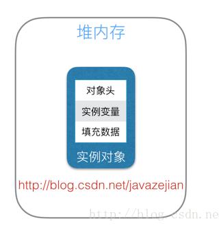

#### 1. 线程安全

线程安全是并发编程中的重要关注点,造成线程安全的主要原因有两点:

- 存在共享数据(也就是临界数据)
- 存在多线程共同操作共享数据

#### 2. Synchronized的三种应用方式

synchronized关键字最主要有一下3种应用方式,下面分别介绍

- 修饰实例方法:作用于当前实例加锁,进入同步代码前要获得当前实例的锁
- 修饰静态方法,作用于当前类对象加锁,进入同步代码前要获得当前类对象的锁
- 修饰代码块,指定加锁的对象,对给定对象加锁,进入同步代码库钱要获得给定对象的锁

#### 3. Synchronized实例


```java
public class AccountingSync implements Runnable{
    //共享资源(临界资源)
    static int i=0;
/**
 * synchronized 修饰实例方法  对象锁(也叫方法锁)
 */
public synchronized void increase(){
    i++;
}
@Override
public void run() {
    for(int j=0;j<1000000;j++){
        increase();
    }
}
public static void main(String[] args) throws InterruptedException {
    AccountingSync instance=new AccountingSync();
    Thread t1=new Thread(instance);
    Thread t2=new Thread(instance);
    t1.start();
    t2.start();
    t1.join();
    t2.join();
    System.out.println(i);
}
/**
 * 输出结果:
 * 2000000
 */
} 
```
上诉代码中,我们开启两个线程共同操作一个资源

- 不具备原子性,因为是`i++`,所有方法逻辑会被打断

```java
 public class AccountingSyncBad implements Runnable{
        int i=0;
        public synchronized void increase(){
            i++;
        }
        @Override
        public void run() {
            for(int j=0;j<1000000;j++){
                increase();
            }
        }
        public void main() throws InterruptedException {
            //new新实例
            Thread t1=new Thread(new AccountingSyncBad());
            //new新实例
            Thread t2=new Thread(new AccountingSyncBad());
            t1.start();
            t2.start();
            //join含义:当前线程A等待thread线程终止之后才能从thread.join()返回
            t1.join();
            t2.join();
            System.out.println(i);
        }
    }
```

对象锁对标单个实例,多实例对象锁失效


…..  具体例子不在赘述

#### 4. synchronized底层语义原理

java中的同步(synchronized)基于进入和退出管理(Monitor)对象的实现,无论是显式同步(有明确的monitorenet和monitorexit指令,即同步代码块)还是隐式同步`ACC_SYNCHRONIZED`都是如此,在java语言中同步用的最多的地方可能是被synchronized修饰的同步,同步方法并不是由**monitorenet和monitorexit**指令来实现同步的,而是由方法调用指令读取运行时常量池中方法 `ACC_SYNCHRONIZED`标志来隐式实现的,关于这点.我们往下看;


#### 5. 理解Java对象和Monitor

在 JVM中,对象在内存中的布局分为3个区域: 对象头,实例数据和对齐填充



- 实例变量: 存放类的属性信息,包括父类的属性信息,如果是数组的实例部分还包括数组的长度,这部分内存按照4字节对齐
- 填充数据:由于虚拟机要求对象其实地址必须是8字节的整数倍.填充数据不是必须存在的,仅仅是为了字节对齐

而对于顶部,也就是java对象头,它实现synchronized的锁对象的基础,这点我们重点分析一下,一般而言java使用的锁对象是存在java对象头里的,jvm中采用两个字节来存储对象头(如果对象是数组则会分配3个字,多出来的1个字是记录数组长度),其主要结构是 **Mark Word和Class  Metadata  Address**,其结构说明如下:


其中**Mark Word**在默认情况下存储对象的HashCode,分代年龄,锁标记位等,一下是32位JVM的**Mark Down**


由于对象头的信息是与对象自定义的数据没有关系的额外存储成本,因此考虑到JVM的空间成本,**Mark Down**被设计为一个非固定的数据结构,以便存储更多的有效数据,他会根据对象本身的状态复用自己的存储空间,除了上诉的**Mark Down**默认存储结构外,还有如下可能变化的结构:


其中**轻量级锁**和**偏向锁**是java6对synchronized锁进行优化后增加的,首先分析重量级锁,这是我们通常说的synchronized的对象锁,所标记位是10,其中指针指向**monitor**对象(也称为管理或者监视器锁)的起始地址.每个对象都选在一个**monitor**与之关联,对象与其**monitor**之间的关系有存在多种实现方式,如**monitor**可以与对象一起创建销毁或当前线程获取对象锁时自动生成,但是当一个**monitor**被某个线程持有后,他便处于锁定状态,在java虚拟机

(HotSpot)中,**monitor**是由**ObjectMonitor**实现的,其主要数据结构如下(位于**HotSpot虚拟机源码ObjectMonitor.hpp文件,C++实现**)

```c++
ObjectMonitor() {
    _header       = NULL;
    _count        = 0; //记录个数  -- 也是重入锁的核心计数器
    _waiters      = 0,
    _recursions   = 0;
    _object       = NULL;
    _owner        = NULL; // 记录当前线程
    _WaitSet      = NULL; //处于wait状态的线程，会被加入到_WaitSet
    _WaitSetLock  = 0 ;
    _Responsible  = NULL ;
    _succ         = NULL ;
    _cxq          = NULL ;
    FreeNext      = NULL ;
    _EntryList    = NULL ; //处于等待锁block状态的线程，会被加入到该列表
    _SpinFreq     = 0 ;
    _SpinClock    = 0 ;
    OwnerIsThread = 0 ;
  }

```

**ObjectMonitor**中有两个队列,**_WaitSet**和**_EntryList**,用来保存**ObjectWaiter**对象列表(每个等待锁的线程都会被封装成ObjectWaiter对象), **_owner**指向持有**ObjectMonitor**对象的线程,当多个线程同时访问一段同步代码块时候,首先会进入**_EntryList**集合,当线程获取到对象的**Monitor**后进入**_owner**设置为当前线程同时**Monitor**中的计数器**count**加1,当调用`wait()`方法时候,将释放当前持有的**Monitor**,**_owner**变为null,**count**自减1,同时该进程进入**_WaitSet**集合中等待被唤醒.若当前线程执行完毕也将释放**monitor(锁)**并复位变量的值(如**_owner和_count**),以便其他线程进入获取**monitor(锁)**,如下所示:


由此看来,**monitor**对象存在于每个java对象头中(存储的指针指向),synchronized锁便是通过这种方式获取锁的,也是为什么java中任意对象可以作为锁的原因,同时也是`notify()&notifyAll()/wait()`等方法存在于顶级对象Object的原因;那么我们进一步分析sychronized在字节码层面上的具体语义实现


#### 6. Synchronized代码块管理原理(锁代码块— 显式的)

我们定义个Synchronized修饰的代码块:

```java
public class SyncCodeBlock {

    public int i;

    public void syncTask(){
        //同步代码库
        synchronized (this){
            i++;
        }
    }
}
```

`javac编译`然后`javap反编译`,字节码如下

```java
public class com.example.lock.SyncCodeBlock {
  public int i;
	
  // 构造函数
  public com.example.lock.SyncCodeBlock();
    Code:
       0: aload_0
       1: invokespecial #1                  // Method java/lang/Object."<init>":()V
       4: return
	
  // 主要看  syncTask的实现     
  public void syncTask();
    Code:
       0: aload_0
       1: dup
       2: astore_1
       3: monitorenter  // 注意此处,进入同步方法
       4: aload_0
       5: dup
       6: getfield      #2                  // Field i:I
       9: iconst_1
      10: iadd
      11: putfield      #2                  // Field i:I
      14: aload_1
      15: monitorexit   // 注意此处,退出同步方法
      16: goto          24
      19: astore_2
      20: aload_1
      21: monitorexit // 注意此处,退出同步方法
      22: aload_2
      23: athrow
      24: return
    Exception table:
       from    to  target type
           4    16    19   any
          19    22    19   any
}

```

我们主要关注字节码的如下方法:

```java

      3: monitorenter  // 注意此处,进入同步方法
      ......
      15: monitorexit   // 注意此处,退出同步方法
      16: goto          24
			......
      21: monitorexit // 注意此处,退出同步方法
```

从反编译出来的字节码,可以看到:

同步代码块实现使用的是**monitorenter**和**monitorexit**指令,其中**monitorenter**指令指向同步代码块的开始位置,**monitorexit**指向同步代码块结束的位置

- 当执行**monitorenter**指令的时候,当前线程试图获取**objectref(即对象锁)**所对应的**monitor**的持有权,当**objectref**的**monitor**的计数器为0,那线程可以成功获取**monitor**,并将计数器设置为1,取锁成功
- 如果当前线程已经拥有了**objectref**的**monitor**的持有权,那它可以重入这个**monitor(关于重入性稍候分析)**,重入时计数器的值也加1
- 倘若其他线程已经拥有了**objectref**的**monitor**的持有权,那当前线程阻塞,直到正在执行的线程执行完毕,即**monitorexit**指令执行,执行线程将释放**monitor(锁)**并设置计数器为0,其他线程将有机会持有**monitor**
- 值得注意的是,编译器将会确保无论方法通过何种方式完成,方法中调用的每调用**monitorenter**指令都有执行其对应的**monitorexit**指令,而且无论这个方法是正常结束还是异常结束
- 为了保证在方法异常完成时**monitorenter**和**monitorexit**仍然可以配对执行,编译器会自动产生一个异常处理器,这个异常处理器可处理所有的异常,他的目的就是用来执行**monitorexit**指令,从上述字节码可以看到多出来一个**monitorexit**指令,他就是异常结束时被执行的释放**monitor**的指令


#### 7.Synchronized方法的底层原理(锁方法— 隐式的)

方法级的同步是隐式,即无需通过字节码指令来控制,他实现在方法调用和返回操作之中.JVM可以从方法常量池中的方法表结构`method_info Structure`中的`ACC_SYNCHRONIZED`访问标志区分一个方法是否是同步方法

当方法调用时候,调用指令会检查方法的`ACC_SYNCHRONIZED`访问标志是否被设置了,如果设置了,执行线程将先持有**monitor**(虚拟机规范中用的是管理一词),然后执行方法,最后在 方法完成时(无论是正常完成还是异常完成)时释放**monitor**

在方法执行期间,执行线程持有了**monitor**,其他任务线程都无法在获得同一个**monitor**,如果一个同步方法在执行期间抛出了异常,并且在方法内部无法处理此异常,那么这个方法所持有的**monitor**对象将在异常抛出到同步方法之外时自动释放;继续看字节码层面的实现

```java
  //==================syncTask方法======================
  public synchronized void syncTask();
    descriptor: ()V
    //方法标识ACC_PUBLIC代表public修饰，ACC_SYNCHRONIZED指明该方法为同步方法
    flags: ACC_PUBLIC, ACC_SYNCHRONIZED
    Code:
      stack=3, locals=1, args_size=1
         0: aload_0
         1: dup
         2: getfield      #2                  // Field i:I
         5: iconst_1
         6: iadd
         7: putfield      #2                  // Field i:I
        10: return
      LineNumberTable:
        line 12: 0
        line 13: 10
}
SourceFile: "SyncMethod.java"
```

从字节码中可以看出,synchronized修饰的方法并没有**monitorenter**和**monitorexit**,取而代之是`ACC_SYNCHRONIZED`标识,该标识指明了改方法是一个同步,JVM通过`ACC_SYNCHRONIZED`访问标志来辨别一个方法是否声明了同步方法,从而执行相应的调用,这边是synchronized锁在同步方法时候的基本原理

在java早期版本中,synchronized属于重量级锁,效率底下,因为监视器(**monitor**)是依赖于底层操作系统**Mutex Lock**来实现 的,而操作系统实现线程之间的切换时也需要从用户态转换到核心态,这个状态之间的转换需要相对较长的时间,时间成本相对比较高,这也是为什么早期的synchronized效率低的原因

 java6之后官方对JVM层面的synchronized进行了较大的优化,所以现在synchronized锁效率也优化的不错了,java6之后,为了减少锁和释放锁所带来的性能消耗,引入了轻量锁和偏向锁

#### 8.java虚拟机对synchronized的优化

锁的状态一共有四种:无锁状态,偏向锁,轻量级锁和重量级锁.

随着锁的竞争,锁可以从偏向锁升级到轻量级锁,再升级为重量级锁,但是锁的升级是单向的,也就是说只能从低到高升级,不会出现锁的降级

关于重量级锁,前面我们已详细分析,下面我们 将介绍偏向锁和轻量级锁以及JVM的其他优化手段

##### 8.1偏向锁

偏向锁是java6之后加入的新锁,他是一种针对加锁操作的优化手段,经过研究发现,在大多数情况下,锁不仅存在多线程竞争,而且总是由同一线程多次获得(重入);因此为了减少同一线程获取锁(会设计一些CAS操作,耗时)的代价而引入偏向锁

**偏向锁的核心思想就是:**

如果一个线程获得了锁,那么锁就进入偏向模式,此时**Mark Down**的结构也变成偏向模式,当这个线程再次请求时候,无需再做任何同步操作,即可获取锁,这样就省去了大量有关锁申请的操作,从而也就提升了程序的性能,所以没有锁竞争的场合,偏向锁有很好的优化效果,毕竟有可能一个线程连续多次申请相同的锁

但是对于锁竞争比较激烈的场合,偏向锁就失效了,因为这种场合极有可能每次申请锁的线程是不相同的,因此在这种场合下就不应该使用偏向锁,否则会得不偿失,需要注意的是,偏向锁失败之后,并不会立即膨胀为重量级锁,而是先升级为轻量级锁

##### 8.2轻量级锁

倘若偏向锁失败,虚拟机并不会立即升级为重量级锁,它还会尝试使用一种称为轻量级锁的优化手段(1.6之后加入),此时的**Mark Down**也变为轻量级锁结构,轻量级锁能够提升性能的依据是**对于绝大部分锁,在 整个生命周期内不存在竞争**,注意这是经验数据;需要了解的是,轻量级锁所适应的场景是**线程交替执行同步块的场合**,如果存在同一时间访问同一个锁的场合,就会导致轻量级锁膨胀为重量级锁

#####8.3 自旋锁

轻量级锁失败后,虚拟机为了避免线程真实的在操作系统层面挂起,还会进行一项称为自旋锁的优化手段

这是基于在大多数情况下,线程持有锁的时间都不会太长,如果直接挂起操作系统层面的线程可能会得不偿失,毕竟操作系统实现 线程之间的切换需要从用户态转换到核心态,这个状态之间的转换需要相对比较长的时间,时间成本相对比较高,因此自旋锁会假设在不久的将来,当前线程可以获得锁,因此虚拟机会让当前想要获得锁的线程做几次空循环(这也是被称为自旋的原因),一般不会太久,可能50-100个循环,在经过若干次循环后,如果得到锁,就顺利进入临界区;如果不能获得锁,那就会在操作系统挂起,这就是自旋锁的优化方式,这种方式确实也是可以提升效率的,最后没办法就只能升级为重量级锁了


##### 8.4 锁消除

锁消除是虚拟机另外一种锁的优化,这种优化更为彻底,java虚拟机在JIT编译时候(可以理解为当某段代码即将第一次被执行时进行编译,又叫即时编译),通过岁运行上下文扫描,去除不可能存在资源竞争的锁,通过这种方式消除没有必要的锁,可以节省毫无意义的锁请求时间,如`StringBuffer`的`append`是一个同步方法,但是在`add`方法中`StringBuffer`属于一个局部变量,并且不会被其他线程所使用,因此`StringBuffer`不可能存在资源竞争的情景,JVM会将其锁消除;

```java
public class StringBufferRemoveSync {

    public void add(String str1, String str2) {
        //StringBuffer是线程安全,由于sb只会在append方法中使用,不可能被其他线程引用
        //因此sb属于不可能共享的资源,JVM会自动消除内部的锁
      	// 主要原因是局部变量,多线程调用add局部变量会重新初始化
        StringBuffer sb = new StringBuffer();
        sb.append(str1).append(str2);
    }

    public static void main(String[] args) {
        StringBufferRemoveSync rmsync = new StringBufferRemoveSync();
        for (int i = 0; i < 10000000; i++) {
            rmsync.add("abc", "123");
        }
    }

}
```


#### 9. Synchronized的可重入性

从互斥锁的设计来说,当一个线程试图操作一个由其他线程持有的对象的临界资源时候,就会出于阻塞状态,但是当一个线程再次请求自己持有的对象锁的临界资源时,这种情况属于**重入锁**;

在java中synchronized是基于原子性的背部锁机制,是可重入的,因此在一个线程调用synchronized方法的同时在其方法体内调用该对象另一个synchronized方法,也就是锁一个线程得到对象锁再次请求该对象锁是可以的:

```java
public class AccountingSync implements Runnable{
    static AccountingSync instance=new AccountingSync();
    static int i=0;
    static int j=0;
    @Override
    public void run() {
        for(int j=0;j<1000000;j++){

            //this,当前实例对象锁
            synchronized(this){
                i++;
                increase();//synchronized的可重入性
            }
        }
    }

    public synchronized void increase(){
        j++;
    }


    public static void main(String[] args) throws InterruptedException {
        Thread t1=new Thread(instance);
        Thread t2=new Thread(instance);
        t1.start();t2.start();
        t1.join();t2.join();
        System.out.println(i);
    }
}
```

正如代码所演示的，在获取当前实例对象锁后进入synchronized代码块执行同步代码，并在代码块中调用了当前实例对象的另外一个synchronized方法，再次请求当前实例锁时，将被允许，进而执行方法体代码，这就是重入锁最直接的体现

**需要特别注意另外一种情况，当子类继承父类时，子类也是可以通过可重入锁调用父类的同步方法。注意由于synchronized是基于monitor实现的，因此每次重入，monitor中的计数器仍会加1。**

#### 10.线程中断和synchronized

正如中断儿子所表达的意义,在线程运行(run方法中间打断他),在java中提供3个方法:

```java
//中断线程（实例方法）
public void Thread.interrupt();

//判断线程是否被中断（实例方法）
public boolean Thread.isInterrupted();

//判断是否被中断并清除当前中断状态（静态方法）
public static boolean Thread.interrupted();
```

当一个线程处于被阻塞状态或者视图执行一个阻塞操作,使用`Thread.interrupt()`方式终端该线程,注意此时将会抛出一个`InterruptedException`的异常,同时中断状态将会被复位(由中断状态改为非中断状态):

```java
private static final String TAG = "T_FUNC";

public static void main(){
    Thread thread = new Thread(){
        @Override
        public void run() {
            try{
                while (true){
                  	// 相当于Sleep  线程阻塞
                    TimeUnit.SECONDS.sleep(2);
                }

            }catch (InterruptedException e){
                Log.i(TAG, "interruted When Sleep");
                boolean interrupted = this.isInterrupted();
              	// 打断之后,中断状态复位, 线程状态回复到  RUNNABLE
                Log.i(TAG,"interrupt: "  + interrupted + "   State: " + this.getState().name());
            }
        }
    };
    thread.start();
    try {
        TimeUnit.SECONDS.sleep(2);
    } catch (InterruptedException e) {
        e.printStackTrace();
    }
  	// 打断之前是  TIMED_WAITING
  	Log.i(TAG,"before  interrupt  State: " + thread.getState().name());
    thread.interrupt();

}
```

运行结果:


除了阻塞中断的场景,我们来试下运行期且非阻塞状态线程的`interrupt()`,代码如下:

```java
public static void main(){
    Thread thread = new Thread(){
        @Override
        public void run() {
            try{
                while (true){
                    Log.i(TAG,"线程未中断");
                }

            }catch (Exception e){
                Log.i(TAG, "interruted When Sleep");
                boolean interrupted = this.isInterrupted();
                Log.i(TAG,"interrupt: "  + interrupted + "   State: " + this.getState().name());
            }
        }
    };
    thread.start();
    try {
        TimeUnit.SECONDS.sleep(2);
    } catch (InterruptedException e) {
        e.printStackTrace();
    }
    Log.i(TAG,"before  interrupt  State: " + thread.getState().name());
    thread.interrupt();

}
```


不错`interrupt()`作用于运行的线程是不能中断的

那么 这样改进:

```java
public static void main(){
    Thread thread = new Thread(){
        @Override
        public void run() {
            //boolean interrupted = this.isInterrupted();
            while (true){
                if (this.isInterrupted()){
                    Log.i(TAG,"线程中断");
                    break;
                }
            }
            Log.i(TAG,"线程中断");
        }
    };
    thread.start();
    try {
        TimeUnit.SECONDS.sleep(2);
    } catch (InterruptedException e) {
        e.printStackTrace();
    }
    Log.i(TAG,"before  interrupt  State: " + thread.getState().name());
    thread.interrupt();

}
```

运行结果:


不错,运行期需要手动去中断,运行期调用`thread.interrupt();`,只会改变`this.isInterrupted()`不会抛出异常复位

#### 11. 中断与synchronized

**事实上线程的中断操作对于正在等待获取的锁对象的synchronized方法或者代码块并不起作用，也就是对于synchronized来说，如果一个线程在等待锁，那么结果只有两种，要么它获得这把锁继续执行，要么它就保持等待，即使调用中断线程的方法，也不会生效。演示代码如下**

```java
public synchronized void f() {
    System.out.println("Trying to call f()");
    while(true) // Never releases lock
        Thread.yield();
}

/**
 * 在构造器中创建新线程并启动获取对象锁
 */
public SynchronizedBlocked() {
    //该线程已持有当前实例锁
    new Thread() {
        public void run() {
            f(); // Lock acquired by this thread
        }
    }.start();
}
public void run() {
    //中断判断
    while (true) {
        if (Thread.interrupted()) {
            System.out.println("中断线程!!");
            break;
        } else {
            f();
        }
    }
}


public static void main(String[] args) throws InterruptedException {
    SynchronizedBlocked sync = new SynchronizedBlocked();
    Thread t = new Thread(sync);
    //启动后调用f()方法,无法获取当前实例锁处于等待状态
    t.start();
    TimeUnit.SECONDS.sleep(1);
    //中断线程,无法生效
    t.interrupt();
}
```

我们在SynchronizedBlocked构造函数中创建一个新线程并启动获取调用f()获取到当前实例锁，由于SynchronizedBlocked自身也是线程，启动后在其run方法中也调用了f()，但由于对象锁被其他线程占用，导致t线程只能等到锁，此时我们调用了t.interrupt();但并不能中断线程。

#### 12.等待唤醒机制与synchronized

等待唤醒机制主要指的是**notify/notifyAll和wait方法**

所谓等待唤醒机制本篇主要指的是notify/notifyAll和wait方法，在使用这3个方法时，必须处于synchronized代码块或者synchronized方法中，否则就会抛出IllegalMonitorStateException异常，这是因为调用这几个方法前必须拿到当前对象的监视器monitor对象，也就是说:

**notify/notifyAll和wait方法依赖于monitor对象，在前面的分析中，我们知道monitor 存在于对象头的Mark Word 中(存储monitor引用指针)，而synchronized关键字可以获取 monitor ，这也就是为什么notify/notifyAll和wait方法必须在synchronized代码块或者synchronized方法调用的原因。**

notify/notifyAll和wait方法必须在synchronized代码块或者synchronized方法中，否则就会抛出IllegalMonitorStateException异常,因为他们必须拿到锁的**monitor**对象,而syncornized可以获得monnitor对象


```java
synchronized (obj) {
       obj.wait();
       obj.notify();
       obj.notifyAll();         
 }
```

需要特别理解的一点是，与sleep方法不同的是wait方法调用完成后，线程将被暂停，但wait方法将会释放当前持有的监视器锁(monitor)，直到有线程调用notify/notifyAll方法后方能继续执行，而sleep方法只让线程休眠并不释放锁。同时notify/notifyAll方法调用后，并不会马上释放监视器锁，而是在相应的synchronized(){}/synchronized方法执行结束后才自动释放锁。

#### 


