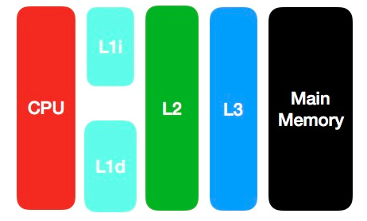
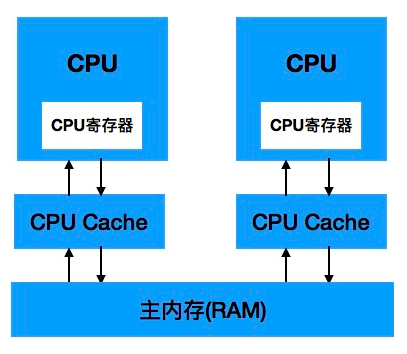
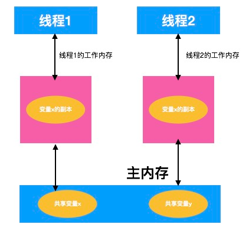
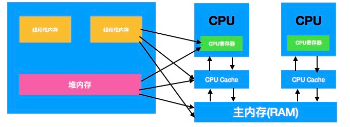

#### 1. volatile关键字的使用

#### 2. CPU缓存模型

要想对volatile有比较深刻的理解,首先我们需要对CPU的缓存模型有一定的认识

在计算机中,所有的运算操作都是由CPU的寄存器来完成的,CPU指令的执行过程需要涉及数据的读取和写入操作,CPU所能访问的所有数据只能是计算机的主存(RAM),虽然CPU的发展频率不断得到提升，但受制于制造工艺以及成本的限制，计算机的内存反倒在访问速度上没有多大的突破，因此CPU的处理速度和内存的访问速度之间的差距越拉越大，通常这种差距可以达到上千倍，极端情况下甚至会在上万倍以上。


由于CPU和计算机主存之间的不对等,通过传统的FSB会导致CPU资源受到极大的限制,降低CPU整体的吞吐量,于是就有了CPU和主存直接增加缓存的设计,现在缓存数量就可以增加到3级了:



Cache的出现是为了解决CPU直接访问内存效率低下的问题，程序在运行的过程中，

- **会将运算所需要的数据从主内存复制一份到CPU Cache中，这样CPU计算时就可以直接对CPU Cache中的数据进行读取和写入**
- 当运算结束之后，再将CPU Cache中最新的数据刷新到主内存当中，CPU通过直接访问Cache的方式提到直接访问主内存的方式极大地提高了CPU的吞吐能力，有个CPU Cache之后，整体的CPU和主内存之间的交互的架构大致如下图所示：



#### 3.java内存模型

由于缓存的出现,极大的提高了CPU的吞吐能力,但是随即产生了**缓存不一致**的问题

在多处理器系统中,每个处理器有自己的高速缓存,而他们共享一个主存,当多个处理器运算任务同步执行同一个同步任务(并隐射到同一块内存区域),将导致各自的缓存数据不一致,这个时候需要通过`缓存一致性协议`来保证数据的正确性,不同的操作系统使用缓存一致性协议都各不相同


因为各种硬件和操作系统的内存访问是有差异的，Java为了程序能在各种平台下运行达到一致的内存访问效果，于是定义了**Java内存模型（Java Memory Mode，JMM）**来对特定内存或高速缓存的读写访问过程进行抽象。


java内存模型定义了线程和主内存之间的抽象关系,具体如下:

- 共享变量存储于主内存之中,每个线程都可以访问  — **主存**
- 每个线程都有私有的工作内存和本地内存 — **工作内存**
- 工作内存值存储改线程对共享变量的副本
- 线程不能直接操作主存,只有先操作了工作内存之后才能写入主存
- 工作内存和java内存模型一样也是一个抽象的概念,他其实并不存在,他涵盖了缓存,寄存器,编译优化以及硬件等



Java内存模型定义了一套主内存和工作内存的交互协议，即一个变量如何从主内存拷贝到工作内存、如何从工作内存同步到主内存之类的实现细节。

具体有8种操作来完成，分别为**lock、unlock、read、load、use、assign、store和write。**除此之外，Java内存模型还规定在执行这8种操作的时候必须满足8种规则，由于篇幅问题，这里就不一一列举了，具体可参看深入理解Java虚拟机第12章的Java内存模型与线程。

`Java内存模型`是一个抽象的概念，其与计算机硬件的结构并不完全一样，比如计算机物理内存不会存在栈内存和堆内存的划分，无论是堆内存还是虚拟机栈内存都会对应到物理的主内存，当然也有一部分堆栈内存数据可能会存入CPU Cache寄存器中。具体可参考下图：



#### 4. volatile变量的特殊规则

Java内存模型对volatile关键字定义了一些特殊的访问规则，当一个变量被volatile修饰后，它将具备两种特性，或者说volatile具有下列两层语义：

- 保证了不同线程对这个变量进行读取时的可见性， 即一个线程修改了某个变量的值， 这新值对其他线程来说是立即可见的。 (volatile 解决了线程间共享变量的可见性问题)。

  

- 禁止进行指令重排序， 阻止编译器对代码的优化。

##### 4.1 针对第一点:可见性

- 使用volatile关键字会强制线程1中修改的共享变量值立即写入主存
- 当线程2进行修改时候,会导致线程1的工作内存中的变量的缓存行无效(反映到硬件层面,就是CPU的L1或者L2缓存中对应的缓存行无效)
- 由于线程1的工作内存中变量的缓存行无效,所以线程1要重新去读主存

这就是volatile的可见性

##### 4.2 不能保证原子性

```java
public class VolatileTest {
	public static volatile int race = 0;
	
	public static void increase() {
		race ++;
	}
	private static final int THREAD_COUNT = 20;

	public static void main(String[] args) {
		Thread[] threads = new Thread[THREAD_COUNT];
		for(int i =0 ;i<THREAD_COUNT;i++) {
			threads[i] = new Thread(() ->{
				for(int j =0;j< 10000;j++) {
					increase();
				}
			});
			threads[i].start();
		}
		
		while(Thread.activeCount() > 1)
			Thread.yield();
		
		System.out.println(race);
	}
}
```

这段代码发起了20个线程，每个线程对race变量进行10000次自增操作，如果这段代码能够正确并发的话，最后输出的结果应该是200000。我们运行完这段代码之后，并没有获得期望的结果，而且发现每次运行程序。输出的结果都不一样，都是一个小于200000的数字。

问题就出在自增运算”race++“之中，我们用javap反编译这段代码后发现只有一行代码的increase()方法在Class文件中是由4条字节码指令构成的。

```java
  public static void increase();
    Code:
       0: getstatic     #13                 // Field race:I
       3: iconst_1
       4: iadd
       5: putstatic     #13                 // Field race:I
       8: return
```

从字节码层面上很容易分析出原因了：当getstatic指令把race的值取到操作栈时，volatile关键字保证了race的值此时是正确的，但是在执行iconst_1、iAdd这些指令的时候，其他线程可能已经把race的值加大了，而在操作栈订的值就变成了过期的数据，所以putstati指令执行后就可能把较小的值同步回主内存中去了。

也就是说由于**volatile**不具有并发能力,导致不具备原子性

由于volatile变量只能保证可见性，在不符合以下两条规则的运算场景中，我们仍然要通过加锁（synchronized或java.util.concurrent中的原子类）来保证原子性。

- 目标结果并不依赖变量的当前值，或者能够确保只有单一的线程修改变量的值。
- 变量不需要与其他状态变量共同参与不变约束。

##### 4.3 禁止指令重排

普通变量仅仅会保证在该方法执行过程中,所有依赖赋值的结果的地方都能保证一致,而不能保证变量赋值操作顺序与程序代码的执行顺序一致

使用伪代码:

```java
Map configOptions;
char[] configText;
//此变量必须定义为volatile
volatile boolean initialized = false;

//假设以下代码在线程A中执行
//模拟读取配置信息，当读取完成后将initialized设置为true以通知其他线程配置可用
configOptions = new HashMap();
configText = readConfigFile(fileName);
processCongigOptions(configText,configOptions);
initialized = true

//假设以下代码在线程B中执行
//等待initialized为true，代表线程A已经把配置信息初始化完成
while(!initialized) {
	sleep();
}
//使用线程A中初始化好的配置信息
doSomethingWithConfig();

```

上面这段代码如果定义的initialized没有使用volatile来修饰，就可能会由于指令重排序的优化，导致位于线程A中最后一句代码initialized = true被提前执行（这里虽然使用Java作为伪代码，但所指的重排序优化是机器级的优化操作，提前执行时值这句话对于的汇编代码被提前执行），这样在线程B中使用配置信息的代码就可能出现错误，而volatile能避免此类情况的发生。

**指令重排序**是指指令乱序执行,即在条件允许的情况下直接运行当前有能力立即执行的后续指令,避开为获取一条指令锁需要的数据而造成的等待,通过连续执行的技术提高执行效率

**编译优化会导致指令重排,这样无法保证有序性**

#### 5. volatile关键字深入解析

指令重排从硬件架构上来说是指CPU采用了运行将多条指令不按程序规定的顺序分开发送给各相应的单元处理,但是并不是指令任意重排,CPU需要能正确处理指令依赖情况以保障程序能正确执行结果.指令把修改同步到内存时,意味者所有操作已经完成,这样便形成了" 指令重排序无法越过内存屏障"的效果。


