#### 1. 背景

java中的大部分同步类(`Lock, Semaphore,ReentrantLock等`)都是基于`AbstractQueuedSynchronizer`(简称AQS)实现的,AQS提供了一个原子式管理同步状态,阻塞和唤醒线程功能以及队列模型的简单框架

#### 2. ReentrantLock

##### 2.1 ReentrantLock特性概览

ReentrantLock意思是可重入锁,指的是一个线程能够对一个临界资源重复加锁;

**首先来看ReentrantLock和sychronized的比较**

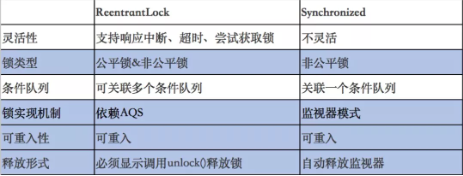

```java
// **************************Synchronized的使用方式**************************
// 1.用于代码块
synchronized (this) {}
// 2.用于对象
synchronized (object) {}
// 3.用于方法
public synchronized void test () {}
// 4.可重入
for (int i = 0; i < 100; i++) {
    synchronized (this) {}
}
// **************************ReentrantLock的使用方式**************************
public void test () throw Exception {
    // 1.初始化选择公平锁、非公平锁
    ReentrantLock lock = new ReentrantLock(true);
    // 2.可用于代码块
    lock.lock();
    try {
        try {
            // 3.支持多种加锁方式，比较灵活; 具有可重入特性
            if(lock.tryLock(100, TimeUnit.MILLISECONDS)){ }
        } finally {
            // 4.手动释放锁
            lock.unlock()
        }
    } finally {
        lock.unlock();
    }
}
```

java锁相关链接:<https://mp.weixin.qq.com/s?__biz=MjM5NjQ5MTI5OA==&mid=2651749434&idx=3&sn=5ffa63ad47fe166f2f1a9f604ed10091&chksm=bd12a5778a652c61509d9e718ab086ff27ad8768586ea9b38c3dcf9e017a8e49bcae3df9bcc8&scene=21#wechat_redirect>,并且ReentrantLock的底层就是由AQS来实现的.

那么,ReentrantLock是如何通过公平锁和非公平锁与AQS关联起来的呢?我们着重从这两者的加锁过程来理解一下他们与AQS之间的关系

非公平锁源码:

```java
static final class NonfairSync extends Sync {
    private static final long serialVersionUID = 7316153563782823691L;

    /**
     * Performs lock.  Try immediate barge, backing up to normal
     * acquire on failure.
     */
    // Android-removed: @ReservedStackAccess from OpenJDK 9, not available on Android.
    // @ReservedStackAccess
    final void lock() {
      	//代码 1
        if (compareAndSetState(0, 1))
            setExclusiveOwnerThread(Thread.currentThread());
        else
            acquire(1);
    }

    protected final boolean tryAcquire(int acquires) {
        return nonfairTryAcquire(acquires);
    }
}
```

**代码1:**

`compareAndSetState(0, 1)`

- 通过CAS设置变量State(同步状态)成功,也就是获取锁成功,则将当前线程设置为独占线程
- 若通过CAS设置变量State(同步状态)失败,也就是获取锁失败,则进入`acquire`方法进行后序的处理

第一步很好理解，但第二步获取锁失败后，后续的处理策略是怎么样的呢？这块可能会有以下思考：

- 某个线程获取锁失败的后续流程是什么呢？有以下两种可能：

- - **将当前线程获锁结果设置为失败，获取锁流程结束。**这种设计会极大降低系统的并发度，并不满足我们实际的需求。所以就需要下面这种流程，也就是AQS框架的处理流程。
  - 存在某种排队等候机制，线程继续等待，仍然保留获取锁的可能，获取锁流程仍在继续。

- 对于问题1的第二种情况，既然说到了排队等候机制，那么就一定会有某种队列形成，这样的队列是什么数据结构呢？

- 处于排队等候机制中的线程，什么时候可以有机会获取锁呢？

- 如果处于排队等候机制中的线程一直无法获取锁，还是需要一直等待吗，还是有别的策略来解决这一问题？

带着上诉的疑问我们去看公平锁:

```java
static final class FairSync extends Sync {
    private static final long serialVersionUID = -3000897897090466540L;

    final void lock() {
      	// 代码 1
        acquire(1);
    }

    /**
     * Fair version of tryAcquire.  Don't grant access unless
     * recursive call or no waiters or is first.
     */
    // Android-removed: @ReservedStackAccess from OpenJDK 9, not available on Android.
    // @ReservedStackAccess
    protected final boolean tryAcquire(int acquires) {
        final Thread current = Thread.currentThread();
        int c = getState();
        if (c == 0) {
            if (!hasQueuedPredecessors() &&
                compareAndSetState(0, acquires)) {
                setExclusiveOwnerThread(current);
                return true;
            }
        }
        else if (current == getExclusiveOwnerThread()) {
            int nextc = c + acquires;
            if (nextc < 0)
                throw new Error("Maximum lock count exceeded");
            setState(nextc);
            return true;
        }
        return false;
    }
}
```

看上诉**代码1**

同样调用代码: `acquire(1);`

这不就是非公平锁没有获取到锁之后的调用吗?

这个方法是其父类**AQS**的核心方法.下面我们会对AQS以及ReentrantLock和AQS的关联做详细介绍

#### 3. AQS

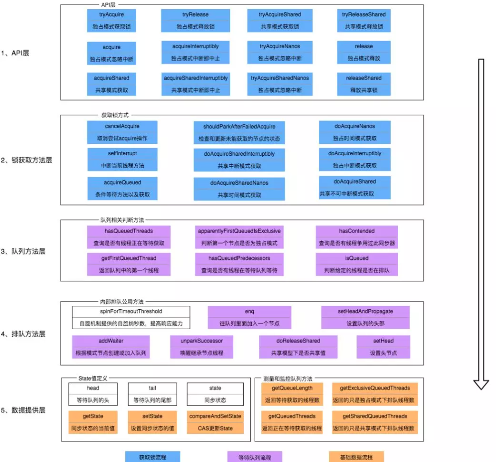

- 上图有颜色的是**method**,没有颜色的是**Attribution**

- 总体而言,AQS框架共分为5层,自上而下由浅入深,从AQS暴露的API到底层基础数据
- 当有自定义同步器接入时,只需要重写第一层所需要的部分方法即可,不需要关注底层具体实现流程.当自定义同步器进行加锁或者解锁操作时,先经过第一层的API进入AQS内部方法,然后经过第二层进行锁的获取,接着对于获取锁失败的流程,进入第三层和第四层的等待队列处理,而这些处理方式均依赖于第5层的基础数据提供层

#### 4.AQS原理概览

AQS的核心思想是,如果被请求的共享资源空闲,那么就将当前请求资源的线程设置为有效的工作线程,将共享资源设置为锁定状态;如果共享资源被占用,就需要一定的阻塞等待唤醒机制来保证锁的分配.这个机制主要用的是CLH队列的变体来实现,将暂时获取不到锁的线程加入到队列中

**CLH：Craig、Landin and Hagersten队列，是单向链表，AQS中的队列是CLH变体的虚拟双向队列（FIFO），AQS是通过将每条请求共享资源的线程封装成一个节点来实现锁的分配。**

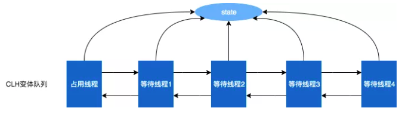

**AQS**使用一个Volatile的int类型的成员变量来表示同步状态,通过内置的FIFO队列来完成资源的获取的排队工作,通过CAS完成对State值的修改

#### 5. AQS的数据结构

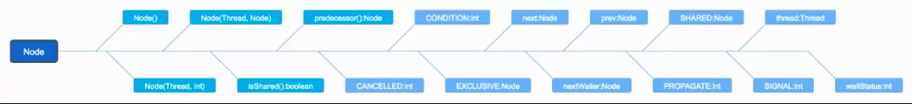

解释几个方法和属性值的含义:

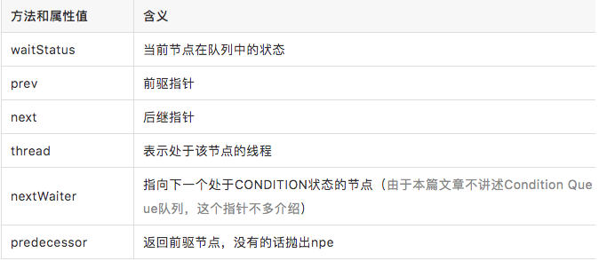

线程两种锁的模式:


waitStatus有下面几个枚举值:

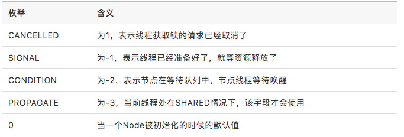


#### 6. AQS同步状态State

在了解数据结构后,接下来了解一下AQS的同步状态State.AQS维护了一个名为state的字段,,意为同步状态,是有Volatile修饰的,用于展示当前临界资源的获取锁的情况

```java
// java.util.concurrent.locks.AbstractQueuedSynchronizer

private volatile int state;
```

下面提供几个访问这个字段的方法:

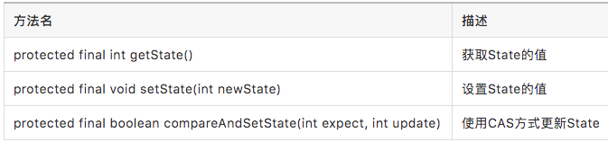

下面提供了几个访问这个字段的方法:

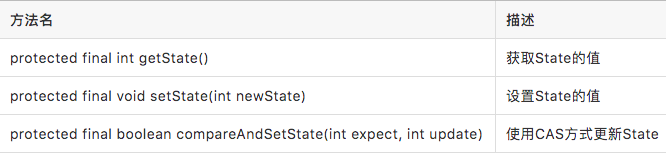

这几个方法都是Final修饰的，说明子类中无法重写它们。我们可以通过修改State字段表示的同步状态来实现多线程的独占模式和共享模式（加锁过程）。

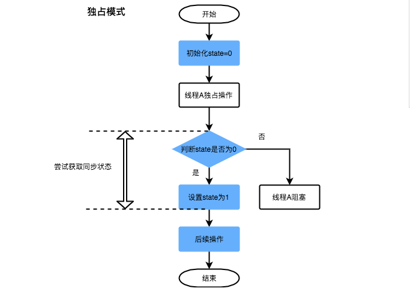

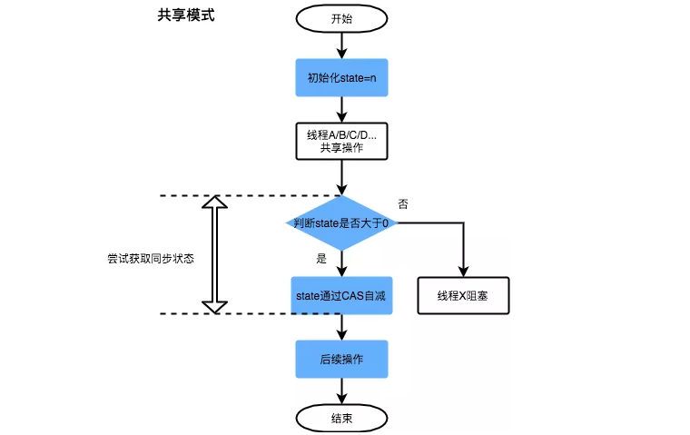

对于我们自定义的同步工具，需要自定义获取同步状态和释放状态的方式，也就是AQS架构图中的第一层：API层。

#### 7 .AQS重写方法与ReentrantLock关联

从架构图中可以得知，AQS提供了大量用于自定义同步器实现的Protected方法。自定义同步器实现的相关方法也只是为了通过修改State字段来实现多线程的独占模式或者共享模式。自定义同步器需要实现以下方法（ReentrantLock需要实现的方法如下，并不是全部）：

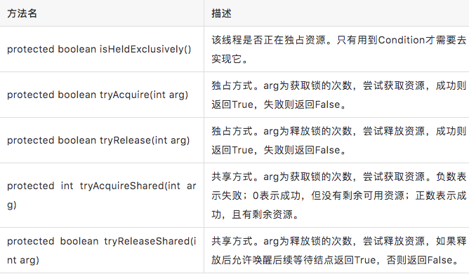

一般来说，自定义同步器要么是独占方式，要么是共享方式，它们也只需实现tryAcquire-tryRelease、tryAcquireShared-tryReleaseShared中的一种即可。AQS也支持自定义同步器同时实现独占和共享两种方式，如ReentrantReadWriteLock。ReentrantLock是独占锁，所以实现了tryAcquire-tryRelease。


