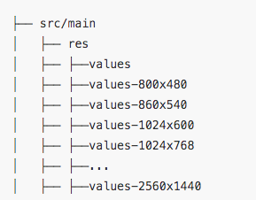
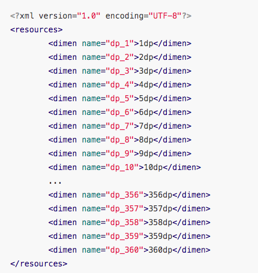
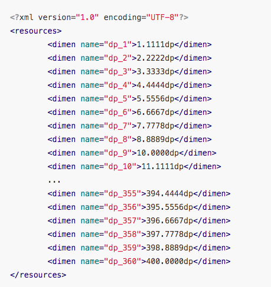

### 适配

- DPI:  就是屏幕像素密度,单位尺寸的像素数量

- PPI:物理概念
- DIP:就是DP

#### 1. smallestWidth  — 根据设计稿dp对屏幕进行分割 

就是根据需求生成对应的values-dimen文件,然后在布局中使用对应的dimen值

**假设:**我们假设设备的屏幕信息是 **1920 \* 1080**、**480 dpi**

那么最小宽度就是 1080,转换为dp就是1080/(480/160) = 360dp

那么 将屏幕宽度分为360份

则  **values-sw360dp** 中的 **dimens.xml** 是

**values-sw400dp** 中的 **dimens.xml**是:

- 优点
  - 非常稳定，极低概率出现意外
  - 不会有任何性能的损耗
  - 适配范围可自由控制，不会影响其他三方库
  - 在插件的配合下，学习成本低 

- 缺点:

  

  - 在布局中引用 **dimens** 的方式，虽然学习成本低，但是在日常维护修改时较麻烦

  - 侵入性高，如果项目想切换为其他屏幕适配方案，因为每个 **Layout** 文件中都存在有大量 **dimens** 的引用，这时修改起来工作量非常巨大，切换成本非常高昂

  - 无法覆盖全部机型，想覆盖更多机型的做法就是生成更多的资源文件，但这样会增加 **App** 体积，在没有覆盖的机型上还会出现一定的误差，所以有时需要在适配效果和占用空间上做一些抉择

  - 如果想使用 **sp**，也需要生成一系列的 **dimens**，导致再次增加 **App** 的体积

  - 不能自动支持横竖屏切换时的适配，如上文所说，如果想自动支持横竖屏切换时的适配，需要使用 **values-w<N>dp** 或 **屏幕方向限定符** 再生成一套资源文件，这样又会再次增加 **App** 的体积

  - 不能以高度为基准进行适配，考虑到这个方案的名字本身就叫 **最小宽度限定符适配方案**，所以在使用这个方案之前就应该要知道这个方案只能以宽度为基准进行适配，为什么现在的屏幕适配方案只能以高度或宽度其中的一个作为基准进行适配

    

    

    

    

#### 2.今日头条AutoSize   — 动态计算density

**当前设备屏幕总宽度（单位为像素）/  设计图总宽度（单位为 dp) = density**

这个公式就是把上面公式中的 **屏幕的总 dp 宽度** 换成 **设计图总宽度**，原理都是一样的，只要 **density** 根据不同的设备进行实时计算并作出改变，就能保证 **设计图总宽度** 不变，也就完成了适配

**其实就是根据设计图的最小宽度dp值和屏幕最小宽度的px值 动态计算density**

#### 3. 算法  

输出单链表倒数第k个元素

屏蔽单链表重复字段,然后输出

