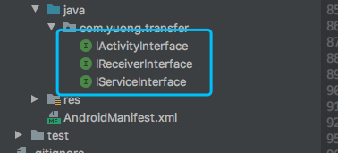
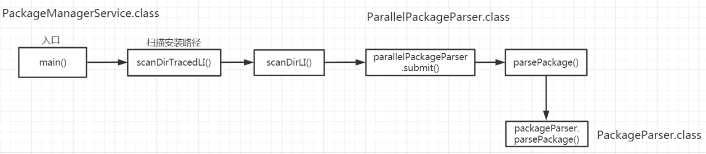

#### 1. 场景

由于插件apk是没有安装的,也就是插件apk没有组件的一些环境,比如context上下文对象之类的,如果要用到这些环境就必须依赖宿主的环境运行.所以我们就要**宿主和插件之间定义一个标准,用来传递宿主中的环境给插件**

#### 2. 插件周期限定  — 制定标准

由于插件没有宿主环境,所以没有办法执行android四大组件的生命周期,所以需要自己抽象接口来实现周期然后进行一一绑定

制定标准(模拟四大组件的生命周期)



```java
/**
 * 用来模拟Activity的声明周期
 */
public interface IActivityInterface {

    /**
     * 插入宿主的Activity
     *
     * @param appActivity
     */
  	// 传入宿主的上下文环境  --- 这是插件周期的执行题
    void insertAppContext(Activity appActivity);

    void onCreate(Bundle savedInstanceState);

    void onStart();

    void onResume();

    void onPause();

    void onStop();

    void onRestart();

    void onDestroy();

}
```

插件`Activity,Service,BroadcastReceiver`均继承base类,然后实现相关的标准接口

- base类中重写与context上下文相关的方法,然后调用宿主上下文进行处理

```java
public abstract class BaseActivity extends Activity implements IActivityInterface {
    protected Activity appActivity;
    @Override
    public void insertAppContext(Activity appActivity) {
        this.appActivity = appActivity;
    }

    @SuppressLint("MissingSuperCall")
    @Override
    public void onCreate(Bundle savedInstanceState) {

    }

    @SuppressLint("MissingSuperCall")
    @Override
    public void onStart() {

    }

    @SuppressLint("MissingSuperCall")
    @Override
    public void onResume() {

    }

    @SuppressLint("MissingSuperCall")
    @Override
    public void onPause() {

    }
    @SuppressLint("MissingSuperCall")
    @Override
    public void onStop() {

    }

    @SuppressLint("MissingSuperCall")
    @Override
    public void onRestart() {

    }

    @SuppressLint("MissingSuperCall")
    @Override
    public void onDestroy() {

    }

    @Override
    public void setContentView(int resId) {
        appActivity.setContentView(resId);
    }

    @Override
    public <T extends View> T findViewById(int id) {
        return appActivity.findViewById(id);
    }

    @Override
    public void startActivity(Intent intent) {
        Intent newIntent = new Intent();
        newIntent.putExtra("className", intent.getComponent().getClassName());
        appActivity.startActivity(newIntent);
    }

    @Override
    public ComponentName startService(Intent service) {
        Intent newService = new Intent();
        newService.putExtra("className", service.getComponent().getClassName());
        return appActivity.startService(newService);
    }

    @Override
    public Intent registerReceiver(BroadcastReceiver receiver, IntentFilter filter) {
        return appActivity.registerReceiver(receiver, filter);
    }

    @Override
    public void sendBroadcast(Intent intent) {
        appActivity.sendBroadcast(intent);
    }
}
```

build工程生成apk文件,adb pull到相关sd卡目录


#### 3. 加载插件

假设插件`.apk`已经推送到指定目录,然后进行加载插件,需要使用`DexClassLoader`加载sd卡上的插件apk(宿主加载)

```java
// 插件apk所在目录
File file = new File(path);
if (!file.exists()) {
    Log.e(TAG, "插件不存在");
    return;
}
File pluginDir = context.getDir("plugin", Context.MODE_PRIVATE);
//加载插件apk的dex文件
dexClassLoader = new DexClassLoader(path, pluginDir.getAbsolutePath(), null, context.getClassLoader());
```

- path:目标apk的目录
-  pluginDir.getAbsolutePath():优化apk下dex之后的存放路径(插件apk解析后dex文件存放的目录)
- null:so路径,这里没有
- context.getClassLoader():parent-ClassLoader

#### 4. 加载resource

获取到`DexClassLoader`然后加载插件apk的资源对象,由于插件没有宿主的环境,也就无法使用`context.getResource`方式来得到一个Resource对象,我们只能new一个resource实现类:

```java
//1、获取插件的AssetManager  todo 并传入apk的资源路径
AssetManager pluginAssetManager = AssetManager.class.newInstance();
Method addAssetPath = AssetManager.class.getMethod("addAssetPath", String.class);
addAssetPath.setAccessible(true);
addAssetPath.invoke(pluginAssetManager, path);
//2、获取宿主的Resources
Resources appResources = context.getResources();
//实例化插件的Resources
pluginResource = new Resources(pluginAssetManager, appResources.getDisplayMetrics(), appResources.getConfiguration());
```

这里需要用到反射,由于实例化resource需要用到下面几个参数

```java
@Deprecated
public Resources(AssetManager assets, DisplayMetrics metrics, Configuration config) {
    this(null);
    mResourcesImpl = new ResourcesImpl(assets, metrics, config, new DisplayAdjustments());
}
```

- metrics&config 直接使用宿主传来的上下文进行获取
- AssetManager需要使用反射,并指明资源的路径所以需要反射获取`AssetManager.addAssetPath`然后将插件的path `invoke`进去

到此为止拿到了类加载器`DexClassLoader`对象和`Resource`

#### 5. 跳转Activity

要跳转Activity首先获取Activity的class-name

```java
//获取插件包的Activity
PackageManager packageManager = getPackageManager();
PackageInfo packageArchiveInfo = packageManager.getPackageArchiveInfo(path, PackageManager.GET_ACTIVITIES);
//获取在manifest文件中注册的第一个activity
ActivityInfo activity = packageArchiveInfo.activities[0];
Intent intent = new Intent(this, ProxyActivity.class);
intent.putExtra("className", activity.name);
startActivity(intent);
```

首先通过`PackageManager`调用其`getPackageArchiveInfo`去遍历插件apk清单中的path,获取插件apk清单中注册的第一个Activity,然后跳转到宿主的占位Activity(**或者可以认为是代理Activity**)

然后走到*ProxyActivity*

```java
@Override
protected void onCreate(@Nullable Bundle savedInstanceState) {
    super.onCreate(savedInstanceState);
    //真正的加载插件里面的Activity
    String className = getIntent().getStringExtra("className");
    try {
      	// step1:根据class-name使用之前获取到的DexclassLoader进行加载
      	// step2:调用插件Activity的onCreate方法
        Class<?> pluginActivity1Clazz = getClassLoader().loadClass(className);
        Constructor<?> constructor = pluginActivity1Clazz.getConstructor(new Class[]{});
        pluginActivity1 = (IActivityInterface) constructor.newInstance(new Object[]{});
        pluginActivity1.insertAppContext(this);
        Bundle bundle = new Bundle();
        bundle.putString("value", "我是宿主传递过来的字符串");
        pluginActivity1.onCreate(bundle);

    } catch (Exception e) {
        e.printStackTrace();
    }

}
```

其实宿主跳转插件中的Activity并不是真正的走`startActivity`仅仅是调用其会调而已

需要注意的是:**在ProxyActivity中,要将宿主上下文传递给插件`pluginActivity1.insertAppContext(this);`**

由于插件没有宿主环境所以对android基础组件的调用或者 startxxx  最终会走到宿主,大概流程如下

> 场景插件Activity内部跳转

*step1:*

```java
button.setOnClickListener(new View.OnClickListener() {
    @Override
    public void onClick(View v) {
        Intent intent = new Intent(appActivity, Plugin2Activity.class);
        startActivity(intent);
    }
});
```

*step2:调用插件基类base的startActivity*

```java
@Override
public void startActivity(Intent intent) {
    Intent newIntent = new Intent();
    newIntent.putExtra("className", intent.getComponent().getClassName());
    appActivity.startActivity(newIntent);
}
```

而这个appActivity就是宿主的占位activity-`ProxyActivity`,那么

*step3:走到宿主占位Activity(也就是代理Activity-ProxyActivity)*

```java
@Override
public void startActivity(Intent intent) {
    String className = intent.getStringExtra("className");
    //todo 自己跳自己  为了实现插件内跳转我们自己调自己
    Intent newIntent = new Intent(this, this.getClass());
    newIntent.putExtra("className", className);
    super.startActivity(newIntent);
}
```

这里是自己跳自己,还是会走到其oncreate中然后调用插件目标Activity的onCreate


**所以插件的交互是在宿主占位Activity中实现,然后与插件的交互就是调用其标准接口方法**,所以*ProxyActivity*重写了许多方法:

```java
/**
 * 代理的Activity
 */
public class ProxyActivity extends Activity {

    private IActivityInterface pluginActivity1;
    private boolean isRegister;
    private ProxyReceiver proxyReceiver;

    @Override
    protected void onCreate(@Nullable Bundle savedInstanceState) {
        super.onCreate(savedInstanceState);
        //真正的加载插件里面的Activity
        String className = getIntent().getStringExtra("className");
        try {
            Class<?> pluginActivity1Clazz = getClassLoader().loadClass(className);
            Constructor<?> constructor = pluginActivity1Clazz.getConstructor(new Class[]{});
            pluginActivity1 = (IActivityInterface) constructor.newInstance(new Object[]{});
            pluginActivity1.insertAppContext(this);
            Bundle bundle = new Bundle();
            bundle.putString("value", "我是宿主传递过来的字符串");
            pluginActivity1.onCreate(bundle);

        } catch (Exception e) {
            e.printStackTrace();
        }

    }

    @Override
    protected void onStart() {
        super.onStart();
        pluginActivity1.onStart();

    }

    @Override
    protected void onResume() {
        super.onResume();
        pluginActivity1.onResume();
    }

    @Override
    protected void onPause() {
        super.onPause();
        pluginActivity1.onPause();
    }

    @Override
    protected void onStop() {
        super.onStop();
        pluginActivity1.onStop();
    }

    @Override
    protected void onRestart() {
        super.onRestart();
        pluginActivity1.onRestart();
    }

    @Override
    protected void onDestroy() {
        super.onDestroy();
        pluginActivity1.onDestroy();
        if (isRegister) {
            unregisterReceiver(proxyReceiver);
        }
    }

    @Override
    public Resources getResources() {
        return PluginManager.getInstance(this).getResource();
    }

    @Override
    public ClassLoader getClassLoader() {
        return PluginManager.getInstance(this).getClassLoader();
    }

    @Override
    public void startActivity(Intent intent) {
        String className = intent.getStringExtra("className");
        //todo 自己跳自己  为了实现插件内跳转我们自己调自己
        Intent newIntent = new Intent(this, this.getClass());
        newIntent.putExtra("className", className);
        super.startActivity(newIntent);
    }

    @Override
    public ComponentName startService(Intent service) {
        String className = service.getStringExtra("className");
        ProxyService.pluginServiceClassName = className;
        //自己跳自己
        Intent newService = new Intent(this, ProxyService.class);
        newService.putExtra("className", className);
        return super.startService(newService);
    }

    @Override
    public Intent registerReceiver(BroadcastReceiver receiver, IntentFilter filter) {
        proxyReceiver = new ProxyReceiver(receiver.getClass().getName());
        isRegister = true;
        return super.registerReceiver(proxyReceiver, filter);
    }

}
```

其他四大组件也是这样

#### 6.注册插件内的静态广播

要加载插件中的静态广播,我们需要知道一点:我们的app的静态广播什么时候被注册

其实在手机开机的时候,手机里面所有的已经安装的app,系统会再次进行扫描一次,也就是为什么开机会比较久的原因吧.等到安装完成之后,会马上扫描`/data/app`目录,然后逐个去解析改目录下的所有apk的**Manifest.xml** 文件,就会自动注册


那么 我们如何去解析apk文件里面的组件信息的.我们知道解析apk文件会用到**PackageManagerService** 这个类，所以我们来查看这个类的源码。



主要看 `PackageParser.class`

```java
public final static class Package implements Parcelable {

    .....
    public final ArrayList<Activity> activities = new ArrayList<Activity>(0);
    public final ArrayList<Activity> receivers = new ArrayList<Activity>(0);
    public final ArrayList<Provider> providers = new ArrayList<Provider>(0);
    public final ArrayList<Service> services = new ArrayList<Service>(0);


    .....
}
```

上述几个list集合就是四大组件相关的集合

其中`public final ArrayList<Activity> receivers = new ArrayList<Activity>(0);`就是注册的receivers

所以:

*step1*:获取这个package,这里使用`.parsePackage`

```java
public Package parsePackage(File packageFile, int flags, boolean useCaches)
        throws PackageParserException {
    Package parsed = useCaches ? getCachedResult(packageFile, flags) : null;
    if (parsed != null) {
        return parsed;
    }

    long parseTime = LOG_PARSE_TIMINGS ? SystemClock.uptimeMillis() : 0;
    if (packageFile.isDirectory()) {
        parsed = parseClusterPackage(packageFile, flags);
    } else {
        parsed = parseMonolithicPackage(packageFile, flags);
    }

    long cacheTime = LOG_PARSE_TIMINGS ? SystemClock.uptimeMillis() : 0;
    cacheResult(packageFile, flags, parsed);
    if (LOG_PARSE_TIMINGS) {
        parseTime = cacheTime - parseTime;
        cacheTime = SystemClock.uptimeMillis() - cacheTime;
        if (parseTime + cacheTime > LOG_PARSE_TIMINGS_THRESHOLD_MS) {
            Slog.i(TAG, "Parse times for '" + packageFile + "': parse=" + parseTime
                    + "ms, update_cache=" + cacheTime + " ms");
        }
    }
    return parsed;
}
```

那么我们的代码就是

```java
//1、解析插件包  public Package parsePackage(File packageFile, int flags)
Class<?> mPackageParserClass = Class.forName("android.content.pm.PackageParser");
Object mPackageParser = mPackageParserClass.newInstance();
Method parsePackageMethod = mPackageParserClass.getMethod("parsePackage`", File.class, int.class);
Object mPackage = parsePackageMethod.invoke(mPackageParser, file, PackageManager.GET_ACTIVITIES);
```

*step2*获取receivers集合:

```java
//2、获取Package类下的   public final ArrayList<Activity> receivers = new ArrayList<Activity>(0); 广播集合
Field mReceiversField = mPackage.getClass().getDeclaredField("receivers");
ArrayList<Object> receivers = (ArrayList<Object>) mReceiversField.get(mPackage);
```

*step3*

到此为止获取到`ArrayList<Activity> receivers`,我们发现里面的元素是Activity,而这个Activity只是一个简单的javabean:

```java
public final static class Activity extends Component<ActivityIntentInfo> implements Parcelable {
    public final ActivityInfo info;
    ......
```

其中成员参数ActivityInfo包含receivers的name

我们只要获取到这个name就可以用类加载加载出来

所以接下来通过`PackageParser.generateActivityInfo`来获取这个ActivityInfo,进而获取name

```java
//先获取到 ActivityInfo类
Class<?> mPackageUserStateClass = Class.forName("android.content.pm.PackageUserState");
Object mPackageUserState = mPackageUserStateClass.newInstance();

Method generateActivityInfoMethod = mPackageParserClass.getMethod("generateActivityInfo", mActivity.getClass(),
        int.class, mPackageUserStateClass, int.class);
//获取userId
Class<?> mUserHandleClass = Class.forName("android.os.UserHandle");
//public static @UserIdInt int getCallingUserId()
int userId = (int) mUserHandleClass.getMethod("getCallingUserId").invoke(null);

//执行此方法 由于是静态方法 所以不用传对象
ActivityInfo activityInfo = (ActivityInfo) generateActivityInfoMethod.invoke(null, mActivity, 0, mPackageUserState, userId);
String receiverClassName = activityInfo.name;
Class<?> receiverClass = getClassLoader().loadClass(receiverClassName);
BroadcastReceiver receiver = (BroadcastReceiver) receiverClass.newInstance();

//5、获取 intent-filter  public final ArrayList<II> intents;这个是intent-filter的集合
//静态内部类反射要用 $+类名
//getField(String name)只能获取public的字段，包括父类的；
//而getDeclaredField(String name)只能获取自己声明的各种字段，包括public，protected，private。
Class<?> mComponentClass = Class.forName("android.content.pm.PackageParser$Component");
Field intentsField = mActivity.getClass().getField("intents");
ArrayList<IntentFilter> intents = (ArrayList<IntentFilter>) intentsField.get(mActivity);
for (IntentFilter intentFilter : intents) {
    //6、注册广播  ---
    context.registerReceiver(receiver, intentFilter);
}
```

