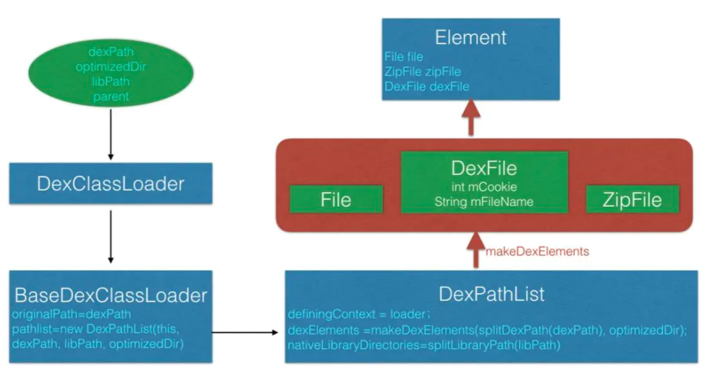

#### 1. *PathClassLoader  & DexClassLoader*

首先介绍android中两个主要的classloader,`PathClassLoader`和`DexClassLoader`,他们都继承自`BaseDexClassLoader`

下面看着两个类的区别

*PathClassLoader*

```java
package dalvik.system;
18
19/**
20 * Provides a simple {@link ClassLoader} implementation that operates on a list
21 * of files and directories in the local file system, but does not attempt to
22 * load classes from the network. Android uses this class for its system class
23 * loader and for its application class loader(s).
24 */
25public class PathClassLoader extends BaseDexClassLoader {
26    /**
27     * Creates a {@code PathClassLoader} that operates on a given list of files
28     * and directories. This method is equivalent to calling
29     * {@link #PathClassLoader(String, String, ClassLoader)} with a
30     * {@code null} value for the second argument (see description there).
31     *
32     * @param dexPath the list of jar/apk files containing classes and
33     * resources, delimited by {@code File.pathSeparator}, which
34     * defaults to {@code ":"} on Android
35     * @param parent the parent class loader
36     */
37    public PathClassLoader(String dexPath, ClassLoader parent) {
38        super(dexPath, null, null, parent);
39    }
40
41    /**
42     * Creates a {@code PathClassLoader} that operates on two given
43     * lists of files and directories. The entries of the first list
44     * should be one of the following:
45     *
46     * <ul>
47     * <li>JAR/ZIP/APK files, possibly containing a "classes.dex" file as
48     * well as arbitrary resources.
49     * <li>Raw ".dex" files (not inside a zip file).
50     * </ul>
51     *
52     * The entries of the second list should be directories containing
53     * native library files.
54     *
55     * @param dexPath the list of jar/apk files containing classes and
56     * resources, delimited by {@code File.pathSeparator}, which
57     * defaults to {@code ":"} on Android
58     * @param libraryPath the list of directories containing native
59     * libraries, delimited by {@code File.pathSeparator}; may be
60     * {@code null}
61     * @param parent the parent class loader
62     */
63    public PathClassLoader(String dexPath, String libraryPath,
64            ClassLoader parent) {
65        super(dexPath, null, libraryPath, parent);
66    }
67}
```

我们直接从注释入手

```java
/**
20 * Provides a simple {@link ClassLoader} implementation that operates on a list
21 * of files and directories in the local file system, but does not attempt to
22 * load classes from the network. Android uses this class for its system class
23 * loader and for its application class loader(s).
24 */
```

我们可以发现`PathClassLoader`被用来加载本地文件系统上的文件和目录,但是不能从网络上加载,关键是它被用来**加载系统类和我们的应用程序**,这也是为什么他的两个构造函数中调用父类构造器的时候第二个参数传null,具体参数的意义在`DexClassLoader`中继续分析

*DexClassLoader*

```java
package dalvik.system;
18
19import java.io.File;
20
21/**
22 * A class loader that loads classes from {@code .jar} and {@code .apk} files
23 * containing a {@code classes.dex} entry. This can be used to execute code not
24 * installed as part of an application.
25 *
26 * <p>This class loader requires an application-private, writable directory to
27 * cache optimized classes. Use {@code Context.getCodeCacheDir()} to create
28 * such a directory: <pre>   {@code
29 *   File dexOutputDir = context.getCodeCacheDir();
30 * }</pre>
31 *
32 * <p><strong>Do not cache optimized classes on external storage.</strong>
33 * External storage does not provide access controls necessary to protect your
34 * application from code injection attacks.
35 */
36public class DexClassLoader extends BaseDexClassLoader {
37    /**
38     * Creates a {@code DexClassLoader} that finds interpreted and native
39     * code.  Interpreted classes are found in a set of DEX files contained
40     * in Jar or APK files.
41     *
42     * <p>The path lists are separated using the character specified by the
43     * {@code path.separator} system property, which defaults to {@code :}.
44     *
45     * @param dexPath the list of jar/apk files containing classes and
46     *     resources, delimited by {@code File.pathSeparator}, which
47     *     defaults to {@code ":"} on Android
48     * @param optimizedDirectory directory where optimized dex files
49     *     should be written; must not be {@code null}
50     * @param libraryPath the list of directories containing native
51     *     libraries, delimited by {@code File.pathSeparator}; may be
52     *     {@code null}
53     * @param parent the parent class loader
54     */
55    public DexClassLoader(String dexPath, String optimizedDirectory,
56            String libraryPath, ClassLoader parent) {
57        super(dexPath, new File(optimizedDirectory), libraryPath, parent);
58    }
59}
```

`DexClassLoader`用来加载加载jar.apk,其实还包括zip文件或者直接加载dex文件,他可以被用来执行未安装的的代码或者未被应用加载过的代码.这里写出四个重要参数的含义:

```java
  public BaseDexClassLoader(String dexPath, File optimizedDirectory,
46            String libraryPath, ClassLoader parent) {
47        super(parent);
48        this.pathList = new DexPathList(this, dexPath, libraryPath, optimizedDirectory);
49    }
```

- dexPath:需要加载的文件地址,可以多个,用File.pathSeparator分割
- optimizedDirectory:dex文件被加载后会被编译优化,优化之后的dex存放路径,不可以为null;注意,注释中也提到需要一个应用私有的可写路径,以防止应用被注入攻击,并且给出了例子: File dexOutputDir = context.getDir("dex", 0);
- libraryPath:包含libraries的目录列表,pligin中有so文件,需要将so拷贝到sd卡上,然后把so所在的目录当参数传入,同样用`File.pathSeparator`进行分割,如果没有则传null就行了,会自动加上系统的so库的存放目录
- parent:父类构造器

这里着重看一下第二个参数,之前说过PathClassLoader中调用父类构造器的时候这个参数传了null,因为加载app应用的时候我们的apk已经被安装到本地文件系统上了,其内部的dex已经被提取并且执行过优化了,优化之后放在系统目录`/data/dalvik-cache`下

#### 2. 具体的加载流程

```java
try {
            File file = view.getActivity().getDir("dex",0);
            String optimizedDirectory = file.getAbsolutePath();
            DexClassLoader loader = new DexClassLoader("需要被加载的dex文件所在的路径",optimizedDirectory,null,context.getClassLoader());
            loader.loadClass("需要加载的类的完全限定名");
        } catch (ClassNotFoundException e) {
            e.printStackTrace();
        }
```

这里我们自定义一个DexClassLoader,并且调用了他的`loadClass`方法,这样一个需要被使用的类就被我们加载进来了,接下去就可以正常使用这个类了,具体怎么使用我就不多说了,我们来研究下这个类是怎么被加载进来的

可以看到`new DexClassLoader`的时候我们使用了4个参数,参数意义上面已经讲过了,从上面源码中可以看到`DexClassLoader`的构造器直接调用了父类的构造器,只要将`optimizedDirectory`封装成一个file即可.具体这些参数是如何使用的,我们往下看:

*BaseDexClassLoader*构造

```java
32    /**
33     * Constructs an instance.
34     *
35     * @param dexPath the list of jar/apk files containing classes and
36     * resources, delimited by {@code File.pathSeparator}, which
37     * defaults to {@code ":"} on Android
38     * @param optimizedDirectory directory where optimized dex files
39     * should be written; may be {@code null}
40     * @param libraryPath the list of directories containing native
41     * libraries, delimited by {@code File.pathSeparator}; may be
42     * {@code null}
43     * @param parent the parent class loader
44     */
45    public BaseDexClassLoader(String dexPath, File optimizedDirectory,
46            String libraryPath, ClassLoader parent) {
47        super(parent); // 调用父类构造器,将parent传给父类
48        this.pathList = new DexPathList(this, dexPath, libraryPath, optimizedDirectory);
49    }
```

首先调用了父类的构造器,但是只将parent传给父类,即ClassLoader,ClassLoader中做的也很简单,他内部有一个parent属性,正好保存传进来的参数parent

看下第二个参数的注释,有提到可以为null,而是否为null刚好是`PathClassLoader`和`DexClassLoader`的区别,那是否为null又意味着什么,继续往下看:

```java
193    /**
194     * Constructs a new instance of this class with the specified class loader
195     * as its parent.
196     *
197     * @param parentLoader
198     *            The {@code ClassLoader} to use as the new class loader's
199     *            parent.
200     */
201    protected ClassLoader(ClassLoader parentLoader) {
202        this(parentLoader, false);
203    }
204
205    /*
206     * constructor for the BootClassLoader which needs parent to be null.
207     */
208    ClassLoader(ClassLoader parentLoader, boolean nullAllowed) {
209        if (parentLoader == null && !nullAllowed) {
210            throw new NullPointerException("parentLoader == null && !nullAllowed");
211        }
212        parent = parentLoader;
213    }
```

这样parent就传给了父类

继续看`this.pathList = new DexPathList(this, dexPath, libraryPath, optimizedDirectory);`

*BaseDexClassLoader*给`DexPathList`赋值,我们来看`DexPathList`究竟是什么

```java
77    /**
78     * Constructs an instance.
79     *
80     * @param definingContext the context in which any as-yet unresolved
81     * classes should be defined
82     * @param dexPath list of dex/resource path elements, separated by
83     * {@code File.pathSeparator}
84     * @param libraryPath list of native library directory path elements,
85     * separated by {@code File.pathSeparator}
86     * @param optimizedDirectory directory where optimized {@code .dex} files
87     * should be found and written to, or {@code null} to use the default
88     * system directory for same
89     */
90    public DexPathList(ClassLoader definingContext, String dexPath,
91            String libraryPath, File optimizedDirectory) {
92				......
100				 // 验证参数合法性 
101        if (optimizedDirectory != null) {
102            if (!optimizedDirectory.exists())  {
103                throw new IllegalArgumentException(
104                        "optimizedDirectory doesn't exist: "
105                        + optimizedDirectory);
106            }
107
108            if (!(optimizedDirectory.canRead()
109                            && optimizedDirectory.canWrite())) {
110                throw new IllegalArgumentException(
111                        "optimizedDirectory not readable/writable: "
112                        + optimizedDirectory);
113            }
114        }
115
116        this.definingContext = definingContext;
117
118        ArrayList<IOException> suppressedExceptions = new ArrayList<IOException>();
119        // save dexPath for BaseDexClassLoader
120        this.dexElements = makePathElements(splitDexPath(dexPath), optimizedDirectory,
121                                            suppressedExceptions);
122
133        this.nativeLibraryDirectories = splitPaths(libraryPath, false);
134        this.systemNativeLibraryDirectories =
135                splitPaths(System.getProperty("java.library.path"), true);
136        List<File> allNativeLibraryDirectories = new ArrayList<>(nativeLibraryDirectories);
137        allNativeLibraryDirectories.addAll(systemNativeLibraryDirectories);
138
139        this.nativeLibraryPathElements = makePathElements(allNativeLibraryDirectories, null,
140                                                          suppressedExceptions);
141
142        if (suppressedExceptions.size() > 0) {
143            this.dexElementsSuppressedExceptions =
144                suppressedExceptions.toArray(new IOException[suppressedExceptions.size()]);
145        } else {
146            dexElementsSuppressedExceptions = null;
147        }
148    }
```

首先来看入参的第四个参数`optimizedDirectory`,如果为null则使用系统默认的路径代替,这个默认路径也就是`/data/dalvik0cache/`目录,这个一般情况下是没有权限去访问的,所以这也就解释了为什么我们只能用`DexClassLoader`去加载类而不用`PathClassLoader`


然后接着看代码,前面三个if是用来验证参数的合法性,下面看核心代码赋值:

```java
116        this.definingContext = definingContext; // target1
117
118       
119        // target2
120        this.dexElements = makePathElements(splitDexPath(dexPath), optimizedDirectory,
121                                            suppressedExceptions);
122				 // target3
133        this.nativeLibraryDirectories = splitPaths(libraryPath, false);
134        this.systemNativeLibraryDirectories =
135                splitPaths(System.getProperty("java.library.path"), true);
```

*target1*:保存实例化DexPathList的`ClassLoader`,

*target2*:声明一个Element数组

*target3:*lib库目录文件数组

```java
private final Element[] dexElements;
private final File[] nativeLibraryDirectories;

```

首先来看下几个`split`函数:

```java
169    /**
170     * Splits the given dex path string into elements using the path
171     * separator, pruning out any elements that do not refer to existing
172     * and readable files. (That is, directories are not included in the
173     * result.)
174     */
175    private static List<File> splitDexPath(String path) {
176        return splitPaths(path, false);
177    }
178
179    /**
180     * Splits the given path strings into file elements using the path
181     * separator, combining the results and filtering out elements
182     * that don't exist, aren't readable, or aren't either a regular
183     * file or a directory (as specified). Either string may be empty
184     * or {@code null}, in which case it is ignored. If both strings
185     * are empty or {@code null}, or all elements get pruned out, then
186     * this returns a zero-element list.
187     */
188    private static List<File> splitPaths(String searchPath, boolean directoriesOnly) {
189        List<File> result = new ArrayList<>();
190
191        if (searchPath != null) {
192            for (String path : searchPath.split(File.pathSeparator)) {
193                if (directoriesOnly) {
194                    try {
195                        StructStat sb = Libcore.os.stat(path);
196                        if (!S_ISDIR(sb.st_mode)) {
197                            continue;
198                        }
199                    } catch (ErrnoException ignored) {
200                        continue;
201                    }
202                }
203                result.add(new File(path));
204            }
205        }
206
207        return result;
208    }
```

这两个顾名思义就是用来分割`dexPath`和`libPath`,他们调用的方法都是`splitPaths`

*添加lib的逻辑:*

```java
133        this.nativeLibraryDirectories = splitPaths(libraryPath, false);
134        this.systemNativeLibraryDirectories =
135                splitPaths(System.getProperty("java.library.path"), true);
136        List<File> allNativeLibraryDirectories = new ArrayList<>(nativeLibraryDirectories);
137        allNativeLibraryDirectories.addAll(systemNativeLibraryDirectories);
138
139        this.nativeLibraryPathElements = makePathElements(allNativeLibraryDirectories, null,
140                                                          suppressedExceptions);
141
```

` this.nativeLibraryDirectories = splitPaths(libraryPath, false);`本地lib的加载,包含libraries的目录列表，plugin中有so文件，需要将so拷贝到sd卡上

` this.systemNativeLibraryDirectories =splitPaths(System.getProperty("java.library.path"), true);`split系统的so库

通过`allNativeLibraryDirectories`将libraries的目录列表，plugin中有so文件以及系统的so库进行合并

添加lib和dex时候全部调用splitPaths,但是第二个参数有所不同,添加lib时候,`directoriesOnly`为true,这是对文件是否存在以及是否可读的验证,最终决定文件是否加入list

lib的加载一目了然继续看dex的加载:`this.dexElements = makePathElements(splitDexPath(dexPath), optimizedDirectory,suppressedExceptions);`

*makePathElements*

```java
210    /**
211     * Makes an array of dex/resource path elements, one per element of
212     * the given array.
213     */
214    private static Element[] makePathElements(List<File> files, File optimizedDirectory,
215                                              List<IOException> suppressedExceptions) {
216        List<Element> elements = new ArrayList<>(); // 创建elementslist
217    		 // 遍历分割后的文件
221        for (File file : files) {
222            File zip = null;
223            File dir = new File("");
224            DexFile dex = null;
225            String path = file.getPath();
226            String name = file.getName();
227						 // 如果包含!/ 将zip和dir split获取结果
228            if (path.contains(zipSeparator)) {
229                String split[] = path.split(zipSeparator, 2);
230                zip = new File(split[0]);
231                dir = new File(split[1]);
232            } else if (file.isDirectory()) {
233                // 如果是文件夹就加入list
235                elements.add(new Element(file, true, null, null));
236            } else if (file.isFile()) {
237                if (name.endsWith(DEX_SUFFIX)) {
238                    // 以.dex结尾
239                    try {
  												 // 使用loadDexFile为dex赋值
240                        dex = loadDexFile(file, optimizedDirectory);
241                    } catch (IOException ex) {
242                        System.logE("Unable to load dex file: " + file, ex);
243                    }
244                } else {
  										 // 如果是.apk,.jar,.zip等文件将其保证成zipfile赋值给zip
245                    zip = file;
246
247                    try {
  												 // 同样是用loadDexFile方法给dex赋值，如果是其他情况则不做处理
248                        dex = loadDexFile(file, optimizedDirectory);
249                    } catch (IOException suppressed) {
													 // 打印异常
257                        suppressedExceptions.add(suppressed);
258                    }
259                }
260            } else {
261                System.logW("ClassLoader referenced unknown path: " + file);
262            }
263
264            if ((zip != null) || (dex != null)) {
265                elements.add(new Element(dir, false, zip, dex));
266            }
267        }
268
269        return elements.toArray(new Element[elements.size()]);
270    }
```

- 创建elementslist
- 遍历分割后的文件
  - 如果包含!/ 将zip和dir split获取结果
  - 如果是文件夹就加入list
  - 如果以.dex结尾,使用loadDexFile为dex赋值
  - 如果是.apk,.jar,.zip文件将其保证成zipfile赋值给zip,使用loadDexFile为dex赋值

也就是说dexpath目前支持所有文件,如果不是.dex需要用file进行包装

*下面看下loadDexFile*

```java
272    /**
273     * Constructs a {@code DexFile} instance, as appropriate depending
274     * on whether {@code optimizedDirectory} is {@code null}.
275     */
276    private static DexFile loadDexFile(File file, File optimizedDirectory)
277            throws IOException {
278        if (optimizedDirectory == null) {
279            return new DexFile(file);
280        } else {
281            String optimizedPath = optimizedPathFor(file, optimizedDirectory);
282            return DexFile.loadDex(file.getPath(), optimizedPath, 0);
283        }
284    }
```

如果制定dex的存放路径就用`dexFile.loadDex`来创建一个DexFile实例,如果没有就new一个DexFile实例

*optimizedPathFor*

```java
286    /**
287     * Converts a dex/jar file path and an output directory to an
288     * output file path for an associated optimized dex file.
289     */
290    private static String optimizedPathFor(File path,
291            File optimizedDirectory) {
292        /*
293         * Get the filename component of the path, and replace the
294         * suffix with ".dex" if that's not already the suffix.
295         *
296         * We don't want to use ".odex", because the build system uses
297         * that for files that are paired with resource-only jar
298         * files. If the VM can assume that there's no classes.dex in
299         * the matching jar, it doesn't need to open the jar to check
300         * for updated dependencies, providing a slight performance
301         * boost at startup. The use of ".dex" here matches the use on
302         * files in /data/dalvik-cache.
303         */
304        String fileName = path.getName();
305        if (!fileName.endsWith(DEX_SUFFIX)) {
306            int lastDot = fileName.lastIndexOf(".");
307            if (lastDot < 0) {
308                fileName += DEX_SUFFIX;
309            } else {
310                StringBuilder sb = new StringBuilder(lastDot + 4);
311                sb.append(fileName, 0, lastDot);
312                sb.append(DEX_SUFFIX);
313                fileName = sb.toString();
314            }
315        }
316
317        File result = new File(optimizedDirectory, fileName);
318        return result.getPath();
319    }
```

这个方法获取被加载的dexpath文件名,如果不是".dex"结尾就改成".dex"结尾,然后用optimizedDirectory和新的文件名构造一个file并返回其路径,所以`DexFile.loadDex`就是dex优化后的输出路径

比如我要加载一个dexpath为“sdcard/coder_yu/plugin.apk”，optimizedDirectory 为使用范例中的目录的话，那么最终优化后的输出路径为/data/user/0/com.coder_yu.test/app_dex/plugin.dex,具体的目录在不同机型不同rom下有可能会不一样。

在上面我们看到返回dex优化路径的时候,如果没有指明优化路径(`optimizedDirectory`)会直接通过new实例化`DexFile`,如果`optimizedDirectory`不为null就返回`DexFile.loadDex`

我们接着看

*DexFile.loadDex*

```java
141    static public DexFile loadDex(String sourcePathName, String outputPathName,
142        int flags) throws IOException {
143
144        /*
145         * TODO: we may want to cache previously-opened DexFile objects.
146         * The cache would be synchronized with close().  This would help
147         * us avoid mapping the same DEX more than once when an app
148         * decided to open it multiple times.  In practice this may not
149         * be a real issue.
150         */
151        return new DexFile(sourcePathName, outputPathName, flags);
152    }
```

继续看`DexFile`的构造

```java
86    /**
87     * Opens a DEX file from a given filename, using a specified file
88     * to hold the optimized data.
89     *
90     * @param sourceName
91     *  Jar or APK file with "classes.dex".
92     * @param outputName
93     *  File that will hold the optimized form of the DEX data.
94     * @param flags
95     *  Enable optional features.
96     */
97    private DexFile(String sourceName, String outputName, int flags) throws IOException {
98        if (outputName != null) {
99            try {
100                String parent = new File(outputName).getParent();
101                if (Libcore.os.getuid() != Libcore.os.stat(parent).st_uid) {
102                    throw new IllegalArgumentException("Optimized data directory " + parent
103                            + " is not owned by the current user. Shared storage cannot protect"
104                            + " your application from code injection attacks.");
105                }
106            } catch (ErrnoException ignored) {
107                // assume we'll fail with a more contextual error later
108            }
109        }
110
111        mCookie = openDexFile(sourceName, outputName, flags);
112        mFileName = sourceName;
113        guard.open("close");
114        //System.out.println("DEX FILE cookie is " + mCookie + " sourceName=" + sourceName + " outputName=" + outputName);
115    }
```

可以看到直接new DexFile（file）和DexFile.loadDex(file.getPath(), optimizedPath, 0)最终都是调用了openDexFile（sourceName， outputName, flags)方法，只是直接new的方式optimizedPath参数为null，这样openDexFile方法会默认使用 /data/dalvik-cache目录作为优化后的输出目录，第二个构造器的注释中写的很明白了。mCookie是一个int值，保存了openDexFile方法的返回值，openDexFile方法是一个native方法，我们就不深入了，我自己也就看了个大概，有兴趣的同学可以看下这篇文章:
 [http://blog.csdn.net/zhoushishang/article/details/38703623](https://link.jianshu.com?t=http://blog.csdn.net/zhoushishang/article/details/38703623)
 这样总算是创建了一个DexClassLoader。

#### 3. 总结 *DexClassLoader*

*step1: 入口DexClassLoader构造*

```java
55//dexPath:需要加载文件的路径 optimizedDirectory:dex优化之后的存放路径 libraryPath:lib以及so的存放	//路径  parent父类classLoader
  public DexClassLoader(String dexPath, String optimizedDirectory,
56            String libraryPath, ClassLoader parent) {
57        super(dexPath, new File(optimizedDirectory), libraryPath, parent);
58    }
```

*step1: 调用父类BaseDexClassLoader的构造*

```java
  public BaseDexClassLoader(String dexPath, File optimizedDirectory,
46            String libraryPath, ClassLoader parent) {
47        super(parent);
48        this.pathList = new DexPathList(this, dexPath, libraryPath, optimizedDirectory);
49    }
```

父类构造继续长传父类

构建pathlist保存`dexPath, libraryPath, optimizedDirectory,classLoader`

*DexPathList*中:

```java
116        // 保存classloader
  				 this.definingContext = definingContext;
117				 // 要加载的文件
120        this.dexElements = makePathElements(splitDexPath(dexPath), optimizedDirectory,
121                                            suppressedExceptions);
122				 // 保存library以及so和系统的so
133        this.nativeLibraryDirectories = splitPaths(libraryPath, false);
134        this.systemNativeLibraryDirectories =
135                splitPaths(System.getProperty("java.library.path"), true);
136        List<File> allNativeLibraryDirectories = new ArrayList<>(nativeLibraryDirectories);
137        allNativeLibraryDirectories.addAll(systemNativeLibraryDirectories);
138
139        this.nativeLibraryPathElements = makePathElements(allNativeLibraryDirectories, null, suppressedExceptions);
```

DexPathList中的definingContext 保存了parentLoader，optimizedDirectory和libraryPath会被分割成数组，其中nativeLibraryDirectories保存了libraryPath被分割后的数组，并且加上了系统so库的目录，dexElements保存了由dexPath被分割后的对应的file而创建的Elememt，它只是一个简单实体类，由一个File，一个ZipFile，一个DexFile组成，ZipFile是由jar、zip、apk形式的file包装成而来，DexFile使用native方法openDexFile打开了具体的file并输出到优化路径。

**新版本对加载的file类型不做限制**



#### 4 *loader.loadClass*

DexClassLoader的创建过程我们已经看完了，看看它是如何去找到我们需要的类的吧！

```java
 try {
            File file = view.getActivity().getDir("dex",0);
            String optimizedDirectory = file.getAbsolutePath();
            DexClassLoader loader = new DexClassLoader("需要被加载的dex文件所在的路径",optimizedDirectory,null,context.getClassLoader());
            loader.loadClass("需要加载的类的完全限定名");
        } catch (ClassNotFoundException e) {
            e.printStackTrace();
        }
```

我们已经拿到了loader了,然后就是`loader.loadClass`,假设我们需要加载的类为"com.hrx.Test"

我们去看下*loader.loadClass*

*DexClassLoader和BaseDexClassLoader*均没有`loadClass`,我们直接看ClassLoader:

```java
468    public Class<?> loadClass(String className) throws ClassNotFoundException {
469        return loadClass(className, false);
470    }
```

```java
protected Class<?> loadClass(String className, boolean resolve) throws ClassNotFoundException {
499        Class<?> clazz = findLoadedClass(className);
500
501        if (clazz == null) {
502            ClassNotFoundException suppressed = null;
503            try {
504                clazz = parent.loadClass(className, false);
505            } catch (ClassNotFoundException e) {
506                suppressed = e;
507            }
508
509            if (clazz == null) {
510                try {
511                    clazz = findClass(className);
512                } catch (ClassNotFoundException e) {
513                    e.addSuppressed(suppressed);
514                    throw e;
515                }
516            }
517        }
518
519        return clazz;
520    }
```

`findLoadedClass(className)`会从虚拟机中寻找是否加载过该class,如果加载过就返回该class,没有加载过就是null

如果`findLoadedClass(className)`没有加载过就返回null,调用`parent.loadClass(className, false)`,就是基于双亲委派,依次上传,一直到根`ClassLoader`

在根`ClassLoader`我们第一次加载sd卡上的自定义插件,所以没有加载过,首先在根`ClassLoader`中`findLoadedClass`肯定为null,根`ClassLoader`没有parent所以继续往下走`findClass(className);`

那么来看*findLoadedClass(className)*源码:

```java
356    protected final Class<?> findLoadedClass(String className) {
357        ClassLoader loader;
358        if (this == BootClassLoader.getInstance())
359            loader = null;
360        else
361            loader = this;
362        return VMClassLoader.findLoadedClass(loader, className);
363    }
```

`BootClassLoader`是默认的`根loader`,所以他是加载器链中顶端,所以他会最终代理一些方法到虚拟机中去执行

其实根节点我们刚才说了是BootClassLoader，而且它重写了loadClass方法，因为它没有parentloader，所以它没有再去调用parent.loadClass(className, false)，而是直接调用findClass方法，而findClass方法中也是直接返回Class.classForName(name, false, null)得到的值，显然结果是null。

我们构造`DexClassLoader`的时候给的是`parentloader`参数是`context.getClassLoader()`,他其实就是加载我们引用的类加载器,也就是`PathClassLoader`,他的`parentloader`就是`BootClassLoader`,这里我们传入应用类加载起的`findClass`也是加载不到我们需要的类的,所以我们还是得取看我们自定义的`DexClassLoader`中的`findClass`方法,DexClassLoader中还是没有重写这个方法，那么还是去BaseDexClassLoader中看吧：


```java
    @Override
    protected Class<?> findClass(String name) throws ClassNotFoundException {
        Class clazz = pathList.findClass(name);
        if (clazz == null) {
            throw new ClassNotFoundException(name);
        }
        return clazz;
    }
```

还记得我们的pathList吗？不记得回头看看上面的图：

```java
    public Class findClass(String name) {
        for (Element element : dexElements) {
            DexFile dex = element.dexFile;
            if (dex != null) {
                Class clazz = dex.loadClassBinaryName(name, definingContext);
                if (clazz != null) {
                    return clazz;
                }
            }
        }
        return null;
    }
```

Element是不是也很熟悉？就是那个简单的实体类，所以继续到DexFile中去看dex.loadClassBinaryName方法：

```java
    public Class loadClassBinaryName(String name, ClassLoader loader) {
        return defineClass(name, loader, mCookie);
    }
    private native static Class defineClass(String name, ClassLoader loader, int cookie);

```


最终使用了native方法defineClass去加载我们需要的类，注意参数里有个mCookie，它就是openDexFile方法返回的dex文件返回的int值，这样就将我们需要加载的类和我们的dex文件对应起来了，去从我们给定的dex文件中去加载我们需要的类。

*cookie是文件描述符*

至此，我们的加载过程就很清楚了。本文所提及的内容并没有什么技术含量，只是顺着一条主线梳理了下整个过程，对于搞明白一些细节可能还是有点帮助。顺带说一下，其实热修复也是用到了这个加载机制，动态的替换掉有bug的类，因为已经被加载过的类不会再被加载，所以只要我们把修复bug后的类放到有bug那个类之前加载，就能解决问题了。

*需要重启生效*

