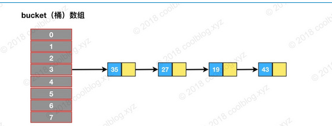
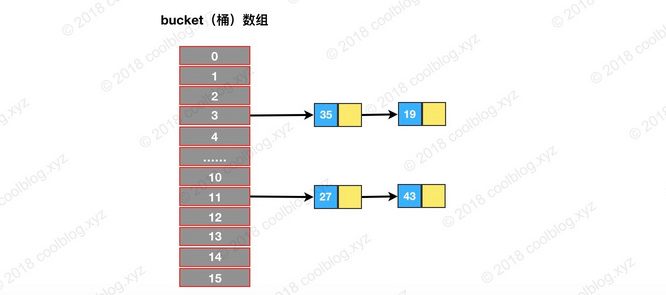
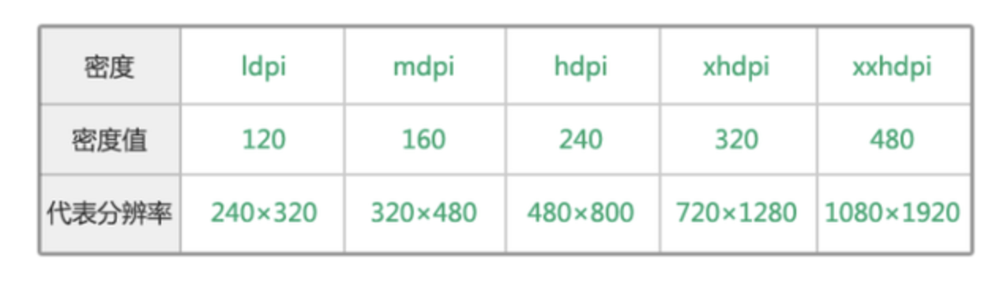

#### 1.HashMap

##### 1. 首先看`put`

```java
public V put(K key, V value) {
  	// 调用putVal方法完成
    return putVal(hash(key), key, value, false, true);
}

final V putVal(int hash, K key, V value, boolean onlyIfAbsent,
               boolean evict) {
    Node<K,V>[] tab; Node<K,V> p; int n, i;
  	// 判断table是否初始化
    if ((tab = table) == null || (n = tab.length) == 0)
        n = (tab = resize()).length;
  	// 计算存储索引的位置,没有元素,就直接赋值
    if ((p = tab[i = (n - 1) & hash]) == null)
        tab[i] = newNode(hash, key, value, null);
    else {
        Node<K,V> e; K k;
      	// 节点若已经存在,执行赋值操作
        if (p.hash == hash &&
            ((k = p.key) == key || (key != null && key.equals(k))))
            e = p;
      	// 判断链表是否是红黑树
        else if (p instanceof TreeNode)
          	// 红黑树对象操作
            e = ((TreeNode<K,V>)p).putTreeVal(this, tab, hash, key, value);
        else {
          	// 链表操作
            for (int binCount = 0; ; ++binCount) {
                if ((e = p.next) == null) {
                    p.next = newNode(hash, key, value, null);
                  	// 如果阈值大于等于8,则变成红黑树
                    if (binCount >= TREEIFY_THRESHOLD - 1) // -1 for 1st
                        treeifyBin(tab, hash);
                    break;
                }
              	// 如果存在重复放入key则直接副高
                if (e.hash == hash &&
                    ((k = e.key) == key || (key != null && key.equals(k))))
                    break;
                p = e;
            }
        }
      	// 执行覆盖操作
        if (e != null) { // existing mapping for key
            V oldValue = e.value;
            if (!onlyIfAbsent || oldValue == null)
                e.value = value;
            afterNodeAccess(e);
            return oldValue;
        }
    }
  	// 记录修改次数
    ++modCount;
  	// 判断是否需要扩容
    if (++size > threshold)
        resize();
    afterNodeInsertion(evict);
    return null;
}
```


#### 2. HashMap为什么拉链的阈值是8

理想情况下，随机的hashcode遵循Poisson分布原则，在给定参数值的情况下，8的对应的分布值已经相当低，在取值方便于后面的位运算的情况下，取值为2的幂次方是很有必要的，两个要求之下，只有8是最适合的。且用户自定的值不应当小于8，避免分布集中。

符合泊松分布,当设置为8的时候,分桶的概率会有亿分之6,是最合理的

#### 3. HashMap初始化不是2的指数,该怎么办

```java
static final int tableSizeFor(int cap) {
    int n = cap - 1;
    n |= n >>> 1;
    n |= n >>> 2;
    n |= n >>> 4;
    n |= n >>> 8;
    n |= n >>> 16;
    return (n < 0) ? 1 : (n >= MAXIMUM_CAPACITY) ? MAXIMUM_CAPACITY : n + 1;
}
```

会进行向上兼容  1—>1& 2—>2  & 3—>4  & 5—>8 & 10—> 16


#### 4. hash扩容



假设原始是容量是8

l-1 : 0000 0111

35 : 0010 0011  & 3

27 : 0001 1011 & 3

19 : 0001 0011 & 3

43 : 0010 1011 & 3


扩容到16

l-1 : 0000 1111

35 : 0010 0011  & 3

27 : 0001 1011 & 11

19 : 0001 0011 & 3

43 : 0010 1011 & 11




所以扩容不会重新计算hash值,但是由于index要用  hash & len-1

####5.hashmap成环

<https://www.cnblogs.com/wen-he/p/11496050.html>


#### 6.你们 Android 开发的时候，对于 UI 稿的 px 是如何适配的？

px： pixel，像素，电子屏幕上组成一幅图画或照片的最基本单元

pt: point，点，印刷行业常用单位，等于1/72英寸

ppi: pixel per inch，每英寸像素数，该值越高，则屏幕越细腻

dpi: dot per inch，每英寸多少点，该值越高，则图片越细腻

dp: dip，Density-independent pixel, 是安卓开发用的长度单位，1dp表示在屏幕像素点密度为160ppi时1px长度

sp: scale-independent pixel，安卓开发用的字体大小单位。


 


1dp = (ppi/160)px


#### 7. ApplicationContext和Activity启动startActivity区别

 ApplicationContext启动startActivity时候需要嘉盛FLAG_ACTIVITY_NEW_TASK或者指定任务栈

#### 8 .LruCache & LinkedHashMap


