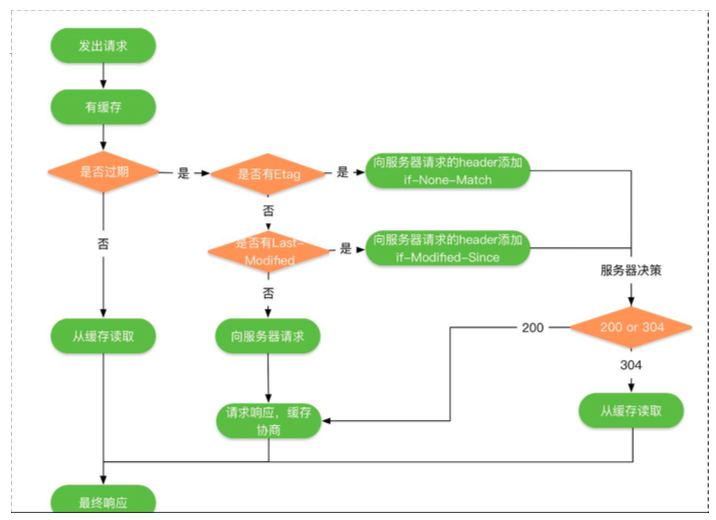
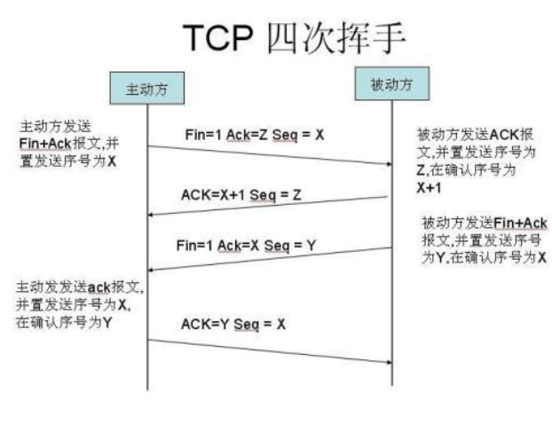

### Http/https相关

#### 1.HTTP 与 HTTPS 有什么区别?

HTTPS 是一种通过计算机网络进行安全通信的传输协议。HTTPS 经由 HTTP 进行通信，但利
用 SSL/TLS 来加密数据包。HTTPS 开发的主要目的，是 供对网站服务器的身份 认证，保
护交换数据的隐私与完整性。


​	   注:TLS 是 SSL 的升级替代版，具体发展历史可以参考传输层安全性协议。


HTTPS(全称:Hypertext Transfer Protocol over Secure Socket Layer)，是以安全为目标
的 HTTP 通道，简单讲是 HTTP 的安全版。即 HTTP 下加入 SSL 层，HTTPS 的安全基础是 SSL，
因此加密的详细内容就需要 SSL。 

- 它是一个 URI scheme(抽象标识符体系)，句法类同 http:
  体系。用于安全的 HTTP 数据传输。https:URL 表明它使用了 HTTP，但 HTTPS 存在不同于
  HTTP 的默认端口及一个加密/身份验证层(在 HTTP 与 TCP 之间)。这个系统的最初研发由
  网景公司进行， 供了身份验证与加密通讯方法，现在它被广泛用于万维网上安全敏感的通
  讯，例如交易支付方面。

超文本传输协议 (HTTP-Hypertext transfer protocol) 是一种详细规定了浏览器和万维网服
务器之间互相通信的规则，通过因特网传送万维网文档的数据传送协议。

- https 协议需要到 ca 申请证书，一般免费证书很少，需要交费。

- http 是超文本传输协议，信息是明文传输，https 则是具有安全性的 ssl 加密传输协议 http 和 https 使用的是完全不同的连接方式用的端口也不一样,前者是 80,后者是 443。

- http 的连接很简单,是无状态的HTTPS 协议是由 SSL+HTTP 协议构建的可进行加密传输、身份认证的网络协议 要比 http 协议安全 

- HTTPS 解决的问题:

  - 1 . 信任主机的问题. 采用 https 的 server 必须从 CA 申请一个用于证明服务器用途类型的证书. 该证书只有用于对应的 server 的时候,客户端才信任次主机 
  - 2 . 防止通讯过程中的数据的泄密和被窜改

- HTTP 与 HTTPS 在写法上的区别也是前缀的不同，客户端处理的方式也不同，具体说来: 

  如果 URL 的协议是 HTTP，则客户端会打开一条到服务端**端口 80(默认)**的连接，并向其 发送老的 HTTP 请求。 如果 URL 的协议是 HTTPS，则客户端会打开一条到**服务端端口 443 (默认)**的连接，然后与服务器握手，以二进制格式与服务器交换一些 SSL 的安全参数，附 上加密的 HTTP 请求。 所以你可以看到，HTTPS 比 HTTP 多了一层与 SSL 的连接，这也就 是客户端与服务端 SSL 握手的过程，整个过程主要完成以下工作: 

  - 交换协议版本号 选择一个两端都了解的密码 对两端的身份进行认证 生成临时的会话密 钥，以便加密信道。 SSL 握手是一个相对比较复杂的过程，更多关于 SSL 握手的过程细节 可以参考 TLS/SSL 握手过程 

#### 2.Http1.1 和 Http1.0以及2.0的区别

##### 2.1 Http1.0和Http1.1的一些区别

- **缓存策略增加**: 
  - 缓存处理，在 HTTP1.0 中主要使用 **header 里的 If-Modified-Since,Expires 来做
    为缓存判断的标准**，HTTP1.1 则引入了更多的**缓存控制策略例如 Entity tag，
    If-Unmodified-Since, If-Match, If-None-Match 等更多可供选择的缓存头来控制缓
    存策略。**
- **支持断点续传:**
  - 带宽优化及网络连接的使用，**HTTP1.0 中，存在一些浪费带宽的现象，例如客户
    端只是需要某个对象的一部分，而服务器却将整个对象送过来了，并且不支持断点
    续传功能，HTTP1.1 则在请求头引入了 range 头域，它允许只请求资源的某个部分，
    即返回码是 206(Partial Content)，**这样就方便了开发者自由的选择以便于充分利
    用带宽和连接。
- **新增状态错误码:**
  - 错误通知的管理，在 HTTP1.1 中**新增了 24 个错误状态响应码**，如 409(Conflict)
    表示请求的资源与资源的当前状态发生冲突;410(Gone)表示服务器上的某个资
    源被永久性的删除。
- **支持host头域处理-增加hostname**
  - Host 头处理，在 HTTP1.0 中认为每台服务器都绑定一个唯一的 IP 地址，因此， 请求消息中的 URL 并没有传递主机名(hostname)。但随着虚拟主机技术的发展， 在一台物理服务器上可以存在多个虚拟主机(Multi-homed Web Servers)，并且它 们共享一个 IP 地址。HTTP1.1 的请求消息和响应消息都应支持 Host 头域，且请求 消息中如果没有 Host 头域会报告一个错误(400 Bad Request)。 

- **支持长连接:**
  - 长连接，HTTP 1.1 支持长连接(PersistentConnection)和请求的流水线
    (Pipelining)处理，在一个 TCP 连接上可以传送多个 HTTP 请求和响应，减少了建
    立和关闭连接的消耗和延迟，在 HTTP1.1 中默认开启 Connection: keep-alive，一
    定程度上弥补了 HTTP1.0 每次请求都要创建连接的缺点。

##### 2.2 SPDY

2012 年 google 如一声惊雷 出了 SPDY 的方案，优化了 HTTP1.X 的请求延迟，解决了HTTP1.X 的安全性，具体如下:

- **降低延迟,对高延迟的请求通过多个请求stream共享一个tcp连接**
  - 1、降低延迟，针对 HTTP 高延迟的问题，SPDY 优雅的采取了多路复用(multiplexing)。
    多路复用通过多个请求 stream 共享一个 tcp 连接的方式，解决了 HOL blocking 的
    问题，降低了延迟同时 高了带宽的利用率。
- **支持请求的优先级**
  - 2、请求优先级(request prioritization)。多路复用带来一个新的问题是，在连接
    共享的基础之上有可能会导致关键请求被阻塞。SPDY 允许给每个 request 设置优先
    级，这样重要的请求就会优先得到响应。比如浏览器加载首页，首页的 html 内容应
    该优先展示，之后才是各种静态资源文件，脚本文件等加载，这样可以保证用户能
    第一时间看到网页内容。
- **压缩header**
  - header 压缩。前面 到 HTTP1.x 的 header 很多时候都是重复多余的。选择合适
    的压缩算法可以减小包的大小和数量。
- **提高安全性:**
  - 基于 HTTPS 的加密协议传输，大大 高了传输数据的可靠性。
- **服务推送(缓存)**
  - 服务端推送(server push)，采用了 SPDY 的网页，例如我的网页有一个 sytle.css
    的请求，在客户端收到 sytle.css 数据的同时，服务端会将 sytle.js 的文件推送给客户
    端，当客户端再次尝试获取 sytle.js 时就可以直接从缓存中获取到，不用再发请求了。

SPDY构成图:


SPDY 位于 HTTP 之下，TCP 和 SSL 之上，这样可以轻松兼容老版本的 HTTP 协议(将 HTTP1.x
的内容封装成一种新的 frame 格式)，同时可以使用已有的 SSL 功能。

##### 2.3 Http2.0和Http1.x相比的新特性

- 解析基于二进制
  - 新的二进制格式(Binary Format)，HTTP1.x 的解析是基于文本。基于文本协议的
    格式解析存在天然缺陷，文本的表现形式有多样性，要做到健壮性考虑的场景必然
    很多，二进制则不同，只认 0 和 1 的组合。基于这种考虑 HTTP2.0 的协议解析决定
    采用二进制格式，实现方便且健壮。
- **多路复用**
  - 多路复用(MultiPlexing)，即连接共享，即每一个 request 都是是用作连接共享机
    制的。一个 request 对应一个 id，这样一个连接上可以有多个 request，每个连接的
    request 可以随机的混杂在一起，接收方可以根据 request 的 id 将 request 再归属
    到各自不同的服务端请求里面。
- **header压缩**
  - header 压缩，如上文中所言，对前面 到过 HTTP1.x 的 header 带有大量信息，而
    且每次都要重复发送，HTTP2.0 使用 encoder 来减少需要传输的 header 大小，通讯
    双方各自 cache 一份 header fields 表，既避免了重复 header 的传输，又减小了需
    要传输的大小。
- **服务端推送**
  - 同 SPDY 一样，HTTP2.0 也具有 server push 功能。


#### 3.Http请求慢的解决方法

- 1、不通过 DNS 解析，直接访问 IP

- 2、解决连接无法复用 

  http/1.0 协议头里可以设置 Connection:Keep-Alive 或者 Connection:Close，选择是否允许 在一定时间内复用连接(时间可由服务器控制)。但是这对 App 端的请求成效不大，因为 App 端的请求比较分散且时间跨度相对较大。 

  - 方案 1.基于 tcp 的长连接 (主要) 移动端建立一条自己的长链接通道，通道的实现是基于 tcp 协议。基于 tcp 的 socket 编程技术难度相对复杂很多，而且需要自己定制协议。但信息 的上报和推送变得更及时，请求量爆发的时间点还能减轻服务器压力(避免频繁创建和销毁 连接) 

  - 方案 2.http long-polling 客户端在初始状态发送一个 polling 请求到服务器，服务器并不会 马上返回业务数据，而是等待有新的业务数据产生的时候再返回，所以链接会一直被保持。 一但结束当前连接，马上又会发送一个新的 polling 请求，如此反复，保证一个连接被保持。 存在问题: 1)增加了服务器的压力 2)网络环境复杂场景下，需要考虑怎么重建健康的 连接通道 3)polling的方式稳定性不好 4)polling的response可能被中间代理cache住 ...... 

  - 方案 3.http streaming 和 long-polling 不同的是，streaming 方式通过再 server response 的头部增加“Transfer Encoding:chuncked”来告诉客户端后续还有新的数据到来 存在问题: 1)有些代理服务器会等待服务器的 response 结束之后才将结果推送给请求客户端。 streaming 不会结束 response 2)业务数据无法按照请求分割 ...... 

  - 方案 4.web socket 和传统的 tcp socket 相似，基于 tcp 协议， 供双向的数据通道。它的 优势是 供了 message 的概念，比基于字节流的 tcp socket 使用更简单。技术较新，不是 所有浏览器都 供了支持。 (属于长链接)

- 3、解决 head of line blocking 

  它的原因是队列的第一个数据包(队头)受阻而导致整列数据包受阻 使用 http pipelining，确保几乎在同一时间把 request 发向了服务器 

#### 4.Http的request和reponse的协议组成

##### 4.1 Request组成

客户端发送一个 HTTP 请求到服务器的请求消息包括以下格式: 

请求行(request line)、请求头部(header)、空行和请求数据四个部分组成。 


请求行以一个方法符号开头，以空格分开，后面跟着请求的 URI 和协议的版本。

*Get 请求例子* 

```java
GET /562f25980001b1b106000338.jpg HTTP/1.1 
  
Host  img.mukewang.com 

User-Agent Mozilla/5.0 (Windows NT 10.0; WOW64) AppleWebKit/537.36 (KHTML, like Gecko) Chrome/51.0.2704.106 Safari/537.36 

Accept image/webp,image/*,*/*;q=0.8 
Referer http://www.imooc.com/ 
Accept-Encoding gzip, deflate, sdch 
Accept-Language zh-CN,zh;q=0.8
```

- 第一部分:请求行，用来说明请求类型,要访问的资源以及所使用的 HTTP 版本. GET 说明请
  求类型为 GET,[/562f25980001b1b106000338.jpg]为要访问的资源，该行的最后一部分说明
  使用的是 HTTP1.1 版本
- 第二部分:请求头部，紧接着请求行(即第一行)之后的部分，
  用来说明服务器要使用的附加信息 从第二行起为请求头部，HOST 将指出请求的目的
  地.User-Agent,服务器端和客户端脚本都能访问它,它是浏览器类型检测逻辑的重要基础.该
  信息由你的浏览器来定义,并且在每个请求中自动发送等等
- 第三部分:空行，请求头部后面的空行是必须的 即使第四部分的请求数据为空，也必须有空行。
- 第四部分:请求数据也叫主体，可以添加任意的其他数据。 这个例子的请求数据为空。

*POST 请求例子*

```java
// 请求行
POST / HTTP1.1

// 请求头
Host:www.wrox.com
User-Agent:Mozilla/4.0 (compatible; MSIE 6.0; Windows NT 5.1; SV1; .NET CLR 2.0.50727; .NET CLR 3.0.04506.648; .NET CLR 3.5.21022)
                
Content-Type:application/x-www-form-urlencoded 
Content-Length:40
Connection: Keep-Alive


//空行

// 请求数据
name=Professional%20Ajax&publisher=Wiley
```

- 第一部分:请求行，第一行明了是 post 请求，以及 http1.1 版本。
- 第二部分:请求头部，第二行至第六行。
- 第三部分:空行，第七行的空行。
- 第四部分:请求数据，第八行。


##### 4.2 Reponse组成

一般情况下，服务器接收并处理客户端发过来的请求后会返回一个 HTTP 的响应消息。 

HTTP 响应也由四个部分组成，分别是:状态行、消息报头、空行和响应正文。 


**第一部分:状态行，由 HTTP 协议版本号， 状态码， 状态消息 三部分组成。**

第一行为状态行，(HTTP/1.1)表明 HTTP 版本为 1.1 版本，状态码为 200，状态消息为(ok) 

**第二部分:消息报头，用来说明客户端要使用的一些附加信息**

第二行和第三行为消息报头， Date:生成响应的日期和时间;Content-Type:指定了 MIME 类型的 HTML(text/html),编码类型是 UTF-8 

**第三部分:空行，消息报头后面的空行是必须的**

*第四部分:响应正文，服务器返回给客户端的文本信息。*

空行后面的 html 部分为响应正文。 

#### 5 谈谈对 http 缓存的了解。

HTTP 的缓存机制也是**依赖于请求和响应 header 里的参数类实现的**，最终响应式从缓存中去，还是从服务端重新拉取，HTTP 的缓存机制的流程如下所示:



Http的缓存分为两种:

- 强制缓存:需要服务端参与判断是否继续使用缓存，当客户端第一次请求数据是，服务端返
  回了缓存的过期时间(Expires 与 Cache-Control)，没有过期就可以继续使用缓存，否则则
  不适用，无需再向服务端询问。

- 对比缓存:需要服务端参与判断是否继续使用缓存，当客
  户端第一次请求数据时，服务端会将缓存标识(Last-Modified/If-Modified-Since 与
  Etag/If-None-Match)与数据一起返回给客户端，客户端将两者都备份到缓存中 ，再次请
  求数据时，客户端将上次备份的缓存 标识发送给服务端，服务端根据缓存标识进行判断，
  如果返回 304，则表示通知客户端可以继续使用缓存。 强制缓存优先于对比缓存

##### 5.1 强制缓存标识:

**强制缓存**

- Expires:Expires 的值为服务端返回的到期时间，即下一次请求时，请求时间小于服务端返
  回的到期时间，直接使用缓存数据。到期时间是服务端生成的，客户端和服务端的时间可能
  有误差。 Cache-Control:Expires 有个时间校验的问题，所有 HTTP1.1 采用 Cache-Control
  替代 Expires。 Cache-Control 的取值有以下几种:
  - private: 客户端可以缓存。 public: 客户端和代理服务器都可缓存。 max-age=xxx: 缓存的
    内容将在 xxx 秒后失效 no-cache: 需要使用对比缓存来验证缓存数据。 no-store: 所有内
    容都不会缓存，强制缓存，对比缓存都不会触发。 我们再来看看对比缓存的两个标识:

**对比缓存**

- Last-Modified/If-Modified-Since

  - Last-Modified 表示资源上次修改的时间。 

    当客户端发送第一次请求时，服务端返回资源上次修改的时间:

    `Last-Modified: Tue, 12 Jan 2016 09:31:27 GMT`

    客户端再次发送，会在 header 里携带 If-Modified-Since。将上次服务端返回的资源时间上
    传给服务端。

    `If-Modified-Since: Tue, 12 Jan 2016 09:31:27 GMT`

    服务端接收到客户端发来的资源修改时间，与自己当前的资源修改时间进行对比，如果自己
    的资源修改时间大于客户端发来的资源修改时间，则说明资源做过修改， 则返回 200 表示
    需要重新请求资源，否则返回 304 表示资源没有被修改，可以继续使用缓存。

  

- 

  

  

  

- Etag/If-None-Match

  - 上面是一种时间戳标记资源是否修改的方法，还有一种资源标识码 ETag 的方式来标记是否
    修改，如果标识码发生改变，则说明资源已经被修改，ETag 优先级高于 Last-Modified。

    `Etag/If-None-Match`

    ETag 是资源文件的一种标识码，当客户端发送第一次请求时，服务端会返回当前资源的标
    识码:

    `ETag: "5694c7ef-24dc"`

    客户端再次发送，会在 header 里携带上次服务端返回的资源标识码: 

    If-None-Match:"5694c7ef-24dc" 服务端接收到客户端发来的资源标识码，则会与自己当前 的资源吗进行比较，如果不同，则说明资源已经被修改，则返回 200，如果相同则说明资源 没有被修改，返回 304，客户端可以继续使用缓存。 


#### 6. Http长连接

Http1.0 是短连接，HTTP1.1 默认是长连接，也就是默认 Connection 的值就是 keep-alive。
但是长连接实质是指的 TCP 连接，而不是 HTTP 连接。TCP 连接是一个双向的通道，它是可
以保持一段时间不关闭的，因此 TCP 连接才有真正的长连接和短连接这一说。

##### 6.1 Http1.1 为什么要用使用 tcp 长连接?

长连接是指的 TCP 连接，也就是说复用的是 TCP 连接。即长连接情况下，多个 HTTP 请求
可以复用同一个 TCP 连接，这就节省了很多 TCP 连接建立和断开的消耗。

此外，长连接并不是永久连接的。如果一段时间内(**具体的时间长短，是可以在 header 当
中进行设置的，也就是所谓的超时时间**)，这个连接没有 HTTP 请求发出的话，那么这个长
连接就会被断掉。

#### 7. Https加密类型

加密算法的类型基本上分为了两种:

- 对称加密，加密用的密钥和解密用的密钥是同一个，比较有代表性的就是 AES 加 密算法; 
- 非对称加密，加密用的密钥称为公钥，解密用的密钥称为私钥，经常使用到的 RSA 加密算法就是非对称加密的; 

此外，还有 Hash 加密算法 **HASH 算法:MD5, SHA1, SHA256 **

相比较对称加密而言，非对称加密安全性更高，但是加解密耗费的时间更长，速度慢。 

**HTTPS = HTTP + SSL，HTTPS 的加密就是在 SSL 中完成的。 **

这就要从 CA 证书讲起了。CA 证书其实就是数字证书，是由 CA 机构颁发的。至于 CA 机 构的权威性，那么是毋庸置疑的，所有人都是信任它的。CA 证书内一般会包含以下内容: 

1. -    证书的颁发机构、版本 
   -    证书的使用者 
   -    证书的公钥 
   -    证书的有效时间 
   -    证书的数字签名 Hash 值和签名 Hash 算法 
   -    ... 

##### 7.1 客户端如何校验CA证书

- CA 证书中的 Hash 值，其实是用证书的私钥进行加密后的值(证书的私钥不在 CA 证书 中)。
- 然后客户端得到证书后，利用证书中的公钥去解密该 Hash 值，得到 Hash-a ;然 后再利用证书内的签名 Hash 算法去生成一个 Hash-b 。最后比较 Hash-a 和 Hash-b 这 两个的值。
  - 如果相等，那么证明了该证书是对的，服务端是可以被信任的;
  - 如果不相等，那 么就说明该证书是错误的，可能被篡改了，浏览器会给出相关 示，无法建立起 HTTPS 连 接。
  - 除此之外，还会校验 CA 证书的有效时间和域名匹配等。 

##### 7.2 Https中的SSL握手建立过程

假设现在有客户端 A 和服务器 B :

- 首先，客户端 A 访问服务器 B ，比如我们用浏览器打开一个网 页 www.baidu.com ，这时，浏览器就是客户端 A ，百度的服务器就是服务器 B 了。 这时候客户端 A 会生成一个随机数 1，把随机数 1 、自己支持的 SSL 版本号以及 加密算法等这些信息告诉服务器 B 。 
- 服务器 B 知道这些信息后，然后确认一下双方的加密算法，然后服务端也生成 一个随机数 B ，并将随机数 B 和 CA 颁发给自己的证书一同返回给客户端 A 。 
- 客户端 A 得到 CA 证书后，会去校验该 CA 证书的有效性，校验方法在上面 已经说过了。校验通过后，客户端生成一个随机数 3 ，然后用证书中的公钥加密随 机数 3 并传输给服务端 B 。 
- 服务端 B 得到加密后的随机数 3，然后利用私钥进行解密，得到真正的随机数 3 
- 最后，客户端 A 和服务端 B 都有随机数 1、随机数 2、随机数 3，然后双方利 用这三个随机数生成一个对话密钥。之后传输内容就是利用对话密钥来进行加解密 了。这时就是利用了对称加密，一般用的都是 AES 算法 
- 客户端 A 通知服务端 B ，指明后面的通讯用对话密钥来完成，同时通知服务 器 B 客户端 A 的握手过程结束。 
- 服务端 B 通知客户端 A，指明后面的通讯用对话密钥来完成，同时通知客户端 A 服务器 B 的握手过程结束。 
- SSL 的握手部分结束，SSL 安全通道的数据通讯开始，客户端 A 和服务器 B 开 始使用相同的对话密钥进行数据通讯。 

简化如下:

-    1、客户端和服务端建立 SSL 握手，客户端通过 CA 证书来确认服务端的身份; 
-    2、互相传递三个随机数，之后通过这随机数来生成一个密钥; 
-    3、互相确认密钥，然后握手结束; 
-    4、数据通讯开始，都使用同一个对话密钥来加解密; 

可以发现，在 HTTPS 加密原理的过程中把对称加密和非对称加密都利用了起来。即利用了 非对称加密安全性高的特点，又利用了对称加密速度快，效率高的好处。 

#### 8. Https如何防范中间人攻击

##### 8.1 什么是中间人攻击

当数据传输发生在一个设备(PC/手机)和网络服务器之间时，攻击者使用其技能和工具将 自己置于两个端点之间并截获数据;尽管交谈的两方认为他们是在与对方交谈，但是实际上 他们是在与干坏事的人交流，这便是中间人攻击。 

有几种攻击方式:

- 嗅探: 嗅探或数据包嗅探是一种用于捕获流进和流出系统/网络的数据包的技术。
  网络中的数据包嗅探就好像电话中的监听
- 数据包注入: 在这种技术中，攻击者会将恶意数据包注入常规数据中。这样用
  户便不会注意到文件/恶意软件，因为它们是合法通讯流的一部分。
- 会话劫持: 在你登录进你的银行账户和退出登录这一段期间便称为一个会话。
  这些会话通常都是黑客的攻击目标，因为它们包含潜在的重要信息。在大多数案例
  中，黑客会潜伏在会话中，并最终控制它。
- SSL 剥离: 在 SSL 剥离攻击中，攻击者使 SSL/TLS 连接剥落，随之协议便从安
  全的 HTTPS 变成了不安全的 HTTP。


#### 9. 有哪些响应码,分别代表什么意思?

- 1** 信息，服务器收到请求，需要请求者继续执行操作 

- 2** 成功，操作被成功接收并处理 

- 3** 重定向，需要进一步的操作以完成请求
- 4** 客户端错误，请求包含语法错误或无法完成请求
- 5** 服务器错误，服务器在处理请求的过程中发生了错误 


### TCP/UDP

#### 10. 为什么tcp要经过三次握手,四次挥手

##### 10.1 重要标志位

- ACK : TCP 协议规定，只有 ACK=1 时有效，也规定连接建立后所有发送的报文的 ACK 必
  须为 1
- SYN(SYNchronization) : 在连接建立时用来同步序号。当 SYN=1 而 ACK=0 时，表明这是
  一个连接请求报文。对方若同意建立连接，则应在响应报文中使SYN=1和ACK=1. 因此,SYN
  置 1 就表示这是一个连接请求或连接接受报文。
- FIN (finis)即完，终结的意思， 用来释放一个连接。当 FIN = 1 时，表明此报文段的发
  送方的数据已经发送完毕，并要求释放连接。

##### 10.2三次握手


- 第一次握手:建立连接。客户端发送连接请求报文段，将 SYN 位置为 1，Sequence Number
  为 x;然后，客户端进入 SYN_SEND 状态，等待服务器的确认;
- 第二次握手:服务器收到 SYN 报文段。服务器收到客户端的 SYN 报文段，需要对这个 SYN
  报文段进行确认，设置 Acknowledgment Number 为 x+1(Sequence Number+1);同时，
  自己自己还要发送 SYN 请求信息，将 SYN 位置为 1，Sequence Number 为 y;服务器端将
  上述所有信息放到一个报文段(即 SYN+ACK 报文段)中，一并发送给客户端，此时服务器
  进入 SYN_RECV 状态;
- 第三次握手:客户端收到服务器的 SYN+ACK 报文段。然后将 Acknowledgment Number
  设置为 y+1，向服务器发送 ACK 报文段，这个报文段发送完毕以后，客户端和服务器端都
  进入 **ESTABLISHED 状态(连接状态)**，完成 TCP 三次握手。

**前两次 SYN为1  每一次接收发出的ACK为Seq+1**

##### 10.3 四次挥手




- 第一次分手:主机 1(可以使客户端，也可以是服务器端)，设置 Sequence Number 和
  Acknowledgment Number，向主机 2 发送一个 FIN 报文段;此时，主机 1 进入 FIN_WAIT_1
  状态;这表示主机 1 没有数据要发送给主机 2 了;
- 第二次分手:主机 2 收到了主机 1 发送的 FIN 报文段，向主机 1 回一个 ACK 报文段，
  Acknowledgment Number 为 Sequence Number 加 1;主机 1 进入 FIN_WAIT_2 状态;**主
  机 2 告诉主机 1，我“同意”你的关闭请求;**
- 第三次分手:主机 2 向主机 1 发送 FIN 报文段，请求关闭连接，同时主机 2 进入 LAST_ACK
  状态;
- 第四次分手:主机 1 收到主机 2 发送的 FIN 报文段，向主机 2 发送 ACK 报文段，然后主机
  1 进入 TIME_WAIT 状态;主机 2 收到主机 1 的 ACK 报文段以后，就关闭连接;此时，主机
  1 等待 2MSL 后依然没有收到回复，则证明 Server 端已正常关闭，那好，主机 1 也可以关闭
  连接了。


“三次握手”的目的是“为了防止已失效的连接请求报文段突然又传送到了服务端，因而产生
错误”。主要目的防止 server 端一直等待，浪费资源。换句话说，即是为了保证服务端能收
接受到客户端的信息并能做出正确的应答而进行前两次(第一次和第二次)握手，为了保证客
户端能够接收到服务端的信息并能做出正确的应答而进行后两次(第二次和第三次)握手。


“四次挥手”原因是因为 tcp 是全双工模式，接收到 FIN 时意味将没有数据再发来，但是还是
可以继续发送数据。


#### 11.TCP可靠传输原理实现(滑动窗口)

- **确认和重传**:接收方收到报文后就会进行确认，发送方一段时间没有收到确认就会重传。
  数据校验。
- **数据合理分片与排序**，TCP 会对数据进行分片，接收方会缓存为按序到达的数据，重新排序
  后再 交给应用层。
- **流程控制:**当接收方来不及接收发送的数据时，则会 示发送方降低发送的速度，防止包丢
  失。
- **拥塞控制:**当网络发生拥塞时，减少数据的发送。


#### 13. TCP和UDP的区别

1、基于连接与无连接;
2、对系统资源的要求(TCP 较多，UDP 少);
3、UDP 程序结构较简单;
4、流模式与数据报模式 ;
5、TCP 保证数据正确性，UDP 可能丢包;
6、TCP 保证数据顺序，UDP 不保证。


#### 14. 如何设计在UDP上层保证UDP的可靠性传输

传输层无法保证数据的可靠传输，只能通过应用层来实现了。实现的方式可以参照 tcp 可靠
性传输的方式。如不考虑拥塞处理，可靠 UDP 的简单设计如下:

- 1、添加 seq/ack 机制，确保数据发送到对端
- 2、添加发送和接收缓冲区，主要是用户超时重传。
-   3、添加超时重传机制。

具体过程即是:送端发送数据时，生成一个随机 seq=x，然后每一片按照数据大小分配 seq。
数据到达接收端后接收端放入缓存，并发送一个 ack=x 的包，表示对方已经收到了数据。
发送端收到了 ack 包后，删除缓冲区对应的数据。时间到后，定时任务检查是否需要重传数
据。

目前有如下开源程序利用 udp 实现了可靠的数据传输。分别为 RUDP、RTP、UDT:

1、RUDP(Reliable User Datagram Protocol)
RUDP  供一组数据服务质量增强机制，如拥塞控制的改进、重发机制及淡化服务器算法等。

2、RTP(Real Time Protocol) 

RTP 为数据 供了具有实时特征的端对端传送服务，如在组播或单播网络服务下的交互式视 频音频或模拟数据。 

3、UDT(UDP-based Data Transfer Protocol)
 UDT 的主要目的是支持高速广域网上的海量数据传输。 


#### 15.Socket

#####  15.1 socket概念

接字(socket)是通信的基石，是支持 TCP/IP 协议的网络通信的基本操作单元。它是网
络通信过程中端点的抽象表示，包含进行网络通信必须的五种信息:连接使用的协议，本地
主机的 IP 地址，本地进程的协议端口，远地主机的 IP 地址，远地进程的协议端口。

为了区别不同的应用程序进程和连接，许多计算机操作系统为应用程序与 TCP/IP 协议交互
供了套接字(Socket)接口。应 用层可以和传输层通过 Socket 接口，区分来自不同应用程
序进程或网络连接的通信，实现数据传输的并发服务。

##### 15.2 建立socket连接

建立 Socket 连接至少需要一对套接字，其中一个运行于客户端，称为 ClientSocket ，另一
个运行于服务器端，称为 ServerSocket 。

套接字之间的连接过程分为三个步骤:服务器监听，客户端请求，连接确认。

- 服务器监听:服务器端套接字并不定位具体的客户端套接字，而是处于等待连接的 状态，实时监控网络状态，等待客户端的连接请求。 
- 客户端请求:指客户端的套接字 出连接请求，要连接的目标是服务器端的套接字。 为此，客户端的套接字必须首先 述它要连接的服务器的套接字，**指出服务器端- - 套接字的地址和端口号，然后就向服务器端套接字 出连接请求 **
-  连接确认:当服 务器端套接字监听到或者说接收到客户端套接字的连接请求时，就响应客户端套接 字的请求，建立一个新的线程，把服务器端套接字的 述发 给客户端，一旦客户端 确认了此 述，双方就正式建立连接。而服务器端套接字继续处于监听状态，继续 接收其他客户端套接字的连接请求。 

##### 15.3 Socket连接与TCP连接

创建 Socket 连接时，可以指定使用的传输层协议，Socket 可以支持不同的传输层协议(TCP
或 UDP)，当使用 TCP 协议进行连接时，该 Socket 连接就是一个 TCP 连接。

##### 15.4 socket连接和http连接

由于通常情况下 Socket 连接就是 TCP 连接，因此 **Socket 连接一旦建立，通信双方即可开 始相互发送数据内容，直到双方连接断开**。但在实际网 络应用中，客户端到服务器之间的 通信往往需要穿越多个中间节点，例如路由器、网关、防火墙等，大部分防火墙默认会关闭 长时间处于非活跃状态的连接而导致 Socket 连接断连，因此需要通过轮询告诉网络，该连 接处于活跃状态。 

而 HTTP 连接**使用的是“请求—响应”的方式，不仅在请求时需要先建立连接，而且需要客户 端向服务器发出请求后，服务器端才能回复数据。** 

很多情况下，需要服务器端主动向客户端推送数据，保持客户端与服务器数据的实时与同步。 此时若双方建立的是 Socket 连接，服务器就可以直接将数 据传送给客户端;若双方建立的 是 HTTP 连接，则服务器需要等到客户端发送一次请求后才能将数据传回给客户端，因此， 客户端定时向服务器端发送连接请求， 不仅可以保持在线，同时也是在“询问”服务器是否 有新的数据，如果有就将数据传给客户端。TCP(Transmission Control Protocol) 传输控制 协议 


##### 15.5 socket断线重连

正常连接断开客户端会给服务端发送一个 fin 包，服务端收到 fin 包后才会知道连接断开。而
断网断电时客户端无法发送 fin 包给服务端，所以服务端没办法检测到客户端已经短线。 为
了缓解这个问题，服务端需要有个心跳逻辑，就是服务端检测到某个客户端多久没发送任何
数据过来就认为客户端已经断开， 这需要客户端定时向服务端发送心跳数据维持连接。

##### 15.6 心跳机制实现

长连接的实现:心跳机制，应用层协议大多都有 HeartBeat 机制，通常是客户端每隔一小段 时间向服务器发送一个数据包，通知服务器自己仍然在线。并传输一些可能必要的数据。使 用心跳包的典型协议是 IM，比如 QQ/MSN/飞信等协议 

1、在 TCP 的机制里面，本身是存在有心跳包的机制的，也就是 TCP 的选项:SO_KEEPALIVE。 系统默认是设置的 2 小时的心跳频率。但是它检查不到机器断电、网线拔出、防火墙这些断 线。 而且逻辑层处理断线可能也不是那么好处理。一般，如果只是用于保活还是可以的。 通过使用 TCP 的 KeepAlive 机制(修改那个 time 参数)，可以让连接每隔一小段时间就产 生一些 ack 包，以降低被踢掉的风险，当然，这样的代价是额外的网络和 CPU 负担。 

2、应用层心跳机制实现。 


#### 16. Cookie和Session的作用和原理

- Session 是在服务端保存的一个数据结构，用来跟踪用户的状态，这个数据可以保存 在集群、数据库、文件中。 
- Cookie 是客户端保存用户信息的一种机制，用来记录用户的一些信息，也是实现 Session 的一种方式。 

*Session*:**由于Http是无状态的所以需要在请求服务时候为特定的用户生成session,并返回sessionID**

由于 HTTP 协议是无状态的协议，所以服务端需要记录用户的状态时，就需要用某种机制来 识具体的用户，这个机制就是 Session.典型的场景比如购物车，当你点击下单按钮时，由于 HTTP 协议无状态，所以并不知道是哪个用户操作的，所以服务端要为特定的用户创建了特 定的 Session，用用于标识这个用户，并且跟踪用户，这样才知道购物车里面有几本书。这 个 Session 是保存在服务端的，有一个唯一标识。在服务端保存 Session 的方法很多，内存、 数据库、文件都有。集群的时候也要考虑 Session 的转移，在大型的网站，一般会有专门的 Session 服务器集群，用来保存用户会话，这个时候 Session 信息都是放在内存的。 

具体到 Web 中的 Session 指的就是用户在浏览某个网站时，从进入网站到浏览器关闭所经 过的这段时间，也就是用户浏览这个网站所花费的时间。因此从上述的定义中我们可以看到， Session 实际上是一个特定的时间概念。 

当客户端访问服务器时，服务器根据需求设置 Session，将会话信息保存在服务器上，同时 将标示 Session 的 SessionId 传递给客户端浏览器， 

浏览器将这个 SessionId 保存在内存中，我们称之为无过期时间的 Cookie。浏览器关闭后， 这个 Cookie 就会被清掉，它不会存在于用户的 Cookie 临时文件。 

以后浏览器每次请求都会额外加上这个参数值，服务器会根据这个 SessionId，就能取得客 户端的数据信息。 

如果客户端浏览器意外关闭，服务器保存的 Session 数据不是立即释放，此时数据还会存在， 只要我们知道那个 SessionId,就可以继续通过请求获得此 Session 的信息，因为此时后台的 Session 还存在，当然我们可以设置一个 Session 超时时间，一旦超过规定时间没有客户端 请求时，服务器就会清除对应 SessionId 的 Session 信息。 


*Cookie*:**保存服务返回的seesionID**

Cookie 是由服务器端生成，发送给 User-Agent(一般是 web 浏览器)，浏览器会将 Cookie 的 key/value 保存到某个目录下的文本文件内，下次请求同一网站时就发送该 Cookie 给服 务器(前 是浏览器设置为启用 Cookie)。Cookie 名称和值可以由服务器端开发自己定义， 对于 JSP 而言也可以直接写入 Sessionid，这样服务器可以知道该用户是否合法用户以及是 否需要重新登录等。 


#### 17 .Ip报文中的内容


- 版本:IP 协议的版本，目前的 IP 协议版本号为 4，下一代 IP 协议版本号为 6。
- 首部长度:IP 报头的长度。固定部分的长度(20 字节)和可变部分的长度之和。共占 4 位。
  最大为 1111，即 10 进制的 15，代表 IP 报头的最大长度可以为 15 个 32bits(4 字节)，也
  就是最长可为 15*4=60 字节，除去固定部分的长度 20 字节，可变部分的长度最大为 40 字
  节。
- 服务类型:Type Of Service。
- 总长度:IP 报文的总长度。报头的长度和数据部分的长度之和。
- 标识:唯一的标识主机发送的每一分数据报。通常每发送一个报文，它的值加一。当 IP 报
  文长度超过传输网络的 MTU(最大传输单元)时必须分片，这个标识字段的值被复制到所
  有数据分片的标识字段中，使得这些分片在达到最终目的地时可以依照标识字段的内容重新
  组成原先的数据。
- 标志:共 3 位。R、DF、MF 三位。目前只有后两位有效，DF 位:为 1 表示不分片，为 0
  表示分片。MF:为 1 表示“更多的片”，为 0 表示这是最后一片。
- 片位移:本分片在原先数据报文中相对首位的偏移位。(需要再乘以 8)
- 生存时间:IP 报文所允许通过的路由器的最大数量。每经过一个路由器，TTL 减 1，当为 0
  时，路由器将该数据报丢弃。TTL 字段是由发送端初始设置一个 8 bit 字段.推荐的初始值由
  分配数字 RFC 指定，当前值为 64。发送 ICMP 回显应答时经常把 TTL 设为最大值 255。
- 协议:指出 IP 报文携带的数据使用的是那种协议，以便目的主机的 IP 层能知道要将数据报
  上交到哪个进程(不同的协议有专门不同的进程处理)。和端口号类似，此处采用协议号，
  TCP 的协议号为 6，UDP 的协议号为 17。ICMP 的协议号为 1，IGMP 的协议号为 2.
- 首部校验和:计算 IP 头部的校验和，检查 IP 报头的完整性。
- 源 IP 地址:标识 IP 数据报的源端设备。
- 目的 IP 地址:标识 IP 数据报的目的地址。
- 最后就是可变部分和数据部分。