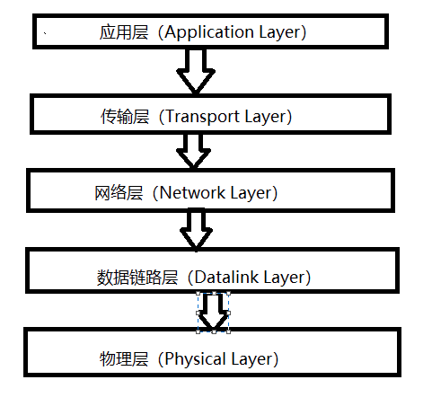
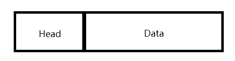
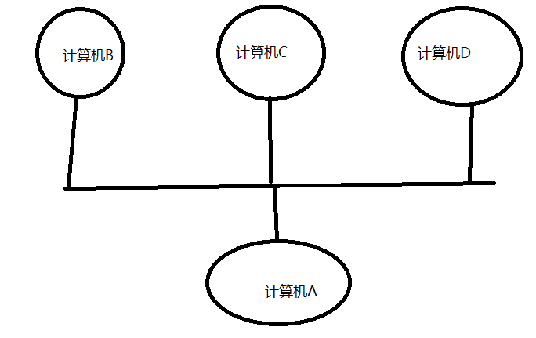

- 物理层:
  
- 一台计算机与另一台计算机要进行通信，第一件要做的事是什么？当然是要把这台计算机与另外的其他计算机连起来啊，**例如可以通过光纤啊，电缆啊，双绞线啊等物体把他们联起来。**然后才能进行通信，也就是说，，物理层负责把两台计算机连起来，然后在计算机之间传送0,1这样的电信号。
  
- 数据链路层: **0-1信号转为数据包**

  - 前面说了，物理层它只是单纯着负责在计算机之间传输0，1这样的电信号。假如这些0，1组合的传送毫无规则，计算机是解读不了的。因此，**我们需要制定一套规则来进行0，1的传送。例如多少个电信号为一组啊，每一组信号应该如何标识才能让计算机读懂啊等。**

    **数据链路层工作在物理层之上，负责给这些0，1制定传送的规则，然后另一方再按照相应的规则来进行解读。**

    - 以太网协议

      以太网协议规定，**一组电信号构成一个数据包，**把这个数据包称之为“桢”。每一个桢由标头(Head)和数据(Data)两部分组成。如下：

      

      这个桢的最大长度是1518个字节，最小长度为64字节。**假如需要传送的数据很大的话，就分成多个桢来进行传送。**

      对于表头和数据这两个部分，他们存放的都是一些什么数据呢？我猜你眯着眼睛都能想到他们应该放什么数据。 毫无疑问，我们至少得知道这个桢是谁发送，发送给谁的等这些信息吧？**所以标头部分主要是一些说明数据，例如发送者，接收者等信息。而数据部分则是这个数据包具体的，想给接受的内容。**

      大家想一个问题，一个桢的长度是64~1518个字节，也就是说桢的长度不是固定的，那你觉得标头部分的字节长度是固定的吗？它当然是固定的啊，假如不是固定的，每个桢都是单独发的，那计算机怎么知道标头是几个字节，数据是几个字节。所以标头部分的字节是固定的，并且固定为18个字节。

    - MAC地址

      把一台计算的的数据通过物理层和链路层发送给另一台计算机，究竟是谁发给谁的，计算机与计算机之间如何区分，你总得给他们一个唯一的标识吧？

      这就是MAC地址，**连入网络的每一个计算机都会有网卡接口，每一个网卡都会一个地址，这个地址就叫做MAC地址**。计算机之间的数据传送，就是通过MAC地址来唯一寻找、传送的。MAC地址在网卡生产是就被唯一标识了。

      广播与ARP协议

      如图，假如计算机A知道了计算机B的MAC地址，然后计算机A想要给计算机B传送数据，虽然计算机A知道了计算机B的MAC地址，可是它要怎么给它传送数据呢？计算机A不仅连着计算机B，而且计算机A也还连着其他的计算机。 虽然计算机A知道计算机B的MAC地址，可是计算机A是无法知道计算机B是分布在哪边路线上的。实际上，计算机A是通过广播的方式把数据发送给计算机B。在同一个子网中，计算机A要向计算机B发送一个数据包，这个数据包包含接收者的MAC地址。这个时候同一个子网中的计算机C,D也会收到这个数据包的，然后收到这个数据包的计算机，会把数据包的MAC地址取出来，与自身的MAC地址对比，如果两者相同，则接受这个数据包，否则就丢弃这个数据包。这种发送方式我们称之为广播,就像我们平时在广场上通过广播的形式呼叫某个人一样。

      那么问题来了，计算机A是如何知道计算机B的MAC地址的呢？

      **这个时候就得由ARP协议这个家伙来解决了，不过ARP协议会涉及到IP地址，不过我们下面才会扯到IP地址。因此我们先放着，就当作是有这么一个ARP协议，通过它我们可以知道子网中其他计算机的MAC地址。**

- 网络层 **定位主机**

  - 区分子网:为了解决**区分子网**这个问题我们引入了一套新的地址协议，这个地址协议能够帮助我们区分MAC地址是否处于同一个子网中。这也是**网络层**负责解决的问题。

    - IP协议:  **区分子网和主机**

      个协议就是IP协议，它所定义的地址，我们称之为IP地址。IP协议有两种版本，一种是IPv4,另一种是IPv6。不过我们目前大多数用的还是IPv4，我们现在也只讨论IPv4这个版本的协议。

      这个IP地址由32为的二进制数组成，我们一般把它分成4段的十进制表示，地址范围为0.0.0.0~255.255.255.255

      每一台想要联网的计算机都会有一个IP地址。这个IP地址被分为两部分，前面一部分代表**网络部分**，后面一部分代表**主机部分**。并且网络部分和主机部分的二进制位数是不固定的。

      假如两台计算机的网络部分是一模一样的，我们就说这两台计算机是**处于同一个子网**中。例如192.168.43.1和192.168.43.2,假如这两个IP地址的网络部分为24为，主机部分为8位。那么他们的网络部分都为192.168.43，所以他们处于同一个子网中。

      

      **由于网络部分位数不一致,所以无法判断是否属于一个子网**

      这就引申出了另一个关键词————子码掩码。子码掩码和IP地址一样也是32位二进制数，不过它的网络部分规定全部为1，主机部分规定全部为0.也就是说，假如上面那两个IP地址的网络部分为24为，主机部分为8为的话，那他们的子码掩码都为11111111.11111111.11111111.00000000，即255.255.255.0。

      那有了子字码掩码，如何来判端IP地址是否处于同一个子网中呢。显然，知道了子码掩码，相当于我们知道了网络部分是几位，主机部分是几位。我们只需要把IP地址与它的子码掩码做与(and)运算，然后把各自的结果进行比较就行了，如果比较的结果相同，则代表是同一个子网，否则不是同一个子网。

      例如，192.168.43.1和192.168.43.2的子码掩码都为255.255.255.0，把IP与子码掩码相与，可以得到他们都为192.168.43.0，进而他们处于同一个子网中。

    - ARP协议

      有了两台计算机的IP地址，我们就可以判断出它们是否处于同一个子网之中。 假如他们处于同一个子网之中，计算机A要给计算机B发送数据时。我们可以通过ARP协议来得到计算机B的MAC地址。ARP协议也是通过广播的形式给同一个子网中的每台电脑发送一个数据包(当然，这个数据包会包含接收方的IP地址)。对方收到这个数据包之后，会取出IP地址与自身的对比，如果相同，则把自己的MAC地址回复给对方，否则就丢弃这个数据包。这样，计算机A就能知道计算机B的MAC地址了。

      可能有人会问，知道了MAC地址之后，发送数据是通过广播的形式发送，询问对方的MAC地址也是通过广播的形式来发送，那其他计算机怎么知道你是要传送数据还是要询问MAC地址呢？其实在询问MAC地址的数据包中，在对方的MAC地址这一栏中，填的是一个特殊的MAC地址，其他计算机看到这个特殊的MAC地址之后，就能知道广播想干嘛了。

      假如两台计算机的IP不是处于同一个子网之中，这个时候，我们就会把数据包发送给网关，然后让网关让我们进行转发传送

    - DNS服务器:

      这里再说一个问题，我们是如何知道对方计算机的IP地址的呢？这个问题可能有人会觉得很白痴，心想，当然是计算机的操作者来进行输入了。这没错，当我们想要访问某个网站的时候，我们可以输入IP来进行访问，但是我相信绝大多数人是输入一个网址域名的，例如访问百度是输入www.baidu.com这个域名。其实当我们输入这个域名时，会有一个叫做DNS服务器的家伙来帮我们解析这个域名，然后返回这个域名对应的IP给我们的。

      

      

- 传输层 **定位主机上的应用**

  - 虽然我们已经把数据成功从计算机A传送到计算机B了，可是，**计算机B里面有各种各样的应用程序，计算机该如何知道这些数据是给谁的呢？**

    这个时候，端口(Port)这个家伙就上场了，也就是说，我们在从计算机A传数据给计算表B的时候，还得指定一个端口，以供特定的应用程序来接受处理。
    也就是说，传输层的功能就是建立端口到端口的通信。相比网络层的功能是建立主机到主机的通信。

    也就是说，有了IP和端口，我们就可以进行通信了。这个时候可能有人会说，我输入IP地址的时候并没有指定一个端口啊。其实呢，对于有些传输协议，已经有设定了一些默认端口了。例如http的传输默认端口是80，这些端口信息也会包含在数据包里的。
    

- 应用层  **规定数据格式 http就在这一层**

  - 终于说到应用层了，应用层这一层最接近我们用户了。

    虽然我们收到了传输层传来的数据，可是这些传过来的数据五花八门，有html格式的，有mp4格式的，各种各样。你确定你能看的懂？

    因此我们需要指定这些数据的格式规则，收到后才好解读渲染。而应用层的功能，**就是用来规定应用程序的数据格式的。**

    五层模型至此讲到这里。对于有些层讲的比较简洁，就随便概况了一下。如果你想详细去了解，可以去买计算机网络相应的资料。希望我的讲解能让你对计算机之间数据的传输有个大概的了解。
    

  

  

  

  

  