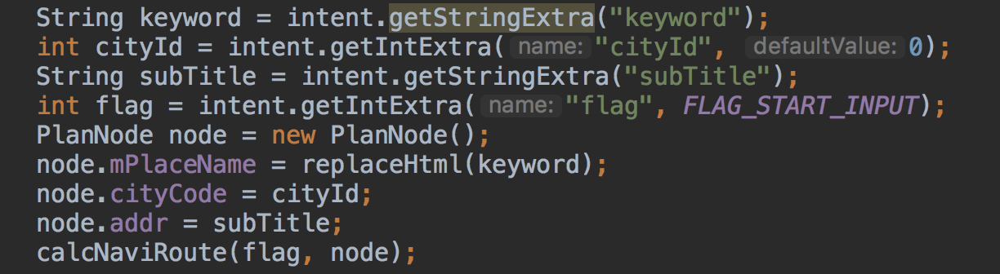

#### 1. 限行接口

算路开始之前设置车牌号

调用时机: 选路之后调用(自动调用),最终调用NavLocalLimitController进行请求逻辑

调用方式: 在NavLimitManager里面注册

回调时机:在算路时候调用限行请求,请求完成开发者自己在会调用进行展示与不展示的逻辑(内部实现线程切换)

#### 2. Sug接口

SuggestionSearch  — 封装了请求接口,传入一个option(就是参数):包括cityid,keyword,当前loc的百度莫卡托

注册接口进行返回,然后进行显示

Sug的key是随着输入,实时进行请求

#### 3. 路线规划

进入算路

会使用BaiduAutoBaseFactory来获取RoutePlanSearch

- 选路接口-click点击

- 更新接口 
- 算路接口

#### 4. 离线下载

暴露接口:

离线地图  接收引擎上抛的消息进行模拟生命周期调回

导航是生命周期回调

