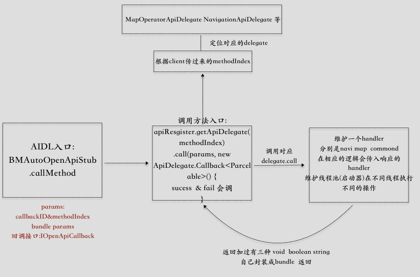

#### 1.openSDK

binderpool  binder连接池


baiduopenSDK & NaviSDK

- 广播:主要是在导航过程中进行诱导消息的实时透出

- AIDL:

  - 入口是

  

- 多模块合并aar  使用`fat-aar`

  - **步骤1**：
    将gradle文件'fat-aar.gradle'到你的项目目录，然后apply：

    `apply from: 'fat-aar.gradle'`

  - 步骤2：定义嵌入的依赖关系
    你需要修改你以前依赖项，并将`compile`更改为`embedded`，作为你想要合并的aar。使用例子如下：

#### 2. NaviSDK

业务点: 

- 路线规划
- 地图选点
- poi检索出sug
- 离线地图/导航
- 图区操作
- 日夜切换(图区一层)
- 家和公司

跳转使用

```java
'androidx.navigation:navigation-fragment:2.0.0-rc02'
```

设置nav跳转的xml

```java
<?xml version="1.0" encoding="utf-8"?>
<navigation xmlns:android="http://schemas.android.com/apk/res/android"
            xmlns:app="http://schemas.android.com/apk/res-auto"
            android:id="@+id/navigation" app:startDestination="@id/mainFragment">
		
    // 当前fragment
    <fragment android:id="@+id/mainFragment" android:name="com.example.autonavidemo.ui.MainFragment"
              android:label="MyFragment">
        // 跳转的fragment对应的id
        <action android:id="@+id/action_mainFragment_to_routePlanFragment" app:destination="@id/routePlanFragment"/>
        <action android:id="@+id/action_mainFragment_to_demoGuideFragment" app:destination="@id/demoGuideFragment"/>
        <action android:id="@+id/action_mainFragment_to_demoCustomUiFragment"
                app:destination="@id/demoCustomUiFragment"/>
        <action android:id="@+id/action_mainFragment_to_autoSelectPointFragment"
                app:destination="@id/autoSelectPointFragment"/>
        <action android:id="@+id/action_mainFragment_to_poiSearchFragment"
                app:destination="@id/poiSearchFragment"/>
        <action android:id="@+id/action_mainFragment_to_LocalMapPage"
            app:destination="@id/LocalMapPage"/>
        <action android:id="@+id/action_mainFragment_to_BNDownloadPage"
            app:destination="@id/BNDownloadPage"/>
        <action android:id="@+id/action_mainFragment_to_offlineNavPage"
            app:destination="@id/offlineNavPage"/>
        <action android:id="@+id/action_mainFragment_to_offlineMapPage"
            app:destination="@id/offlineMapPage"/>

    </fragment>
    <fragment android:id="@+id/routePlanFragment" android:name="com.example.autonavidemo.ui.fragment.RoutePlanFragment"
              android:label="RoutePlanFragment">
        <action android:id="@+id/action_routePlanFragment_to_searchInputFragment"
                app:destination="@id/searchInputFragment"/>
        <action android:id="@+id/action_routePlanFragment_to_demoGuideFragment"
                app:destination="@id/demoGuideFragment"/>
        <action android:id="@+id/action_routePlanFragment_to_demoCustomUiFragment"
                app:destination="@id/demoCustomUiFragment"/>
    </fragment>
    <fragment android:id="@+id/demoGuideFragment" android:name="com.example.autonavidemo.ui.navidemo.DemoGuideFragment"
              android:label="DemoGuideFragment"/>
    <fragment android:id="@+id/demoCustomUiFragment"
              android:name="com.example.autonavidemo.ui.navidemo.DemoCustomUiFragment"
              android:label="DemoCustomUiFragment"/>
    <fragment android:id="@+id/searchInputFragment"
              android:name="com.example.autonavidemo.ui.fragment.SearchInputFragment"
              android:label="SearchInputFragment"/>
    <fragment android:id="@+id/autoSelectPointFragment"
              android:name="com.example.autonavidemo.ui.fragment.AutoSelectPointFragment"
              android:label="AutoSelectPointFragment"/>
    <fragment android:id="@+id/poiSearchFragment"
              android:name="com.example.autonavidemo.ui.fragment.PoiSearchFragment"
              android:label="PoiSearchFragment"/>
    <fragment android:id="@+id/offlineMapPage"
        android:name="com.example.autonavidemo.ui.fragment.OfflineMapFragment"
        android:label="OfflineMapFragment"/>
    <fragment android:id="@+id/offlineNavPage"
        android:name="com.example.autonavidemo.ui.fragment.OfflineNaviFragment"
        android:label="OfflineNaviFragment"/>
    <fragment android:id="@+id/LocalMapPage"
        android:name="com.baidu.baidumap.autosdk.base.page.LocalMapPage"
        android:label="LocalMapPage"/>
    <fragment android:id="@+id/BNDownloadPage"
        android:name="com.baidu.baidumap.autosdk.base.page.BNDownloadPage"
        android:label="BNDownloadPage"/>
</navigation>
```

Activity中设置默认fragment

```java
<fragment
        android:name="androidx.navigation.fragment.NavHostFragment"
        android:id="@+id/fragment"
        android:layout_width="0dp"
        android:layout_height="0dp"
        app:layout_constraintBottom_toBottomOf="parent"
        app:layout_constraintLeft_toLeftOf="parent"
        app:layout_constraintRight_toRightOf="parent"
        app:layout_constraintTop_toTopOf="parent"
        app:defaultNavHost="false"
        app:navGraph="@navigation/nav_fragment" />
```

处理fragment返回事件

```java
@Override
public void onBackPressed() {
    if (baseFragment != null && !baseFragment.onBackPressed()) {
        if(fm.getBackStackEntryCount() == 0){
            super.onBackPressed();
        } else {
            onSupportNavigateUp();
        }
    }
}
```

```java
@Override
public boolean onSupportNavigateUp() {
    return Navigation.findNavController(this, R.id.fragment).navigateUp();
}
```

```java
NavHostFragment.findNavController(MainFragment.this)
        .navigate(R.id.action_mainFragment_to_demoCustomUiFragment, bundle);
```

